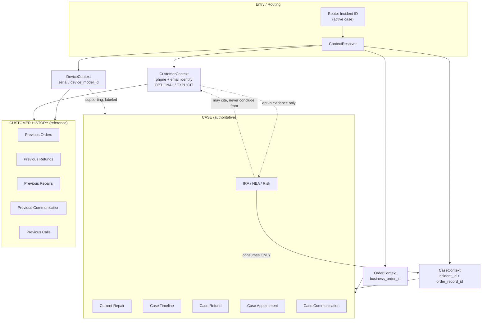
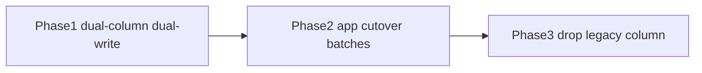

# BR-02 — Separate Case Context from Customer Context

**Status:** Architecture Decision — identity naming Phase 1 implemented (dual-column + dual-write); Phase 2–3 tracked below  
**Priority:** P1 platform integrity  
**Audience:** Product, engineering, AI/IRA, CRM roadmap  
**Related:** Production cross-order investigation (SC20839 / RD3465668 ↔ RD3465378), [IRA v2 Intelligence Pipeline](ira-v2-intelligence-pipeline.md), Customer 360 drawer, [Master Architecture §4](radium-desk-v2-master-architecture.md#4--data-ownership)  
**Last updated:** 2026-08-07

---

## 1. Decision

Customer 360 and IRA must treat **Case Context** and **Customer Context** as separate bounded contexts.

| Context | Authority | Role |
|---------|-----------|------|
| **Case Context** | Authoritative for the open drawer | Current repair, NBA, risk, timeline, actions |
| **Order Context** | Authoritative for commercial lifecycle of the linked order | Payment, serial, transaction, warranty |
| **Device Context** | Authoritative for hardware identity | Serial history, prior repairs on same device |
| **Customer Context** | Historical reference only | Lifetime orders, prior refunds, prior conversations |

**Hard rule:** Customer Context MUST NEVER silently modify Case Context conclusions (NBA, risk, status, timeline, refund eligibility, “already processed” claims) unless an agent explicitly expands a labeled supporting-evidence section.

Production confirmed FKs are sound. The defect is architectural scope blending via `customer_phone` / `customer_email`.

---

## 2. Target architecture



### Scope definitions

#### CASE SCOPE (authoritative)

Contains **only** artifacts keyed by `incident_id` and/or the incident’s `order_record_id` (FK → `orders.id`):

- Current order + service case
- Current device snapshot (as attached to this order)
- Current refund(s) for this order/case
- Current appointment(s) for this incident
- Current timeline (case/order-scoped sources only)
- Current emails linked to this order/incident
- Current WhatsApp **template dispatches** for this order
- Current notifications for this incident
- Current owner, status, waiting state, SLA for this case
- Current NBA / IRA reasoning

#### ORDER SCOPE

- Order lifecycle, payments, dispatch, transaction, serial entry, warranty / RD service flags
- Order-level audit events
- Must not expand to sibling orders by phone

#### DEVICE SCOPE

- Prior repairs / cases for the **same serial** (not same phone)
- Hardware / RadiumBox enrichment for this serial
- Device intelligence used as **supporting** evidence with explicit serial linkage

#### CUSTOMER SCOPE (historical reference)

Identity keys: normalized phone + email (future: stable `customer_id`).

- Previous orders, refunds, devices, appointments
- Previous WhatsApp **conversations**, calls, inbound emails
- Lifetime metrics (order count, open cases elsewhere, refund-free history)

**May never** silently drive:

- Current case reasoning, NBA, risk, timeline composition, refund eligibility, or health “last contact” for the active case

---

## 3. Service classification (as-is → target)

### 3.1 Case scoped (keep / tighten)

| Service / component | Today | Target |
|---------------------|-------|--------|
| `Customer360Controller::show(Incident)` | Case | Case |
| `Customer360Service::drawerData` shell (incident→order) | Case | Case (stop injecting phone summary into case shell) |
| `IncidentWaitingStateService` | Case | Case |
| `ScheduledSupportAppointmentContext::forIncident` | Case | Case |
| `RefundRequestService` / refund create | Order+Case | Case/Order |
| `RefundConfirmationSupportService::resolveApprovedRefund` | Case/Order | Case/Order |
| `WhatsAppTemplateDispatchTimelineSource` | Order | Order/Case |
| `NotificationTimelineEventSource` | Order’s incidents | Case/Order |
| `AppointmentTimelineEventSource` | Order’s incidents | Case |
| `ServiceCaseLifecycleTimelineEventSource` | Case | Case |
| `CustomerWaitingLifecycleTimelineEventSource` | Case | Case |
| Communication action eligibility (most) | Case/Order | Case/Order |
| `OrderActivityTimelineService` (refunds/notes) | Order | Order |

### 3.2 Order scoped

| Service / component | Today | Target |
|---------------------|-------|--------|
| `OrderCustomerTimelineSource` (payments, notes, refunds) | Order | Order |
| `RadiumBoxSyncTimelineEventSource` / enrichment sync | Order | Order |
| Serial / identity correction timeline sources | Order | Order |
| Transaction / completion status | Order | Order |

### 3.3 Device scoped

| Service / component | Today | Target |
|---------------------|-------|--------|
| Serial validation / RadiumBox by serial | Mixed (often via order) | Device |
| Prior repairs by serial (if any today) | Often phone-mixed via Knowledge | Device |
| `RdServiceStatusResolver` | Order/device | Device+Order |

### 3.4 Customer scoped (must be isolated)

| Service / component | Today | Target |
|---------------------|-------|--------|
| `CustomerScopeQueryCache` | **Mixed into case/IRA** | Customer only |
| `Customer360RecentCommunicationService::forCustomerPhone` | **Mixed into health** | Customer only |
| `WhatsAppConversationAggregator::forPhone` | **Mixed into case timeline** | Customer only |
| `BonvoiceCustomerCallService` / contact intelligence | **Mixed into health/IRA** | Customer (+ case links when incident-linked) |
| `Customer360HealthCardPresenter` appointment counts | **Phone-wide** | Split: case appts vs customer totals |
| `Customer360InsightsPresenter` (refund-free, etc.) | Phone-wide | Customer History panel |
| `Customer360SlaMetricsService::ordersForPhone` | Phone-wide | Customer / ops analytics |
| `IncomingEmailCustomerMatcher` | Customer routing | Customer routing (rules below) |
| `InteraktCustomerMatcher::ordersForPhone` | Customer | Customer |
| `BonvoiceInboundCustomerResolver` | Customer routing | Customer routing |

### 3.5 Mixed scope today (must be split)

| Service / component | Why mixed | Split into |
|---------------------|-----------|------------|
| `Customer360Service` | Drawer builds Case UI + phone `CustomerScopeQueryCache` + phone recent comms | Case facade + CustomerHistory facade |
| `CaseIntelligenceFactCollector` | Case facts + `CustomerScopeQueryCache` | CaseFacts only; CustomerFacts optional bag |
| `CaseIntelligenceEngine` | Uses phone for health appointment metrics | Case health only |
| `CommunicationSummaryBuilder` | Inherits phone-scoped timeline events | Case timeline events only |
| `AIService` / `IncidentAIContextBuilder` / `AIIncidentBundle` | Bundle carries phone scope cache | Case bundle; optional `CustomerHistoryEvidence` |
| `KnowledgeEngine` | Sibling payments/repairs via scope cache | Order/Device case facts + Customer history appendix |
| `OperationsAdvisorService` | Phone scope for incident insights | Case insights; customer metrics labeled |
| `CustomerContactAttemptEvidenceService` | Incident links **or** fallback all phone calls | Case links only for eligibility; phone calls → Customer |
| `IncomingEmailOrderVisibilityQuery` | `order_id` OR incidents OR **`from_email`** | Case: FK only; Customer: email identity |
| `WhatsAppTimelineEventSource` | Order arg but queries phone | Move to Customer timeline section |
| `BonVoiceCallTimelineEventSource` | Phone | Customer section; case shows incident-linked calls only |
| `IncomingEmailTimelineEventSource` | Uses visibility OR email | Case FK-linked only |
| Timeline registry (`AppServiceProvider`) | Registers phone + order sources in one list | Two registries: CaseTimelineSources / CustomerTimelineSources |

---

## 4. Every place mixed scope currently exists

### Silent blend into active case (P0)

1. `Customer360Service` → `new CustomerScopeQueryCache($order->customer_phone)` for summary / health / IRA paths  
2. `Customer360Service::healthCard` → `forCustomerPhone` recent WA/email + last call + repeat contact  
3. `Customer360HealthCardPresenter::appointmentCounts($customerPhone)`  
4. `CaseIntelligenceFactCollector` embeds `scopeCache` into facts  
5. `CommunicationSummaryBuilder` / IRA narrative from timeline that includes phone-scoped sources  
6. `KnowledgeEngine` / `AIService.buildBundle` sibling-order economics  
7. `CustomerContactAttemptEvidenceService` phone-wide Bonvoice fallback  
8. `IncomingEmailOrderVisibilityQuery` `orWhere('from_email', $customerEmail)`  
9. `WhatsAppTimelineEventSource` → `aggregator->forPhone`  
10. `BonVoiceCallTimelineEventSource` phone calls on case timeline  

### Customer-level UI that looks case-local

11. Drawer summary “Total Orders / Open Cases” without “across customer” labeling  
12. `Customer360InsightsPresenter` refund-free / multi-order badges  
13. Ops header health status derived from phone-wide missed appointments  

### Routing (acceptable as Customer, dangerous if treated as Case)

14. `IncomingEmailCustomerMatcher` → latest order by `customer_email`  
15. `BonvoiceInboundCustomerResolver` / missed-call recovery → phone → latest/active  
16. `InteraktCustomerMatcher::ordersForPhone`  

---

## 5. ContextResolver design

### 5.1 Responsibility

Single entry for read models. Presenters **never** query phone-wide stores directly. They request typed contexts.

```
ContextResolver
  ::forIncident(Incident $incident): ResolvedContexts
```

```
ResolvedContexts
  case: CaseContext          // always
  order: OrderContext        // always when order linked
  device: ?DeviceContext     // when serial/model present
  customer: ?CustomerContext // lazy / explicit / flag-gated
```

### 5.2 Context contracts (conceptual)

**CaseContext**

- Keys: `incident_id`, `order_id`
- Includes: status, owner, waiting, SLA, appointments (this incident), refunds (this order/case), notifications, WA template dispatches (this order), case timeline events, case-linked emails/calls
- Excludes: sibling orders, phone conversation aggregates, lifetime refunds

**OrderContext**

- Keys: `order_id`
- Includes: payment, transaction, serial fields, warranty/RD flags, order audits

**DeviceContext**

- Keys: `serial_number` and/or `device_model_id`
- Includes: prior incidents sharing serial, enrichment, hardware stats
- Evidence refs must carry `serial` in metadata

**CustomerContext**

- Keys: normalized `phone`, `email` (later `customer_id`)
- Includes: other orders/incidents, prior refunds, conversation snapshot, call history, inbound emails by identity, lifetime metrics
- Access policy: `CustomerContextAccess::ReferenceOnly`
- Any use inside IRA requires `SupportingEvidence` wrapper with `scope=customer` and human-visible badge

### 5.3 Presenter rule

| Presenter / panel | Allowed contexts |
|-------------------|------------------|
| Case header, status, owner, SLA | Case (+ Order) |
| Case Timeline | Case (+ Order) |
| IRA / NBA / Risk / Executive narrative | **Case only** (+ optional SupportingEvidence from Customer/Device) |
| Refund panel / eligibility | Case + Order |
| Appointment panel | Case |
| Communication (case) | Case (template dispatches, linked emails, linked calls) |
| Customer History panel | Customer (+ Device) |
| Insights lifetime badges | Customer |

### 5.4 Replacement of `CustomerScopeQueryCache`

| Today | Tomorrow |
|-------|----------|
| Constructed inside case/IRA paths | Constructed only by `CustomerContext` builder |
| Opaque Collection of all order IDs | Named `CustomerContext` DTO with explicit sections |
| Shared into `AIIncidentBundle` as authority | Moved to `bundle.customerHistory?` optional, never default authority |

Rename path (non-breaking): keep class as deprecated adapter behind `CustomerContextFactory` until callers migrate.

---

## 6. Customer360 layout redesign

```
┌─────────────────────────────────────────────────────────────┐
│ CASE                                          [SC20839]     │
│ Order RD3465668 · Owner · Status · SLA                      │
├─────────────────────────────────────────────────────────────┤
│ Current Repair / Device (this order)                        │
│ IRA (CaseContext only)                                      │
│ Timeline (case/order-scoped)                                │
│ Refund (this order/case)                                    │
│ Appointment (this incident)                                 │
│ Communication (this case: templates, linked mail/calls)     │
├─────────────────────────────────────────────────────────────┤
│ CUSTOMER HISTORY                    optional · collapsed    │
│ Previous Orders (incl. RD3465378)                           │
│ Previous Refunds (REF-2026-000083 on other order)            │
│ Previous Repairs / Devices                                  │
│ Previous Communication / WhatsApp conversation              │
│ Previous Calls / Emails / Appointments                      │
│ Lifetime metrics                                            │
└─────────────────────────────────────────────────────────────┘
```

### UX rules

1. Customer History is **collapsed by default** on agent case work (flag-configurable).  
2. Every Customer History row shows **owning Order ID + Case ID**.  
3. No shared “Recent communication SENT” chip on the case header sourced from phone-wide queries.  
4. Case Communication shows only this order’s template dispatches + FK-linked messages.  
5. Copy must never say “Refund already processed” unless refund FK belongs to this case/order.

---

## 7. IRA redesign

### 7.1 Consumption rule

```
CaseIntelligenceFactCollector
  → CaseContext facts ONLY
  → Case timeline sources ONLY (no WhatsAppConversationAggregator, no from_email OR, no phone calls unless incident-linked)

CaseReasoningEngine / CommunicationSummaryBuilder / NBA / Risk
  → may read SupportingEvidence[] with scope ∈ {case, order, device}
  → CustomerHistory evidence requires:
       - feature flag
       - explicit evidence ref
       - cannot alone set risk/NBA/status claims
```

### 7.2 Forbidden conclusions (examples)

| Forbidden (from sibling order) | Allowed |
|--------------------------------|---------|
| “Refund already processed” because Order A refunded | “Customer has a prior refund on RD3465378” only inside Customer History / labeled evidence |
| “Last WhatsApp was appointment booked” from sibling | Last template dispatch **for this order** |
| “Customer not responding” from unrelated phone calls | Unreachable only via **incident-linked** call attempts |
| Open-case count affecting this case’s urgency from siblings | Sibling open cases listed under Customer History |

### 7.3 Supporting evidence contract

```
SupportingEvidence
  scope: case | order | device | customer
  subject_ref: order_id / incident_id / serial / phone
  claim: string
  allowed_use: display | cite_in_narrative | never_drive_nba
```

Default for `scope=customer`: `never_drive_nba`.

### 7.4 Alignment with IRA v2

BR-02 is a prerequisite for trustworthy Evidence Registry:

- Evidence adapters declare `scope` at ingest time.  
- CaseIntelligence aggregate stores `caseEvidence` separately from `customerEvidence`.  
- Presenters project case first; customer appendix second.

---

## 8. Migration plan (no breaking changes, feature-flagged)

### Flags (proposed)

| Flag | Default | Effect |
|------|---------|--------|
| `C360_CONTEXT_SEPARATION` (`br02.enabled`) | `false` | Master switch |
| `C360_CASE_TIMELINE_STRICT` | `false` | Drop phone/email-OR sources from case timeline |
| `C360_HEALTH_CASE_SCOPED` | `false` | Recent comms / last contact from case/order only |
| `IRA_CASE_CONTEXT_ONLY` | `false` | Fact collector + builders ignore CustomerScopeQueryCache |
| `C360_CUSTOMER_HISTORY_PANEL` | `false` | Render Customer History section from CustomerContext |
| `INBOUND_MATCH_PREFER_ACTIVE_CASE` | `false` | Email/call matchers prefer operationally active incident across identity |

Reuse pattern from `config/ira.php` (`IRA_V2_ENABLED`, etc.).

### Phases

**Phase 0 — Instrument (no UX change)**  
- Tag every phone/email query with a metrics/log dimension `scope_bleed=true`.  
- Snapshot golden cases: multi-order same phone (RD3465668 / RD3465378).

**Phase 1 — Case timeline strict** (`C360_CASE_TIMELINE_STRICT`)  
- Case timeline registry excludes `WhatsAppTimelineEventSource`, phone Bonvoice aggregate, email `from_email` OR.  
- Keep those sources available to Customer History builder.  
- Backward compatible: flag off = today’s blend.

**Phase 2 — Health + recent communication** (`C360_HEALTH_CASE_SCOPED`)  
- `forOrder` / `forIncident` variants for recent WA/email.  
- Health last-contact from case-scoped data.  
- Customer lifetime chips move behind Customer History flag.

**Phase 3 — IRA case-only** (`IRA_CASE_CONTEXT_ONLY`)  
- Fact collector stops attaching authoritative `CustomerScopeQueryCache`.  
- Knowledge/AI sibling economics become optional supporting evidence.  
- CommunicationSummaryBuilder uses case timeline only.

**Phase 4 — Customer History panel** (`C360_CUSTOMER_HISTORY_PANEL`)  
- New panel + ContextResolver customer lazy load.  
- Deprecate unlabeled summary counts on case header (or relabel “Customer: 2 orders”).

**Phase 5 — Inbound routing** (`INBOUND_MATCH_PREFER_ACTIVE_CASE`)  
- Matcher prefers active incident under phone/email; else latest.  
- Does not change historical linked rows.

**Phase 6 — Data model hardening (optional, later)**  
- Add `order_id` / `incident_id` to `interakt_messages` where attributable.  
- Populate stable `orders.customer_id` for CRM scale.  
- Still keep identity fallbacks for unmatched channels.

### Compatibility

- Existing APIs keep response shape; new keys additive (`customer_history`, `context_scopes`).  
- Old phone methods remain but are forbidden from Case presenters when flags on (static analysis / code owners).  
- No FK migrations required for Phases 1–5.

---

## 9. Every `customer_phone` / `customer_email` boundary crossing

### Crosses into Case / IRA (must stop or re-home)

| Location | Key | Crosses how |
|----------|-----|-------------|
| `CustomerScopeQueryCache::orderIds` | phone | All sibling orders into case summary/IRA |
| `Customer360Service` (multiple paths) | phone | Instantiates scope cache + health |
| `Customer360RecentCommunicationService::forCustomerPhone` | phone | Last WA/email across orders → case health |
| `Customer360HealthCardPresenter::appointmentCounts` | phone | Missed/total appts across cases |
| `Customer360InsightsPresenter::orderIds` | phone | Refund-free / lifetime insights |
| `Customer360SlaMetricsService` | phone | Multi-order SLA aggregate |
| `WhatsAppConversationAggregator::forPhone` | phone | Conversation on case timeline |
| `WhatsAppTimelineEventSource` | phone via order | Case timeline |
| `BonvoiceCustomerCallService` / ContactIntelligence | phone | Health + IRA urgency |
| `BonVoiceCallTimelineEventSource` | phone | Case timeline |
| `CustomerContactAttemptEvidenceService` | phone fallback | Case eligibility evidence |
| `IncomingEmailOrderVisibilityQuery` | email | Sibling/unlinked mail on case timeline |
| `CaseIntelligenceFactCollector` | phone cache | IRA facts |
| `CaseIntelligenceEngine` | phone | Health presenter metrics |
| `AIService` / `IncidentAIContextBuilder` | phone cache | AI bundle |
| `KnowledgeEngine` | phone cache | Sibling payments/repairs |
| `OperationsAdvisorService` | phone cache | Incident insights |
| `CommunicationSummaryBuilder` | inherited | Sibling channel events in narrative |

### Acceptable Customer-scope / routing uses (keep, isolate)

| Location | Key | Rule |
|----------|-----|------|
| `IncomingEmailCustomerMatcher` | email | Customer routing only; prefer active case when flagged |
| `BonvoiceInboundCustomerResolver` | phone | Deep-link routing; do not write into CaseContext facts |
| `InteraktCustomerMatcher::ordersForPhone` | phone | Matching helper for CustomerContext |
| Notification contact resolver | phone/email | Delivery addressing for **current** order contact fields (Order scope contact, not history) |
| Intake / search / legacy import | phone/email | CRM intake — outside case drawer authority |
| `WhatsAppTemplateDispatcher` writing `customer_phone` | phone | Denormalized send field on dispatch row — still keyed by `order_id` |

### Contact fields on the active order (not a cross-order read)

Reading `$order->customer_phone` / `customer_email` **for the active order** to send a message or display the header is Order/Case contact data — allowed.  
**Forbidden** is using those values as a join key to pull **other** orders’ artifacts into Case Context.

---

## 10. Smallest safe implementation order

1. **Flags + golden tests** for multi-order same phone (refund on A, appointment on B).  
2. **Case timeline strict** — highest user trust, lowest surface area (exclude 3 sources / tighten email visibility).  
3. **Health recent communication → forOrder** — fixes “SENT from other order” chip.  
4. **IRA_CASE_CONTEXT_ONLY** — stops wrong NBA/refund conclusions.  
5. **Customer History panel** — restores visibility without re-blending.  
6. **Inbound matcher prefer active** — prevents future wrong attachment.  
7. **Schema** (`interakt_messages.order_id`, `customer_id`) when channel attribution is ready.

Do **not** start with a big-bang rewrite of `Customer360Service`. Introduce `ContextResolver` beside the service; migrate presenters one panel at a time.

---

## 11. Platform scale notes (CRM / AI / Voice / WhatsApp / Email / multi-device)

| Future capability | Context home | Rule |
|-------------------|--------------|------|
| CRM Customer 360 page | CustomerContext primary | Case drawers deep-link in |
| Multi-device journeys | DeviceContext + CaseContext | Never use phone as device key |
| Voice AI assist | Case if call linked; else Customer | Link call→incident before case reasoning |
| WhatsApp Business API threads | Customer conversation; Case for template ops | Persist `order_id`/`incident_id` when known |
| Email threads | Case when linked; Customer identity inbox otherwise | No `from_email` OR on case timeline |
| IRA multi-case advisor | Explicit multi-CaseContext set | Not phone-expanded single case |

---

## 12. Success criteria

- Viewing SC20839 / RD3465668 never shows REF-2026-000083 as a case-level refund or “already refunded” IRA claim.  
- Case “last communication” equals this order’s latest template/notification, not sibling’s.  
- Case timeline contains no phone-wide WhatsApp conversation aggregate and no email-only-by-address rows.  
- Customer History (flag on) lists sibling order RD3465378 with its refund and appointments, labeled by order/case IDs.  
- Feature flags restore legacy blended behavior instantly.

---

## 13. Non-goals (this BR)

- Rewriting refund FK model (already correct).  
- Mandatory `customer_id` backfill before Phase 5.  
- Changing dashboard Status/Timeline columns (separate concern).  
- LLM provider changes.

---

## 14. Decision summary

**Adopt BR-02:** Case Context is authoritative; Customer Context is explicit historical reference.  
Eliminate silent `customer_phone` / `customer_email` joins from Case/IRA paths behind flags, in the order: Timeline → Health → IRA → History panel → Inbound routing → Schema.

---

## 15. Order / Incident identity naming

### 15.1 Problem

Production investigations repeatedly confused:

| Column | Meaning | Example |
|--------|---------|---------|
| `orders.id` | Internal PK | `29006` |
| `orders.order_id` | Business order ID | `RD3478853` |
| `incidents.order_id` (legacy) | **FK → `orders.id`** — not the business ID | `29006` |

Bare `order_id` in code/docs/logs is ambiguous. Prefer qualified names.

### 15.2 Glossary (canonical)

| Preferred name | Storage | Meaning |
|----------------|---------|---------|
| `order_record_id` | `incidents.order_record_id` → `orders.id` | Internal order record FK |
| `business_order_id` | `orders.order_id` | External / display ID (`RD…`, `INQ-…`) |
| `orders.id` | PK | Same numeric value as `order_record_id` when linked |

**Never** use bare `order_id` in new architecture text without saying which of the above it means.

**Keep unchanged forever:** `orders.order_id` as the sole business identifier (Cashfree webhook `data.order.order_id`, RadiumBox CLI `--order=`, Customer360 display).

### 15.3 Target schema (incidents)

```text
orders
-------
id                 (internal PK)
order_id           (business ID — unchanged)

incidents
---------
order_record_id    (FK → orders.id)   ← preferred
order_id           (legacy FK, dual-written until Phase 3)
```

Child tables (`refund_requests.order_id`, email, WhatsApp, etc.) still use `order_id` as FK → `orders.id`. Same rename pattern can follow later; **out of scope for Phase 1–2**.

### 15.4 Zero-downtime migration plan



#### Phase 1 — Additive + dual-write (implemented)

1. Add `incidents.order_record_id` (nullable → backfill → NOT NULL + FK CASCADE).
2. **Keep** `incidents.order_id` and its FK.
3. `Incident` model: `order()` uses `order_record_id`; `saving` syncs `order_id` ↔ `order_record_id`.
4. High-traffic writers set both columns.
5. Legacy mass-assignment `'order_id' => $order->id` continues to work.

#### Phase 2 — Application cutover (follow-up PRs; not destructive)

| Batch | Surfaces | Example files |
|-------|----------|---------------|
| 2a | Cashfree / intake | `CashfreeWebhookProcessorService`, `QuickServiceRequestService`, `InquiryOrderLinkService`, `LegacyOrderImportService` |
| 2b | Ready Queue / assignment | `ServiceCaseAssignmentEligibilityService`, `ServiceCaseAssignmentService`, Ready Queue strategies, `OrderTransactionService` |
| 2c | Customer360 / workspace | Customer360 presenters, `WorkspaceContextResolver`, workspace `*Request` classes |
| 2d | Finance / Commercial / Refunds | `OrderPaymentJournalService` (incident side), `CommercialServiceRestorationService` / Controller, refund listing |
| 2e | Raw SQL / reports | `UniversalSearchService`, `TeamActivityIncidentResolver`, `AutomationOperationsSnapshotService`, `IncidentListingQuery` (param naming) |
| 2f | Forms / API | `StoreIncidentRequest` / `UpdateIncidentRequest` / Bonvoice CTC — accept `order_record_id` with fallback to `order_id`; emit both during deprecation |

Request validation today already means **internal PK** (`exists:orders,id`). Keep that contract; prefer `order_record_id` in new code.

#### Phase 3 — Drop legacy name (only when safe)

Gates before `DROP COLUMN incidents.order_id`:

- Code search / CI: no new writers that set only `incidents.order_id`
- One full release with dual-write + Phase 2 read cutover green
- Raw SQL joins updated to `order_record_id`

**Do not execute Phase 3 until gates pass.**

### 15.5 Risks

| Risk | Mitigation |
|------|------------|
| Dual columns diverge | Model `saving` hook syncs both; writers dual-write |
| Raw SQL still uses `incidents.order_id` | Safe while columns equal; migrate in batch 2e |
| External clients send `order_id` | Keep accepting legacy request key through Phase 2 |
| Shared-hosting ALTER | Additive nullable column + backfill before NOT NULL / FK |
| Child-table confusion remains | Document pattern; do not mass-rename in Phase 1 |

### 15.6 Rollback

| Step | Action |
|------|--------|
| Phase 1 code | Revert model dual-write + writers; leave `order_record_id` (harmless) or drop **only** `order_record_id` |
| Phase 1 migration `down` | Drop FK + `order_record_id`; `incidents.order_id` remains source of truth |
| Phase 2 | Revert app PRs; dual-write still keeps columns equal |
| Phase 3 (future) | Re-add `order_id`, backfill from `order_record_id`, restore dual-write before any drop |

Never drop or rename `orders.order_id` (business ID) as part of this work.
