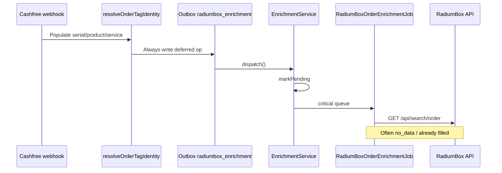
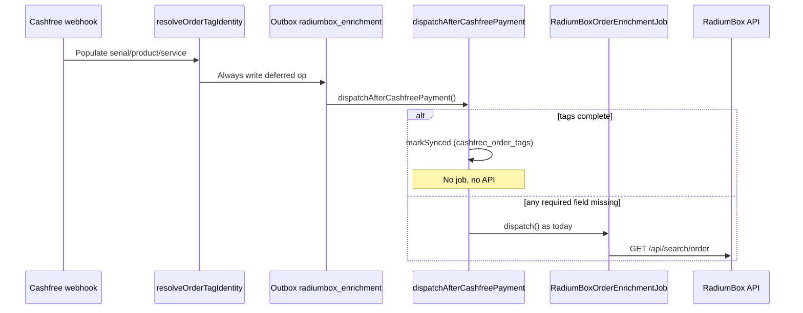

# Cashfree-First Enrichment — Implementation Report

**Date:** 2026-08-07  
**Baseline:** production `v4.0.8` / `ee6dae2e`  
**Canvas:** [`cashfree-first-enrichment.canvas.tsx`](/Users/ravi/.cursor/projects/Users-ravi-radium-service-desk/canvases/cashfree-first-enrichment.canvas.tsx)

---

## Verdict

Cashfree `order_tags` already populate serial / product / service at payment ingest (Phase A). This change adds a **completeness gate** on the paid-order deferred path: when tags satisfy `needsEnrichment() === false`, the order is marked **SYNCED** and the RadiumBox job is **not** dispatched. Incomplete tags keep today’s automatic RadiumBox fallback. Manual sync, backfill, recovery, and legacy repair are unchanged.

---

## 1. Field availability (confirmed)

| Cashfree tag (`data.order.order_tags.*`) | Order field(s) | Already mapped at ingest? |
|------------------------------------------|----------------|---------------------------|
| `serial_no` | `serial_number` (+ entered_at/by) | Yes — Phase A |
| `product_name` | `product_name`, `device_model` | Yes — Phase A |
| `rd_service_name` | `service_history` | Yes — Phase A |

Device-model alias resolution still runs via `OrderIdentityLifecycleService::afterOrderCreatedWithIdentity` (unchanged).

Production sample (prior investigation): **49/50** recent SUCCESS payments carried non-null `order_tags` with these three keys.

---

## 2. Completeness rule

Uses existing `RadiumBoxService::needsEnrichment()`:

- Serial locked (present)
- Device model present (`device_model_id` or `device_model`)
- `product_name` filled
- Non-empty `service_history`

If **not** needed → Cashfree-complete path.  
If **needed** → `dispatch()` as before (critical queue, `PENDING`).

---

## 3. Before / after flow

### Before

### After

---

## 4. Instrumentation

`CashfreeRadiumBoxBypassMetrics` (day-scoped cache counters):

| Counter | Meaning |
|---------|---------|
| `paid_enrichment_decisions` | Paid-order enrichment decisions |
| `bypassed` | Jobs avoided (Cashfree-complete) |
| `fallback_dispatched` | RadiumBox jobs queued |
| `bypass_percentage` | `bypassed / decisions × 100` |

Snapshot: `app(CashfreeRadiumBoxBypassMetrics::class)->snapshot()`.

Audit: `radiumbox.enrichment_completed` with `sync_source=cashfree_order_tags`, `lookup_result=cashfree_order_tags`, `radiumbox_job_bypassed=true`.

Logs: `RadiumBox enrichment bypassed; Cashfree order_tags complete.`

---

## 5. Benchmark estimates

| Metric | Before | After (est.) |
|--------|--------|--------------|
| RadiumBox jobs / paid order (complete tags) | **1** | **0** |
| RadiumBox jobs / paid order (incomplete tags) | **1** | **1** |
| API calls / complete-tag paid order | **1** (often `no_data`) | **0** |
| Expected bypass rate | — | **~90–98%** (49/50 tags present; most include all three keys) |
| Est. API reduction on paid path | — | **~90–98%** of paid-order enrichment HTTP |
| Ready Queue block from PENDING | ~job duration (~30–60s) even when tags complete | **None** when tags complete |

Per-day example (assume 100 paid orders, 95 complete tags):

| | Before | After |
|--|--------|-------|
| Jobs | 100 | 5 |
| Jobs avoided | 0 | **95** |
| Paid-path API calls | ~100 (+ retries) | ~5 (+ retries) |

---

## 6. Files changed

| File | Change |
|------|--------|
| `app/Services/RadiumBox/RadiumBoxOrderEnrichmentService.php` | `dispatchAfterCashfreePayment()`, `finalizeCashfreeTagEnrichment()` |
| `app/Services/Cashfree/CashfreeWebhookDeferredOperationsService.php` | Call `dispatchAfterCashfreePayment` |
| `app/Services/Cashfree/CashfreeRadiumBoxBypassMetrics.php` | **New** day counters |
| `tests/Feature/Cashfree/CashfreeFirstEnrichmentBypassTest.php` | **New** bypass / fallback tests |
| `tests/Feature/Cashfree/CashfreeOrderTagsIngestTest.php` | Queue::fake for incomplete-tag RB fill test |
| `tests/Feature/CashfreePaymentIntegrityTest.php` | Mock `dispatchAfterCashfreePayment` |
| `docs/cashfree-first-enrichment-implementation.md` | This report |

**Unchanged:** tag ingest mapping, device-model resolver, manual sync, backfill, recovery scheduler, legacy repair, RadiumBox client/job implementation.

---

## 7. Risks

| Risk | Severity | Mitigation |
|------|----------|------------|
| Tags present but wrong / stale vs RadiumBox | Low–Med | Manual sync + recovery still available; RB fill-missing never overwrites tag values |
| Completeness true but Ready Queue needs stricter serial validation | Low | Lifecycle + eligibility unchanged; only skips redundant HTTP |
| Warranty/AMC/customer fields not in tags | Info | Still only via RB / other paths when `needsEnrichment` is false those fields are not required for SYNCED |
| Metrics are cache day-counters (not warehouse) | Low | Audit `cashfree_order_tags` is durable signal |
| Duplicate serial skipped at ingest → incomplete → RB fallback | Expected | Preserves current behavior |

---

## 8. Customer-visible behavior

- Identity fields still appear from Cashfree tags at payment time (unchanged).
- Complete-tag orders reach SYNCED faster and avoid PENDING Ready Queue delay.
- Incomplete-tag orders still get automatic RadiumBox enrichment.
- C360 manual sync, ops batch recover, scheduler recovery, backfills unchanged.

---

## Stop

Implementation + tests + documentation only. Not released / not deployed in this step.
