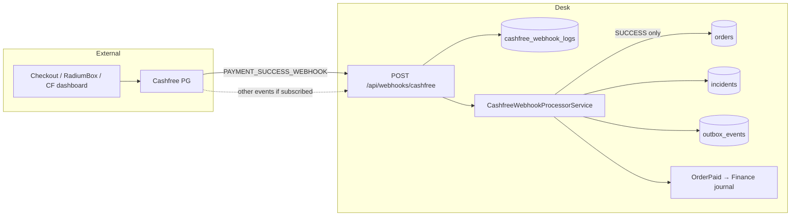

# Cashfree Integration — Complete Data Inventory

**Date:** 2026-08-06  
**Mode:** Read-only investigation (no code changes, no production writes, no Cashfree write APIs)  
**Canvas:** [`cashfree-integration-data-inventory.canvas.tsx`](/Users/ravi/.cursor/projects/Users-ravi-radium-service-desk/canvases/cashfree-integration-data-inventory.canvas.tsx)  
**Related:** [cashfree-phase-a-hardening.md](./cashfree-phase-a-hardening.md), [cashfree-integrity-root-cause.md](./cashfree-integrity-root-cause.md), [sc28430-refund-service-investigation.md](./sc28430-refund-service-investigation.md)

---

## Verdict

Radium Desk’s Cashfree integration is **webhook-inbound only**. There is **no Cashfree HTTP API client** in the codebase — no Payment, Order, Refund, Settlement, Customer, Token, Link, or Subscription API calls.

| Surface | Integrated? | Detail |
|---------|-------------|--------|
| Inbound webhook | **Yes** | `POST /api/webhooks/cashfree` |
| Outbound Payment / Order APIs | **No** | Checkout/order creation happens outside Desk |
| Refund APIs | **No** | Desk refunds are manual / wallet; `ApprovedRefundMethod::Cashfree` still uses `ManualRefundExecutor` |
| Settlement APIs / webhooks | **No** | Not parsed; not stored structurally |
| Customer / Token / Link / Subscription APIs | **No** | Not present |

Business processing creates a Desk order + service case **only** for `PAYMENT_SUCCESS_WEBHOOK` with `payment_status = SUCCESS`. Every other delivery is stored on `cashfree_webhook_logs` and left at `received` (or fails signature checks).

---

## 1. Current Cashfree architecture

### Runtime path (success)

1. Cashfree POSTs webhook → `CashfreeWebhookController`
2. Full headers + payload + raw body stored on `cashfree_webhook_logs`
3. Optional HMAC signature verify (`CASHFREE_VERIFY_SIGNATURE` + `CASHFREE_CLIENT_SECRET`)
4. `CashfreeWebhookProcessorService` runs only if type = `PAYMENT_SUCCESS_WEBHOOK` and status = `SUCCESS`
5. System-user preflight → create `orders` row → create/link service case → outbox deferred ops → `OrderPaid`

### Config (env)

| Key | Purpose |
|-----|---------|
| `CASHFREE_CLIENT_SECRET` | Webhook signature secret (not API app id/secret for PG calls) |
| `CASHFREE_VERIFY_SIGNATURE` | Enable HMAC verify |
| `CASHFREE_SYSTEM_USER_EMAIL` | Automation actor for order/case creation |
| `CASHFREE_PERSIST_RETRY_*` | Deadlock/lock-wait retries |
| `CASHFREE_AUTO_RECOVER_*` | Replay recoverable failed SUCCESS webhooks |

There is **no** `CASHFREE_APP_ID`, API base URL, or PG API key in Desk config.

### Ops / recovery (Desk-internal; no Cashfree API)

| Command / tool | Role |
|----------------|------|
| `cashfree:validate-config` | Config guard |
| `cashfree:reconcile` | Compare SUCCESS logs vs Desk orders |
| `cashfree:recover-historical` | Replay failed SUCCESS payloads |
| `cashfree:auto-recover-missing` | Scheduled recovery |
| `cashfree:reprocess-failed` | Reprocess failed logs |
| `cashfree:recover-awaiting-product-details` | Downstream case hygiene |
| Webhook Explorer UI | Read-only log browser |

---

## 2. APIs used

### Endpoints currently integrated

| Direction | Endpoint | Purpose |
|-----------|----------|---------|
| Inbound | `POST /api/webhooks/cashfree` | Sole Cashfree integration surface |
| Internal UI | `GET /cashfree/webhook-explorer` (+ show) | Operator inspection of stored deliveries |

### Cashfree product APIs — integration status

| API family | Status | Notes |
|------------|--------|-------|
| Payment APIs (get payment, etc.) | **Never requested** | No client |
| Order APIs (create/get order) | **Never requested** | Orders arrive via webhook `data.order.order_id` |
| Refund APIs | **Never requested** | Refunds completed via `ManualRefundExecutor` |
| Settlement / reconciliation APIs | **Never requested** | No UTR/batch pull |
| Customer APIs | **Never requested** | Customer fields taken from webhook only |
| Token / Saved instrument APIs | **Never requested** | — |
| Payment Link APIs | **Never requested** | `order_tags.cf_link_id` may appear in payloads but is ignored |
| Subscription APIs | **Never requested** | — |
| Easy Split / vendor APIs | **Never requested** | — |

---

## 3. Webhooks used

### Handled (business logic)

| Event | Condition | Effect |
|-------|-----------|--------|
| `PAYMENT_SUCCESS_WEBHOOK` | `data.payment.payment_status = SUCCESS` | Create/link order + case; mark log `processed` |

### Accepted & stored, not processed

Any other payload that reaches the endpoint is logged with `processing_status = received` and **no** order creation. Examples Cashfree can send (if subscribed in CF dashboard):

| Event | Desk behaviour |
|-------|----------------|
| `PAYMENT_FAILED_WEBHOOK` | Stored only |
| `PAYMENT_USER_DROPPED_WEBHOOK` | Stored only |
| `REFUND_STATUS_WEBHOOK` | Stored only (no refund matcher) |
| `AUTO_REFUND_STATUS_WEBHOOK` | Stored only |
| `SETTLEMENT_INITIATED` / `SUCCESS` / `FAILED` / `REVERSED` | Stored only |
| `VENDOR_SETTLEMENT_*` | Stored only |
| Duplicate SUCCESS for same `cf_payment_id` | Idempotent: mark processed, skip create |

> **Subscription caveat:** Whether production Cashfree dashboard currently forwards failed/refund/settlement events to this URL is a dashboard setting, not visible in Desk code. Desk will accept them if sent. Prior production case review ([sc28430](./sc28430-refund-service-investigation.md)) found payment SUCCESS only for that payment — no refund webhook rows.

### Webhook delivery fields (headers)

| Header / meta | Stored | Used |
|---------------|--------|------|
| Full request headers JSON | Yes (`request_headers`) | Signature: `X-Webhook-Timestamp`, `X-Webhook-Signature` |
| `x-webhook-version` (or aliases) | Yes (`webhook_version`) | Display / explorer |
| `x-idempotency-key` | In headers JSON | **Ignored** for dedupe (Desk dedupes on `cf_payment_id`) |
| `x-webhook-attempt` | In headers JSON | **Ignored** |
| Raw body | Yes (`raw_body`) | Signature base string; explorer |
| Source IP / User-Agent | Yes | Audit / explorer |

---

## 4. Complete field inventory

Classification legend:

1. **Structured store** — first-class column on `orders` or indexed log column  
2. **Raw store** — present in `cashfree_webhook_logs.request_payload` / `raw_body` only  
3. **Business logic** — read by `CashfreeWebhookPayloadParser` / processor / integrity  
4. **Ignored but available** — present in Cashfree webhook schema (and typically in raw store) but not promoted or used  
5. **Never requested** — would require an API or webhook Desk does not integrate

### 4.1 Envelope

| Field | Structured | Raw | Logic | Notes |
|-------|------------|-----|-------|-------|
| `type` | — | Yes | Yes | Gate for SUCCESS processing |
| `event_time` | — | Yes | Fallback for `payment_date` | Used only if `payment_time` missing |

### 4.2 `data.order`

| Field | Structured | Logic | Value if ignored |
|-------|------------|-------|------------------|
| `order_id` | `orders.order_id` | Required | — |
| `order_amount` | — | **Ignored** | High — can differ from `payment_amount` when offers apply |
| `order_currency` | — | **Ignored** | Medium — assume INR |
| `order_tags` | **Phase A ingest** | **Used** | Promotes `product_name` → `orders.product_name` + `device_model`, `serial_no` → `orders.serial_number` (normalized), `rd_service_name` → `orders.service_history`; audit source `cashfree_order_tags` (see [order-tags investigation](./cashfree-order-tags-production-investigation.md)) |
| `order_note` (newer versions) | — | **Ignored** | Low |

### 4.3 `data.payment`

| Field | Structured | Logic | Value if ignored |
|-------|------------|-------|------------------|
| `cf_payment_id` | `orders.cashfree_payment_id`, log column | Idempotency key | — |
| `payment_status` | — | Must be `SUCCESS` | Failed/dropped statuses unused |
| `payment_amount` | `orders.payment_amount` | Finance journal amount | — |
| `payment_currency` | — | **Ignored** | Medium |
| `payment_message` | — | **Ignored** | High — gateway message / decline text |
| `payment_time` | `orders.payment_date` | Yes | — |
| `bank_reference` | `orders.bank_reference` | Yes | RRN-like bank ref for UPI/etc. |
| `auth_id` | — | **Ignored** | High — card/netbanking auth |
| `payment_group` | Mapped → `orders.payment_method` (uppercased) | Yes | Coarse method only (`UPI`, `CREDIT_CARD`, …) |
| `payment_method` (object) | — | Fallback key name only | **High** — full instrument ignored |
| `international_payment` | — | **Ignored** | Medium |
| `payment_surcharge.*` | — | **Ignored** | High — fee/tax on payment |

### 4.4 `data.payment.payment_method` instruments (ignored detail)

Desk stores only the **group** (or top-level key). Instrument fields below are available in webhook payloads but not structured/used:

| Method | Available fields (Cashfree schema) | Business value |
|--------|------------------------------------|----------------|
| **UPI** | `channel`, `upi_id`, `upi_instrument`, `upi_instrument_number`, `upi_payer_ifsc`, `upi_payer_account_number` | **High** — Customer360, refund destination, fraud |
| **Card** | `card_number` (masked), `card_network`, `card_type`, `card_sub_type`, `card_country`, `card_bank_name`, `card_network_reference_id`, `instrument_id`, EMI fields | **High** — support + finance |
| **Netbanking** | `netbanking_bank_code`, `netbanking_bank_name` | **High** |
| **Wallet / app** | `channel` (e.g. AmazonPay), `upi_id` | Medium |
| **Cardless EMI / pay later** | `provider`, `phone`, EMI details | Medium |

Production evidence ([sc28430](./sc28430-refund-service-investigation.md)): UPI id `7643082915-2@ybl` was present on the payment but only coarse method/amount/`cf_payment_id` were used operationally.

### 4.5 `data.customer_details`

| Field | Structured | Logic | Value if ignored |
|-------|------------|-------|------------------|
| `customer_name` | `orders.customer_name` | Yes | Often null from CF |
| `customer_email` | `orders.customer_email` | Yes | — |
| `customer_phone` | `orders.customer_phone` | Inquiry auto-link | — |
| `customer_id` | — | **Ignored** | High — stable CF customer key |

### 4.6 `data.payment_gateway_details`

| Field | Structured | Logic | Value if ignored |
|-------|------------|-------|------------------|
| `gateway_order_id` | `orders.gateway_order_id` | Yes | — |
| `gateway_payment_id` | `orders.gateway_payment_id` | Yes | — |
| `gateway_name` | — | **Ignored** | Low |
| `gateway_order_reference_id` | — | **Ignored** | Medium — audit |
| `gateway_settlement` | — | **Ignored** | Medium — settlement rail hint |
| `gateway_status_code` | — | **Ignored** | Medium |
| `gateway_reference_name` (newer) | — | **Ignored** | Low |

### 4.7 `data.payment_offers[]`

| Field group | Status | Value |
|-------------|--------|-------|
| `offer_id`, `offer_type`, meta, redemption (`discount_amount`, `cashback_amount`) | Raw only / ignored | **High** — explains `order_amount` vs `payment_amount`; finance & analytics |

### 4.8 `data.error_details` (failed payments)

| Fields | Status | Value |
|--------|--------|-------|
| `error_code`, `error_description`, `error_reason`, `error_source`, raw subcodes | Stored if event received; **not processed** | **High** — funnel / support / ops |

### 4.9 `data.terminal_details`

| Fields | Status | Value |
|--------|--------|-------|
| `cf_terminal_id`, `terminal_phone` | Ignored | Low–Medium (offline/POS) |

### 4.10 Refund webhook fields (`REFUND_STATUS_WEBHOOK`) — never processed

| Field | Never used in Desk | Value |
|-------|--------------------|-------|
| `cf_refund_id` | Yes | High |
| `cf_payment_id` | Yes (could link to order) | High |
| `refund_id`, `order_id` | Yes | High |
| `refund_amount`, `refund_currency` | Yes | High |
| `refund_status`, `status_description` | Yes | High |
| `refund_arn` | Yes | High — bank ARN |
| `refund_type`, `refund_mode` | Yes | Medium |
| `refund_charge` | Yes | High — finance |
| `created_at`, `processed_at` | Yes | Medium |
| `refund_note`, `metadata`, `refund_splits` | Yes | Medium |
| Auto-refund: `bank_reference`, `refund_reason` | Yes | High |

Desk refund lifecycle today is **internal** (`refund_requests` → approve → `ManualRefundExecutor` → complete/close). Gateway refund IDs are typically null (see sc28430).

### 4.11 Settlement webhook fields — never processed

| Field | Available from Cashfree | Used? | Why unused |
|-------|-------------------------|-------|------------|
| `settlement_id` | Yes | No | No handler / no settlement table |
| `settled_on` / `settlement_initiated_on` | Yes | No | Finance posts at payment time, not settlement |
| `utr` | Yes | No | Bank payout reference never captured |
| `amount_settled`, `settlement_amount`, `payment_amount` | Yes | No | Net vs gross not reconciled in Desk |
| `service_charge`, `service_tax`, `settlement_charge`, `settlement_tax` | Yes | No | Fees not attributed per settlement |
| `adjustment` | Yes | No | Refunds/chargebacks in batch ignored |
| `payment_from` / `payment_till` | Yes | No | Batch window unused |
| `status`, `settlement_type`, `reason`, `remarks` | Yes | No | Lifecycle unused |

Settlement APIs (`Get All Settlements`, recon by order, etc.) are also **never requested**.

---

## 5. Used vs ignored (summary)

### Structured on `orders` today

`order_id`, `customer_name`, `customer_email`, `customer_phone`, `cashfree_payment_id`, `payment_amount`, `payment_method` (group only), `payment_date`, `bank_reference`, `gateway_order_id`, `gateway_payment_id`

### Used in business logic (beyond storage)

| Use | Fields |
|-----|--------|
| Idempotency / integrity | `cf_payment_id` |
| Create order + case title | `order_id`, customer fields, amounts |
| Inquiry auto-link | `customer_phone` |
| Coarse method label | `payment_group` |
| Finance journal (OrderPaid) | `payment_amount`, `payment_date` |
| Cashfree-verified identity | presence of `cashfree_payment_id` |
| Recovery / reconcile | SUCCESS payload + `cf_payment_id` / `order_id` |

### Ignored but available (highest signal)

UPI VPA / instrument, card bank/network/type, netbanking bank, `auth_id`, `payment_message`, `customer_id`, offer discount/cashback, surcharge fee/tax, `order_amount`, gateway settlement hints, error_details on failures, entire refund + settlement payloads.

### Important nuance: raw log retention

**Ignored ≠ lost.** Full JSON remains on `cashfree_webhook_logs` for SUCCESS (and any other events delivered). Gap is **structured promotion + product use**, not absence of the bytes — unless logs are purged or events were never subscribed.

---

## 6. Business value matrix

| Ignored field / area | Domains | Priority |
|----------------------|---------|----------|
| UPI `upi_id` / payer IFSC / account mask | Customer360, Support, Fraud, Refunds | **High** |
| Card bank / network / type / masked PAN | Support, Fraud, Analytics | **High** |
| Netbanking bank name/code | Support, Analytics | **High** |
| `payment_message` + `error_details` | Support, Ops, Analytics | **High** |
| `auth_id` / card network reference | Audit, Fraud | **High** |
| Offers (`discount_amount`, codes) | Finance, Analytics | **High** |
| Surcharge service charge/tax | Finance | **High** |
| Settlement `utr`, batch id, fees | Finance, Ops | **High** |
| Refund `cf_refund_id`, `refund_arn`, status | Finance, Support, Audit | **High** |
| `customer_id` (Cashfree) | Customer360 | **High** |
| `order_amount` vs `payment_amount` | Finance, Support | **High** |
| `order_tags.product_name` / `serial_no` / `rd_service_name` | Customer360, Ops, Support | **High** — Phase A promotes at ingest (`cashfree_order_tags`) |
| `gateway_settlement` / order reference | Audit | Medium |
| International flag | Analytics, Compliance | Medium |
| Terminal details | Ops (POS) | Low |
| `gateway_name` | Low | Low |

---

## 7. Top 20 high-value fields to start storing

Promote from webhook JSON onto structured columns (or a `cashfree_payments` / payment-attempt table):

| # | Field | Source | Why |
|---|-------|--------|-----|
| 1 | `upi_id` (payer VPA) | `payment_method.upi` | Refund destination + Customer360 |
| 2 | `upi_channel` | `payment_method.upi.channel` | Collect vs intent analytics |
| 3 | `upi_payer_ifsc` | UPI (newer versions) | Bank identity |
| 4 | `card_bank_name` | card | Support / issuing bank |
| 5 | `card_network` | card | Visa/RuPay/etc. |
| 6 | `card_type` / `card_sub_type` | card | Debit/credit/EMI |
| 7 | `card_number` (masked) | card | Agent confirmation |
| 8 | `netbanking_bank_name` | netbanking | Support |
| 9 | `payment_message` | payment | Gateway human message |
| 10 | `auth_id` | payment | Auth / audit |
| 11 | `customer_id` (CF) | customer_details | Stable external customer key |
| 12 | `order_amount` | order | Gross before offers |
| 13 | `offer_code` / `discount_amount` | payment_offers | Margin truth |
| 14 | `payment_surcharge_service_charge` | surcharge | Fee |
| 15 | `payment_surcharge_service_tax` | surcharge | Tax |
| 16 | `error_code` + `error_reason` | error_details | Failure analytics |
| 17 | `settlement_id` | settlement webhook | Batch link |
| 18 | `utr` | settlement webhook | Bank payout ref |
| 19 | `cf_refund_id` + `refund_arn` | refund webhook | Gateway refund truth |
| 20 | `refund_status` + `refund_amount` | refund webhook | Lifecycle sync |

---

## 8. Recommended roadmap

### Quick wins (extract from existing SUCCESS payloads)

1. ~~Promote `order_tags` (`product_name`, `serial_no`, `rd_service_name`) at SUCCESS ingest~~ — **done (Phase A)**.
2. Parse and store UPI VPA, card bank/network/type, netbanking bank from `payment_method`.
3. Store `payment_message`, `auth_id`, CF `customer_id`, `order_amount`.
4. Store offer discount/cashback + surcharge fee/tax when present.
5. Surface payment instrument fields on Order workspace / Customer360 payment card.
6. Backfill historical SUCCESS `order_tags` from `cashfree_webhook_logs` for older orders still missing identity.

### Phase 2 (event coverage)

1. Process `PAYMENT_FAILED_WEBHOOK` / `USER_DROPPED` into payment-attempt analytics (no fake orders).
2. Subscribe + handle `REFUND_STATUS_WEBHOOK` / auto-refund; link to `refund_requests` when method is Cashfree.
3. Implement real Cashfree refund executor (read status + initiate refund APIs) instead of always-manual path.
4. Handle `SETTLEMENT_*` webhooks → settlement batch table with UTR, fees, adjustments.
5. Use settlement net amounts to reconcile finance clearing vs bank.

### Future

1. Outbound Payment/Order GET for integrity when webhook missing.
2. Settlement reconciliation API jobs (pull, not only push).
3. Dispute/chargeback webhooks if enabled on account.
4. Payment-link / subscription products only if business adopts them.
5. Risk/fraud scoring feeds (device/IP beyond webhook source IP).

---

## Refunds — current vs Cashfree

| Topic | Current state |
|-------|---------------|
| Lifecycle | Desk-internal: request → review → pending_execution → complete/close |
| Gateway | **Not called**; executor always `manual` |
| Fields stored on refund | Desk amounts/methods/refs entered by agents |
| Cashfree refund webhooks | Not handled |
| Settlement refs on refund | None |

---

## Settlements — why available data is unused

1. No settlement webhook processor branch (SUCCESS-only payment gate).
2. No outbound settlement/recon client.
3. Finance `OrderPaymentJournalService` posts **gross payment_amount at payment time** to bank clearing / revenue — it does not wait for or net against Cashfree settlement UTR/fees.
4. Therefore settlement batch, date, UTR, and fee fields may arrive in raw logs (if subscribed) but never become Desk finance truth.

---

## Investigation limits

| Limit | Impact |
|-------|--------|
| Local DB empty (`cashfree_webhook_logs` = 0) | Live event-type histogram not re-queried this session |
| No Cashfree dashboard access | Exact webhook subscription set unknown |
| No Cashfree read APIs called | “Never requested” confirmed from code; live account entitlements not probed |
| Prior prod notes (sc28430) | Confirm SUCCESS payloads include UPI VPA; refunds not gateway-initiated |

---

## Source map (code)

| Area | Path |
|------|------|
| Config | `config/cashfree.php` |
| Webhook entry | `app/Http/Controllers/Webhooks/CashfreeWebhookController.php` |
| Parser | `app/Services/Cashfree/CashfreeWebhookPayloadParser.php` |
| Processor | `app/Services/Cashfree/CashfreeWebhookProcessorService.php` |
| Order columns | migrations `2026_06_28_160000_*`, `2026_06_28_170000_*` |
| Refund executor | `app/Services/Refunds/ManualRefundExecutor.php`, `RefundExecutorResolver.php` |
| Finance post | `app/Services/Finance/OrderPaymentJournalService.php` |

Cashfree schema references: [Payment webhooks](https://www.cashfree.com/docs/api-reference/payments/previous/v2023-08-01/payments/webhooks), [Refund webhooks](https://www.cashfree.com/docs/api-reference/payments/previous/v2023-08-01/refunds/webhooks), [Settlement webhooks](https://www.cashfree.com/docs/api-reference/payments/previous/v2023-08-01/settlements/settlement-webhooks).
