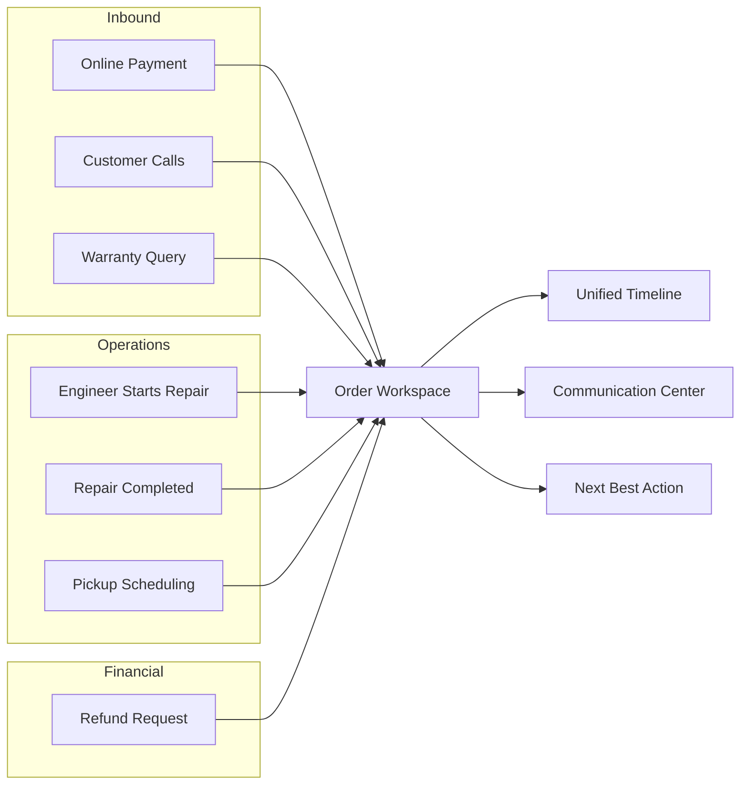
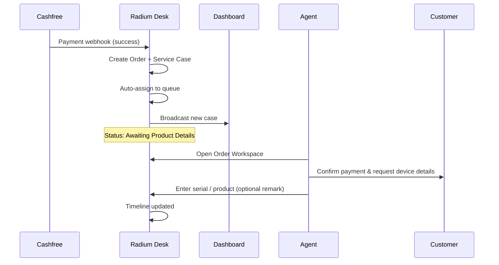
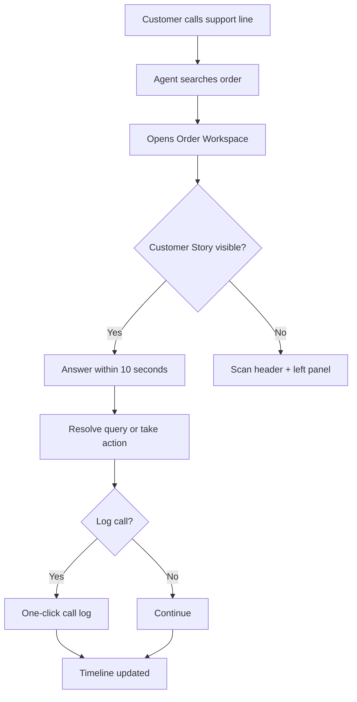
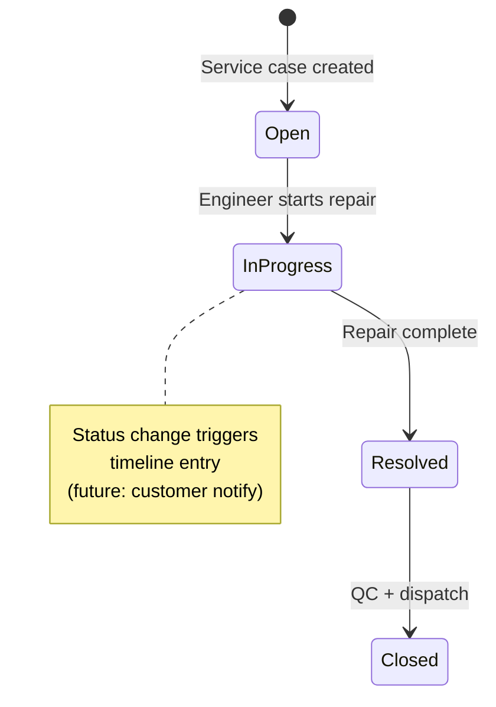
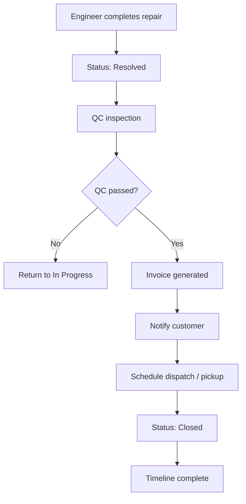
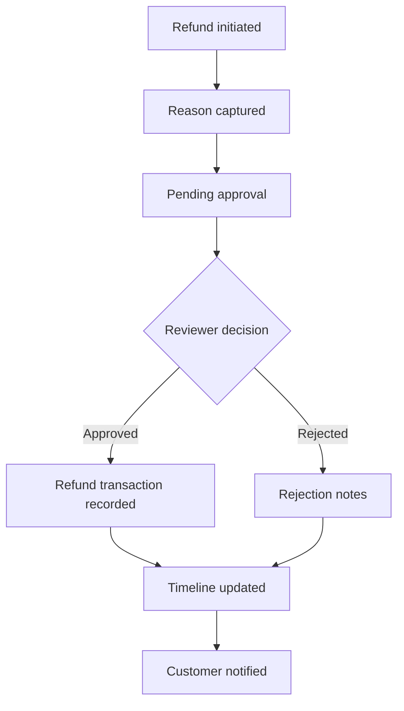
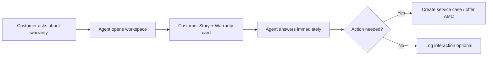
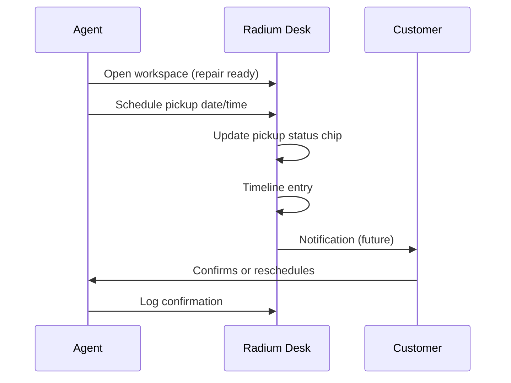

# Customer Journey Blueprint

**Phase:** 5.2 — Customer Journey & Order Workspace UX  
**Status:** Design blueprint (no integrations in this phase)  
**Audience:** Product, operations, engineering  
**Last updated:** 2026-07-15

This document defines the end-to-end customer journeys that Radium Desk must support from a single **Order Workspace**. Each journey describes what the system does automatically, what agents do, how customers are communicated with, what appears on the timeline, and how success is measured.

**Related documents:**

- [Order Workspace Blueprint](./order-workspace-blueprint.md) — component review, agent audit, communication center, NBA framework, hierarchy, backlog
- [Product Foundations](./product-foundations.md) — ownership, activation, immutability
- [Workspace Architecture](./workspace-architecture.md) — modal action system (service case context)

---

## Journey Map Overview

All journeys converge on the **Order Workspace** as the operational hub. Service cases, payments, communications, and timeline entries are facets of the same order — not separate modules.

---

## Journey 1 — Online Payment Received

### Flow

### Trigger

Customer completes an online payment via Cashfree (repair fee, activation fee, or service charge).

### Automatic System Actions

| Step | Action | Current state | Target state |
|------|--------|---------------|--------------|
| 1 | Receive and verify Cashfree webhook | Implemented | — |
| 2 | Create `Order` with payment metadata (amount, method, bank reference, gateway IDs) | Implemented | — |
| 3 | Create Service Case with source `Cashfree`, status `Awaiting Product Details` | Implemented | — |
| 4 | Auto-assign to operational queue | Implemented | — |
| 5 | Broadcast to dashboard (Reverb) | Implemented | — |
| 6 | Append timeline entry: "Service Case {ref} created" | Partial — visible on order timeline via incident creation | Add explicit "Payment received" entry |
| 7 | Surface order on agent dashboard with payment chip | Partial — payment fields exist; workspace chips use transaction lock, not gateway payment | Distinguish "Payment received" vs "Activation complete" |

### Agent Actions

1. Agent sees new case on dashboard or searches order by Cashfree order ID / phone.
2. Opens **Order Workspace** — immediately sees customer name, phone, payment amount, and status chip **Payment Received**.
3. Contacts customer to confirm payment and collect device details (serial, model, issue description).
4. Updates order (serial, product) and advances service case from `Awaiting Product Details` → `Open` / `In Progress`.
5. Optionally logs call or sends WhatsApp confirmation from workspace quick actions (future).

### Customer Communication

| Channel | Message (template) | Timing |
|---------|-------------------|--------|
| SMS / WhatsApp (future) | "Payment of ₹{amount} received for order {order_id}. Our team will contact you shortly to confirm device details." | Within 5 minutes of webhook |
| Phone (agent) | Confirm identity, payment reference, device model, pickup/drop-off preference | First contact within SLA |
| Email (future) | Payment receipt + next steps | Optional, same day |

### Timeline Entries

| Entry | Actor | When |
|-------|-------|------|
| Payment received via Cashfree — ₹{amount} | System | Webhook processed |
| Service Case {ref} created | System | Case auto-created |
| Service Case assigned to {agent} | System | Auto-assignment |
| Order updated — Serial Number: {value} | Agent | After customer confirmation |
| Remark: Customer confirmed payment and device details | Agent | Optional |

### Success Criteria

- Agent can identify payment status within **3 seconds** of opening workspace.
- Customer receives confirmation within **15 minutes** of payment (automated or agent).
- No duplicate orders for the same `cf_payment_id`.
- Service case progresses from `Awaiting Product Details` within **24 hours**.
- Full payment audit trail visible on Payments tab and timeline.

### Journey 1A — Missing Serial Automation

After [Journey 1 — Online Payment](#journey-1--online-payment-received), paid service orders may enter automated serial recovery and customer outreach.

**Do not assume** outreach is triggered only because `serial_number` is empty. The full business trigger, timeline, and operator checklist are documented in **[Missing Serial Automation](./missing-serial-automation.md)**.

Summary:

| Stage | What happens |
|-------|----------------|
| Order paid | Cashfree webhook; RadiumBox enrichment scheduled |
| +15 min | Automatic serial recovery attempted |
| Serial still missing | Request Serial Number (email + WhatsApp) + Customer Waiting state |
| +24 h | Support Reminder (`CustomerWaitingFollowup`) |
| 6:00 PM | Auto-close via existing waiting lifecycle (if no response) |

---

## Journey 2 — Customer Calls

### Flow

### Trigger

Customer calls support with a question about their order, repair status, payment, or pickup.

### Automatic System Actions

| Step | Action | Current state |
|------|--------|---------------|
| 1 | Order lookup by phone, order ID, or serial (global search) | Orders index + lookup API exist |
| 2 | Load workspace with customer summary, active repair, status chips | Implemented |
| 3 | Highlight active service case banner if open case exists | Implemented |
| 4 | Pre-compute Customer Story summary | Not yet — placeholder in blueprint |
| 5 | Suggest next best action based on order state | Static placeholder in Agent Assistant |

### Agent Actions

1. Search or navigate to order (from dashboard link, phone lookup, or order ID).
2. **Glance at Level 1 information** (see [Information Hierarchy](./order-workspace-blueprint.md#information-hierarchy)):
   - Order ID, customer name, phone
   - Current repair status and engineer
   - Payment / completion status
   - Status chips (payment, warranty, priority, pickup)
3. Answer customer question using visible context — **target: under 10 seconds** to first meaningful response.
4. Take action if needed: create ticket, add remark, navigate to service case.
5. **Optional:** Log call with duration, outcome, and notes (one click from Communication tab or quick actions).

### Customer Communication

| Scenario | Agent response pattern |
|----------|------------------------|
| "What's my repair status?" | Read repair status card + engineer name; quote ETA if available |
| "Did you receive my payment?" | Check payment chip + Payments tab |
| "When can I pick up?" | Check pickup chip + schedule (future) |
| New issue on same device | Create new service case from workspace (per product foundations: never reopen closed cases) |

### Timeline Entries

| Entry | Actor | When |
|-------|-------|------|
| Inbound call — {duration} — {outcome} | Agent | If logged (future) |
| Remark added | Agent | If notes captured |
| Service Case {ref} created | Agent/System | If new issue opened |

### Success Criteria

- Agent finds correct order in **≤ 2 searches**.
- Level 1 context visible **without scrolling or tab switching** on standard viewport.
- Call logging (when implemented) completes in **≤ 2 clicks**.
- No navigation away from workspace for routine status queries.
- Average time-to-first-answer **≤ 10 seconds** for top 5 call types.

---

## Journey 3 — Engineer Starts Repair

### Flow

### Trigger

Assigned engineer begins physical repair work on the device.

### Automatic System Actions

| Step | Action | Current state |
|------|--------|---------------|
| 1 | Service case status → `In Progress` | Implemented via service case status service |
| 2 | Timeline entry for status change | Implemented (audit + activity timeline) |
| 3 | Dashboard broadcast / row refresh | Implemented |
| 4 | Update workspace repair status card and chips | Implemented (on page refresh) |
| 5 | Customer notification (SMS/WhatsApp) | **Future** — placeholder only |
| 6 | Real-time workspace refresh without full reload | **Future** — Reverb on order context |

### Agent Actions

1. Engineer or coordinator updates status on service case (from service case page or future inline workspace action).
2. Agent monitoring workspace sees updated status, engineer name, and SLA.
3. If customer calls, agent confirms repair is in progress with engineer name.

### Customer Communication (Future)

| Channel | Message |
|---------|---------|
| WhatsApp / SMS | "Your {device} repair (Ref: {repair_id}) is now in progress. Estimated completion: {date}." |
| Phone | Agent uses suggested response from Agent Assistant |

### Timeline Entries

| Entry | Actor |
|-------|-------|
| Service Case {ref} status changed: Open → In Progress | Engineer / Agent |
| Assigned to {engineer} | System (if reassigned) |
| Remark: {diagnosis notes} | Engineer |

### Success Criteria

- Status visible on workspace within **30 seconds** of change (real-time target).
- Customer notification sent within **5 minutes** (when channel integrated).
- No duplicate status transitions.
- Engineer name always visible in repair status card.

---

## Journey 4 — Repair Completed

### Flow

### Trigger

Engineer marks repair as complete; device enters quality control.

### Automatic System Actions

| Step | Action | Current state |
|------|--------|---------------|
| 1 | Status → `Resolved` | Implemented |
| 2 | Timeline entry | Implemented |
| 3 | QC workflow gate | **Future** — design in RadiumBox phase |
| 4 | Invoice generation | **Future** — Invoice quick action placeholder |
| 5 | Customer notification with invoice link | **Future** |
| 6 | Dispatch / pickup scheduling | **Future** — Journey 7 |
| 7 | Status → `Closed` after handoff | Implemented |

### Agent Actions

1. Confirm QC passed (future QC module or manual remark).
2. Trigger or verify invoice readiness.
3. Contact customer via preferred channel with pickup/dispatch details.
4. Mark dispatch complete; close service case if all criteria met.
5. For activation orders: assign Transaction ID if applicable (separate activation path per product foundations).

### Customer Communication

| Stage | Channel | Message |
|-------|---------|---------|
| QC passed | WhatsApp / SMS | "Your device repair is complete and passed quality check." |
| Invoice ready | Email / WhatsApp | Invoice PDF or payment link |
| Ready for pickup | SMS / WhatsApp | Pickup address, hours, ID required |
| Dispatched | SMS | Tracking / courier details |

### Timeline Entries

| Entry | Actor |
|-------|-------|
| Service Case status: In Progress → Resolved | Engineer |
| QC passed | QC Agent (future) |
| Invoice {number} generated | System (future) |
| Customer notified — repair ready | Agent / System |
| Dispatch scheduled / completed | Agent |
| Service Case closed | Agent / System |

### Success Criteria

- End-to-end repair-to-customer-handoff tracked on single timeline.
- Invoice accessible from workspace Payments tab (future).
- Customer notified within **1 hour** of QC pass.
- Agent can answer "Is my device ready?" in **≤ 5 seconds** when status is Resolved+.

---

## Journey 5 — Refund Request

### Flow

### Trigger

Customer requests refund (duplicate payment, service not rendered, cancellation, goodwill).

### Automatic System Actions

| Step | Action | Current state |
|------|--------|---------------|
| 1 | Create `RefundRequest` with reference number | Implemented |
| 2 | Link to order (and optional service case) | Implemented |
| 3 | Audit log entry | Implemented |
| 4 | Timeline entry on order | Implemented via `OrderActivityTimelineService` |
| 5 | Surface pending refund on workspace | **Not yet** — refunds live on separate `/refunds` module |
| 6 | Customer notification | **Future** |

### Agent Actions

1. Create refund request from workspace (future) or refunds module (current).
2. Capture mandatory reason and amount.
3. Escalate to approver if agent lacks permission.
4. Approver reviews, enters refund transaction ID or rejects with notes.
5. Agent notifies customer of outcome.

### Customer Communication

| Stage | Message |
|-------|---------|
| Request received | "Refund request {ref} received. We will review within {SLA}." |
| Approved | "Refund of ₹{amount} approved. Transaction ID: {id}. Expected in {days} business days." |
| Rejected | "Refund request declined. Reason: {notes}. Contact support if you have questions." |

### Timeline Entries

| Entry | Actor |
|-------|-------|
| Refund request {ref} created — ₹{amount} | Agent |
| Refund {ref} approved / rejected | Approver |
| Remark on refund | Agent |

### Success Criteria

- Refund status visible on Order Workspace without leaving page (target).
- Full audit trail from request → decision → payout reference.
- Customer notified within **24 hours** of decision.
- Pending refunds appear in Next Best Action for approvers.

---

## Journey 6 — Warranty Query

### Flow

### Trigger

Customer asks whether device is under warranty, what is covered, or when warranty expires.

### Automatic System Actions

| Step | Action | Current state |
|------|--------|---------------|
| 1 | Display warranty status chip | **Placeholder** — hardcoded "Warranty Active" |
| 2 | Warranty summary card on Overview | **Placeholder** — static "Standard coverage" |
| 3 | Compute warranty from purchase date + product rules | **Future** — RadiumBox / product catalog |
| 4 | Show repair history count on Customer Story | Partial — service case list exists |
| 5 | Suggest AMC if expired | **Future** — NBA rule |

### Agent Actions

1. Open Order Workspace (search by serial or phone).
2. Read **Customer Story** and warranty card — no tab switch required.
3. Answer coverage, expiry, and previous repair questions.
4. If in warranty: create service case or explain process.
5. If expired: offer paid repair or AMC (future sales module).

### Customer Communication

| Scenario | Response |
|----------|----------|
| Active warranty | "Your {device} is under warranty until {date}. Coverage includes {scope}." |
| Expired | "Warranty expired on {date}. We can offer repair at ₹{estimate} or an AMC plan." |
| Previous repair | "You had {n} previous repairs — last on {date} for {issue}." |

### Timeline Entries

| Entry | Actor |
|-------|-------|
| Remark: Warranty inquiry — {summary} | Agent (optional) |
| Service Case created for warranty repair | Agent |

### Success Criteria

- Warranty status visible in **Level 1** (header chips or Customer Story) — not buried in Device tab.
- Agent answers standard warranty question in **≤ 10 seconds**.
- No navigation to external warranty system for basic queries (future integration reads through workspace).

---

## Journey 7 — Pickup Scheduling

### Flow

### Trigger

Device is ready for customer pickup, or customer requests pickup/drop-off scheduling for intake.

### Automatic System Actions

| Step | Action | Current state |
|------|--------|---------------|
| 1 | Show "Pickup Pending" chip when active incident exists | **Partial** — chip shown for any active incident, not pickup-specific |
| 2 | Pickup schedule record | **Future** |
| 3 | Calendar / slot validation | **Future** |
| 4 | Customer notification with slot details | **Future** |
| 5 | Timeline entry | **Future** |
| 6 | Reminder if customer no-show | **Future** — NBA rule |

### Agent Actions

1. Confirm device ready (Journey 4 complete).
2. Open pickup scheduler from workspace quick action or Overview.
3. Select date, time window, and location.
4. Notify customer via preferred channel.
5. On customer confirmation, update schedule; on no-show, trigger reminder NBA.

### Customer Communication

| Stage | Message |
|-------|---------|
| Scheduled | "Pickup scheduled for {date} {time} at {location}. Please bring ID." |
| Reminder | "Reminder: pickup tomorrow at {time}." |
| Rescheduled | "Pickup moved to {new_date}. Reply to confirm." |

### Timeline Entries

| Entry | Actor |
|-------|-------|
| Pickup scheduled — {date} {time} | Agent |
| Pickup confirmed by customer | Agent / System |
| Pickup completed | Agent |
| Reminder sent | System |

### Success Criteria

- Pickup status visible at Level 1 when relevant.
- Schedule + notify in **≤ 3 clicks** from workspace.
- Customer receives confirmation within **5 minutes** of scheduling.
- No-show reminders automated (future).

---

## Cross-Journey Principles

These apply to all seven journeys:

| Principle | Requirement |
|-----------|-------------|
| **Single hub** | Every journey action starts or ends in Order Workspace |
| **Timeline as audit** | Every material event appends to order timeline (append-only) |
| **No module hopping** | Refunds, communications, repairs surface in workspace — not separate apps |
| **10-second rule** | Level 1 information answers 80% of inbound calls without clicks |
| **Channel-agnostic comms** | Phone, WhatsApp, email, SMS share one communication timeline |
| **Configurable NBA** | System suggests next action; agent always confirms |
| **Future-ready** | Placeholders today; integrations plug into designed slots |

---

## Journey ↔ Workspace Surface Matrix

| Journey | Primary workspace surfaces | Tabs used |
|---------|---------------------------|-----------|
| 1 — Online payment | Status chips, Payments, Overview, Timeline | Overview, Payments, Timeline |
| 2 — Customer calls | Customer Story, header meta, left panel, Agent Assistant | Overview (default) |
| 3 — Engineer repair | Repair status card, status chips, Timeline | Overview, Timeline |
| 4 — Repair complete | Quick actions (Invoice), Communication, Timeline | Overview, Communication, Payments |
| 5 — Refund | Timeline, Payments (future Refunds card) | Timeline, Payments |
| 6 — Warranty | Customer Story, warranty chip/card | Overview |
| 7 — Pickup | Status chips, Communication, NBA | Overview, Communication |

---

## Document maintenance

| Change | Action |
|--------|--------|
| Missing serial automation timing or trigger rules | Update [Missing Serial Automation](./missing-serial-automation.md) |
| New channel integrated | Update Customer Communication tables in affected journeys |
| RadiumBox QC/invoice live | Update Journey 4 automatic actions |
| Warranty data source defined | Update Journey 6 from placeholder to live rules |
| Pickup module built | Update Journey 7 current state column |
