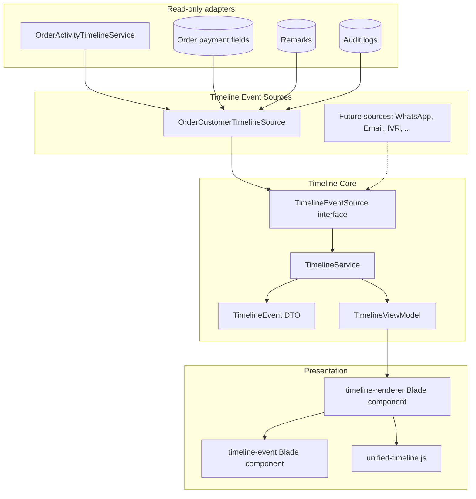

# Customer Timeline Foundation (Phase 8.1)

**Status:** Implemented  
**Scope:** Reusable unified timeline framework for Customer360  
**Last updated:** 2026-07-01

---

## Architecture



Customer360 loads the first page via `Customer360Service`. Older events load through `GET /dashboard/service-cases/{incident}/customer-360/timeline?offset=N`.

---

## Data model

### TimelineEventType (`App\Enums\TimelineEventType`)

| Type | Status | Icon |
|------|--------|------|
| `payment` | Supported | `bi-credit-card` |
| `service_case_created` | Supported | `bi-tools` |
| `assignment` | Supported | `bi-person-check` |
| `internal_note` | Supported | `bi-chat-left-text` |
| `audit_event` | Supported | `bi-journal-text` |
| `whatsapp`, `email`, `ivr_call`, `dispatch`, `replacement`, `automation`, `ai_summary` | Reserved | Pre-mapped icons |

Future types are defined on the enum with icons and labels. UI renders any type generically via `TimelineEventType::icon()` — no Blade changes required.

### TimelineEvent (`App\Data\TimelineEvent`)

| Field | Purpose |
|-------|---------|
| `type` | Event classification + icon lookup |
| `occurredAt` | Sorting and day grouping |
| `title` | Business-friendly headline |
| `summary` | Short always-visible detail |
| `detail` | Long content; auto-collapsed when > 120 chars |
| `actor` | `TimelineActor` (name, subtitle, automation flag) |
| `dedupeKey` | Cross-source deduplication |

### TimelineViewModel (`App\Data\TimelineViewModel`)

| Field | Purpose |
|-------|---------|
| `groups` | `TimelineDayGroup[]` — Today / Yesterday / Earlier |
| `totalCount` | Full history size (for pagination) |
| `loadedCount` | Events rendered so far |
| `offset` / `limit` | Current page window |
| `hasMore` | Whether “Load older events” should show |

---

## UI behaviour

- **Relative timestamps** — `2 hours ago` via `diffForHumans()`
- **Exact timestamp on hover** — `title` attribute with `d M Y • h:i A`
- **Day grouping** — Today, Yesterday, Earlier (app timezone)
- **Expand/collapse** — native `<details>` for long `detail` text
- **Pagination** — “Load older events” fetches the next HTML fragment and appends into matching day groups
- **Empty state** — clock icon + “No customer activity recorded yet.”

---

## Extension points

1. **`TimelineEventSource` interface** — implement `collect(): Collection<TimelineEvent>` and pass to `TimelineService::build()`.
2. **`TimelineEventType` enum** — add a case + `label()` + `icon()`; mark `isSupported()` when ready.
3. **`Customer360TimelineService`** — compose multiple sources:

```php
$this->timelineService->build([
    new OrderCustomerTimelineSource(...),
    new WhatsAppTimelineSource(...), // future
]);
```

4. **`<x-timeline-renderer>`** — reusable anywhere; accepts `TimelineViewModel`, optional `loadMoreUrl`.
5. **`initUnifiedTimeline(root)`** — wire pagination in any container (already called from Customer360 drawer).

---

## Files added / modified

### Added
- `app/Enums/TimelineEventType.php`
- `app/Enums/TimelineDayBucket.php`
- `app/Data/TimelineEvent.php`
- `app/Data/TimelineDayGroup.php`
- `app/Data/TimelineViewModel.php`
- `app/Contracts/Timeline/TimelineEventSource.php`
- `app/Services/Timeline/TimelineService.php`
- `app/Services/Timeline/Customer360TimelineService.php`
- `app/Services/Timeline/Sources/OrderCustomerTimelineSource.php`
- `resources/views/components/timeline-renderer.blade.php`
- `resources/views/components/timeline-event.blade.php`
- `resources/views/customer-360/partials/timeline-page.blade.php`
- `resources/js/unified-timeline.js`
- `tests/Unit/TimelineServiceTest.php`
- `tests/Feature/CustomerTimelineTest.php`
- `docs/customer-timeline-foundation.md`

### Modified
- `app/Services/Customer360Service.php` — uses `Customer360TimelineService`
- `app/Http/Controllers/Customer360Controller.php` — timeline pagination endpoint
- `app/Support/AppDateFormatter.php` — `timelineRelative()`
- `app/Support/helpers.php` — `display_app_timeline_relative()`
- `resources/views/customer-360/partials/timeline.blade.php`
- `resources/js/customer-360-drawer.js`
- `resources/css/app.css`
- `routes/web.php`
- `tests/Feature/Customer360DrawerTest.php`
- `tests/Unit/Customer360ServiceTest.php`

Payment processing and webhook logic were **not** modified. Payment events are read from existing order fields and audit logs only.
