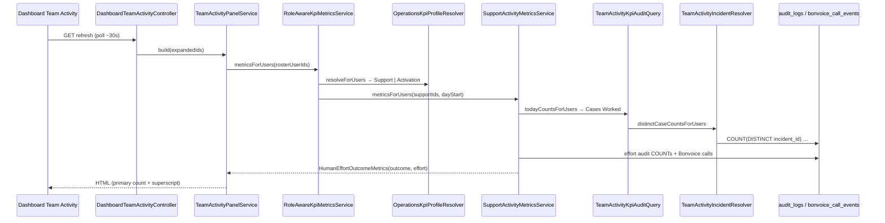
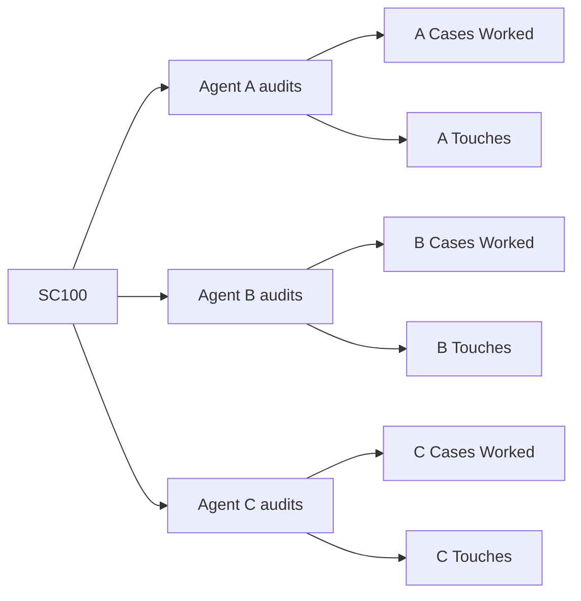

# Cases Worked & Customer Touches — Complete Investigation

**Date:** 2026-08-05  
**Type:** P0 reverse-engineering (read-only; no code changes)  
**Audience:** Agent Handbook · Manager Handbook · KPI Documentation  
**Scope:** Support-profile Team Activity metrics labelled **Cases Worked** and **Customer Touches**

---

## Executive summary

| Metric | Label in UI | Code name | Unit | Window |
|--------|-------------|-----------|------|--------|
| **Cases Worked** | Cases Worked | `outcome` | **Distinct service-case Reference Nos.** the agent touched today via allowlisted human actions | Calendar day (`APP_TIMEZONE`, default `Asia/Kolkata`) from `startOfDay` → now |
| **Customer Touches** | Customer Touches | `effort` | **Sum of counted action events** (not distinct cases): status updates + manual remarks ± deletes + manual WhatsApp + emails + Bonvoice calls | Same calendar day |

**One-line definitions (code-accurate):**

- **Cases Worked** = count of unique `incident_id` values resolved from today’s allowlisted `audit_logs` for that agent.
- **Customer Touches** = `COUNT(*)` of specific effort audit events **plus** distinct Bonvoice `call_id`s attributed to the agent today — **not** “customer replies.”

These two metrics are **independent**. An action can increment one, both, or neither.

---

## Critical warning — two different “customer” counters exist

| Surface | Label shown | Source of truth | Same as Team Activity? |
|---------|-------------|-----------------|------------------------|
| **Team Activity** (dashboard) | Cases Worked / Customer Touches | `RoleAwareKpiMetricsService` → `SupportActivityMetricsService` | **Yes — canonical for this investigation** |
| **Workforce Member 360** (Support profile) | Same labels via `outcome_count` / `effort_count` | Overlays RoleAware onto snapshot | **Yes — same numbers** |
| **My Performance** | “Completed” cases / “Customer replies” | `TeamPerformanceMetricsService` → `work_sessions` counters + closed incidents | **No — different math and labels** |
| **Legacy performance card** | cases completed / communications | Session sums | **No** |

My Performance “Customer replies” reads `work_sessions.communication_events_count` (Presence increments when email/WhatsApp side-effects fire). That is **not** Team Activity Customer Touches. Do not equate them in handbooks without calling out the split.

---

## Execution path (Team Activity)



### File path

| Layer | File |
|-------|------|
| Controller | `app/Http/Controllers/DashboardTeamActivityController.php` |
| Panel | `app/Services/Dashboard/TeamActivityPanelService.php` |
| Role router | `app/Services/Operations/RoleAwareKpiMetricsService.php` |
| Profile | `app/Services/Operations/OperationsKpiProfileResolver.php` |
| Support metrics | `app/Services/Operations/SupportActivityMetricsService.php` |
| Cases Worked query | `app/Support/Dashboard/TeamActivityKpiAuditQuery.php` |
| Incident resolution SQL | `app/Support/Dashboard/TeamActivityIncidentResolver.php` |
| Labels | `app/Enums/OperationsKpiProfile.php` |
| DTO | `app/Data/Operations/HumanEffortOutcomeMetrics.php` |
| Blade | `resources/views/dashboard/partials/team-activity-agent-row.blade.php` |
| Allowlists | `config/dashboard-team-activity.php` (`event_count_allowlist`) |
| Effort event map | `config/operations-kpi.php` (`support.effort_events`) |

### Profile gate

```php
// OperationsKpiProfileResolver
usesAdminQueues($user) → Activation  // Orders Activated / Activation Sessions
else → Support                       // Cases Worked / Customer Touches
```

Only **Support** agents get Cases Worked / Customer Touches. Operations Admins see Activation KPIs instead.

---

## Time window & reset

| Question | Answer (from code) |
|----------|-------------------|
| Window start | `Carbon::now()->startOfDay()` (`TeamActivityKpiAuditQuery::dayStart`, `SupportActivityMetricsService`) |
| Timezone | `config('app.timezone')` = `env('APP_TIMEZONE', 'Asia/Kolkata')` |
| Window end | Implicit: all rows with `created_at >= dayStart` (and Bonvoice `started_at >= dayStart`) — no upper bound other than “now” |
| Shift-based? | **No** |
| Rolling 24h? | **No** |
| Login-session-based? | **No** (not tied to `work_sessions`) |
| Counter reset | Soft reset at local midnight — queries simply exclude yesterday’s rows. No stored counter table. |
| Cache / Redis / snapshot job | **None** for these KPIs. Recomputed on every Team Activity panel build / poll. |

---

## Cases Worked — exact definition

### Formula

```
Cases Worked(agent, day) =
  COUNT(DISTINCT resolved_incident_id)
  FROM allowlisted audit_logs for agent since dayStart
  WHERE resolved_incident_id IS NOT NULL
```

Config comment (`config/dashboard-team-activity.php`):

> One unique Reference No. (service case) touched by a human = one count.

Implementation: `TeamActivityIncidentResolver::distinctCaseCountsForUsers()`.

### What increments it?

Any **allowlisted** audit event attributed to the agent (`audit_logs.user_id`) that successfully resolves to an `incident_id`.

#### Allowlist (`event_count_allowlist`)

| Event | Counts for Cases Worked? | Special filter |
|-------|--------------------------|----------------|
| `service_case.assigned` | Yes | — |
| `service_case.reassigned` | Yes | — |
| `service_case.status_changed` | Yes | Includes resolve, close, reopen, any status |
| `service_case.escalated` | Yes | — |
| `whatsapp.template_sent` | Yes | **`trigger_source = manual` only** |
| `incoming_email.promoted_to_service_case` | Yes | Manual promote path |
| `created` (Remark morph) | Yes | **`new_values.origin = manual` only** |
| `deleted` (Remark morph) | Yes | **`old_values.origin = manual` only** |
| `serial.assigned` | Yes | Resolves via `incident_id` in payload or order→latest incident |
| `order.updated` | Yes | Order → latest incident |
| `order.identity.corrected` | Yes | Order → latest incident |
| `refund.approved` / `rejected` / `completed` | Yes | Via `refund_requests.incident_id` |
| `approval_numbers.submitted` / `deleted` | Yes | Via `approval_incident` pivot |
| `workforce.leave.approved` | In allowlist | Typically **no incident_id** → contributes **0** (COUNT DISTINCT ignores NULL) |

#### Explicitly does **not** increment Cases Worked

| Action / event | Why |
|----------------|-----|
| Opening / viewing a case | No audit written |
| Customer reply (`incoming_email.received` / `.linked`) | Not in `event_count_allowlist` |
| Email sent (`notification.dispatched`) | Not in count allowlist (only in activity feed + Customer Touches) |
| `communication_action.lifecycle` | Not in count allowlist |
| Auto / IRA / scheduler WhatsApp | Filtered out (`trigger_source ≠ manual`) |
| System remarks (`origin = system`) | Filtered out |
| Automation pipeline events | Not in count allowlist |
| Availability changes | Not in count allowlist |
| Driver guide sent (`service_reference.driver_guide_sent`) | Not in count allowlist |
| Pure assignment of **you** by someone else | Credit goes to **actor**’s `user_id`, not assignee |
| Calls (Bonvoice) | Not in Cases Worked path |

### Incident resolution (how Reference No. is found)

SQL `COALESCE` in `TeamActivityIncidentResolver::incidentIdExpression()`:

1. Auditable is Incident → `auditable_id`
2. JSON `new_values.incident_id`
3. Remark on Incident → `remarks.remarkable_id`
4. Remark on Order → latest incident for that order
5. Refund → `refund_requests.incident_id`
6. Approval → `approval_incident.incident_id`
7. Auditable is Order → latest incident for order (`ORDER BY updated_at DESC, id DESC LIMIT 1`)

### FAQ — Cases Worked

| Question | Answer |
|----------|--------|
| Does opening count? | **No** |
| Does assignment count? | **Yes** — for the **assigner (actor)**, not automatically for the assignee |
| Does status change count? | **Yes** (any status including resolve/close/reopen) |
| Does internal note count? | **Yes** if manual remark |
| Does customer reply count? | **No** (for the agent) |
| Does WhatsApp count? | **Yes** if manual only |
| Does reopening count? | **Yes** as a status change event — still **one** case that day if already counted |
| Does resolve count? | **Yes** (status change) — still one distinct case |
| Does close count? | **Yes** (status change) — still one distinct case |
| Can one case be counted twice for one agent same day? | **No** — distinct incident_id |
| Can one case be counted on different days? | **Yes** — day 1 and day 2 each get +1 if the agent acts both days |
| Can two agents both receive credit? | **Yes** — each agent’s own audits → each gets +1 for that case |
| When is counter reset? | Local calendar midnight (query window) |

Proven by tests:

- `DashboardTeamActivityCasesWorkedTest::test_twenty_actions_on_one_reference_no_count_as_one_case_worked`
- `…test_two_users_on_same_reference_no_each_receive_one_case_worked`
- `…test_two_distinct_reference_numbers_count_as_two_cases_worked`

---

## Customer Touches — exact definition

### Formula

```
Customer Touches(agent, day) =
    status_updates
  + remarks
  + whatsapp
  + emails
  + calls
```

Where each component is computed in `SupportActivityMetricsService::effortCountsForUsers()` + `callCountsForUsers()`.

Breakdown keys (stored on `HumanEffortOutcomeMetrics.breakdown`):

| Key | Source | Aggregation |
|-----|--------|-------------|
| `status_updates` | `audit_logs.event IN (service_case.status_changed)` | `COUNT(*)` |
| `remarks` | Manual remark `created` + manual remark `deleted` | `COUNT(*)` |
| `whatsapp` | `whatsapp.template_sent` with `trigger_source=manual` | `COUNT(*)` |
| `emails` | `notification.dispatched` + `communication_action.lifecycle` | `COUNT(*)` — **no manual filter** |
| `calls` | `bonvoice_call_events` matched to agent extension / callback `user_id` | Distinct `call_id` per user |

Config: `config/operations-kpi.php` → `support.effort_events`.

### What is a “touch”?

In code, a touch is **any counted effort event**, not necessarily customer-facing:

- Status change (internal workflow) **is** a touch  
- Manual internal note **is** a touch  
- Manual WhatsApp **is** a touch  
- Email dispatch / communication lifecycle **is** a touch  
- Phone call (Bonvoice) **is** a touch  
- Assignment / serial / order edit / refund **are not** touches (they can still count Cases Worked)

### Every event vs Customer Touches

| Event / action | Customer Touches? | Notes |
|----------------|-------------------|-------|
| Reply / email send (`notification.dispatched`) | **Yes** | +1 per dispatch audit; actor = message actor |
| Communication action lifecycle | **Yes** | Counts even when ignored for Cases Worked |
| Internal note (manual remark created) | **Yes** | |
| Remark deleted (manual) | **Yes** | Deleting a note is a touch |
| System remark | **No** | Filtered |
| Assignment / reassignment / escalate | **No** | Not in effort_events |
| Status update (any) | **Yes** | +1 per change including resolve/close/reopen |
| Follow-up WhatsApp (manual) | **Yes** | |
| WhatsApp automation / IRA / scheduler | **No** | |
| Call (Bonvoice) | **Yes** | Deduped by `user_id:call_id` |
| Customer inbound email received | **No** | Not in effort_events |
| Customer profile edit | **No** (unless it emits an effort event — it does not) |
| Order edit (`order.updated`) | **No** for CT; **Yes** for CW |
| Serial update | **No** for CT; **Yes** for CW |
| Refund action | **No** for CT; **Yes** for CW |
| Approval numbers | **No** for CT; **Yes** for CW |
| Timeline-only / view | **No** |
| Opening case | **No** |

### Where touches are recorded

Touches are **not** written to a `customer_touches` table. They are **derived at read time** from:

1. **`audit_logs`** — written by services at action time (`AuditLogService::log`)
2. **`bonvoice_call_events`** — written by Bonvoice webhook ingest

Recording producers (non-exhaustive, for handbook):

| Action | Service that writes audit / call |
|--------|----------------------------------|
| Status change / reopen / close | `ServiceCaseStatusService` → `service_case.status_changed` |
| Manual remark | `RemarkService` → `created` + `origin=manual` |
| WhatsApp send complete | `WhatsAppTemplateDispatchCompletionService` → `whatsapp.template_sent` |
| Email notification | `NotificationAuditTrailService` → `notification.dispatched` |
| Communication action | `CommunicationActionLifecycleAuditService` → `communication_action.lifecycle` |
| Phone | Bonvoice webhook → `bonvoice_call_events` |

Side channel (My Performance only): `TeamMemberActivityService::recordCustomerCommunication()` increments `work_sessions.communication_events_count` — **not** used by Team Activity Customer Touches.

---

## Counting rules matrix

| Agent action | Cases Worked | Customer Touches |
|--------------|--------------|------------------|
| Open / view case | Neither | Neither |
| Assign / reassign / escalate (as actor) | **Cases Worked** (distinct) | Neither |
| Receive assignment (as assignee only) | Neither* | Neither* |
| Status change (any, incl. resolve/close/reopen) | **Cases Worked** | **+1 touch** |
| Manual internal note | **Cases Worked** | **+1 touch** |
| Delete manual note | **Cases Worked** | **+1 touch** |
| System note | Neither | Neither |
| Manual WhatsApp | **Cases Worked** | **+1 touch** |
| Auto WhatsApp | Neither | Neither |
| Send email / notification.dispatched | Neither | **+1 touch** |
| communication_action.lifecycle | Neither | **+1 touch** |
| Promote inbound email to case | **Cases Worked** | Neither |
| Customer email received (inbound) | Neither | Neither |
| Serial / model / order update | **Cases Worked** | Neither |
| Refund approve/reject/complete | **Cases Worked** | Neither |
| Approval number submit/delete | **Cases Worked** | Neither |
| Phone call (Bonvoice matched) | Neither | **+1 touch** (per call_id) |
| 20 status changes on same case same day | Still **1** CW | **+20** CT |

\*Assignee may still get My Performance session counters via `recordStatusChange($assignee)` on assignment — that does **not** affect Team Activity CW/CT.

---

## Worked example — SC100

Assume Support Agent A, shift today, SC100 never touched before today.

| Step | Action | Audit / data written | Δ Cases Worked | Δ Customer Touches | Running CW | Running CT |
|------|--------|----------------------|----------------|--------------------|------------|------------|
| 1 | Opens SC100 | None | 0 | 0 | 0 | 0 |
| 2 | Replies (email `notification.dispatched`) | Email audit | 0 | +1 | 0 | 1 |
| 3 | Adds manual note | Remark `created` manual | +1 | +1 | **1** | 2 |
| 4 | Changes status → In Progress | `status_changed` | 0 (same case) | +1 | 1 | 3 |
| 5 | Assigns engineer (A is actor) | `service_case.assigned` | 0 (same case) | 0 | 1 | 3 |
| 6 | Customer replies (inbound email) | `incoming_email.received` (not agent effort) | 0 | 0 | 1 | 3 |
| 7 | Marks Resolved | `status_changed` | 0 | +1 | 1 | 4 |
| 8 | Marks Closed | `status_changed` | 0 | +1 | 1 | **5** |

**Final for Agent A today on SC100 alone:**

- **Cases Worked = 1**
- **Customer Touches = 5**

If step 2 were **manual WhatsApp** instead of email:

- CW becomes 1 at step 2 (WhatsApp is in count allowlist)
- CT still +1 at step 2
- Final CW = 1, CT = 5 (same totals; CW just increments earlier)

---

## Multi-agent credit



Rules:

1. Credit is always by **`audit_logs.user_id`** (the actor who performed the action).
2. Assignment audit credits the **assigner**, not the assignee.
3. If A, B, and C each perform at least one allowlisted Cases Worked action on SC100 today → **each** gets Cases Worked += 1.
4. Customer Touches accumulate **per agent** from that agent’s own effort events only.
5. There is **no** “primary owner only” rule and **no** split of a single touch across agents.

Test proof: `DashboardTeamActivityCasesWorkedTest::test_two_users_on_same_reference_no_each_receive_one_case_worked`.

---

## Edge cases

| Scenario | Cases Worked | Customer Touches |
|----------|--------------|------------------|
| **Reopened case** | Reopen = `status_changed` → counts as CW if first allowlisted action that day; else same distinct case | +1 status touch |
| **Merged case** | No special merge KPI logic; whichever incident_ids resolve from audits are counted | Same |
| **Transferred / reassigned** | Actor of reassignment gets CW; new assignee gets CW only when **they** act | Reassignment itself is not a touch |
| **Bulk update** | Each audit row evaluated; distinct incident_ids across batch | Each effort event counted |
| **Automation update** | Automation events generally **excluded** from CW allowlist; system remarks/WhatsApp filtered | Auto WhatsApp excluded; emails **may** still count if `notification.dispatched` is logged with an agent `user_id` |
| **API update** | Counts if it writes allowlisted audits under a real user_id | Same |
| **Webhook update** | Bonvoice webhooks feed **calls** (CT). Case webhooks that write automation audits typically **not** CW | Calls yes |
| **Cron update** | Counts only if cron logs under a human user with allowlisted events (usually system → excluded from roster) | Same |
| **Imported cases** | `legacy_order.imported` not in CW allowlist | Not a touch |
| **Deleted cases** | Audits remain; `COUNT(DISTINCT incident_id)` still counts IDs even if incident row gone (no join required for incident-type audits) | Effort audits still count |
| **No schedule / leave** | KPIs still compute from audits; leave status does not zero CW/CT | Same |
| **Activation-profile admin** | Does **not** see Cases Worked / Customer Touches (Activation KPIs instead) | N/A |

---

## Data sources

### Tables

| Table | Role |
|-------|------|
| `audit_logs` | Primary source for CW and most CT components |
| `remarks` | Join for remark→incident resolution; origin filter via JSON on audit |
| `refund_requests` | Join for refund→incident |
| `approval_incident` | Join for approval→incident |
| `incidents` | Subquery for order→latest incident |
| `bonvoice_call_events` | Call touches |
| `users` | `bonvoice_extension` for call attribution; role → Support vs Activation |

### Key columns

**`audit_logs`** (`database/migrations/2026_06_24_033007_create_audit_logs_table.php`):

- `user_id`, `event`, `auditable_type`, `auditable_id`
- `old_values` / `new_values` (JSON) — `origin`, `trigger_source`, `incident_id`, `status`
- `created_at`
- Indexes: `event`, `created_at`, morph index on auditable

**`bonvoice_call_events`**:

- `call_id`, `started_at`, `source_number`, `destination_number`, `callback_params` (may contain `user_id`)
- Unique `(call_id, leg)`

### Aggregations

- Cases Worked: `COUNT(DISTINCT incident_id)` grouped by `user_id`
- Customer Touches: sum of per-category `COUNT(*)` + distinct call_ids
- No materialized daily summary table for these Team Activity KPIs
- No Redis cache on the KPI path
- No scheduler job that precomputes Cases Worked / Customer Touches

### Related but separate counters (do not confuse)

| Counter | Storage | Used by |
|---------|---------|---------|
| `work_sessions.cases_handled_count` | Incremented on CaseAction / StatusChange presence | My Performance “handled”, contribution signals |
| `work_sessions.communication_events_count` | Incremented on CustomerCommunication presence | My Performance “Customer replies” |
| `incidents` closed/resolved by `updated_by` | Query in TeamPerformanceMetrics | My Performance “Completed” |
| Team Activity Calls column | Separate `TeamActivityCallMetricsService` | Calls answered / talk time UI — **not** the CT number |

---

## UI verification — when numbers can disagree

| Comparison | Match? | Why |
|------------|--------|-----|
| Team Activity CW/CT vs RoleAware service | **Always** (same call) | Panel reads RoleAware directly |
| Team Activity vs Workforce Member 360 Support | **Yes** | 360 overwrites snapshot with RoleAware for Support |
| Team Activity CT vs My Performance “Customer replies” | **Can differ** | Different sources (audits+calls vs session `communication_events_count`) |
| Team Activity CW vs My Performance “Completed” | **Can differ** | CW = distinct touched cases; Completed = closed/resolved with `updated_by` in period |
| Team Activity CT vs Calls column | **Can differ** | CT includes status/remarks/email/WhatsApp + all matched calls; Calls column is answered/talk metrics with inbound filters |
| Expanded history row count vs CW | **Can differ** | History lists allowlisted counted audits (multiple per case); CW is distinct cases |
| Poll lag | Minor | Panel rebuilds every ~30s; numbers are live SQL, not stale cache |

---

## SQL sketches (as implemented)

### Cases Worked (conceptual)

```sql
-- Simplified shape of TeamActivityIncidentResolver::distinctCaseCountsForUsers
SELECT al.user_id,
       COUNT(DISTINCT /* COALESCE incident resolution */) AS case_count
FROM audit_logs al
LEFT JOIN remarks r ON …
LEFT JOIN refund_requests rr ON …
LEFT JOIN approval_incident ai ON …
WHERE al.user_id IN (…)
  AND al.created_at >= :dayStart
  AND (
        al.event IN (:directEvents)  -- assigned, status_changed, …
     OR (al.event = 'whatsapp.template_sent' AND JSON trigger_source = 'manual')
     OR (al.event = 'created' AND auditable is Remark AND origin = 'manual')
     OR (al.event = 'deleted' AND auditable is Remark AND origin = 'manual')
  )
GROUP BY al.user_id
HAVING COUNT(DISTINCT incident_id) > 0;
```

### Customer Touches — status example

```sql
SELECT user_id, COUNT(*) AS aggregate
FROM audit_logs
WHERE user_id IN (…)
  AND event = 'service_case.status_changed'
  AND created_at >= :dayStart
GROUP BY user_id;
```

---

## Recommendations (post-investigation)

### 1. Current definition (keep for handbook accuracy)

- **Cases Worked** — Unique service cases (Reference Nos.) the agent performed an allowlisted human action on **today**.
- **Customer Touches** — Count of the agent’s effort events today (status changes, manual notes ± deletes, manual WhatsApp, email/lifecycle audits, phone calls). **Not** unique customers and **not** only customer replies.

### 2. Problems

| Problem | Impact |
|---------|--------|
| Name “Customer Touches” implies customer-facing contacts | Status changes and note deletes inflate the number |
| Email effort has **no** manual filter (unlike WhatsApp) | Automated emails with agent as actor can inflate CT |
| Cases Worked allowlist includes non-case events (`workforce.leave.approved`) | Harmless today (NULL incident) but confusing |
| Assignment counts CW for assigner, not assignee | Managers may expect ownership-based credit |
| Email reply increments CT but **not** CW until another allowlisted action | Counter-intuitive sequence |
| My Performance “Customer replies” ≠ Team Activity “Customer Touches” | Cross-screen disagreement |
| Opening a case does nothing | Pure investigation work invisible |

### 3. Suggested wording (documentation / UI copy)

| Current | Suggested | Rationale |
|---------|-----------|-----------|
| Cases Worked | **Unique Cases Touched Today** | Emphasizes distinct Reference Nos. + calendar day |
| Customer Touches | **Work Actions Today** or **Case Activities** | Matches event-count reality (includes internal status/notes) |
| If product wants customer-only effort | **Customer Interactions** | Would require **excluding** status/remarks deletes and tightening email filters — a product change, not current behaviour |

Recommended handbook blurbs:

> **Cases Worked** — How many different service cases you actively worked on today. Twenty updates on one case still count as one.

> **Customer Touches / Work Actions** — How many individual actions you took today (notes, status changes, manual WhatsApp, emails, calls). Multiple actions on one case all count.

---

## Code index (quick lookup)

| Concern | Location |
|---------|----------|
| Outcome/effort labels | `app/Enums/OperationsKpiProfile.php` |
| CW allowlist | `config/dashboard-team-activity.php` → `event_count_allowlist` |
| CT event map | `config/operations-kpi.php` → `support.effort_events` |
| CW distinct SQL | `app/Support/Dashboard/TeamActivityIncidentResolver.php` |
| CW orchestration | `app/Support/Dashboard/TeamActivityKpiAuditQuery.php` |
| CT aggregation | `app/Services/Operations/SupportActivityMetricsService.php` |
| Role routing | `app/Services/Operations/RoleAwareKpiMetricsService.php` |
| Panel wiring | `app/Services/Dashboard/TeamActivityPanelService.php` |
| Status audit write | `app/Services/ServiceCaseStatusService.php` |
| Remark audit write | `app/Services/RemarkService.php` |
| Assignment audit write | `app/Services/ServiceCaseAssignmentService.php` |
| Email audit write | `app/Services/Notifications/NotificationAuditTrailService.php` |
| Feature tests | `tests/Feature/DashboardTeamActivityCasesWorkedTest.php`, `RoleAwareKpiMetricsTest.php`, `DashboardTeamActivityKpiRefinementTest.php`, `DashboardTeamActivityRemarkCountTest.php` |

---

## Appendix — Activation profile (not Cases Worked)

For completeness: users with admin queues see:

- Outcome: **Orders Activated** (`service_reference.assigned` distinct orders)
- Effort: **Activation Sessions** (clustered by transaction_id + gap)

See `AdminActivationMetricsService` — out of scope for Support Cases Worked / Customer Touches handbooks.
