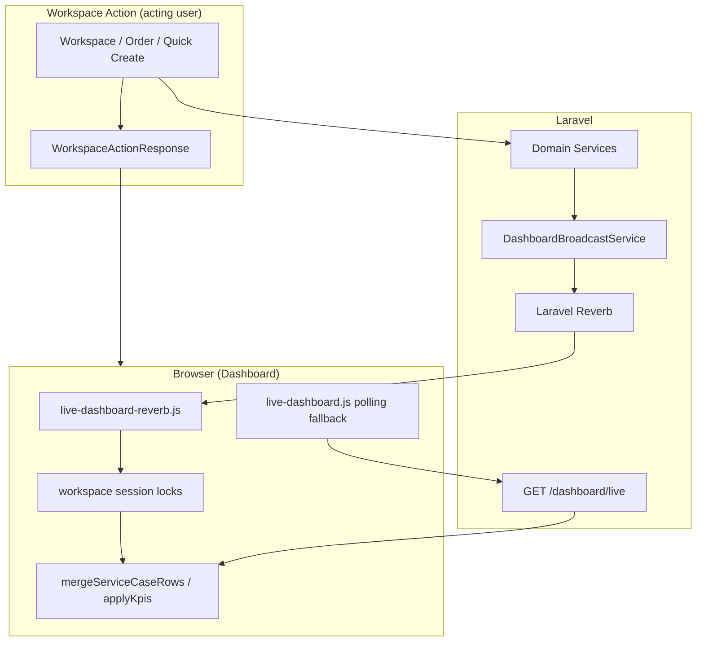

# Dashboard Phase 4.2 — Laravel Reverb Real-time Infrastructure

## Architecture



### Data flow

1. **Acting user** — Workspace actions return `WorkspaceActionResponse` immediately (unchanged).
2. **Other users** — Domain services dispatch broadcast events via `DashboardBroadcastService`.
3. **Client** — Echo receives events on `private-dashboard.{userId}` and applies partial DOM updates through the same merge pipeline as polling.
4. **Fallback** — When `DASHBOARD_LIVE_MODE=auto`, polling resumes automatically if Reverb disconnects.

## Files changed

| Area | Files |
|------|-------|
| Infrastructure | `config/dashboard.php`, `config/broadcasting.php`, `config/reverb.php`, `routes/channels.php`, `.env.example`, `composer.json` |
| Events | `app/Events/Dashboard/*` |
| Services | `DashboardBroadcastService`, `ServiceCaseAssignmentService`, `ServiceCaseStatusService`, `OrderTransactionService`, `QuickServiceRequestService`, `RemarkService` |
| Listeners | `app/Listeners/BroadcastNotificationCreated.php` |
| Client | `resources/js/live-dashboard-reverb.js`, `resources/js/live-dashboard.js`, `resources/js/live-dashboard-merge.js`, `resources/js/app.js` |
| Views | `resources/views/dashboard/index.blade.php` |
| Tests | `tests/Feature/DashboardBroadcastTest.php`, `tests/Feature/BroadcastAuthorizationTest.php`, `tests/js/live-dashboard-reverb.test.js` |
| Deployment | `tools/commands/deploy.sh`, `docs/reverb-setup.md` |

## Configuration

```env
BROADCAST_CONNECTION=reverb
DASHBOARD_LIVE_MODE=auto          # poll | reverb | auto
DASHBOARD_POLL_INTERVAL_MS=30000

REVERB_APP_ID=...
REVERB_APP_KEY=...
REVERB_APP_SECRET=...
REVERB_HOST=localhost
REVERB_PORT=8080
REVERB_SCHEME=http
```

## Reverb setup (development)

See [reverb-setup.md](./reverb-setup.md).

Quick start:

```bash
cp .env.example .env   # if needed
php artisan reverb:install   # generates keys interactively
composer dev           # serves app + queue + reverb + vite
```

## Production requirements

| Process | Command | Purpose |
|---------|---------|---------|
| Reverb | `php artisan reverb:start` | WebSocket server |
| Queue | `php artisan queue:work` | Optional if broadcasts are queued later |
| Web | PHP-FPM / Apache | HTTP + `/broadcasting/auth` |

Supervisor example:

```ini
[program:reverb]
command=php /path/to/artisan reverb:start
autostart=true
autorestart=true
user=www-data

[program:queue]
command=php /path/to/artisan queue:work --sleep=3 --tries=3
autostart=true
autorestart=true
user=www-data
```

## Performance: Polling vs Reverb

| Metric | Polling (30s) | Reverb |
|--------|---------------|--------|
| Update latency | Up to 30 seconds | Sub-second |
| HTTP requests | 2/min/user (dashboard + notifications) | Auth + WebSocket keepalive |
| Payload size | Full table + KPIs each poll | Changed rows + KPI strip only |
| Server load | Periodic DB queries per connected user | Event-driven on mutations only |

Both paths share `mergeServiceCaseRows()` — no full table replacement.

## Migration notes

1. Deploy with `DASHBOARD_LIVE_MODE=auto` (default) — polling remains as safety net.
2. Configure Reverb env vars on production; run Reverb under Supervisor.
3. Verify `/broadcasting/auth` returns 200 for authenticated dashboard users.
4. Monitor Reverb process health for 1–2 weeks.
5. After stabilization, optionally set `DASHBOARD_LIVE_MODE=reverb`.

## Rollback strategy

1. Set `DASHBOARD_LIVE_MODE=poll` — instant fallback, no code deploy required.
2. Set `BROADCAST_CONNECTION=null` — disables server-side broadcasts.
3. Stop Reverb Supervisor process — polling continues in `auto` mode.
4. Full revert: checkout pre-4.2 commit; polling architecture is unchanged.

## Test results

Run:

```bash
php artisan test
npm test
npm run build
```

## Security

- Private channels: `dashboard.{userId}`, `notifications.{userId}`, `dashboard.incident.{incidentId}`
- Authorization in `routes/channels.php` using `incidents.view` and `IncidentPolicy::view`
- Row HTML rendered per-recipient via `DashboardService::serviceCaseRowViewData()`

## Preserved (unchanged)

- Workspace modal, sessions, `WorkspaceActionResponse`, `WorkspaceRefreshPolicy`, `WorkspaceRefreshRenderer`
- `DashboardService`, Blade row partials, `replace_rows()` client path
- `GET /dashboard/live` polling endpoint
