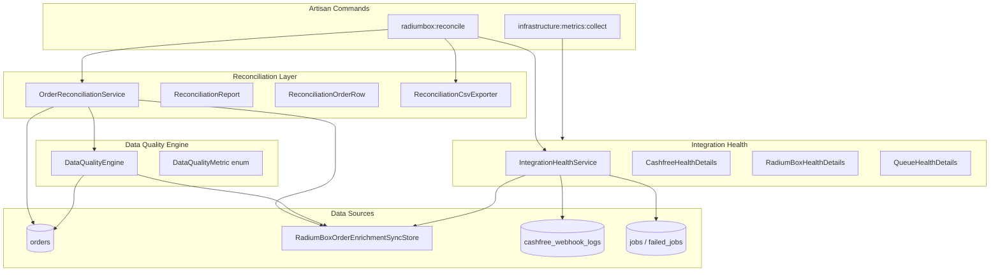

# Data Reconciliation & Integration Health

**Task:** P29-06-001 — Data Reconciliation & Integration Health (Phase 6.2)

This document describes Radium Desk’s permanent Data Quality and Reconciliation layer. It is read-only with respect to business workflows: it observes order and integration state without changing Cashfree or RadiumBox processing logic.

---

## 1. Purpose

Operations teams need continuous answers to four questions:

1. **What is synchronized?** — Orders enriched from RadiumBox with a `SYNCED` status.
2. **What is missing?** — Orders lacking serial numbers, device models, warranty metadata, activation, or customer contact.
3. **What failed?** — RadiumBox sync failures and Cashfree webhook processing failures.
4. **What requires operator attention?** — Manual overrides, duplicate serials, stale pending syncs, and queue backlogs.

The reconciliation layer provides these answers through Artisan commands, reusable metrics, structured health DTOs, and CSV export — with no dashboard dependency.

---

## 2. Architecture



### Key components

| Component | Namespace | Role |
|-----------|-----------|------|
| `DataQualityEngine` | `App\Infrastructure\DataQuality` | Reusable order quality metrics |
| `OrderReconciliationService` | `App\Infrastructure\Reconciliation` | Aggregate report + per-order rows |
| `ReconciliationCsvExporter` | `App\Infrastructure\Reconciliation` | CSV serialization |
| `IntegrationHealthService` | `App\Infrastructure\IntegrationHealth` | Structured Cashfree, RadiumBox, and queue health |
| `ReconcileRadiumBoxOrdersCommand` | `App\Console\Commands` | CLI entry point |

---

## 3. Metric definitions

### Reconciliation report (`radiumbox:reconcile`)

| Metric | Definition |
|--------|------------|
| Total Orders | All non-deleted orders in the database |
| Orders Missing Serial | `serial_number` is null or empty |
| Orders Missing Device Model | `device_model_id` is null and `device_model` is null or empty |
| Orders Missing Both | Intersection of missing serial and missing device model |
| Orders Awaiting Sync | Sync store status = `PENDING` |
| Orders with Failed Sync | Sync store status = `FAILED` |
| Orders Successfully Synced | Sync store status = `SYNCED` |
| Orders using Manual Serial | `serial_entered_by_user_id` is set |
| Orders using Manual Device Model | `device_model_assigned_by_user_id` is set |

### Data quality metrics (`DataQualityEngine`)

| Metric | Key | Definition |
|--------|-----|------------|
| Missing Serial | `missing_serial` | No `serial_number` on the order |
| Missing Model | `missing_model` | No master device model ID and no `device_model` text |
| Missing Warranty | `missing_warranty` | No `warranty` key in RadiumBox sync store metadata |
| Missing Activation | `missing_activation` | No `transaction_id` assigned |
| Missing Customer Contact | `missing_customer_contact` | All of `customer_name`, `customer_email`, and `customer_phone` are empty |
| Duplicate Serial | `duplicate_serial` | Same `serial_number` appears on more than one order |

Future modules (dashboards, alerts, reports) should call `DataQualityEngine` methods instead of duplicating these queries.

### Integration health DTOs

**Cashfree (`CashfreeHealthDetails`)**

| Field | Source |
|-------|--------|
| `lastWebhookAt` | Latest `received_at` in `cashfree_webhook_logs` |
| `lastSuccessfulWebhookAt` | Latest `processed_at` where status = `processed` |
| `failedWebhooks` | Count of logs with status = `failed` |

**RadiumBox (`RadiumBoxHealthDetails`)**

| Field | Source |
|-------|--------|
| `lastSuccessfulSyncAt` | Integration health probe aggregate cache |
| `failedSyncs` | Orders with sync store status = `FAILED` |
| `pendingSyncs` | Orders with sync store status = `PENDING` |
| `averageResponseTimeMs` | Rolling average from enrichment attempts |

**Queue (`QueueHealthDetails`)**

| Field | Source |
|-------|--------|
| `pendingJobs` | Count of rows in `jobs` |
| `failedJobs` | Count of rows in `failed_jobs` |
| `oldestPendingJobAt` | Earliest `created_at` in `jobs` |

---

## 4. Artisan commands

### Reconciliation report

```bash
php artisan radiumbox:reconcile
```

Prints the aggregate reconciliation table and a JSON integration health snapshot.

### CSV export

```bash
php artisan radiumbox:reconcile --csv=/path/to/reconciliation.csv
```

CSV columns:

| Column | Content |
|--------|---------|
| Order ID | Business order identifier |
| Customer | Name, email, or phone (first available) |
| Serial | Current serial number |
| Model | Display device model name |
| Sync Status | `PENDING`, `SYNCED`, `FAILED`, or empty |
| Failure Reason | Last error from sync store metadata |
| Last Attempt | Sync store `updated_at` timestamp |
| Manual Override | `Serial`, `Device Model`, or both |

### Infrastructure metrics (existing)

```bash
php artisan infrastructure:metrics:collect
```

Captures queue metrics and probe-based integration health. Scheduled when `INFRASTRUCTURE_METRICS_ENABLED=true`.

---

## 5. Manual recovery process

When reconciliation or health metrics indicate problems:

### Missing serial or device model

1. Run `php artisan radiumbox:reconcile` to identify affected orders.
2. For bulk historical gaps, use `php artisan radiumbox:backfill-orders --dry-run` first, then run without `--dry-run`.
3. For a single order: `php artisan radiumbox:backfill-orders --order=RD1234567`.
4. Alternatively, assign serial or device model manually in the order workspace (manual overrides are tracked and never overwritten by RadiumBox sync).

### Failed RadiumBox sync

1. Check the CSV export or sync store metadata (`last_error`).
2. Verify RadiumBox API connectivity via integration health (`average_response_time_ms`, `last_successful_sync_at`).
3. Re-dispatch enrichment: `php artisan radiumbox:backfill-orders --order=<order_id>`.
4. Inspect queue health for pending/failed jobs blocking retries.

### Failed Cashfree webhooks

1. Open the Cashfree Webhook Explorer (admin UI) or query `cashfree_webhook_logs`.
2. Review `processing_error` on failed rows.
3. Fix signature/config issues if failures are authentication-related.
4. Re-send webhooks from Cashfree dashboard if the payment was valid but processing failed.

### Duplicate serials

1. Use `DataQualityEngine::duplicateSerials()` or review CSV export.
2. Resolve conflicts manually — determine the correct order for each serial and update or clear incorrect assignments.

### Queue backlog

1. Check `QueueHealthDetails` via reconciliation output or `infrastructure:metrics:collect`.
2. Ensure the queue worker cron is running (see `docs/infrastructure-readiness.md`).
3. Inspect `failed_jobs` for terminal failures and retry or fix root cause.

---

## 6. Nightly reconciliation strategy

Recommended production schedule:

| Time | Action |
|------|--------|
| Every 5 min | `infrastructure:metrics:collect` (when enabled) — queue and probe snapshots |
| Daily (e.g. 02:00 IST) | `php artisan radiumbox:reconcile --csv=/var/log/radium/reconciliation-$(date +%F).csv` |
| Daily | Review CSV for `FAILED` sync status, duplicate serials, and missing contact |
| Weekly | Trend comparison of missing serial/model counts |

Log output from `radiumbox:reconcile` is written at `info` level with key `RadiumBox order reconciliation completed.` and the full metric payload in context.

Alert thresholds (future):

- `orders_with_failed_sync` > 0 for more than 1 hour
- `orders_awaiting_sync` > 10
- `failed_webhooks` increasing over 24h
- `oldest_pending_job_at` older than 30 minutes

---

## 7. Future dashboard integration

This phase deliberately ships **no UI**. The following surfaces are ready for Phase 6.3+:

| Surface | Consumer |
|---------|----------|
| `ReconciliationReport::toArray()` | Dashboard summary cards |
| `DataQualityEngine::allMetrics()` | Data quality widget |
| `IntegrationHealthService::all()` | Integration status panel |
| `ReconciliationOrderRow` collection | Operator drill-down table |
| Cached payloads from `IntegrationHealthRegistry` and `QueueMetricsService` | Real-time polling without full scans |

Suggested dashboard layout (future):

1. **Summary row** — total orders, missing serial, missing model, failed syncs.
2. **Integration strip** — Cashfree last webhook, RadiumBox avg response time, queue pending count.
3. **Attention queue** — filter CSV rows where sync status = `FAILED` or manual override is set.
4. **Trend charts** — nightly CSV archived to object storage for historical comparison.

---

## 8. What this phase does not change

- Cashfree webhook processing logic
- RadiumBox enrichment, retry, or API client behaviour
- Order workspace UI or dashboard layout
- Business rules for serial locking or device model assignment

The only RadiumBox touchpoint is a read-only `updatedAt()` accessor on `RadiumBoxOrderEnrichmentSyncStore` for reconciliation timestamps.

---

## 9. Related documentation

- [Infrastructure Readiness](infrastructure-readiness.md) — queue workers, scheduling, VPS migration
- RadiumBox backfill: `php artisan radiumbox:backfill-orders --help`
