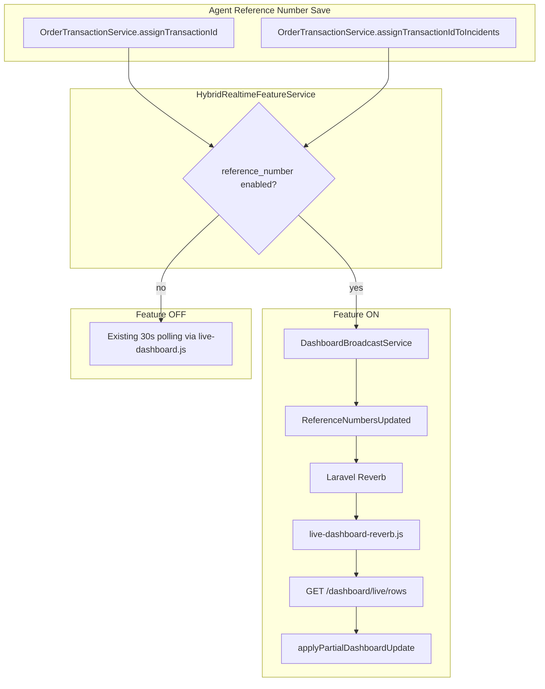

# Hybrid Reverb Phase 1 — Reference Number Realtime

## 1. Architecture



Polling is never removed. `DASHBOARD_LIVE_MODE=auto` still falls back to polling when Reverb disconnects for other live features.

## 2. Event flow

1. Agent saves a single or bulk Reference Number (unchanged business logic).
2. `OrderTransactionService` still calls `transactionAssigned` / `transactionsAssigned`.
3. `DashboardBroadcastService` asks `HybridRealtimeFeatureService::enabled(REFERENCE_NUMBER)`.
4. **OFF** → return immediately (no WebSocket, no KPI fan-out). Other agents see the change on the next poll.
5. **ON** → after DB commit, one `ReferenceNumbersUpdated` per eligible recipient with `incident_ids` + `updated_at` (no HTML).
6. Client fetches `/dashboard/live/rows?ids[]=...&queue=...` and merges only those rows / removals.
7. No KPI strip refresh and no full dashboard reload on this path.

## 3. Files modified

| Area | Files |
|------|-------|
| Feature framework | `config/hybrid_realtime.php`, `app/Services/HybridRealtime/*` |
| Admin settings | `config/system_settings.php`, `SystemSettingsService`, admin Blade, update request |
| Broadcast | `DashboardBroadcastService` (ref-no methods only), `ReferenceNumbersUpdated` |
| Row fragments | `DashboardLiveController::rows`, `DashboardLiveRowVisibilityService::liveRowsPayload`, routes, dashboard Blade |
| Client | `resources/js/live-dashboard-reverb.js` |
| Config example | `.env.example` |
| Tests | Hybrid realtime unit/feature tests, settings tests, post-commit stability, JS reverb tests |
| Docs | `docs/hybrid-reverb-phase-1.md` |

## 4. Settings implementation

Runtime control (no deploy required):

**Admin → System Settings → Hybrid Realtime**

- [x] Reference Number — wired, default **OFF**
- Assignment — Coming Soon (disabled)
- Close / Resolve — Coming Soon (disabled)
- Incoming Calls — Coming Soon (disabled)
- Desktop Notifications — Coming Soon (disabled)
- Operator Alerts — Coming Soon (disabled)

Resolution in `HybridRealtimeFeatureService`:

1. Feature must be `wired` in `config/hybrid_realtime.php`
2. Optional env hard kill-switch (`REVERB_REF_NO_ENABLED=false`) forces OFF
3. Otherwise `system_settings.hybrid_realtime.reference_number` controls enablement

## 5. Batch strategy

**One WebSocket event per recipient** with:

```json
{
  "incident_ids": [1, 2, 3],
  "updated_at": "2026-07-21T04:30:00Z"
}
```

Why this wins for Phase 1:

- A 35-row bulk assign is 1 message per viewer, not 35
- Broadcast path does not render Blade HTML for every recipient × incident
- HTML is rendered once per viewing client via a single `/dashboard/live/rows` request
- Chunking can be added later if payload size becomes an issue; not needed at current batch sizes

## 6. Performance estimate

| Scenario | Before (HTML TransactionAssigned) | Phase 1 ON (lightweight) | Phase 1 OFF |
|----------|-----------------------------------|---------------------------|-------------|
| Single ref-no | N recipients × row HTML + KPI fan-out | N lightweight events + 1 row fetch/client | Poll only (~30s) |
| Bulk 35 | up to 35 × N HTML events + KPI | 1 × N events + 1 batched row fetch/client | Poll only |
| KPI cost | Yes | No on this path | No on this path |

Server broadcast CPU drops because HTML rendering moves to the clients that actually need the rows.

## 7. Rollback procedure

1. Admin unchecks **Reference Number** in Hybrid Realtime → immediate (cache cleared on save)
2. Optional hard kill: set `REVERB_REF_NO_ENABLED=false` and reload config cache if used
3. Global safety nets unchanged: `DASHBOARD_LIVE_MODE=poll` or Reverb disconnect fallback

## 8. Risks

| Risk | Mitigation |
|------|------------|
| Viewers briefly stale while feature OFF | Existing 30s poll remains |
| Row fetch fails after event | Next poll repairs; no dashboard hard failure |
| Queue membership edge cases | `/dashboard/live/rows` uses the same visibility/classifier rules as HTML broadcasts |
| Admins confuse Coming Soon toggles | Disabled in UI; forced to defaults on save; not wired in code |
| Behaviour change vs prior always-on TransactionAssigned for ref-no | Intentional: default OFF restores polling-first Hybrid rollout |

## 9. Future readiness

`HybridRealtimeFeature` already defines:

- `ASSIGNMENT`
- `CLOSE_RESOLVE`
- `INCOMING_CALLS`
- `DESKTOP_NOTIFICATIONS`
- `OPERATOR_ALERTS`

To ship a later phase:

1. Set `wired => true` for that feature in `config/hybrid_realtime.php`
2. Gate the corresponding broadcast path with `HybridRealtimeFeatureService::enabled(...)`
3. Prefer a dedicated lightweight event + fragment fetch (same pattern as Reference Number)
4. Enable the admin toggle (remove `disabled`)

No further framework changes are required.
