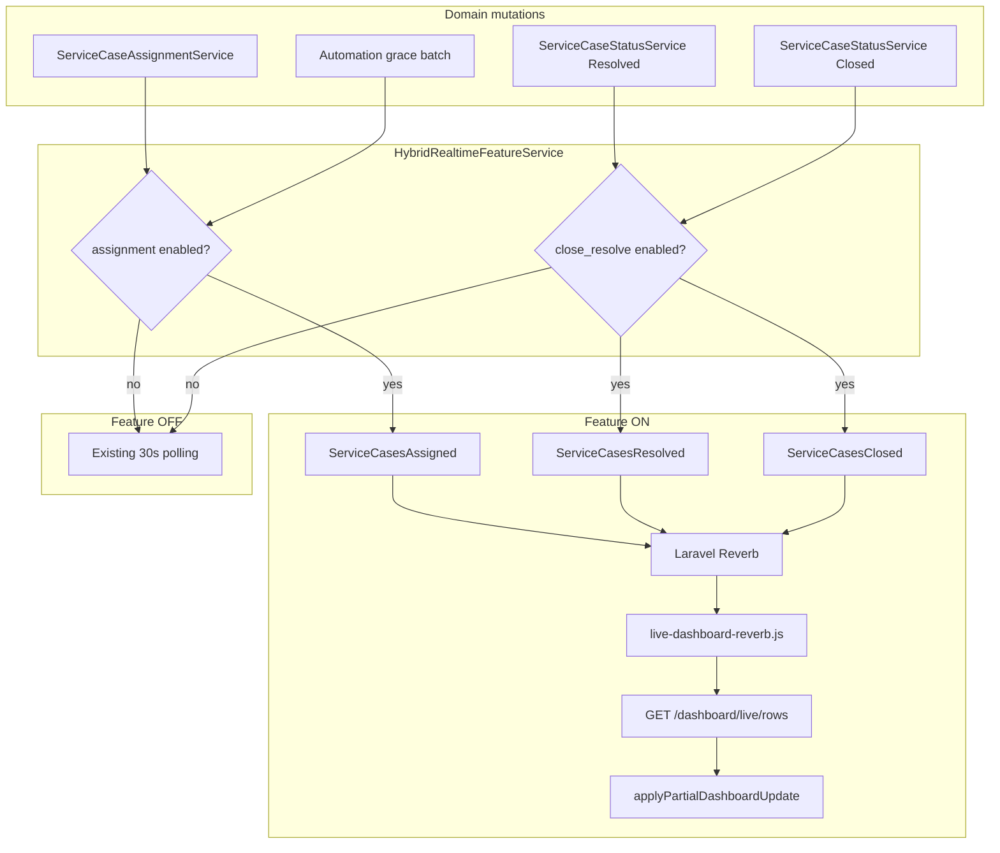

# Hybrid Reverb Phase 2 — Assignment / Close / Resolve

Performance-first extension of [Phase 1](./hybrid-reverb-phase-1.md). Same framework, same polling safety net, no HTML over WebSockets, no KPI rebuild on these paths.

## 1. Architecture



Phase 1 Reference Number path is unchanged. `serviceCaseQueueMembershipChanged` (waiting / holds / order edits) still uses the legacy HTML `ServiceCaseCreated` path until a later phase.

## 2. Files modified

| Area | Files |
|------|-------|
| Flags / settings | `config/hybrid_realtime.php` (`wired => true`), `config/system_settings.php` (enable Assignment + Close/Resolve toggles) |
| Events | `HybridIncidentsUpdated`, `ServiceCasesAssigned`, `ServiceCasesResolved`, `ServiceCasesClosed` |
| Broadcast | `DashboardBroadcastService` assignment/resolve/close methods + coalesce/bulk APIs |
| Automation batch | `ServiceCaseAutomationGraceService::processExpiredGracePeriods` uses assignment coalesce |
| Client | `resources/js/live-dashboard-reverb.js` listens for Phase 2 events via shared hybrid handler |
| Tests | `HybridRealtimeAssignmentCloseResolveTest`, settings/feature unit test updates |
| Docs | `docs/hybrid-reverb-phase-2.md` |

## 3. New lightweight events

| Event | Feature flag | Payload |
|-------|--------------|---------|
| `ServiceCasesAssigned` | `hybrid_realtime.assignment` | `incident_ids`, `incidents[]` |
| `ServiceCasesResolved` | `hybrid_realtime.close_resolve` | same |
| `ServiceCasesClosed` | `hybrid_realtime.close_resolve` | same |

Each `incidents[]` item:

```json
{
  "incident_id": 123,
  "queue": "my_work",
  "status": "in_progress",
  "updated_at": "2026-07-21T05:00:00+00:00"
}
```

No Blade HTML. No KPI strip. Channel: `private-dashboard.{userId}`.

## 4. Client flow

1. Echo receives hybrid event.
2. Ignore when search / quick-filter active; skip locked workspace rows.
3. `GET /dashboard/live/rows?ids[]=...&queue=...` (Phase 1 endpoint).
4. `applyPartialDashboardUpdate({ rows, remove_incident_ids })`.
5. Polling continues as fallback when Reverb disconnects (`DASHBOARD_LIVE_MODE=auto`).

## 5. Batch strategy

| Path | Strategy |
|------|----------|
| Single assign / resolve / close | One lightweight event per recipient |
| Bulk APIs `serviceCasesAssigned/Resolved/Closed` | One event per recipient with all ids |
| Automation grace expiry loop | `beginAssignmentCoalesce` → many assigns → `flushAssignmentCoalesce` → **one** event |

Never emit one WebSocket message per incident when a bulk/coalesce API is available.

## 6. Performance estimate

| Scenario | Legacy HTML path | Phase 2 ON | Phase 2 OFF |
|----------|------------------|------------|-------------|
| Single assign | N × row HTML + KPI fan-out | N lightweight events + 1 row fetch/client | Poll only |
| Grace batch 20 assigns | up to 20 × N HTML + KPIs | 1 × N events + 1 batched row fetch | Poll only |
| Resolve / close | HTML + KPI (+ SLA on close) | Lightweight only | Poll only |
| Transaction duration | Unchanged — broadcasts still `afterCommit` | Unchanged | Unchanged |

## 7. Rollback

1. Admin → System Settings → Hybrid Realtime → uncheck **Assignment** and/or **Close / Resolve**
2. Optional env hard kill: `REVERB_ASSIGNMENT_ENABLED=false`, `REVERB_CASE_STATUS_ENABLED=false`
3. Global: `DASHBOARD_LIVE_MODE=poll`

No deploy required for admin toggles. Reference Number Phase 1 toggle is independent.

## 8. Production rollout plan

1. Deploy with both features **OFF** (defaults).
2. Confirm polling still updates assignment/close/resolve within ~30s.
3. Enable **Assignment** for a subset of admins / staging first; watch Reverb CPU, row-fetch latency, and broadcast volume.
4. Enable **Close / Resolve** after Assignment is stable.
5. Measure before expanding to Incoming Calls / Desktop Notifications / Operator Alerts.
6. If latency or broadcast volume regresses: disable the specific toggle immediately and investigate.

## Success criteria

- Assignment, Resolved, and Closed are independently switchable Hybrid Realtime features (Close/Resolve share one admin toggle as designed in Phase 1 settings).
- Polling remains the safety net.
- No HTML over WebSockets on these paths.
- No KPI rebuild on these paths.
- No broadcast storms for automation assignment batches.
- Phase 1 Reference Number behaviour unchanged.
