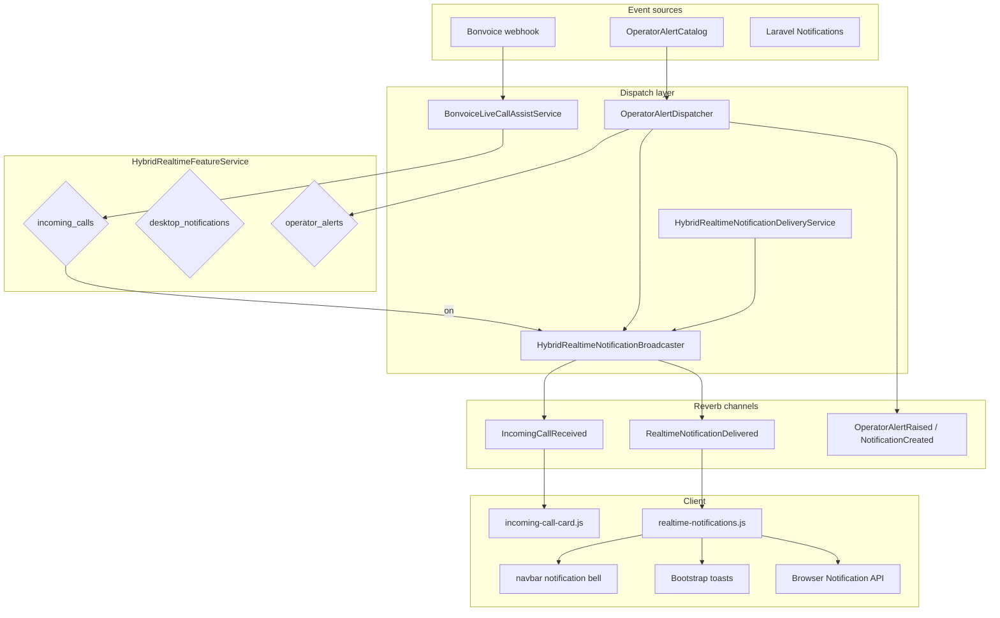

# Hybrid Reverb Phase 3 — Incoming Calls, Actionable Notifications & Operator Alerts

## 1. Architecture



### Design principles

- **Reuse Phase 1/2 patterns** — lightweight payloads, private `notifications.{userId}` channel, no dashboard HTML broadcast.
- **Single delivery path** — `RealtimeNotificationDelivered` is the canonical event for toast, browser, and bell updates. `OperatorAlertRaised` remains for backward compatibility.
- **Runtime configurable** — all Phase 3 features gated via System Settings → Performance card (no `.env` required for normal operation).
- **Polling fallback** — notification bell polling (`live-notifications.js`) unchanged when Reverb disconnects.

---

## 2. Event flow

### Incoming calls

1. Bonvoice webhook → `BonvoiceLiveCallAssistService::maybeNotify()`.
2. When `hybrid_realtime.incoming_calls` is ON → `HybridRealtimeNotificationBroadcaster::broadcastIncomingCall()`.
3. `IncomingCallReceived` event with lightweight call payload (no dashboard refresh).
4. Client `incoming-call-card.js` renders a floating call card instantly.

### Operator alerts & actionable notifications

1. `OperatorAlertDispatcher::dispatch()` (existing entry point).
2. Gated by `hybrid_realtime.operator_alerts` OR legacy `operator_alerts.enabled`.
3. Broadcasts `OperatorAlertRaised` (legacy) + `RealtimeNotificationDelivered` (unified).
4. `HybridRealtimeNotificationDeliveryService` applies runtime settings (sound, browser, toast duration, priority threshold).
5. Client `realtime-notifications.js` handles priority rules:
   - **Critical** — persistent toast, requires acknowledgement, browser notification
   - **High** — toast + browser notification
   - **Normal** — toast only
   - **Silent** — notification center only (no toast/browser)

---

## 3. Files modified

| Area | Files |
|------|-------|
| Feature framework | `config/hybrid_realtime.php` (wired Phase 3 features) |
| Runtime settings | `config/system_settings.php` (notification delivery settings) |
| Core services | `HybridRealtimeNotificationBroadcaster`, `HybridRealtimeNotificationDeliveryService` |
| DTOs / enums | `RealtimeNotification`, `NotificationPriority` |
| Events | `IncomingCallReceived`, `RealtimeNotificationDelivered` |
| Bonvoice | `BonvoiceLiveCallAssistService` |
| Operator alerts | `OperatorAlertDispatcher` |
| Admin UI | `performance-card.blade.php` (Notification Delivery section) |
| Client | `realtime-notifications.js`, `incoming-call-card.js`, `live-dashboard-reverb.js`, `operator-alerts.js` |
| Dashboard | `incoming-call-card-host.blade.php`, `dashboard/index.blade.php` |
| Tests | `HybridRealtimePhase3Test`, `HybridRealtimeNotificationBroadcasterTest`, updated feature service test |
| Docs | `docs/hybrid-reverb-phase-3.md` |

---

## 4. Runtime settings (Performance card)

| Setting | Purpose |
|---------|---------|
| `hybrid_realtime.incoming_calls` | Enable incoming call cards |
| `hybrid_realtime.desktop_notifications` | Enable unified realtime notifications |
| `hybrid_realtime.operator_alerts` | Enable operator alert broadcasts |
| `performance.notifications.toast_duration_ms` | Toast visibility duration |
| `performance.notifications.sound_enabled` | Alert sound playback |
| `performance.notifications.browser_enabled` | Browser notifications for Critical/High |
| `performance.notifications.priority_threshold` | Minimum priority delivered |
| `performance.notifications.quiet_hours_enabled` | Future placeholder |

---

## 5. Performance impact

| Area | Impact |
|------|--------|
| Incoming call card | Single lightweight Reverb message per call; no dashboard/KPI refresh |
| Realtime notifications | One broadcast per recipient; deduplication via cache (6h TTL) |
| Client | Toast DOM creation on demand; no polling increase |
| Server | Negligible CPU delta — payloads are JSON IDs/metadata only |

Measure before/after with `IncomingCallOperatorAlertTest` and production Reverb metrics when rolling out.

---

## 6. Security considerations

- All channels use existing `notifications.{userId}` private channel authorization (self-only).
- Incoming call payloads exclude raw webhook payloads; only sanitized fields broadcast.
- Admin settings require `system-settings.manage` permission.
- Browser notifications require user-granted `Notification.permission`.
- Deduplication prevents alert spam from webhook retries.

---

## 7. Rollback plan

1. Disable Phase 3 toggles in System Settings → Performance → Hybrid Realtime.
2. Legacy paths remain: `operator_alerts.enabled` env flag and Laravel notification polling.
3. Revert code deploy — unwired features in `config/hybrid_realtime.php` ignore DB settings.
4. No schema migration required.

---

## 8. Deployment notes

1. Deploy code.
2. Run `SystemSettingsSeeder` to seed new `performance.notifications.*` keys.
3. Enable features incrementally in System Settings:
   - Start with **Incoming Calls** for a pilot agent group
   - Enable **Operator Alerts** next
   - Enable **Desktop Notifications** last
4. Users refresh browser to load new JS.
5. Confirm Reverb is running (`broadcasting.default=reverb`).

---

## 9. Tests

```bash
php artisan test --filter='HybridRealtime|IncomingCall|OperatorAlert'
```

Key coverage:
- Feature flag gating for incoming calls and operator alerts
- Priority mapping from `AlertSeverity` to `NotificationPriority`
- System Settings UI renders Phase 3 controls
- Dashboard includes incoming call card host
