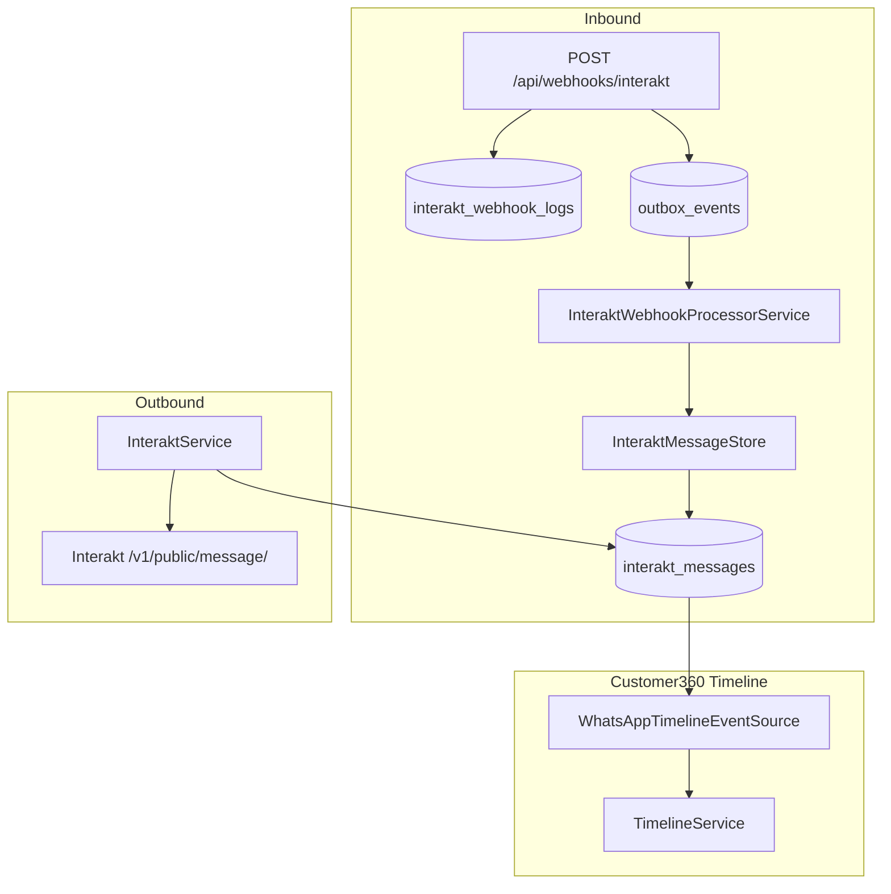

# Interakt WhatsApp Integration Foundation (Phase 8.2 / 8.2.1)

**Status:** Implemented  
**Scope:** Communication foundation for Customer360 WhatsApp timeline events  
**Last updated:** 2026-07-01

Phase 8.2.1 aligns webhook parsing with the [official Interakt webhook specification](https://www.interakt.shop/resource-center/interakts-webhooks-for-customer-messages-sent-template-status/).

---

## Architecture



Webhook handling mirrors Cashfree reliability patterns: persist first, enqueue outbox work, process with retries, and upsert messages idempotently by `message_id`.

---

## Configuration

| Variable | Purpose |
|----------|---------|
| `INTERAKT_API_KEY` | Outbound API authentication (Basic Auth) |
| `INTERAKT_WEBHOOK_SECRET` | Webhook HMAC secret from Developer Settings (not the API key) |
| `INTERAKT_BASE_URL` | Interakt API base URL (default: `https://api.interakt.ai`) |
| `INTERAKT_VERIFY_SIGNATURE` | Require valid `Interakt-Signature` header |
| `INTERAKT_TIMEOUT_SECONDS` | HTTP timeout |
| `INTERAKT_MAX_RETRIES` | Retry count for transient API failures |

Credentials are never hardcoded. See `config/interakt.php`.

---

## Supported Interakt plans

| Plan | Webhook capability | Supported in Radium Desk |
|------|-------------------|--------------------------|
| **Growth** | Template/message send API; **message status webhooks** for API-sent templates (`message_api_*`) and campaign templates (`message_campaign_*`) | Yes |
| **Advanced** | Everything in Growth plus **incoming customer messages** (`message_received`) and session messaging APIs | Incoming webhook parsing supported; delivery requires Advanced plan on the Interakt account |

Configure webhooks in Interakt: `https://app.interakt.ai/settings/developer-setting`.

### Unsupported / out of scope

- Interakt UI chat window / agent reply
- Attachment upload UI
- Template manager
- Conversation screen
- Automatic linking of `callback_data` to service cases (stored for future use)
- Webhook replay after Interakt disables endpoint (Interakt does not retry failed deliveries)

---

## Official payload mapping

| Official field | Parser method | Persisted column / usage |
|----------------|---------------|--------------------------|
| `type` | `eventType()` | `interakt_webhook_logs.event_type` |
| `timestamp` | fallback in `statusTimestamp()` | used only when message-level timestamps absent |
| `data.customer.channel_phone_number` | `channelPhoneNumber()` | primary input to `InteraktCustomerMatcher` |
| `data.customer.country_code` + `phone_number` | `countryCode()` / `phoneNumber()` | legacy fallback for customer matching |
| `data.message.id` | `messageId()` | `interakt_messages.message_id` |
| `data.message.message` | `messageText()` | `interakt_messages.text` |
| `data.message.message_content_type` | `messageType()` | `interakt_messages.message_type` |
| `data.message.media_url` | `mediaUrl()` | `interakt_messages.media_url` |
| `data.message.raw_template` | `templateMetadata()` / `templateName()` / `templateLanguage()` | `template_name`, `template_language`, optional `text` (body) |
| `data.message.received_at_utc` | `receivedAtUtc()` | `interakt_messages.sent_at` |
| `data.message.delivered_at_utc` | `deliveredAtUtc()` | `interakt_messages.delivered_at` |
| `data.message.seen_at_utc` | `seenAtUtc()` | `interakt_messages.read_at` |
| `data.message.channel_failure_reason` | `channelFailureReason()` | `interakt_messages.channel_failure_reason` → timeline detail |
| `data.message.channel_error_code` | `channelErrorCode()` | `interakt_messages.channel_error_code` → timeline detail |
| `data.message.meta_data.source_data.callback_data` | `callbackData()` | `interakt_messages.callback_data` |
| Full payload | stored by controller | `interakt_messages.payload`, `interakt_webhook_logs.payload` |

### Event types

| Category | Official `type` values | Delivery status mapping |
|----------|------------------------|-------------------------|
| API template status | `message_api_sent`, `message_api_delivered`, `message_api_read`, `message_api_failed` | `sent`, `delivered`, `read`, `failed` |
| Campaign template status | `message_campaign_sent`, `message_campaign_delivered`, `message_campaign_read`, `message_campaign_failed` | same substring logic as API events |
| Incoming message | `message_received` | incoming direction; status defaults to delivered |

### Signature verification

| Official requirement | Implementation |
|---------------------|--------------|
| Header `Interakt-Signature` | `InteraktWebhookSignatureVerifier` |
| Value `sha256=<hex>` | HMAC-SHA256 over raw body |
| Secret from Developer Settings | `INTERAKT_WEBHOOK_SECRET` |

---

## Database schema

### `interakt_messages`

| Column | Type | Notes |
|--------|------|-------|
| `message_id` | string, unique | Interakt message identifier |
| `customer_phone` | string | Matched to `orders.customer_phone` |
| `direction` | enum | `incoming` / `outgoing` |
| `message_type` | string | e.g. `Text`, `Template` |
| `text` | text | Message body or template body |
| `media_url` | string | Optional media |
| `template_name` | string | From `raw_template.display_name` / `name` |
| `template_language` | string | From `raw_template.language` |
| `delivery_status` | string | `sent`, `delivered`, `read`, `failed`, `pending` |
| `channel_failure_reason` | text | WhatsApp failure reason |
| `channel_error_code` | string | WhatsApp failure code |
| `callback_data` | string | Echo of API `callbackData` |
| `sent_at`, `delivered_at`, `read_at` | timestamps | From official message lifecycle fields |
| `payload` | json | Raw webhook snapshot |

### `interakt_webhook_logs`

| Column | Type | Notes |
|--------|------|-------|
| `event_type` | string | e.g. `message_received`, `message_api_delivered` |
| `payload` | json | Parsed webhook body |
| `raw_body` | longtext | Original request body |
| `request_headers` | json | Incoming headers |
| `processing_status` | string | `received`, `processed`, `failed` |
| `processing_error` | text | Last processing error |
| `processed_at` | timestamp | When processing completed |

---

## API flow

### Inbound webhook

1. `InteraktWebhookController` logs and stores raw payload in `interakt_webhook_logs`.
2. Optional signature verification via `Interakt-Signature: sha256=...` using `INTERAKT_WEBHOOK_SECRET`.
3. Outbox event `interakt.webhook.process.{log_id}` is written in the same request cycle.
4. Controller returns `{ "status": "ok" }` quickly (Interakt requires HTTP 200 within 3 seconds).
5. `OutboxProcessorService` dispatches to `InteraktWebhookProcessorService`.
6. Messages are upserted idempotently by `message_id`; customer phone is matched via `InteraktCustomerMatcher` using `channel_phone_number` first.

### Outbound send

`InteraktService` exposes:

- `sendTextMessage(countryCode, phoneNumber, text, callbackData?)`
- `sendTemplateMessage(countryCode, phoneNumber, template, callbackData?)`

Successful sends persist an outgoing row in `interakt_messages`. Delivery/read updates arrive via webhook.

---

## Timeline integration

`WhatsAppTimelineEventSource` reads `interakt_messages` for the order's `customer_phone` and maps them to `TimelineEventType::WhatsApp`.

| Direction | Actor | Summary | Status / detail |
|-----------|-------|---------|-----------------|
| Incoming | Customer | Message text | — |
| Outgoing template | Template (subtitle = template name) | Template name or body | Status label: Sent / Delivered / Read / Failed; detail shows failure reason/code when present |

Example outgoing timeline row:

```
WhatsApp
Template · Repair Started
Delivered
```

Registered in `Customer360TimelineService` alongside `OrderCustomerTimelineSource`. No UI changes required — existing timeline renderer handles the new type.

---

## Customer matching

`InteraktCustomerMatcher` resolves phones in this order:

1. `data.customer.channel_phone_number` (official)
2. Legacy `country_code` + `phone_number`
3. Normalized candidates (local number, ISD-prefixed, last 10 digits)

Matches against `orders.customer_phone` using the same strategy as `Customer360Service`.

---

## Reliability

| Mechanism | Implementation |
|-----------|----------------|
| Transactional outbox | `InteraktWebhookOutboxWriter` → `outbox_events` |
| Idempotency | Unique `message_id`; outbox key per webhook log |
| Retry | `OutboxProcessorService` backoff (same as Cashfree) |
| Durability | Raw webhook always stored before processing |

---

## Tests

- `tests/Feature/InteraktWebhookTest.php` — official payloads, phone matching, timeline, campaign/API status, failure metadata, retry
- `tests/Feature/InteraktWebhookSignatureTest.php` — `INTERAKT_WEBHOOK_SECRET` verification
- `tests/Unit/InteraktWebhookPayloadParserTest.php` — official field parsing
- `tests/Unit/InteraktServiceTest.php` — outbound API behaviour
- `tests/Unit/InteraktCustomerMatcherTest.php` — `channel_phone_number` and legacy matching
- `tests/Unit/WhatsAppTimelineEventSourceTest.php` — timeline mapping including failure detail

Official fixture shapes live in `tests/Support/InteractsWithInteraktWebhooks.php`.

---

## Compatibility report (Phase 8.2.1)

| Area | Before 8.2.1 | After 8.2.1 |
|------|--------------|-------------|
| Customer phone | `country_code` + `phone_number` only | `channel_phone_number` primary + legacy fallback |
| Webhook secret | Reused `INTERAKT_API_KEY` | Dedicated `INTERAKT_WEBHOOK_SECRET` |
| Lifecycle timestamps | Root `timestamp` only | `received_at_utc` / `delivered_at_utc` / `seen_at_utc` preferred |
| Template metadata | `template_name` field only | Parsed from `raw_template` (name, language, body) |
| Campaign events | Not covered | `message_campaign_*` via shared delivery-status logic |
| Failure metadata | Not stored | `channel_failure_reason`, `channel_error_code` persisted and shown in timeline |
| Callback data | Not stored | `callback_data` persisted for future correlation |
| Test fixtures | Simplified internal shape | Official Interakt examples |

**Conclusion:** The integration is compatible with the latest documented Interakt webhook specification for Growth (API/campaign status) and Advanced (incoming messages) plans, with legacy payload shapes retained for backward compatibility.
