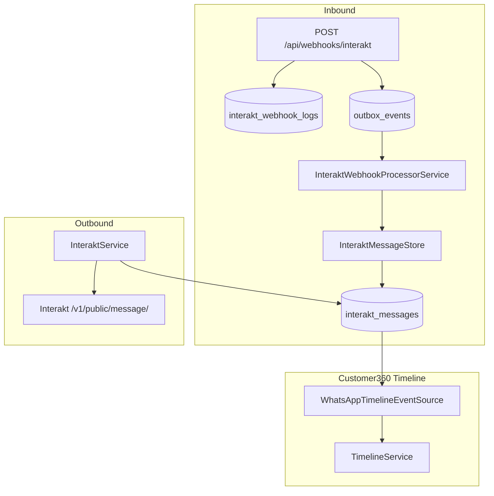

# Interakt WhatsApp Integration Foundation (Phase 8.2)

**Status:** Implemented  
**Scope:** Communication foundation for Customer360 WhatsApp timeline events  
**Last updated:** 2026-07-01

---

## Architecture

Webhook handling mirrors Cashfree reliability patterns: persist first, enqueue outbox work, process with retries, and upsert messages idempotently by `message_id`.

---

## Configuration

| Variable | Purpose |
|----------|---------|
| `INTERAKT_API_KEY` | API authentication (also used for webhook signature verification) |
| `INTERAKT_BASE_URL` | Interakt API base URL (default: `https://api.interakt.ai`) |
| `INTERAKT_VERIFY_SIGNATURE` | Require valid `Interakt-Signature` header |
| `INTERAKT_TIMEOUT_SECONDS` | HTTP timeout |
| `INTERAKT_MAX_RETRIES` | Retry count for transient API failures |

Credentials are never hardcoded. See `config/interakt.php`.

---

## Database schema

### `interakt_messages`

| Column | Type | Notes |
|--------|------|-------|
| `message_id` | string, unique | Interakt message identifier |
| `customer_phone` | string | Matched to `orders.customer_phone` |
| `direction` | enum | `incoming` / `outgoing` |
| `message_type` | string | e.g. `text`, `template` |
| `text` | text | Message body |
| `media_url` | string | Optional media |
| `template_name` | string | Template name for outgoing HSM |
| `delivery_status` | string | `sent`, `delivered`, `read`, `failed`, `pending` |
| `sent_at`, `delivered_at`, `read_at` | timestamps | Lifecycle timestamps |
| `payload` | json | Raw API/webhook payload snapshot |

### `interakt_webhook_logs`

| Column | Type | Notes |
|--------|------|-------|
| `event_type` | string | e.g. `message_received`, `message_api_delivered` |
| `payload` | json | Parsed webhook body |
| `raw_body` | longtext | Original request body |
| `request_headers` | json | Incoming headers |
| `processing_status` | string | `received`, `processed`, `failed` |
| `processing_error` | text | Last processing error |
| `processed_at` | timestamp | When processing completed |

---

## API flow

### Inbound webhook

1. `InteraktWebhookController` logs and stores raw payload in `interakt_webhook_logs`.
2. Optional signature verification via `Interakt-Signature: sha256=...`.
3. Outbox event `interakt.webhook.process.{log_id}` is written in the same request cycle.
4. Controller returns `{ "status": "ok" }` quickly.
5. `OutboxProcessorService` dispatches to `InteraktWebhookProcessorService`.
6. Messages are upserted idempotently by `message_id`; customer phone is matched via `InteraktCustomerMatcher`.

### Outbound send

`InteraktService` exposes:

- `sendTextMessage(countryCode, phoneNumber, text, callbackData?)`
- `sendTemplateMessage(countryCode, phoneNumber, template, callbackData?)`

Successful sends persist an outgoing row in `interakt_messages`. Delivery/read updates arrive via webhook.

---

## Timeline integration

`WhatsAppTimelineEventSource` reads `interakt_messages` for the order's `customer_phone` and maps them to `TimelineEventType::WhatsApp`.

| Direction | Actor | Summary / detail |
|-----------|-------|------------------|
| Incoming | Customer | Message text |
| Outgoing template | Template (subtitle = template name) | Delivery status (Sent / Delivered / Read) |

Registered in `Customer360TimelineService` alongside `OrderCustomerTimelineSource`. No UI changes required — existing timeline renderer handles the new type.

---

## Customer matching

`InteraktCustomerMatcher` reuses the same phone lookup strategy as `Customer360Service`: match against `orders.customer_phone` using candidate formats (local number, country-prefixed, last 10 digits).

---

## Reliability

| Mechanism | Implementation |
|-----------|----------------|
| Transactional outbox | `InteraktWebhookOutboxWriter` → `outbox_events` |
| Idempotency | Unique `message_id`; outbox key per webhook log |
| Retry | `OutboxProcessorService` backoff (same as Cashfree) |
| Durability | Raw webhook always stored before processing |

---

## Tests

- `tests/Feature/InteraktWebhookTest.php` — webhook, duplicate, send, timeline, matching, failure, retry
- `tests/Unit/InteraktServiceTest.php` — outbound API behaviour
- `tests/Unit/InteraktCustomerMatcherTest.php` — phone matching
- `tests/Unit/WhatsAppTimelineEventSourceTest.php` — timeline mapping

---

## Not in scope (Phase 8.2)

- Chat window / agent reply UI
- Attachments UI
- Template manager
- Conversation screen
