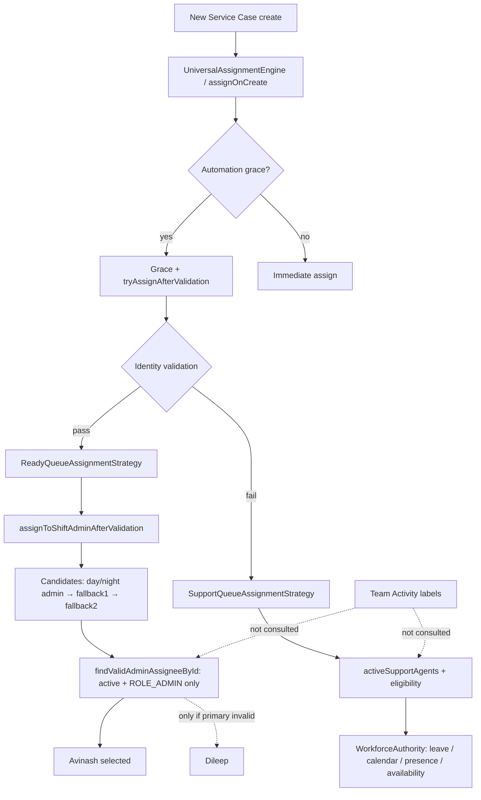

# IRA Assigned On-Leave Admin — Investigation

**Case:** C[04-08] (related)  
**Prompt:** P[04-08]-012  
**Date:** 2026-08-04  
**Type:** Read-only root cause (no code changes)  
**Canvas:** [/Users/ravi/.cursor/projects/Users-ravi-radium-service-desk/canvases/ira-assign-on-leave-avinash-investigation.canvas.tsx](/Users/ravi/.cursor/projects/Users-ravi-radium-service-desk/canvases/ira-assign-on-leave-avinash-investigation.canvas.tsx)

---

## Bottom line

**IRA did not “choose” Avinash from Team Activity.** Automation (Cashfree / grace / validation) labeled the actor as **IRA** in Telegram, then the **Ready Queue → day shift admin** path resolved assignee to Avinash because he is the configured day-shift admin and is an active `admin`. That path only checks **active + admin role** — it does **not** consult leave, presence, schedule, Team Activity status, or workload.

Dileep was not preferred because he is **fallback admin #1**. Fallbacks run only when the primary candidate fails `findValidAdminAssigneeById` (missing, inactive, trashed, or not `admin`). Leave does not invalidate the primary.

If Team Activity shows Avinash as **On Leave**, that means approved leave is visible to WorkforceAuthority for *display* — but shift-admin assignment never asks WorkforceAuthority.

---

## Root cause analysis

| Layer | Finding |
|-------|---------|
| Primary cause | Ready Queue / shift-admin resolver ignores leave and presence |
| Why “IRA” | Automation actor → Telegram `assigned_by` label = `IRA` (`telegramAssignedByLabel`) |
| Why Avinash | Day window (typically 09:00–18:30) → `assignment.day_shift_admin_user_id` → Avinash |
| Why not Dileep | Fallback only if primary invalid; primary was valid |
| Team Activity | Display-only; assignment never reads status labels |
| Support-pool leave gate | Exists, but **admins are not in the support pool** — irrelevant for this path |

### Why Avinash was considered eligible

1. Case entered Ready Queue strategy (validation success during/after automation grace is the common path).  
2. `ReadyQueueAssignmentStrategy::assign` → `assignToShiftAdminAfterValidation`.  
3. `resolveAssigneeOrNull` → candidate IDs: **[day admin, fallback1, fallback2]**.  
4. Day admin = Avinash.  
5. `findValidAdminAssigneeById(Avinash)`: user exists, not trashed, `is_active`, has `admin` → **accepted**.  
6. Leave / presence / calendar: **never evaluated**.

### Why Dileep was not preferred

Candidate order is primary then fallbacks. Dileep (`assignment.fallback_admin_1_user_id`) is only tried if Avinash fails the admin validity check. Leave does not cause failure → Dileep never ranked.

### Candidate ranking for this assignment (shift-admin path)

| Rank | Candidate | Check | Result |
|------|-----------|-------|--------|
| 1 | Avinash (day admin) | active + admin role | **Selected** |
| 2 | Dileep (fallback #1) | not evaluated | Skipped |
| 3 | Fallback #2 | not evaluated | Skipped |

No least-load, round-robin, skill, or Team Activity ranking on this path.

---

## Architecture diagram

---

## Decision flow (this incident class)

1. **Create** unassigned case (often Cashfree / quick create).  
2. **Grace** (~60s) may try early assignment after validation.  
3. Validation **passes** → Ready Queue (not support RR).  
4. Skip if active support appointment or inquiry (inquiry → RR).  
5. Hardware order routing may override (fixed email; also no leave check).  
6. Else **shift admin chain** → first valid admin.  
7. `applyAssignment` with `assignment_override: shift_admin`.  
8. Telegram/notification may show **Assigned by IRA** because actor is automation.

---

## Pipeline inspection answers

| Question | Answer |
|----------|--------|
| How IRA builds candidate pool | IRA does **not** build a pool. Automation uses Ready → shift-admin ID list **or** Support → `activeSupportAgents` |
| Workforce availability consulted? | **Support pool:** yes. **Shift admin:** no |
| Team Activity status consulted? | **Never** |
| Leave consulted? | **Support pool:** approved leave only. **Shift admin:** no. Pending leave: never |
| Presence consulted? | **Support pool:** open session required, not Away. **Shift admin:** no |
| Shift schedule consulted? | **Support pool:** calendar hours / weekly off / holiday. **Shift admin:** only day vs night **admin identity** window, not assignee leave schedule |
| Workload balancing? | Smart/least-load for **appointments** only. Ready/shift-admin: no |
| Priority overrides availability? | Shift-admin override explicitly bypasses support eligibility |

### Exclusion matrix

| Status / condition | Support RR / Smart | Ready / Shift admin |
|--------------------|--------------------|---------------------|
| On Leave (Team Activity label) | N/A (label unused) | N/A |
| Approved leave | Excluded | **Not excluded** |
| Pending leave | Not excluded | Not excluded |
| No Schedule | Calendar allows (no schedule ≠ blocked) | Not checked |
| Shift Not Started | Usually not present → excluded | Not checked |
| Not Logged In | No open session → excluded | Not checked |
| Shift Ended | No open session → excluded | Not checked |
| Offline (availability) | Excluded | Not checked |
| Disabled (`is_active=false`) | Excluded | Excluded |
| Locked users | No lock concept in path | No lock concept |
| Soft-deleted | Excluded | Excluded |
| Non-admin on shift path | N/A | Excluded (must be `admin`) |

---

## Also inspected

| Mechanism | Role in this bug |
|-----------|------------------|
| Round-robin | Support path only; not used when Ready/shift-admin wins |
| Least-load smart | Appointments / deferred smart; not Ready Queue |
| Previous owner | Not on new create |
| Skill matching | Not in production smart path |
| Queue ownership | Ready vs Support strategies; Ready → shift admin |
| Manual overrides | Separate; dropdown also lacks leave gate |
| Assignment cache | RR cursor / deferred lock / request snapshots — not assignee leave cache |
| Timing vs leave approval | Leave approve does **not** reassign open work; does not invalidate shift-admin ID |

Cross-ref: [docs/leave-assignment-safety-investigation.md](docs/leave-assignment-safety-investigation.md) already flagged “Avinash pending leave → day-shift Ready admin path has no leave gate.”

---

## Files involved

| File | Role |
|------|------|
| `app/Support/Assignment/Strategies/ReadyQueueAssignmentStrategy.php` | Ready → shift admin |
| `app/Services/ServiceCaseAssignmentService.php` | `assignToShiftAdminAfterValidation`, `resolveAssigneeOrNull`, `findValidAdminAssigneeById`, RR pool, IRA telegram label |
| `app/Services/ServiceCaseAutomationGraceService.php` | Grace + post-validation assign |
| `app/Services/Assignment/UniversalAssignmentEngine.php` | Queue routing entry |
| `app/Services/Operations/WorkforceAuthorityService.php` | Support-pool eligibility (leave/presence/calendar) |
| `app/Services/Operations/WorkCalendarService.php` | Approved leave query |
| `app/Services/Operations/SmartAssignmentService.php` | Least-load (appointments) |
| `app/Support/Dashboard/TeamActivityStatusResolver.php` | On Leave **display only** |
| `config/service_case_assignment.php` | Day/night/fallback emails |
| `app/Listeners/Operations/DispatchIraSmartAssignmentNotification.php` | IRA notification branding |

---

## Recommended policy (do not implement yet)

| Proposal | Recommendation | Rationale |
|----------|----------------|-----------|
| Assign only Active users | **No** as sole rule | Too narrow; Idle/Busy still on duty |
| Assign Active + Idle + Pending | **Yes for support pool** | Matches on-duty Available/Busy + useful overlays; Pending is Team Activity overlay for open session |
| Exclude On Leave completely | **Yes — all auto paths** including shift admin, escalation L1, email intake forced fallback |
| Exclude No Schedule | **Optional / later** | Today no-schedule still calendar-allows; enforce schedules operationally first |
| Exclude Shift Not Started during working hours | **N/A for shift admin**; for support pool presence already blocks |
| Exclude Not Logged In after shift start | **Yes for support pool** (already via presence); **add equivalent for shift admin** |

**Minimum fix for this incident class:** apply `WorkforceAuthorityService::isOnApprovedLeave` (and ideally full `isOnDuty` / intake availability) inside `findValidAdminAssigneeById` / shift-admin candidate loop so Avinash on approved leave falls through to Dileep (then fallback #2). Mirror for night admin and escalation/email admin paths.

**Product default:** auto-assign only users who are **on duty** (Available or Busy with presence), and **never** approved-leave users on any automatic path. Team Activity labels should remain presentation — but they must share the same authority gates as assignment.

---

## Risks of current behaviour

- Operators trust Team Activity “On Leave” as coverage; Ready Queue still loads leave admins.  
- Fallback admins never absorb load while primary is on leave but still “valid”.  
- Pending leave creates false sense of safety even before approval.

---

## Rollback / next steps

Investigation only — no production change. When implementing: feature-flag shift-admin leave gate; add regression tests (day admin on approved leave → fallback); do not couple assignment to Team Activity enums.
