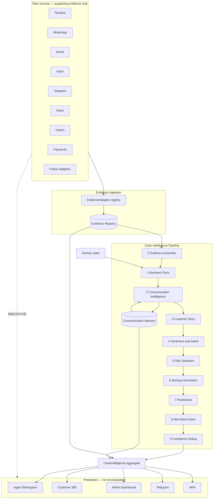
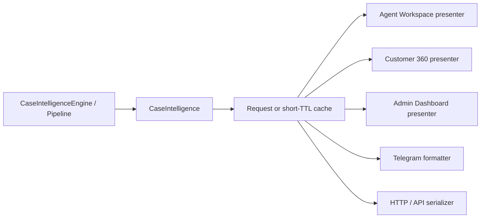

# IRA v2 — Explainable Case Intelligence Architecture

**Status:** Design only (no implementation in this document)  
**Audience:** Product, engineering, operations leadership  
**Scope:** Intelligent Response Assistant (IRA) case assist + operations brain  
**Related:** [Radium Desk Master Architecture §8 AI Roadmap](radium-desk-v2-master-architecture.md#8--ai-roadmap), [Order Workspace Blueprint](order-workspace-blueprint.md), [Customer Journeys](customer-journeys.md), [WhatsApp Communication Summary](whatsapp-communication-summary.md)  
**Last updated:** 2026-07-29

---

## 1. Purpose

IRA today is a **dual-layer, mostly deterministic intelligence brand**:

| Layer | Audience | What it does today |
|-------|----------|--------------------|
| **Customer 360 Case Intelligence** | Agents on a service case | Snapshot briefing, NBA, risks, evidence, workbench drafts, Hindi narrative toggle |
| **Operations Brain** | Admins / ops / owners | Morning briefing, risk alerts, capacity recommendations, Telegram digests |

Production intelligence is **rule-based**. LLM contracts exist but are stubs or null. Business facts on `CaseIntelligenceSnapshot` are already declared authoritative; language layers may only reword.

**IRA v2** evolves that foundation into an **explainable Case Intelligence architecture**:

1. A shared **Evidence Registry** aggregates supporting evidence once from Timeline, WhatsApp, Email, Voice, Telegram, Notes, Orders, Payments, and future adapters.
2. Every intelligence module returns a standard **`IntelligenceFinding`** (finding + confidence + evidence refs + reasoning summary).
3. A top-level **`CaseIntelligence`** aggregate is the single computed product of the pipeline.
4. **Presenters** (Agent Workspace, Customer 360, Admin Dashboard, Telegram, APIs) project the aggregate — they never recompute intelligence or re-parse raw events.
5. Every user-facing recommendation can answer: **why**, **which evidence**, and **how confident**.

Product guardrails unchanged:

- AI **recommends**; humans **act**.
- No silent auto-execution from IRA recommendations.
- Domain and conversational facts stay authoritative; generative layers never invent business state.
- Deterministic-first; LLM reasoning optional behind feature flags.
- Instant rollback via feature flags remains mandatory.

**Communication remains a first-class module** (after Business Facts, before Customer Story). Channel logs and Business Timeline are **evidence sources**, not intelligence engines. Downstream modules consume the Evidence Registry + prior module outputs — never raw stores independently.

---

## 2. Current Architecture (as-is)

### 2.1 Case pipeline (request-scoped)

```
Incident
  → CaseIntelligenceFactCollector
  → AIService.buildBundle (NullAIProvider + confidence)
  → OperationsAdvisorService.incidentInsightsFromBundle
  → Builders: State / Risk / Evidence / Communication / Summary / Recommendation
  → CaseIntelligenceSnapshot (schema 1.3)
  → CaseReasoningEngine.enrich (+ CaseStory)
  → CaseIntelligenceLanguageEnhancer (Null — no-op)
  → Presenters → Customer 360 Blade surfaces
```

Snapshots are **not persisted**; memoized for the request lifetime. Evidence is scattered (timeline feed, builder-local lists, panel evidence items). Reasoning still walks raw `TimelineEvent` types. Presenters sometimes assemble narrative from multiple services rather than one immutable aggregate.

### 2.2 Operations Brain pipeline

```
IraMemoryService → IraRiskDetectionService → IraRecommendationEngineService
  → IraReasoningProvider → IraMorningBriefing → Ops UI + Telegram + feedback
```

### 2.3 Capability maturity today

| Capability | Today | Gap vs explainable Case Intelligence |
|------------|-------|--------------------------------------|
| Business facts | **Strong** | Not yet a named slice of a top-level aggregate |
| Shared evidence | **Partial** | Per-builder evidence; no registry across sources |
| Standard finding contract | **Missing** | Risks/NBA have ad-hoc shapes; no universal why/evidence/confidence |
| Communication intelligence | **Partial** | `CommunicationSummary`; no Memory / latency / unanswered Q |
| Customer Story | **Partial** | `CaseStory` exists; not finding-backed |
| Sentiment & Intent | **Placeholder** | `customerMoodLevel = unknown` |
| Risk / Missing info / NBA | **Present (rules)** | Explainability incomplete / inconsistent |
| Predictions | **Missing** | Roadmap only |
| Presenter purity | **Partial** | C360 presenters; OW / Telegram / APIs not aggregate consumers |
| Plugin architecture | **Contracts only** | No stage / evidence-adapter / finding registry |

### 2.4 Evidence dual role (critical)

| Role | Today | Target |
|------|-------|--------|
| Raw sources (timeline, WA, email, voice, …) | Independently parsed by multiple builders/reasoning | Feed **Evidence Registry** once via adapters |
| Operator UIs for those sources | Often treated as the way to “understand the case” | **Supporting evidence browsers** linked from findings |
| Intelligence outputs | Mixed DTOs | **`IntelligenceFinding`** collections inside **`CaseIntelligence`** |

---

## 3. Design Principles

1. **Evidence once** — Raw sources are adapted into the Evidence Registry; modules never independently parse WhatsApp/Email/Voice/Timeline/Orders/Payments stores for meaning.
2. **Findings everywhere** — Every module emits `IntelligenceFinding` (or collections thereof) with confidence, evidence refs, and reasoning summary.
3. **One aggregate** — `CaseIntelligence` is the sole computed product for a case build; presenters are pure projections.
4. **Pipeline, not monolith** — Ordered stages with typed I/O, soft/hard failure modes, and plugin slots.
5. **Facts before language** — Structured intelligence first; LLM may decorate language or propose findings behind flags — never mutate authoritative facts without policy.
6. **Communication before story** — Conversational module runs after Business Facts and before Story.
7. **Explainability by default** — Any user-facing recommendation must expose why / evidence / confidence (see §8).
8. **Composable plugins** — New modules and evidence adapters register without rewriting the orchestrator.
9. **Human-in-the-loop** — NBA / workbench / Memory LLM proposals never auto-act.
10. **Rollback-first** — Stage, adapter, and LLM flags; `ira.case_intelligence_engine` master switch.

---

## 4. Target Architecture Overview



**Authoritative stage order:**

| # | Stage | Primary outputs |
|---|-------|-----------------|
| 0 | Evidence Assembly | Populated **Evidence Registry** |
| 1 | Business Facts | Facts envelope + findings |
| 2 | Communication Intelligence | Comm envelope + Memory updates + findings |
| 3 | Customer Story | Story projection + findings |
| 4 | Sentiment & Intent | Mood/intent findings |
| 5 | Risk Detection | Risk findings |
| 6 | Missing Information | Gap findings |
| 7 | Predictions | Prediction findings (optional / soft-empty early) |
| 8 | Next Best Action | NBA findings (primary + alternatives) |
| 9 | Confidence Rollup | Composite confidence + factor findings |

**Execution model:** Stage 0 hard-fails only if registry cannot be created (empty registry is valid). Stage 1 hard-fails without domain facts. Later stages soft-degrade with explicit `unavailable` / empty finding lists. **No stage after 0 may fetch raw source stores** for evidence; they query the registry by id/filter and read prior module slices on the in-progress aggregate.

**Ops Brain** remains a sibling pipeline. It may consume exported findings or Memory aggregates later; it does not recompute case intelligence inside Telegram formatters.

---

## 5. Evidence Registry

### 5.1 Purpose

The **Evidence Registry** is the single shared catalog of supporting evidence for a case build. It aggregates normalized items from all evidence adapters so every intelligence module cites the same identifiers and presenters can deep-link without re-fetching meaning.

### 5.2 Evidence item contract

```
EvidenceItem
  id: EvidenceId              // stable within build; prefer durable when source has stable PK
  source: EvidenceSource      // timeline | whatsapp | email | voice | telegram | notes
                              // | order | payment | radiumbox | memory | system | custom
  kind: string                // e.g. message, call, status_change, payment_capture, remark
  occurredAt: datetime?
  summary: string             // short factual label for UI
  preview?: string            // truncated; PII-aware
  actors?: { type, id?, name? }[]
  links: {
    deepLink?: string         // Interakt, mailbox, recording, timeline anchor
    timelineEventId?: …
    externalId?: …
  }
  payloadRef?: opaque         // pointer to raw store — not inlined into findings
  tags?: string[]             // channel, direction, waiting, etc.
  adapterId: string           // provenance
```

### 5.3 Evidence adapters (extensible)

```
EvidenceAdapter
  id(): string
  source(): EvidenceSource
  supports(CaseBuildContext): bool
  collect(CaseBuildContext): list<EvidenceItem>
```

| Adapter (initial) | Backing sources (reuse) |
|-------------------|-------------------------|
| Timeline | `Customer360TimelineService`, business milestone composers, timeline source registry |
| WhatsApp | `InteraktMessage`, `WhatsAppConversationAggregator`, template dispatches |
| Email | `IncomingEmailMessage`, inbound email timeline source |
| Voice | `BonvoiceCallEvent`, BonVoice timeline source |
| Telegram | IRA / assignment notification logs where case-scoped; ops outbound as applicable |
| Notes | Remarks / agent notes on incident/order |
| Orders | Order lifecycle facts as evidence (created, activated, fulfillment states) |
| Payments | Payment captures / failures / refunds as evidence items |
| Future | SMS, Instagram, Messenger, Voice AI, RadiumBox QC, etc. — new adapters only |

**Relationship to Communication channel adapters:** Communication Intelligence may use a *view* of registry items filtered to conversational sources, or a thin `ConversationEvent` projection derived **from the registry** (not a second fetch). Prefer one ingest path (Evidence Assembly) to avoid dual parsing.

### 5.4 Registry API (logical)

```
EvidenceRegistry
  all(): list<EvidenceItem>
  get(id): EvidenceItem?
  bySource(source): list<EvidenceItem>
  byIds(ids): list<EvidenceItem>
  query(filter): list<EvidenceItem>   // time range, tags, kind
  register(items): void               // adapters only, during Stage 0
```

**Immutability after Stage 0:** Registry contents are frozen for the build (append-only exception: Memory-backed evidence items registered when Memory writes occur, with ids available to later stages).

### 5.5 What the registry is not

- Not a replacement for Business Timeline or channel UIs (those remain evidence browsers).
- Not a full transcript store (previews + links only).
- Not authoritative domain state (Orders/Payments evidence supports claims; Stage 1 facts remain the domain authority).

---

## 6. IntelligenceFinding Contract

Every intelligence module returns findings using this shared contract. Module-specific payloads hang off `data` / typed subclasses, but **explainability fields are mandatory**.

```
IntelligenceFinding
  id: string
  module: ModuleId
    // business_facts | communication | story | sentiment_intent
    // | risk | missing_info | predictions | nba | confidence | custom
  code: string                    // stable machine key, e.g. risk.customer_silent
  finding: string                 // human-readable conclusion (one sentence preferred)
  severity?: info | low | medium | high | critical
  status: asserted | hypothetical | unavailable | superseded
  confidence: Confidence          // see below
  evidenceRefs: EvidenceId[]      // MUST resolve in Evidence Registry (or Memory evidence ids)
  reasoningSummary: string        // short “why” — deterministic rule text or LLM rationale
  reasoningDetail?: string[]      // optional bullet steps for “Why?” expanders
  data?: object                   // module-specific typed payload
  pluginId?: string
  generatedAt: datetime
  schemaVersion: string
```

### 6.1 Confidence object

```
Confidence
  level: high | medium | low | unknown
  score?: 0..100                  // optional numeric
  factors?: { code, label, impact }[]
  basis: data_completeness | rule_strength | model_inference | mixed
```

### 6.2 Module output shape

Each stage writes:

1. A **typed slice** for convenience (e.g. `CommunicationIntelligenceResult`, `CustomerStoryProjection`).
2. A **`findings: IntelligenceFinding[]`** list — including the primary conclusions that UI must explain.

User-facing primary NBA, each risk chip, each missing-info item, sentiment mood, and story headline claims **must** be findings (or map 1:1 to findings).

### 6.3 Explainability invariant

> For any finding shown to a user, the presenter can render **Finding**, **Confidence**, **Reasoning summary**, and a resolvable **Evidence list** without calling intelligence services again.

Missing evidence refs or empty reasoning on a user-visible finding is a **pipeline defect**, not a UI problem.

---

## 7. CaseIntelligence Aggregate

Top-level product of one case build. Evolves today’s `CaseIntelligenceSnapshot` (compat shim during migration).

```
CaseIntelligence
  meta:
    incidentId, orderId?
    generatedAt
    schemaVersion
    pipelineVersion
    buildId                      // request/cache key
  businessFacts: BusinessFactsEnvelope
  communication: CommunicationIntelligenceResult
  communicationMemory: CommunicationMemory      // durable ref + materialised entries for build
  customerStory: CustomerStoryProjection
  sentimentIntent: SentimentIntentResult
  risks: IntelligenceFinding[]                  // module=risk (typed data on each)
  predictions: IntelligenceFinding[]            // module=predictions
  missingInformation: IntelligenceFinding[]     // module=missing_info
  nextBestActions:
    primary: IntelligenceFinding                // module=nba
    alternatives: IntelligenceFinding[]
  confidence: CompositeConfidence               // rollup + factors
  evidence: EvidenceRegistry                    // or EvidenceRegistryView
  findingsIndex: IntelligenceFinding[]          // optional flat index of all module findings
  workbench?: AIWorkbenchDTO                    // drafts remain human-gated
  compat?: { … }                                // legacy snapshot field projections
```

### 7.1 Authority rules inside the aggregate

| Slice | Authority |
|-------|-----------|
| `businessFacts` | Domain truth |
| `communication` + `communicationMemory` | Conversational truth |
| `evidence` | Supporting proof catalog |
| `customerStory` / sentiment / risks / predictions / missing / nba | **Derived** conclusions as findings — must not contradict facts; may highlight absences |
| LLM language fields | Non-authoritative wording only |

### 7.2 Relationship to `CaseIntelligenceSnapshot`

| Today | Target |
|-------|--------|
| `CaseIntelligenceSnapshot` schema 1.3 | Compat projection / rename path → `CaseIntelligence` |
| `evidence` / `evidenceViewItems` arrays | Populated from Evidence Registry + finding refs |
| `communicationSummary` | Shim over `communication` |
| `recommendedAction` | `nextBestActions.primary.data` + finding wrapper |
| `confidenceScore` / level | `confidence` rollup |

---

## 8. Explainability Requirements (UX + API)

Every **user-facing recommendation or conclusion** (NBA, risk, gap, sentiment chip, prediction, story claim that drives action) must expose:

| Surface element | Source on finding |
|-----------------|-------------------|
| **What** | `finding` |
| **Why** | `reasoningSummary` (+ optional `reasoningDetail`) |
| **Evidence** | `evidenceRefs` → registry items (summary, time, deep link) |
| **Confidence** | `confidence.level` (+ factors on expand) |

### 8.1 Presenter obligations

- **Do not** invent why-text in Blade/JS if missing — show “Explanation unavailable” and treat as telemetry defect.
- **Do not** re-query Interakt/Email/Voice to rebuild evidence lists — use registry items only.
- Compact UI may show finding + confidence; full “Why?” drawer loads reasoning + evidence from the aggregate already in hand.

### 8.2 API obligations

JSON/API consumers receive findings with the same four fields. Deep links may be omitted for non-UI clients, but evidence ids and summaries remain.

### 8.3 LLM explainability

When reasoning is model-produced:

- `confidence.basis` includes `model_inference`.
- `pluginId` / flag id recorded.
- Prefer citing registry evidence ids the model was given; reject or down-rank outputs that cite unknown ids (deterministic validator).

---

## 9. Presenter Consumption Model

**Rule:** Presenters consume `CaseIntelligence` (or a serialized projection). They **never** invoke stage modules, evidence adapters, or raw source parsers to decide NBA/risks/story.



| Presenter | Consumes | Must not |
|-----------|----------|----------|
| **Agent Workspace** | Story, primary NBA finding, communication strip, risks/gaps, confidence | Call `CaseReasoningEngine` or timeline for meaning |
| **Customer 360** | Existing IRA panel/advisor/workbench bound to aggregate slices | Rebuild summary from `AIService` ad hoc |
| **Admin Dashboard** | Ops briefing may *reference* case finding exports; case drill-down loads aggregate | Recompute case NBA in ops Blade |
| **Telegram** | Formatters map findings → message blocks with why/confidence truncated | Re-run risk detectors while sending |
| **APIs** | Serialize aggregate / finding subsets | Expose raw multi-source joins as “intelligence” |

**Caching:** Request-scoped memoization remains default (today’s engine behavior). Optional short-TTL or durable snapshot persistence is a later phase — presenters still read aggregate, not sources.

**Workbench:** Draft generation may run as a gated collaborator using aggregate context; send/insert remains human + audit. Drafts should attach evidence refs when suggesting replies tied to unanswered questions / promises.

---

## 10. Stage Specifications

### Stage 0 — Evidence Assembly

| | |
|--|--|
| **Input** | `CaseBuildContext` (incident/order scope) |
| **Output** | Frozen **Evidence Registry** |
| **Reuse** | Timeline source registry, WhatsApp/Email/Voice stores, notes, order/payment read models, existing evidence builders |
| **Failure** | Empty registry allowed; abort only on infrastructure failure |

---

### Stage 1 — Business Facts Extraction

| | |
|--|--|
| **Input** | Domain read models + registry (for citations only) |
| **Output** | `businessFacts` + findings (e.g. serial missing, waiting party) |
| **Reuse** | `CaseIntelligenceFactCollector`, `IncidentAIContextBuilder`, `CustomerJourneyBuilder` |
| **Failure** | Hard abort |

Conversational last-touch / preferred channel are **not** Stage 1 — they belong to Communication.

---

### Stage 2 — Communication Intelligence

| | |
|--|--|
| **Input** | Business facts + **Evidence Registry** (conversational sources) + Communication Memory |
| **Output** | `communication` envelope + Memory upserts + findings (silence, unanswered Q, preferred channel, …) |
| **Reuse** | `CommunicationSummaryBuilder` family; migrate silent/frequent-call/contact-without-progress signals here |
| **Failure** | Soft — `status: sparse` |

#### Communication envelope (unchanged intent)

Conversation history, preferred channel, last customer interaction, last agent response, response latency, silent periods, promise tracking, repeated questions, unanswered questions, escalation indicators, conversation sentiment trend, status, evidence refs.

#### Communication Memory

Durable promises, commitments, expectations, offers, callbacks (see prior design). Entries always carry `evidenceRefs` into the registry (Memory may also register synthetic evidence items of `source=memory`).

**Hard rule:** Stage 2 does not open channel DBs if Stage 0 already registered those items; it reads the registry.

---

### Stage 3 — Customer Story Generation

| | |
|--|--|
| **Input** | Business facts + communication (+ Memory) + registry for citations |
| **Output** | `customerStory` + findings per headline claim / blocker bullet that drives action |
| **Reuse** | `CaseStory`, summary builders, language enhancer (wording only) |

---

### Stage 4 — Sentiment & Intent

| | |
|--|--|
| **Input** | Communication findings/envelope + facts + registry excerpts |
| **Output** | `sentimentIntent` + findings for mood and each intent |
| **Approach** | Deterministic heuristics first; optional NLP/LLM behind flags |
| **Guardrail** | No auto-escalation from sentiment alone |

---

### Stage 5 — Risk Detection

| | |
|--|--|
| **Input** | Aggregate-so-far + registry |
| **Output** | `risks[]` as `IntelligenceFinding` |
| **Reuse** | `AIRiskScoringService`, `CaseRiskBuilder`, reasoning risk detectors (via Stage 2 signals) |

---

### Stage 6 — Missing Information

| | |
|--|--|
| **Input** | Facts + communication unanswered/expectations + policy |
| **Output** | `missingInformation[]` findings (domain + conversational gaps) |
| **Reuse** | `CaseStateBuilder::openQuestions`, missing-mandatory detectors |

---

### Stage 7 — Predictions

| | |
|--|--|
| **Input** | Aggregate-so-far + registry |
| **Output** | `predictions[]` findings (SLA breach likelihood, promise-breach likelihood, priority hints, …) |
| **Early phases** | Soft-empty list / `unavailable` findings — slot reserved for extensibility |
| **Hard rule** | Consumes registry + prior findings only |

---

### Stage 8 — Next Best Action

| | |
|--|--|
| **Input** | Full prior slices + action visibility |
| **Output** | `nextBestActions.primary` + `alternatives` as findings (why-this / why-not in reasoning) |
| **Reuse** | `CaseAdvisorDecisionBuilder`, `CaseRecommendationBuilder` |
| **Guardrail** | Non-blocking; no auto-execute |

---

### Stage 9 — Confidence Rollup

| | |
|--|--|
| **Input** | All findings + registry coverage metrics |
| **Output** | `confidence` composite + optional factor findings |
| **Reuse** | `AIContextConfidenceCalculator` as data-completeness basis |

Layers: **DataConfidence**, **DecisionConfidence**, **InferenceConfidence**, aggregated to **CompositeConfidence**.

---

## 11. Agent & Admin Surfaces (projection notes)

### Agent (Customer 360 + Agent Workspace)

1. Customer Story (finding-backed bullets)  
2. Primary NBA (finding — why / evidence / confidence)  
3. Communication strip  
4. Risks & Missing Info (each a finding)  
5. Sentiment & Intent (+ predictions when present)  
6. Supporting evidence drawer (registry items; Timeline / WA / Email / Voice / …)  
7. Workbench  

### Admin

- Ops briefing continues via Operations Brain; case drill-down loads `CaseIntelligence`.  
- Finding provenance (`module`, `pluginId`) shown on full analysis.  
- Telegram formatters render finding subsets — no recomputation.

---

## 12. Extensible Plugin Architecture

```
EvidenceAdapter            // Stage 0 ingest
IntelligenceStagePlugin    // stages 1–9 / custom / predictions
  run(...) -> StageIO including IntelligenceFinding[]

CommunicationMemoryWriter  // propose Memory entries (confirm policy)
IntelligenceEnricherPlugin // language only
OpsDetectorPlugin          // ops brain parity
```

`StageId` includes: `evidence | facts | communication | story | sentiment_intent | risk | missing_info | predictions | nba | confidence | custom`.

Config registration mirrors timeline source registry (`config/ira.php` plugins + evidence adapters). Feature flags per adapter, stage, and LLM enricher.

Future modules (Knowledge Suggestions, Supervisor Alerts, new channels) register as stage plugins or evidence adapters without aggregate shape breaks — add findings to `findingsIndex` and optionally a typed slice via schema version bump.

---

## 13. Services to Reuse

| Area | Role in explainable architecture |
|------|----------------------------------|
| Timeline source registry + C360 timeline services | Evidence adapters (timeline) |
| WhatsApp / Email / Voice models & aggregators | Evidence adapters + deep links |
| `CommunicationSummaryBuilder` + DTOs | Stage 2 seed |
| `CaseIntelligenceEvidence` / evidence panel presenters | Map to registry-backed UI |
| Fact / state / risk / recommendation / summary builders | Stage implementations emitting findings |
| `CaseReasoningEngine` | Migrate detectors → Stage 2/5 finding producers |
| `AIContextConfidenceCalculator` | Stage 9 data confidence |
| `CaseIntelligenceEngine` | Become pipeline orchestrator producing `CaseIntelligence` |
| C360 IRA presenters / Blade | Pure projectors |
| Ops Brain + Telegram communication services | Formatters / fleet; optional finding consumers |
| Feature flags + `ira:*` schedules | Rollback / delivery |

**Thin over time:** Monolithic engine body; independent timeline parsing in reasoning; presenter-side intelligence assembly; ad-hoc evidence arrays without registry ids.

---

## 14. Data & Schema Notes

- **`CaseIntelligence`:** Request-scoped by default; optional persistence later for API/admin.  
- **Communication Memory:** Durable.  
- **Evidence Registry:** Build-scoped (ids stable within `buildId`); durable ids preferred when source PKs exist.  
- **Schema version:** Bump when finding contract, registry, and aggregate slices land.  
- **PII:** Previews truncated; payload bodies via `payloadRef` + policy for LLM.  
- **Compat:** Keep projecting legacy snapshot fields until presenters migrate.

---

## 15. Migration Plan

Principles: **no big-bang**, **flag every stage**, **parity before polish**, **preserve Phases 0–5**, layer Evidence Registry + Finding contract + aggregate/presenter purity onto the existing Communication-aware plan.

### Phase 0 — Document & contract freeze (this doc)

- Freeze: Evidence Registry + adapters, `IntelligenceFinding`, `CaseIntelligence` aggregate, stage order 0–9, presenter purity rule, explainability UX requirements.
- No runtime behavior change.

### Phase 1 — Pipeline scaffolding (behavior-preserving)

- Orchestrator stages **0 → 1 → 2 → 3 → 5 → 6 → 8 → 9** (Stage 4 sentiment stub; Stage 7 predictions empty).
- Stage 0 builds registry from **existing** timeline/comms inputs already loaded by fact collector (wrap, don’t redesign stores).
- Stage 2 wraps `CommunicationSummaryBuilder` into communication slice.
- Emit aggregate **compat-equal** to today’s snapshot UX (findings may mirror existing strings).
- Master rollback: `ira.case_intelligence_engine.enabled`.

**Exit criteria:** Existing IRA / CommunicationSummary tests green; zero intentional UX change.

### Phase 2 — Story-first UX + evidence demotion + finding-backed NBA/risks

- Story + NBA lead; Communication strip; Timeline/WA/Email/Voice under evidence drawer backed by registry.
- Primary NBA and visible risks become `IntelligenceFinding` with why/evidence/confidence in C360.
- Presenters read aggregate only for those surfaces (no ad-hoc rebuild).

**Exit criteria:** Agent answers what’s going on / what next / why without opening raw logs; “Why?” works for primary NBA.

### Phase 3 — Sentiment heuristics + Communication depth + Order Workspace

- Stage 4 heuristics from communication findings; latency/silence; action-sourced Memory.
- Agent Workspace presenter binds to aggregate (Story / NBA / Communication).
- Confidence rollup shows factors including evidence coverage.

**Exit criteria:** Mood not always unknown when signals exist; OW not an empty shell; Memory holds action-sourced commitments.

### Phase 4 — Adapter & plugin extraction + hard boundaries

- Full `EvidenceAdapter` registry (Timeline, WhatsApp, Email, Voice, Notes, Orders, Payments, Telegram-as-applicable).
- Channel/communication logic reads registry only.
- Stages 1–9 forbidden from raw source I/O (API boundary / code owners).
- Predictions stage remains soft-empty but pluggable.
- Language enhancers = enrichers only.

**Exit criteria:** New evidence adapter (e.g. SMS) registerable via config; new risk plugin emits findings without orchestrator edits.

### Phase 5 — Optional LLM + aggregate persistence

- LLM sentiment / Memory proposals / reasoningDetail behind flags; evidence-id validator required.
- Optional durable `CaseIntelligence` snapshots for APIs/admin/Telegram async.
- Feedback keyed to finding id / plugin id.

**Exit criteria:** Flag-off returns to Phase 3 deterministic behavior.

### Phase mapping (preserved strategy)

| Phase | Prior focus | Explainability / aggregate addition |
|-------|-------------|-------------------------------------|
| 0 | Contracts | + Evidence Registry, Finding, CaseIntelligence, presenter purity |
| 1 | Behavior-preserving scaffold | + Stage 0 wrap; finding-shaped compat outputs |
| 2 | Story-first UX | + Finding-backed NBA/risks; evidence drawer from registry |
| 3 | Sentiment + OW + Memory | + Explainable sentiment; OW projector |
| 4 | Plugin / channel extraction | + Full evidence adapters; ban raw re-parse; predictions slot |
| 5 | Optional LLM | + Validated LLM reasoning; optional aggregate persistence |

### Rollback matrix

| Flag / switch | Effect |
|---------------|--------|
| `ira.enabled` | Master product off |
| `ira.case_intelligence_engine.enabled` | Legacy C360 assembly |
| `ira.business_timeline.enabled` | Flat timeline UI (independent) |
| `ira.communication_intelligence.enabled` | Sparse communication slice |
| `ira.evidence_registry.enabled` (new) | Fallback: legacy evidence arrays only |
| `ira.explainability_strict.enabled` (new) | Hide user-facing claims lacking why/evidence |
| Per-adapter / per-stage / per-LLM flags | Granular disable |

---

## 16. Testing Strategy (design)

| Layer | Focus |
|-------|-------|
| Unit | Finding contract completeness; registry query; Memory transitions |
| Adapter | Source → EvidenceItem without module coupling |
| Boundary | Stages 1–9 tests inject registry + prior slices only |
| Explainability | Every fixture NBA/risk has why + ≥1 evidence ref + confidence |
| Presenter | Given frozen aggregate JSON, UI renders without service mocks for intelligence |
| Golden | Same incident → stable aggregate slices across Phase 1 |
| LLM path | Reject findings citing unknown evidence ids |

Baselines: `tests/Feature/Ira*`, `tests/Unit/Customer360/Intelligence/*`, `tests/Unit/AI/*`.

---

## 17. Out of Scope

- Changing payment, warranty, or RadiumBox **ownership** of domain data (they contribute evidence + facts only)  
- Auto-send / auto-assign from NBA  
- Auto-accept LLM Memory without policy  
- Merging Ops Brain into the case pipeline  
- Removing Timeline or channel log UIs  
- Full transcript ingestion into the aggregate by default  
- Production LLM without security / cost / PII review  

---

## 18. Success Metrics

| Metric | Signal |
|--------|--------|
| Explainability coverage | % user-visible findings with why + evidence + confidence |
| Time-to-first-action | Act from NBA without opening raw logs |
| Presenter purity | No intelligence recomputation in OW / C360 / Telegram formatters |
| Evidence reuse | Modules cite registry ids; zero direct source parsers in stages 1–9 (Phase 4+) |
| Promise hygiene | Memory commitments closed deliberately |
| Extensibility | New adapter or module ships without aggregate break |
| Rollback drills | Flags exercised without C360 outage |

---

## 19. Summary

IRA v2 is an **explainable Case Intelligence** architecture:

1. **Evidence Registry** — one shared catalog from Timeline, WhatsApp, Email, Voice, Telegram, Notes, Orders, Payments, and future adapters.  
2. **`IntelligenceFinding`** — every module returns finding + confidence + evidence refs + reasoning summary.  
3. **`CaseIntelligence`** — single aggregate (facts, communication, story, sentiment, risks, predictions, missing info, NBAs, confidence, Memory, registry).  
4. **Pipeline 0–9** — Evidence Assembly → Facts → Communication → Story → Sentiment → Risk → Missing Info → Predictions → NBA → Confidence.  
5. **Presenters** project the aggregate only (Agent Workspace, Customer 360, Admin, Telegram, APIs).  
6. **Explainability** is mandatory for user-facing recommendations.  
7. **Deterministic-first**; LLM optional behind flags with evidence-id validation.  
8. **Phased rollout 0–5 preserved**, extended for registry, findings, and presenter purity.
