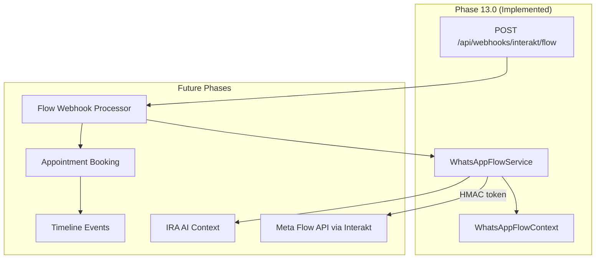

# Meta WhatsApp Flow Roadmap

**Status:** Phase 13.0 foundation complete  
**Scope:** Preparation for Meta "Complete Flow" integration via Interakt  
**Last updated:** 2026-07-03

Phase 13.0 lays the groundwork so Meta WhatsApp Flow can be plugged in later without refactoring core services. No Meta API calls are made in this phase.

---

## Phase 13.0 — Foundation (Current)

Implemented:

| Component | Purpose |
|-----------|---------|
| `WhatsAppFlowService` | Build flow context, sign/validate tokens, resolve incidents |
| `WhatsAppFlowContext` | DTO carrying incident, customer, device, and booking data |
| `POST /api/webhooks/interakt/flow` | Webhook skeleton (501 Not Implemented) |
| Customer360 Operations Health | WhatsApp Flow status card (Ready / Not Configured) |
| Operations Dashboard | Meta Flow integration card (Not Configured) |

Token signing uses HMAC-SHA256 with the Laravel application key—the same cryptography stack as signed URLs.

---

## Phase 13.1 — Flow Creation

**Goal:** Create and publish a Meta WhatsApp Flow in the Meta Business Manager / Interakt console.

Planned work:

1. Define flow screens (device confirmation, appointment details, booking confirmation).
2. Map `WhatsAppFlowContext` fields to flow screen variables.
3. Configure Interakt to send flow messages using `WhatsAppFlowService::generateToken()`.
4. Store flow ID and version in `config/interakt.php` or system settings.
5. Update Operations Dashboard Meta Flow card to reflect configuration status.

**Extension point:** `WhatsAppFlowService::buildContext()` — add fields here when flow screens need more data.

---

## Phase 13.2 — Webhook

**Goal:** Handle Meta flow completion callbacks at `POST /api/webhooks/interakt/flow`.

Planned work:

1. Replace 501 stub in `InteraktFlowWebhookController` with payload parsing.
2. Verify webhook signature (reuse `InteraktWebhookSignatureVerifier` or Meta-specific verifier).
3. Extract flow token from callback payload.
4. Call `WhatsAppFlowService::validateToken()` and `resolveIncident()`.
5. Persist webhook log (mirror `interakt_webhook_logs` pattern).
6. Enqueue outbox processing for reliability.

**Extension point:** `InteraktFlowWebhookController::handle()` — wire to a future `InteraktFlowWebhookProcessorService`.

---

## Phase 13.3 — Appointment Booking

**Goal:** Complete appointment booking from within the WhatsApp Flow.

Planned work:

1. On flow completion webhook, read selected date/time slot from payload.
2. Create `SupportAppointment` record linked to resolved incident.
3. Emit timeline event (`TimelineEventType::Appointment`).
4. Update Customer360 WhatsApp Flow status to Ready automatically.
5. Send confirmation message (optional template dispatch).

**Constraint:** Reuse existing `SupportAppointment` model and validation—do not duplicate booking logic.

**Extension point:** New `InteraktFlowAppointmentBookingService` that delegates to existing appointment store logic.

---

## Phase 13.4 — IRA Integration

**Goal:** Surface WhatsApp Flow context in IRA AI workbench and executive summary.

Planned work:

1. Include flow status in `AIContextBuildSnapshot`.
2. Add flow completion events to IRA advisor insights.
3. Enable agents to trigger flow sends from Customer360 quick actions.
4. Train IRA prompts on flow-related customer interactions.

**Extension point:** `Customer360Service::drawerData()` — pass flow readiness to AI bundle.

---

## Phase 13.5 — Timeline Integration

**Goal:** Show WhatsApp Flow events in the unified Customer360 timeline.

Planned work:

1. Create `WhatsAppFlowTimelineEventSource`.
2. Record events: flow sent, flow opened, flow completed, flow expired.
3. Add timeline filter chip for flow events.
4. Link timeline entries to incident via flow token resolution.

**Extension point:** `Customer360TimelineService` — register new event source alongside WhatsApp message events.

---

## Architecture

---

## Configuration

| Variable | Purpose | Phase |
|----------|---------|-------|
| `INTERAKT_FLOW_TOKEN_TTL_HOURS` | Flow token expiry (default: 24) | 13.0 |
| `INTERAKT_FLOW_ID` | Meta flow identifier | 13.1 |
| `INTERAKT_FLOW_VERSION` | Published flow version | 13.1 |

See `config/interakt.php`.

---

## Security Notes

- Flow tokens are HMAC-signed and include `expires_at`.
- Tokens embed `incident_id` for secure incident restoration via `resolveIncident()`.
- No customer PII is exposed in unsigned form—the payload is base64-encoded and signed.
- Webhook signature verification will be required before processing (Phase 13.2).
