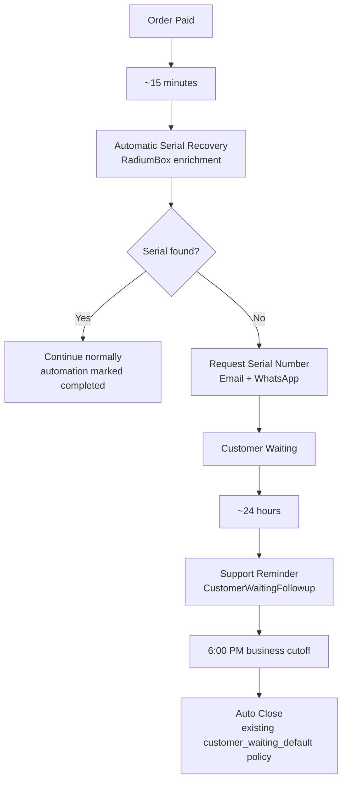

# Missing Serial Automation

**Audience:** Engineering, operations, support leads  
**Status:** Live automation (`missing-serial:process`)  
**Last updated:** 2026-07-15

**Related code:**

- `App\Services\MissingSerial\MissingSerialAutomationService`
- `missing-serial:process` (scheduled every `missing_serial.schedule_interval_minutes`, default 15)
- `config/missing_serial.php`

**Related documents:**

- [Customer Journey Blueprint](./customer-journeys.md) — Journey 1 (Online Payment Received)
- [Journey 1A — Missing Serial Automation](./customer-journeys.md#journey-1a--missing-serial-automation)

---

## Business Purpose

The Missing Serial Automation ensures that support cases are not delayed when a valid device serial number is unavailable.

Before contacting the customer, the system attempts to recover the serial number automatically from RadiumBox. Customers are contacted only when automatic recovery is unsuccessful.

### Objectives

- Reduce manual effort for support agents.
- Avoid unnecessary customer communication.
- Give RadiumBox an opportunity to recover the serial number automatically.
- Request the serial number only when genuinely required.
- Follow a consistent customer journey:
  **Request Serial Number → Support Reminder → Auto Close**.

---

## Trigger

> **Common misconception:** “Request Serial Number is sent if the serial number is missing.”
>
> That description is **incomplete**. A missing serial alone does **not** trigger outreach. The automation waits for payment confirmation, allows time for automatic recovery, confirms RadiumBox has already tried, and only contacts the customer once per missing-serial event.

The **initial** Request Serial Number communication is sent **only when every condition below is true**:

| # | Condition | What it means in practice |
|---|-----------|---------------------------|
| 1 | **Order is successfully paid** | Cashfree payment is verified (`cashfree_payment_id` present). Unpaid or unverified orders are excluded. |
| 2 | **~15 minutes have elapsed** | `payment_date` (or order `created_at` if payment date is absent) + `missing_serial.first_delay_minutes` (default **15**) must be in the past. |
| 3 | **RadiumBox automatic serial recovery has already been attempted** | At least one enrichment attempt exists (`radiumbox_sync_attempts > 0`, sync status is not `not_synced`, or `radiumbox_last_sync_at` is set). Orders still waiting for the first RadiumBox sync are **not** contacted. |
| 4 | **A valid serial number is still unavailable** | Serial is null, empty, or whitespace-only (missing / placeholder / pending validation). RadiumBox enrichment is still needed (serial not locked and/or device model still missing). |
| 5 | **Customer has not already been contacted for this missing-serial event** | No prior successful Request Serial Number WhatsApp dispatch for the order, and automation status is not already `requested` / `reminded` / `escalated` / `completed`. Manual “Request Serial Number” from the workspace counts as prior contact. |

### Additional exclusions

| Exclusion | Reason |
|-----------|--------|
| Product orders (`RDE*` prefix) | Hardware product sales use a different flow |
| Cancelled orders or approved refunds | Order is blocked |
| Automation disabled or tracking columns unavailable | Config / schema guard |
| Device recovery already complete | `needsEnrichment()` is false — serial/model resolved via RadiumBox or manual entry |

### When all conditions are met

The automation dispatches:

1. **Request Serial Number email** (when email channel is enabled and available)
2. **Request Serial Number WhatsApp** (when WhatsApp channel is enabled and available)
3. **Customer Waiting state** (`WaitingReason::SerialNumber`) on the linked service case, if one is not already active

Audit event: `missing_serial.request_sent`

---

## Customer Journey

### Timeline summary

| Elapsed time | Event | Notification / action |
|--------------|-------|------------------------|
| **Payment** | Cashfree webhook creates order + service case | — |
| **+15 min** | RadiumBox recovery window; first scheduler pass after delay | — |
| **After recovery fails** | Request Serial Number | `NotificationType::RequestSerialNumber` (email + WhatsApp) + Customer Waiting state |
| **+24 h** from first request | Support Reminder | `NotificationType::CustomerWaitingFollowup` (Support Reminder email + WhatsApp) |
| **6:00 PM** local (after reminder) | Auto Close if no customer response | Existing `customer_waiting_default` waiting lifecycle — **unchanged** |
| **+72 h** from first request | Coordinator escalation (if still unresolved) | Internal assignment — no customer notification |

### Configuration (defaults)

| Key | Default | Purpose |
|-----|---------|---------|
| `missing_serial.first_delay_minutes` | 15 | Delay after payment before first outreach |
| `missing_serial.reminder_delay_hours` | 24 | Delay after first request before Support Reminder |
| `missing_serial.escalation_delay_hours` | 72 | Delay before coordinator escalation |
| `missing_serial.schedule_interval_minutes` | 15 | How often `missing-serial:process` runs |

---

## Manual vs Automatic Paths

| Path | Trigger | Same notifications? |
|------|---------|----------------------|
| **Automatic** | `missing-serial:process` when all business conditions are met | Yes — Request Serial Number email + WhatsApp |
| **Manual** | Agent uses “Request Serial Number” in Order / Customer 360 workspace | Yes — same templates; prevents scheduler duplicate |

Both paths create or preserve the Customer Waiting state and stamp `missing_serial_first_requested_at`.

---

## Operator Checklist

When investigating “why didn’t the customer get Request Serial Number?”:

1. Is `cashfree_payment_id` present?
2. Has at least **15 minutes** passed since payment?
3. Has RadiumBox enrichment been **attempted** at least once?
4. Is `serial_number` still empty?
5. Was the customer **already contacted** (check WhatsApp dispatches or `missing_serial_automation_status`)?
6. Is the order a product (`RDE*`) or refunded/cancelled order?
7. Are notification channels enabled in system settings?

Use `php artisan missing-serial:process` (or check `storage/logs/missing-serial-automation.log`) for batch outcomes: `sent`, `reminded`, `escalated`, `skipped`, `failed`.

---

## Document Maintenance

| Change | Update |
|--------|--------|
| Timing config changes | This doc + `config/missing_serial.php` header |
| New exclusion rule in `ineligibilityReason()` | Trigger table |
| Notification type / template change | Customer journey table + [Customer Journey Blueprint](./customer-journeys.md) |
