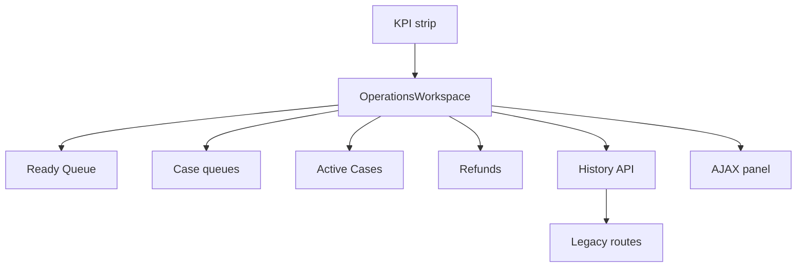

# Operations Workspace Unification — Investigation

**Type:** Architecture / UX investigation (read-only — no implementation)  
**Date:** 2026-08-04  
**Status:** Findings complete; awaiting architecture approval  
**Canvas:** [`operations-workspace-unification.canvas.tsx`](/Users/ravi/.cursor/projects/Users-ravi-radium-service-desk/canvases/operations-workspace-unification.canvas.tsx)

---

## 1. Verdict

The Dashboard is **already** the Operations Center for **seven of nine** named surfaces. The real gaps are:

1. KPI and queue-chip clicks still do **full page navigation** (`<a href>`), not soft workspace switches.
2. **Active Service Cases** (`/incidents?status=active`) and **Refunds** (`/refunds`) leave the Dashboard entirely and duplicate listing chrome.
3. There is **no** formal `OperationsWorkspace` configuration layer — behaviour is implicit in `queue` / `filter` params + shared Blade partials.

| Metric | Value |
|---|---|
| Surfaces already on Dashboard | 7/9 |
| Surfaces that leave Dashboard | 2 (Active Cases, Refunds) |
| Soft workspace switch today | 0 |
| Shared case table | 1 (`recent-service-cases` + `service-case-row`) |

### Recommended direction

Formalize an **OperationsWorkspace** configuration layer on top of the existing Dashboard panel. Convert KPI + queue chip clicks to soft switches (History API + AJAX panel swap). Keep Ready Queue available as a first-class workspace. Embed Active Cases and Refunds as adapters without duplicating table/filter/search/action UIs. Preserve `/incidents` and `/refunds` routes for deep links, bookmarks, and compatibility.

**Stack today:** Blade + Vite vanilla JS + Reverb/poll. No Livewire/Vue/React on these listings. Prefer extending that stack over introducing a new SPA.

### Success criteria mapping

| Criterion | Today | After (proposed) |
|---|---|---|
| Dashboard is primary Ops Center | Mostly true for case queues | True for all daily workspaces including Active + Refunds |
| KPI click does not navigate away | False — full page href | Soft switch; URL updates via history |
| One workspace visible at a time | True for queue chips | True for all configured workspaces |
| No duplicated UI | Incidents + Refunds duplicate listing chrome | Adapters reuse partials / shared chrome |
| Legacy routes remain | Yes | Yes — redirects or same controllers for compatibility |

---

## 2. Page inventory

### Architecture fact

**Seven of the nine named surfaces are not separate pages.** They are queue/filter modes of a single Dashboard at `/dashboard`, sharing one Blade table, one row partial, and the same AJAX endpoints.

| Named surface | Implementation | URL pattern |
|---|---|---|
| Ready Queue | Dashboard `queue=action_required` | `/dashboard?queue=action_required` |
| Exceptions | Dashboard `queue=attention` | `/dashboard?queue=attention` |
| Scheduled | Dashboard `queue=scheduled` | `/dashboard?queue=scheduled` |
| Customer Waiting | Dashboard `queue=waiting_customer` | `/dashboard?queue=waiting_customer` |
| Hardware Queue | Dashboard `queue=hardware` | `/dashboard?queue=hardware` |
| Overdue | Dashboard legacy `filter=overdue` | `/dashboard?filter=overdue` |
| Open Cases | KPI alias → Ready Queue | `/dashboard?queue=action_required#dashboard-service-cases-panel` |
| Active Service Cases | Separate CRUD list | `/incidents?status=active` |
| Refunds | Separate resource list | `/refunds` / `/refunds?status=pending` |

---

### Ready Queue

| Concern | Detail |
|---|---|
| Kind | Dashboard queue |
| URL | `/dashboard?queue=action_required` |
| Data source | `DashboardSnapshot` + `OperationsQueueClassifier` (`ActionRequired` + Ready-for-reference overlay) |
| Filters | `queue=action_required`; role-scoped available queues |
| Sorting | `DashboardIncidentSortComparator` (attention → SLA → created) |
| Pagination | Initial 35 + Load More 25 (AJAX) — `config/dashboard.php` |
| Actions | Row open → Customer 360; assignment via `ReadyQueueAdminAssignmentService` |
| Bulk | Assign Ref. No. (Admin / Ops Admin / SuperAdmin) |
| Search | Quick filter + `/search` + `search-rows` |
| Permissions | `auth`+`active`; `incidents.view`; admin ready visibility gate |
| Components | `recent-service-cases` + `service-case-row` + live-dashboard JS |
| Gap | Already in-workspace; chip/KPI still full-page navigate |

---

### Exceptions

| Concern | Detail |
|---|---|
| Kind | Dashboard queue |
| URL | `/dashboard?queue=attention` |
| Data source | Classifier `isAttention` (validation failed, unassigned high-priority, etc.) |
| Filters / sort / pagination | Shared with Ready |
| Actions / bulk / search | Shared |
| Permissions | `incidents.view` |
| Components | Shared dashboard table |
| Gap | Already in-workspace |

---

### Scheduled

| Concern | Detail |
|---|---|
| Kind | Dashboard queue |
| URL | `/dashboard?queue=scheduled` |
| Data source | Pending-admin + support appointment `preferred_date ≥ today` |
| Sorting | Appointment-aware sort + badges |
| UI extras | `data-scheduled-appointment-board`, appointment cell, agent Next Appointment tile |
| Gap | Already in-workspace |

---

### Customer Waiting

| Concern | Detail |
|---|---|
| Kind | Dashboard queue |
| URL | `/dashboard?queue=waiting_customer` |
| Data source | Waiting state or `WaitingForCustomerSerial` automation |
| Scope | Agents: assigned-only; Admins: all waiting |
| Note | Admin chip meta hides Waiting, but KPI/route still reachable |
| Gap | Already in-workspace |

---

### Hardware Queue

| Concern | Detail |
|---|---|
| Kind | Dashboard queue |
| URL | `/dashboard?queue=hardware` (aliases: `hardware_orders`, `warehouse`, `dispatch`) |
| Data source | Order ID prefixes (RDE/RIN) via `Order::isHardwareOrderId` |
| Permissions | `dashboard.hardware.view` |
| Gap | Already in-workspace |

---

### Overdue

| Concern | Detail |
|---|---|
| Kind | Legacy filter (not a queue key) |
| URL | `/dashboard?filter=overdue` |
| Data source | Pending-admin, non-hardware, SLA Overdue |
| Note | Dual model (`queue` vs `filter`) complicates soft-switch |
| Gap | In-workspace but needs first-class workspace id |

---

### Open Cases

| Concern | Detail |
|---|---|
| Kind | KPI alias — **not a list** |
| URL | Navigates to Ready Queue |
| Data | `open_cases` = Ready + Scheduled + Attention counts |
| Gap | No dedicated list; naming conflicts with Active Service Cases |

---

### Active Service Cases

| Concern | Detail |
|---|---|
| Kind | **Separate page** |
| URL | `/incidents?status=active` |
| Controller | `IncidentController@index` |
| Data source | Eloquent `Incident`; `status IN operationallyActive()` |
| Filters | order_id, reference_no, category, status, source, dates |
| Sorting | `latest()` |
| Pagination | Laravel `paginate(15)` |
| Actions | View / Edit / Create — no C360 drawer |
| Bulk | None |
| Search | GET form only |
| Permissions | `authorizeResource(Incident)`; `IncidentPolicy` |
| Components | `incidents/index.blade.php` + `service-cases.js` (**unique**) |
| Gap | Leaves Dashboard; duplicates listing UX |

---

### Refunds

| Concern | Detail |
|---|---|
| Kind | **Separate page** |
| URL | `/refunds?status=pending` |
| Controller | `RefundRequestController@index` |
| Data source | `RefundRequest` (+ order, incident, requester) |
| Filters | reference, order, incident ref, status, requester, dates + queue cards |
| Pagination | `paginate(15)` |
| Actions | View / create; approve/reject/complete on show |
| Bulk | None |
| Permissions | `refunds.view` / `review` / `execute` |
| Components | `refunds/index.blade.php` (**unique**) |
| Gap | Leaves Dashboard; different domain model |

---

### Summary matrix

| Surface | Kind | Leaves Dashboard? | Reuse path |
|---|---|---|---|
| Ready Queue | Dashboard queue | No | CaseQueueAdapter |
| Exceptions | Dashboard queue | No | CaseQueueAdapter |
| Scheduled | Dashboard queue | No | CaseQueueAdapter |
| Customer Waiting | Dashboard queue | No | CaseQueueAdapter |
| Hardware Queue | Dashboard queue | No | CaseQueueAdapter |
| Overdue | Legacy filter | No | CaseFilterAdapter |
| Open Cases | KPI alias | No | Shortcut → Ready |
| Active Service Cases | Separate page | **Yes** | ActiveCasesAdapter |
| Refunds | Separate page | **Yes** | RefundQueueAdapter |

---

## 3. UX proposal

### Target operator flow

```
Dashboard (stays mounted)
  ├─ KPI strip          ← soft-switch, no navigation
  ├─ Team Activity      ← unchanged, remains available
  └─ OperationsWorkspace (exactly one visible)
        Ready Queue | Exceptions | Scheduled | Waiting |
        Hardware | Overdue | Active Cases | Refunds
```

### Behaviour rules

| Interaction | Today | Proposed |
|---|---|---|
| Click Ready / Exceptions / Scheduled chip | Full document navigation to `?queue=` | Prevent default → soft switch → `pushState` |
| Click Open KPI | Navigate to Ready Queue (full reload) | Soft switch to `action_required` |
| Click Overdue KPI | Navigate `?filter=overdue` (full reload) | Soft switch to overdue filter workspace |
| Click Total Active Cases KPI | Leave to `/incidents?status=active` | Soft switch to ActiveCasesAdapter on Dashboard |
| Click Refunds KPI | Leave to `/refunds?status=pending` | Soft switch to RefundQueueAdapter on Dashboard |
| Browser back / forward | Full page loads | `popstate` restores workspace without reload |
| Deep link / bookmark | Works for `?queue=` / legacy pages | Works for `?workspace=`; legacy URLs redirect or embed |

### Naming

Prefer a single query param family. Recommend `workspace` as the public switch key, with aliases mapping existing `queue` / `filter` for compatibility.

Do **not** invent a separate “Open Cases” list — keep Open as a Ready Queue shortcut, or rename the KPI to avoid colliding with Active Service Cases.

Ready Queue remains reachable at all times (chip + default landing for admins).

---

## 4. Architecture

### Diagram



### Component hierarchy

```
DashboardPage
├─ KpiStrip (soft-switch actions, not full navigation)
├─ TeamActivityPanel (unchanged, below or beside)
└─ OperationsWorkspace  ← single visible workspace
   ├─ WorkspaceChrome (title, chips, search slot, bulk slot)
   ├─ CaseQueueAdapter → recent-service-cases + row partial
   ├─ CaseFilterAdapter (overdue / my_attention)
   ├─ ActiveCasesAdapter → incidents index partial (embedded)
   └─ RefundQueueAdapter → refunds index partial (embedded)
```

### Configuration model (proposed)

| Workspace ID | Label | Adapter | Data source | Live |
|---|---|---|---|---|
| `action_required` | Ready Queue | CaseQueueAdapter | DashboardSnapshot queue | Yes — existing live/load-more |
| `attention` | Exceptions | CaseQueueAdapter | DashboardSnapshot queue | Yes |
| `scheduled` | Scheduled | CaseQueueAdapter | DashboardSnapshot queue | Yes |
| `waiting_customer` | Customer Waiting | CaseQueueAdapter | DashboardSnapshot queue | Yes |
| `hardware` | Hardware | CaseQueueAdapter | DashboardSnapshot queue | Yes |
| `overdue` | Overdue | CaseFilterAdapter | Legacy `filter=overdue` | Yes (filter path) |
| `active_cases` | Active Service Cases | ActiveCasesAdapter | Incident index (`status=active`) | Optional poll / soft reload |
| `refunds` | Refund Queue | RefundQueueAdapter | RefundRequest index | Separate poll or soft reload |

### Adapter contract

Each adapter exposes:

- `id`, `label`, `permission`
- `resolveQuery(Request)`
- `renderPanelHtml()`
- `supportsLive`, `supportsLoadMore`, `supportsBulk`
- `deepLink()`

`CaseQueueAdapter` is thin config over existing `DashboardService` / `DashboardLiveController`.  
`ActiveCasesAdapter` and `RefundQueueAdapter` extract Blade tables from current index views into partials rendered into the same host slot.

### Navigation & deep links

| Concern | Strategy |
|---|---|
| In-dashboard switches | AJAX replace `#dashboard-primary-panel` (or workspace host); update `data-live-queue` / filter attrs |
| Browser history | `history.pushState` / `replaceState` with `?workspace=` (or preserve `?queue=`/`?filter=`) |
| Deep links | `GET /dashboard?workspace=X` performs full SSR of that workspace (same as today for queue) |
| `/incidents?status=active` | Keep route; optional redirect to dashboard workspace **or** continue standalone for power users |
| `/refunds` | Keep resource routes for create/show/approve; index can redirect or dual-render |
| Search engines | Auth-gated app — SEO irrelevant; bookmarks + shared ops links matter |
| Sidebar Service Cases | Can remain `/incidents` (catalog) while KPI Active uses embedded workspace |

---

## 5. Reuse inventory

### Reuse as-is (do not duplicate)

- `recent-service-cases.blade.php`
- `service-case-row.blade.php`
- `DashboardSnapshot` + `OperationsQueueClassifier`
- `dashboard.live` / `dashboard.live.rows`
- Load-more + search-rows endpoints
- Customer 360 + workspace batch assign
- Team Activity panel
- `OperationsRoleService` queue sets

### Extract / adapt (do not rebuild)

- `incidents/index` table → partial for ActiveCasesAdapter
- `refunds/index` table + queue cards → partial
- KPI hrefs → `data-workspace-switch` attributes
- Queue chip `<a>` → soft-switch handler
- Unify overdue as first-class workspace id
- Optional shared WorkspaceChrome for non-case adapters

### Core files

| File | Role |
|---|---|
| `routes/web.php` | dashboard + live + load-more + incidents + refunds |
| `app/Http/Controllers/DashboardController.php` | Full page render |
| `app/Http/Controllers/DashboardLiveController.php` | AJAX KPIs + rows |
| `app/Services/DashboardPersonalizationService.php` | Queue resolution / role sets |
| `app/Services/DashboardService.php` | `recentServiceCases` + stats |
| `app/Services/Dashboard/DashboardSnapshot.php` | Classification + filters |
| `app/Services/Operations/OperationsQueueClassifier.php` | Primary queue assignment |
| `config/operations.php` | Queue labels / tones |
| `config/dashboard.php` | Page sizes + live mode |

### UI / JS files

| File | Role |
|---|---|
| `resources/views/dashboard/index.blade.php` | Shell: KPIs → panel → Team Activity |
| `resources/views/dashboard/partials/kpi-strip.blade.php` | KPI destinations (full hrefs today) |
| `resources/views/dashboard/partials/recent-service-cases.blade.php` | Shared cases workspace UI |
| `resources/views/dashboard/partials/service-case-row.blade.php` | Row partial |
| `resources/js/pages/dashboard.js` | Entry: live + reverb |
| `resources/js/live-dashboard.js` | Poll / apply KPIs / rows |
| `resources/js/dashboard-load-more.js` | Offset pagination |
| `resources/views/incidents/index.blade.php` | Legacy Active Cases |
| `resources/views/refunds/index.blade.php` | Legacy Refunds |

---

## 6. Performance review

| Topic | Finding | Recommendation |
|---|---|---|
| Lazy loading | Case rows already load-more; C360 lazy on open | Keep; lazy-fetch Active/Refund panel HTML only on first switch |
| Infinite scroll vs pagination | Dashboard uses Load More; incidents/refunds use `paginate(15)` | Keep Load More for case queues; Active/Refund can keep page links inside adapter or migrate later |
| Existing APIs | Web JSON under auth: live, rows, more, search-rows — no `api.php` listing APIs | Add `dashboard.workspace` panel endpoint returning HTML fragment; reuse live where possible |
| Blade reuse | Strong for case queues; weak for Active/Refund | Partial extraction avoids second full layout paint |
| Polling | 20s active / 60s idle; Reverb preferred (`live_mode=auto`) | Only case-queue workspaces stay on live pipeline; pause live when Refund/Active adapter active |
| Caching | Request-scoped `DashboardSnapshotStore`; forget on broadcasts | Do not add long TTL list caches; soft-switch must invalidate panel only |
| Full page cost today | Every KPI/chip click re-SSR KPIs + Team Activity + panel | Soft switch eliminates redundant Team Activity / shell work — **largest win** |

**Known risk (existing):** KPI strip vs row list can diverge briefly under hybrid Reverb events (see P0-1 investigation). Soft-switching must not worsen this — refresh live attrs atomically with panel HTML.

---

## 7. Mobile

Dashboard case table already uses a scroll container (`#dashboard-service-cases-scroll`) with mobile-reduced max-height and denser typography under 576px. KPI strip and queue chips wrap. Table wraps use `overflow-x: auto` — horizontal scroll is **contained to the table**, not the page.

| Area | Current behaviour | Workspace requirement |
|---|---|---|
| Case table | Vertical clamp + touch scrolling; columns shrink on xs | Keep; soft-switch must not widen layout |
| Queue chips | Full-width wrap on mobile | Workspace chrome chips must wrap; hide zero-count tabs (existing) |
| Active / Refund tables | Bootstrap `table-responsive` (page-level horizontal scroll risk) | Embed inside same scroll host; avoid nested full-bleed wide filters stacking poorly |
| KPI strip | Responsive cards | Tap = soft switch (no navigation jank) |
| Bulk toolbar | Full width on xs | Only for case adapters that support bulk |

**Mobile success bar:** Soft workspace switch must not introduce page-level horizontal scrolling. Prefer stacked filter forms for Active/Refund adapters on small screens.

---

## 8. Migration strategy

| Phase | Scope | Risk | Rollback |
|---|---|---|---|
| **0 — Approve** | Lock adapter list, URL param, Active/Refund embed vs redirect policy | None | N/A |
| **1 — Soft switch (case queues)** | Intercept chip + KPI links that already stay on `/dashboard`; `pushState` + panel AJAX | Low — same HTML, different transport | Feature flag off → restore full href navigation |
| **2 — Workspace registry** | Introduce OperationsWorkspace config + overdue as workspace id; keep queue aliases | Low–med | Flag; aliases still hit `DashboardController` |
| **3 — Active Cases embed** | Extract incidents table partial; ActiveCasesAdapter; KPI points to workspace | Med — filter form + pagination UX | KPI href back to `/incidents`; leave route intact |
| **4 — Refunds embed** | Extract refunds partial; RefundQueueAdapter; keep show/approve routes | Med — different permissions + actions | KPI href back to `/refunds` |
| **5 — Harden** | `popstate`, shared links, analytics, pause live on non-case adapters | Low | Flag |

---

## 9. Rollback strategy

1. Ship behind `DASHBOARD_OPERATIONS_WORKSPACE=soft|full|off` (or equivalent config). `off` restores today’s full navigations and KPI hrefs.
2. Never delete `/incidents` or `/refunds` in the same release as embed — dual-path until ops confirms.
3. Panel AJAX failures fall back to `window.location = deepLink`.
4. No schema migrations required for Phases 1–2; Phase 3–4 are view/JS only.

---

## 10. Decision checkpoints (approval needed)

| Decision | Options | Recommendation |
|---|---|---|
| Active Cases on Dashboard? | Embed / Redirect KPI only / Leave as-is | **Embed** via adapter; keep `/incidents` for catalog & filters power-use |
| Refunds on Dashboard? | Embed index / KPI opens new tab / Leave | **Embed** pending queue; keep full `/refunds` for workflow actions |
| URL param | `workspace=` vs keep `queue=`/`filter=` | **Accept both**; normalize to workspace internally |
| Open KPI naming | Keep Open→Ready / Rename / New list | **Keep** shortcut to Ready; avoid building a fourth list |
| Infinite scroll | Replace Load More / Keep | **Keep** Load More for case queues (proven) |

---

## Out of scope

**No implementation in this investigation.** Do not change KPI hrefs, chip navigation, or extract partials until Phase 0 decisions are signed off.

---

## Related prior work

- [P0-1 KPI vs row divergence](docs/p0-1-kpi-row-divergence-investigation.md) — live/Reverb consistency risk to respect during soft-switch
- Dashboard live modes: `config/dashboard.php` (`poll` / `reverb` / `auto`)
