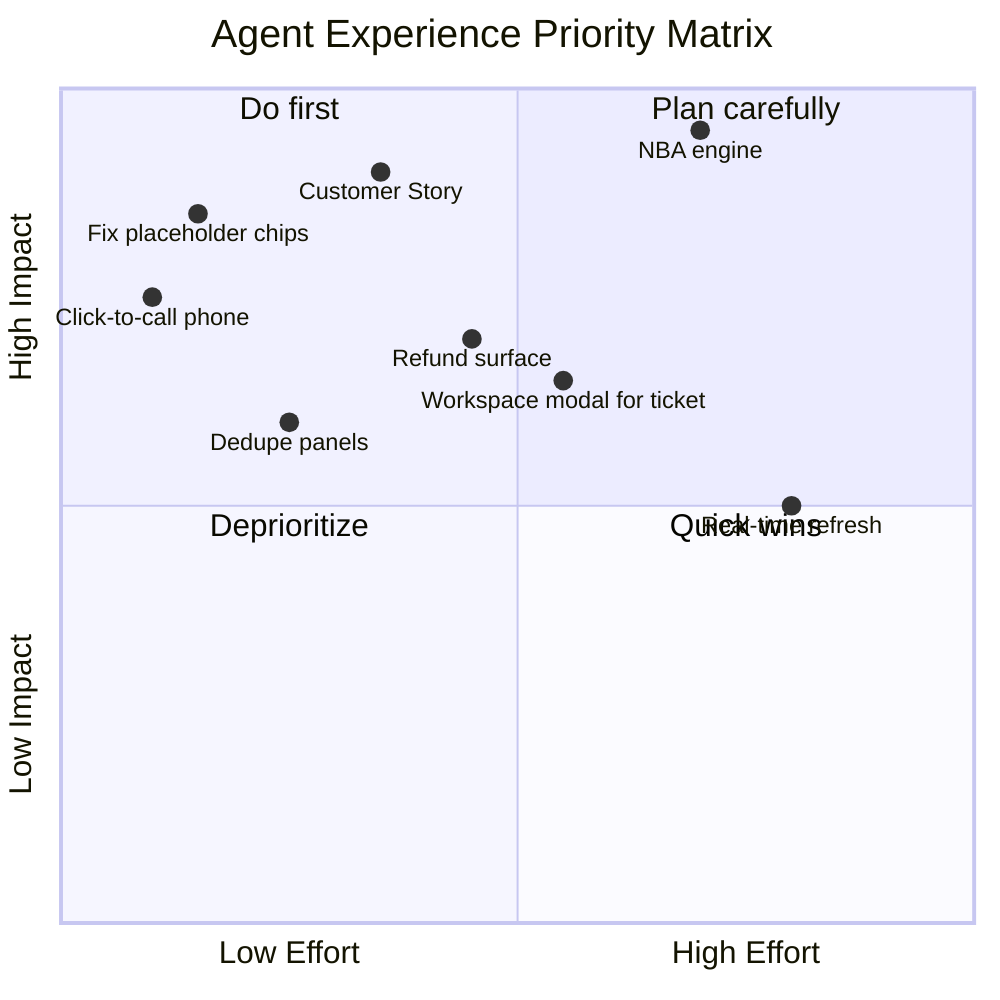
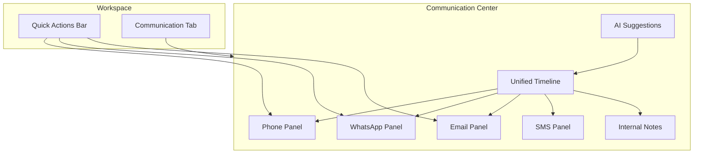
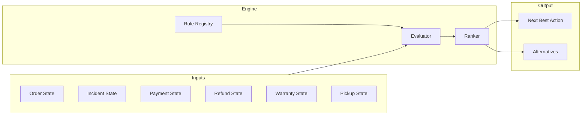
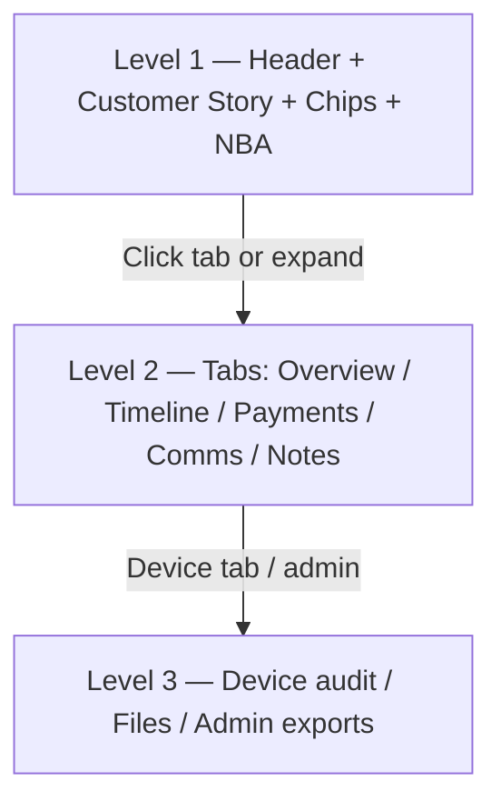
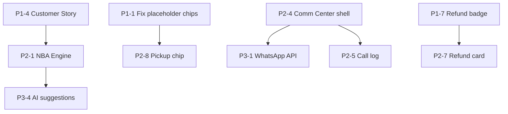

# Order Workspace Blueprint — Phase 5.2

**Status:** Design blueprint (documentation only — no production changes in this phase)  
**Audience:** Product, UX, engineering, operations  
**Last updated:** 2026-06-28

**Related:** [Customer Journeys](./customer-journeys.md) · [Product Foundations](./product-foundations.md) · [Workspace Architecture](./workspace-architecture.md)

---

## Table of Contents

1. [Current Layout](#current-layout)
2. [Component Review](#component-review)
3. [Agent Experience Audit](#agent-experience-audit)
4. [Communication Center (Future)](#communication-center-future)
5. [Customer Story Component](#customer-story-component)
6. [Next Best Action Framework](#next-best-action-framework)
7. [Information Hierarchy](#information-hierarchy)
8. [UX Improvement Backlog](#ux-improvement-backlog)
9. [Target Layout Mockup](#target-layout-mockup)

---

## Current Layout

The Order Workspace uses a **three-column layout**:

```
┌─────────────────────────────────────────────────────────────────────────────┐
│  LEFT PANEL (17.5rem)  │  CENTER PANEL (flex)          │  AGENT ASSISTANT   │
│  ─────────────────     │  ─────────────────────        │  (20rem)           │
│  Customer card         │  Breadcrumb + Order ID          │  Customer asking   │
│  Device card           │  Status chips                   │  Suggested response│
│  Repair Status card    │  Header meta (8 fields)         │  Next action       │
│  Timeline (3 items)    │  Quick actions bar              │  Quick info        │
│  Recent Comms (stub)   │  Active case banner             │  AI placeholder    │
│                        │  Tabs: Overview | Timeline |    │                    │
│                        │        Payments | Device |      │                    │
│                        │        Communication | Files |  │                    │
│                        │        Notes                    │                    │
└─────────────────────────────────────────────────────────────────────────────┘
```

**Entry point:** `GET /orders/{order}` → `orders.show` → three partials: `left-panel`, `center-panel`, `agent-assistant`.

**Client behavior:** Tab switching via `order-workspace.js`; no lazy-load fetch yet (all tab HTML rendered server-side).

---

## Component Review

For each component: **Purpose**, **Priority** (P1 = critical for daily ops, P2 = important, P3 = nice-to-have), and disposition recommendations.

### Layout Shell

| Component | File | Purpose | Priority | Remain? | Move? | Remove? | Collapse? | Tab? | Card? |
|-----------|------|---------|----------|---------|-------|---------|-----------|------|-------|
| Three-column layout | `show.blade.php` | Single-screen ops hub | P1 | Yes | — | — | — | — | — |
| Left panel | `left-panel.blade.php` | At-a-glance context | P1 | Yes | Merge into Customer Story | — | On mobile | — | — |
| Center panel | `center-panel.blade.php` | Primary work area | P1 | Yes | — | — | — | — | — |
| Agent assistant | `agent-assistant.blade.php` | NBA + AI surface | P2 | Yes | — | — | Collapsible on narrow screens | — | — |

### Header Zone

| Component | File | Purpose | Priority | Remain? | Move? | Remove? | Collapse? | Tab? | Card? |
|-----------|------|---------|----------|---------|-------|---------|-----------|------|-------|
| Breadcrumb | `center-panel` | Navigation context | P3 | Yes | — | — | Hide on mobile | — | — |
| Order ID (H1) | `center-panel` | Primary identifier | P1 | Yes | — | — | — | — | — |
| Status chips | `status-chips.blade.php` | Level 1 state signals | P1 | Yes | — | — | Wrap on mobile | — | — |
| Header meta (8 fields) | `center-panel` | Repair ID, customer, owner, engineer, dates, SLA, priority | P1 | Yes | Dedupe: drop customer (in left panel) | — | Collapse to "Details" on mobile | — | — |
| Transaction locked alert | `center-panel` | Activation complete notice | P1 | Yes | — | — | — | — | — |
| Active service case banner | `active-service-case-banner` | Warn + link to open case | P1 | Yes | — | — | — | — | — |

**Status chips notes:**

- `Warranty Active` and `Pickup Pending` are **hardcoded placeholders** — must connect to real data or show "Unknown."
- Payment chip conflates gateway payment with transaction/activation lock — split into two chips (see backlog).

### Quick Actions

| Component | File | Purpose | Priority | Remain? | Move? | Remove? | Collapse? | Tab? | Card? |
|-----------|------|---------|----------|---------|-------|---------|-----------|------|-------|
| Call / WhatsApp / Email | `quick-actions.blade.php` | Outbound comms | P1 | Yes (disabled OK) | — | — | — | — | — |
| Create Ticket | `quick-actions.blade.php` | New service case | P1 | Yes | — | — | — | — | — |
| Invoice | `quick-actions.blade.php` | Send/generate invoice | P2 | Yes (placeholder) | — | — | — | — | — |
| More (Edit, Delete) | `quick-actions.blade.php` | Admin actions | P3 | Yes | Move Edit to More only | Consider removing Delete from workspace | — | — | — |

**Recommendation:** Promote **Next Best Action** as the first quick action (primary CTA) when NBA engine is live.

### Left Panel Cards

| Component | File | Purpose | Priority | Remain? | Move? | Remove? | Collapse? | Tab? | Card? |
|-----------|------|---------|----------|---------|-------|---------|-----------|------|-------|
| Customer info card | `left-panel` | Name, phone, email | P1 | Merge | → Customer Story (top of left) | — | — | — | Yes |
| Device info card | `left-panel` | Model, serial | P1 | Merge | → Customer Story | — | — | — | Yes |
| Repair status card | `left-panel` | Active repair summary | P1 | Yes | Also keep in header meta | — | — | — | Yes |
| Timeline (3 items) | `left-panel` | Recent activity preview | P2 | Yes | — | Remove when Customer Story includes "last event" | — | Link to Timeline tab | Yes |
| Recent Communications | `left-panel` | Comm preview | P2 | Yes | → Communication Center | Remove duplicate stub | — | Communication tab | Yes |

**Recommendation:** Replace five left cards with **Customer Story** + **compact repair strip** + **last communication snippet**.

### Tabs & Tab Content

| Tab | File | Purpose | Priority | Remain? | Move? | Remove? | Collapse? | Tab? | Card? |
|-----|------|---------|----------|---------|-------|---------|-----------|------|-------|
| Overview | `tabs/overview.blade.php` | Summary dashboard | P1 | Yes | — | — | — | Yes (default) | — |
| Timeline | `tabs/timeline.blade.php` | Full activity history | P1 | Yes | — | — | — | Yes | — |
| Payments | `tabs/payments.blade.php` | Payment + transaction | P1 | Yes | — | — | — | Yes | — |
| Device | `tabs/device.blade.php` | Serial audit trail | P2 | Yes | Merge audit fields into Level 3 drawer | — | — | Yes | — |
| Communication | `tabs/communication.blade.php` | Comm history | P1 | Yes | Expand to Communication Center | — | — | Yes | — |
| Files | `tabs/files.blade.php` | Attachments | P3 | Yes (placeholder) | — | — | — | Yes | — |
| Notes | `tabs/notes.blade.php` | Internal remarks | P1 | Yes | — | — | — | Yes | — |

### Overview Tab Sub-components

| Component | File | Purpose | Priority | Remain? | Move? | Remove? | Collapse? | Tab? | Card? |
|-----------|------|---------|----------|---------|-------|---------|-----------|------|-------|
| Summary cards (SLA, Priority, Payment, Warranty) | `summary-cards.blade.php` | KPI strip | P1 | Yes | Move SLA/Priority to header meta only | Remove duplicate warranty | — | — | Yes |
| Customer / Device / Order / Repair cards | `overview` | Detailed fields | P2 | Partial | Dedupe with left panel | Remove duplicates | Collapse less-used cards | — | Yes |
| Service cases list | `service-cases-list` | Historical cases | P1 | Yes | — | — | — | Own tab? (if list grows) | — |
| Recent Timeline (5 items) | `overview` | Activity preview | P2 | Yes | — | Remove if left panel preview kept | — | — | Card |
| Recent Communication stub | `overview` | Comm preview | P2 | Yes | → Communication tab only | Remove duplicate | — | — | Card |

### Agent Assistant

| Component | File | Purpose | Priority | Remain? | Move? | Remove? | Collapse? | Tab? | Card? |
|-----------|------|---------|----------|---------|-------|---------|-----------|------|-------|
| Customer Asking About | `agent-assistant` | Intent detection (future AI) | P2 | Yes | — | — | — | — | — |
| Suggested Response | `agent-assistant` | Reply template | P2 | Yes | — | — | — | — | — |
| Next Recommended Action | `agent-assistant` | NBA display | P1 | Yes | Promote visually | — | — | — | — |
| Quick Info | `agent-assistant` | Supplementary counts | P2 | Yes | Merge into Customer Story | — | — | — | — |
| AI widgets placeholder | `agent-assistant` | Future AI | P3 | Yes | — | — | — | — | — |

### Shared Primitives

| Component | File | Purpose | Priority | Remain? | Notes |
|-----------|------|---------|----------|---------|-------|
| Info card | `info-card.blade.php` | Reusable card shell | P1 | Yes | Use for Customer Story sections |
| Timeline renderer | `timeline.blade.php` | Activity entries | P1 | Yes | Add comm/refund/pickup icon types |
| Tab JS | `order-workspace.js` | Tab activation | P1 | Yes | Add URL hash sync (`#payments`) |

---

## Agent Experience Audit

Evaluated against the five operational principles from the phase brief.

### 1. Can a new agent understand it?

| Finding | Severity | Detail |
|---------|----------|--------|
| Layout is intuitive | Good | Three columns map to Context / Work / Guidance |
| Too much duplication | Medium | Customer, device, repair appear in left panel, header, and Overview |
| Placeholder chips mislead | High | "Warranty Active" and "Pickup Pending" always show — new agents will give wrong answers |
| Tab overload | Medium | Seven tabs without guidance on which to use first |
| Service case vs order | Medium | Banner helps, but relationship not explained inline |

**Verdict:** Structure is learnable in ~15 minutes, but **placeholder data erodes trust**. New agents need a one-line legend under status chips explaining what each chip means.

### 2. Can they answer in under 10 seconds?

| Question type | Current time | Blocker |
|---------------|-------------|---------|
| Who is the customer? | ~2s | Left panel or header |
| What's the repair status? | ~3s | Left panel repair card |
| Is payment received? | ~5s | Chip + Payments tab if ambiguous |
| Warranty status? | **Unreliable** | Hardcoded chip |
| When was last contact? | **>10s** | Empty comm stubs — must say "unknown" |
| Any open refunds? | **>30s** | Not on workspace — separate module |

**Verdict:** ~60% of common questions meet the 10-second target. Warranty, communications, and refunds fail.

### 3. Are there unnecessary clicks?

| Action | Clicks today | Ideal |
|--------|-------------|-------|
| View full timeline | 1 (tab) | 0 for last event; 1 for full |
| Add remark | 1 (Notes tab) + form | 1 (inline or workspace modal) |
| Open active service case | 1 (banner button) | 0 if inline status sufficient; 1 to deep-link |
| Create ticket | 1 (navigates away) | 1 (modal from workspace — future) |
| Edit order | 2 (More → Edit) | 2 (acceptable) |
| Log a call | N/A | 1 (future) |

**Verdict:** Tab switching for notes and payments is acceptable. **Create Ticket leaving workspace** is the biggest workflow break.

### 4. Is information duplicated?

| Data | Locations | Recommendation |
|------|-----------|----------------|
| Customer name/phone/email | Left panel, header meta, Overview | Keep in Customer Story only + phone in header for click-to-call |
| Device model/serial | Left panel, Overview, Device tab | Level 1: model + serial; Level 2: Device tab for audit |
| Repair status | Left panel, header, Overview, banner | Consolidate to repair strip + banner |
| SLA / Priority | Header meta + summary cards | Header only |
| Timeline | Left (3), Overview (5), Timeline tab | Left: last 1 event; tab: full |
| Payment status | Chip, summary card, Payments tab, alert | Chip + Payments tab; remove summary card duplicate |

**Verdict:** Significant duplication increases scan time and risk of inconsistent display.

### 5. Are important actions visible?

| Action | Visible? | Notes |
|--------|----------|-------|
| Create Ticket | Yes | Primary styled button |
| Contact customer | Disabled stubs | Should show phone click-to-call at minimum |
| Assign Transaction ID | Payments tab | Should be NBA when payment pending |
| Add remark | Hidden in Notes tab | Should be quick action |
| Approve refund | Not on workspace | Missing |
| Open service case | Banner | Good |

**Verdict:** Ticket creation is prominent; **remark, payment, and refund actions are under-exposed**.

### 6. Does the screen guide the next action?

| Mechanism | State |
|-----------|-------|
| Active case banner | Works — clear CTA |
| Agent Assistant NBA | Static placeholder text |
| Status chips | Inform but don't direct |
| Dashboard-style queue | Not on workspace |

**Verdict:** **Does not yet guide** — NBA and contextual CTAs are the highest-impact improvement.

### Audit Summary



### Top Recommendations (from audit)

1. **Remove or label placeholder data** — Never show fake warranty/pickup state.
2. **Introduce Customer Story** at top of left panel — single scan for call handling.
3. **Wire NBA to order state** — Replace static Agent Assistant text.
4. **Make phone number clickable** — `tel:` link in header (zero integration cost).
5. **Surface refunds on workspace** — Pending refund badge + timeline link.
6. **Integrate workspace modal actions** — Remark and create ticket without page leave (reuse existing workspace architecture with `order` context).
7. **Deduplicate** — One canonical location per data point per hierarchy level.

---

## Communication Center (Future)

Design for a unified Communication Center within the **Communication** tab and quick actions. No integrations in Phase 5.2 — structure and placeholders only.

### Architecture



### Channel Panels (Placeholders)

Each channel panel shares a common structure:

| Section | Content |
|---------|---------|
| **Header** | Channel icon, customer identifier, preferred-channel badge |
| **Composer** | Message template selector, free text, send button (disabled until integrated) |
| **History** | Last 5 interactions inline; "View all" expands unified timeline |
| **Actions** | Log call, send template, schedule follow-up |

#### Phone

- Click-to-call from Customer Story phone field
- Manual call log: duration, direction (inbound/outbound), outcome (resolved, callback, no answer), notes
- Future: CTI integration, auto-pop on inbound match

#### WhatsApp

- Thread view placeholder
- Template messages: payment confirmation, repair status, pickup reminder, invoice link
- Future: WhatsApp Business API via unified provider

#### Email

- Thread view placeholder
- Templates: payment receipt, invoice, warranty info
- Future: IMAP/SMTP or transactional email service

#### SMS

- Short template messages only (160 char preview)
- Future: SMS gateway (DLT-compliant templates)

#### Internal Notes

- Distinct from customer-facing remarks
- Visible only to agents; styled differently in unified timeline
- Reuse existing remarks infrastructure with visibility flag (future schema)

### Unified Communication Timeline

Single chronological feed merging all channels:

```
┌──────────────────────────────────────────────────────────┐
│  Communication Timeline                    [Filter ▼]    │
├──────────────────────────────────────────────────────────┤
│  ● WhatsApp — Outbound — 2h ago — Agent Priya           │
│    "Your repair is in progress..."                       │
│  ● Call — Inbound — 5h ago — Agent Rahul — 3m 42s       │
│    Outcome: Resolved · Notes: Confirmed pickup Friday    │
│  ● Internal Note — 1d ago — Agent Admin                  │
│    Customer prefers Hindi; call after 2pm                  │
│  ● Email — Outbound — 2d ago — System                    │
│    Payment receipt attached                                │
└──────────────────────────────────────────────────────────┘
```

**Filters:** All | Phone | WhatsApp | Email | SMS | Internal

**Timeline integration:** Customer-facing comms also appear on order Activity Timeline as summary entries; full thread stays in Communication Center.

### AI Suggestions (Future)

Placeholder panel below composer:

| Suggestion type | Example |
|-----------------|---------|
| Reply draft | Based on last customer message + order state |
| Tone adjustment | Formal ↔ conversational |
| Language | Hindi / English based on Customer Story preference |
| Next action | "Customer asked about pickup — schedule now?" |

**Guardrails:** AI never sends automatically; agent must review and click Send.

### Communication Tab Layout (Target)

```
┌─────────────────────────────────────────────────────────┐
│  [Phone] [WhatsApp] [Email] [SMS] [Internal]  ← sub-nav │
├────────────────────────────┬────────────────────────────┤
│  Active channel composer   │  AI Suggestions (future)   │
│  + templates               │  ┌────────────────────────┐│
│                            │  │ Suggested reply...     ││
├────────────────────────────┤  │ [Use template]         ││
│  Unified Communication     │  └────────────────────────┘│
│  Timeline (scroll)         │                            │
└────────────────────────────┴────────────────────────────┘
```

---

## Customer Story Component

A reusable, concise summary at the **top of the left panel** (and optionally collapsed into header on mobile). Generated from existing data — no new integrations required for v1.

### Visual Design

```
┌─────────────────────────────────────────┐
│  CUSTOMER STORY                    [···] │
├─────────────────────────────────────────┤
│  Rajesh Kumar · +91 98765 43210         │
│  iPhone 14 Pro · SN: ABC123XYZ          │
├─────────────────────────────────────────┤
│  • Customer since Mar 2023              │
│  • Warranty active until Dec 2026       │
│  • 2 previous repairs (last: Jan 2026)  │
│  • Prefers WhatsApp · Hindi             │
│  • Waiting for pickup — Fri 10am        │
└─────────────────────────────────────────┘
```

### Data Sources (v1 — existing fields)

| Story line | Source | Fallback |
|------------|--------|----------|
| Customer since {date} | `order.created_at` or earliest incident | "New customer" |
| Warranty {status} | **Placeholder → future product rules** | "Warranty unknown" |
| {n} previous repairs | `order.incidents_count - 1` or closed incidents | "No prior repairs" |
| Last repair {date} | Latest closed incident `updated_at` | Omit line |
| Prefers {channel} | **Future:** customer preference field | Omit until captured |
| Language | **Future:** preference field | Omit until captured |
| Waiting for {state} | Derived from NBA / status chips | Omit if none |

### Generation Rules

1. **Maximum 6 bullet lines** — truncate lowest priority first.
2. **Priority order:** current wait state → warranty → repair history → preferences → tenure.
3. **Never fabricate** — if data is missing, omit the line or show "Unknown" (never hardcode "Active").
4. **Refresh triggers:** page load; future: Reverb on order/incident update.

### Blade Structure (Design — not implemented)

```
orders/workspace/partials/customer-story.blade.php
  ├── Header: customer name + click-to-call phone
  ├── Subheader: device model + serial (monospace)
  └── Bullet list: @foreach($storyLines as $line)
```

### Service Class (Design — not implemented)

```
App\Services\CustomerStoryService::forOrder(Order $order): CustomerStory
  → lines: array<{ icon, text, priority, level }>
  → preferredChannel: ?string
  → preferredLanguage: ?string
```

### Where It Appears

| Surface | Variant |
|---------|---------|
| Left panel | Full Customer Story |
| Header (mobile) | Name + primary chip only |
| Agent Assistant | Feed top 3 lines into "Quick Info" |
| Communication Center | Preferred channel badge |

---

## Next Best Action Framework

Rule-based, configurable recommendation engine. **Design only** — no implementation in Phase 5.2.

### Design Goals

| Goal | Approach |
|------|----------|
| Configurable | Rules in config/DB, not hardcoded Blade |
| Explainable | Each recommendation includes reason text |
| Non-blocking | Agent can ignore; no auto-execution |
| Context-aware | Inputs: order state, incident state, payment, refunds, comms |
| Extensible | New rules added without UI changes |

### Architecture



### Rule Definition Schema

```yaml
# config/next_best_action.php (proposed)
rules:
  - id: share_payment_link
    priority: 100
    condition:
      all:
        - order.payment_received: false
        - order.transaction_locked: false
        - incident.status: awaiting_product_details
    action:
      label: Share Payment Link
      description: Customer has not completed payment. Send payment link via WhatsApp.
      icon: bi-credit-card
      channel: whatsapp
      template: payment_link
      workspace_action: open_communication_composer

  - id: send_invoice
    priority: 90
    condition:
      all:
        - incident.status: resolved
        - invoice.ready: true
        - invoice.sent: false
    action:
      label: Send Invoice
      description: Repair complete. Invoice is ready but not yet sent.
      icon: bi-receipt
      channel: email
      template: invoice_ready

  - id: pickup_reminder
    priority: 85
    condition:
      all:
        - pickup.scheduled: true
        - pickup.completed: false
        - pickup.scheduled_at: "< 24h from now"
    action:
      label: Send Pickup Reminder
      description: Pickup scheduled within 24 hours. Confirm with customer.
      icon: bi-truck
      channel: whatsapp
      template: pickup_reminder

  - id: offer_amc
    priority: 70
    condition:
      all:
        - warranty.status: expired
        - incident.status: open
    action:
      label: Offer AMC Plan
      description: Warranty expired. Customer may benefit from annual maintenance.
      icon: bi-shield-plus
      channel: phone

  - id: collect_device_details
    priority: 95
    condition:
      all:
        - incident.source: cashfree
        - incident.status: awaiting_product_details
    action:
      label: Collect Device Details
      description: Payment received. Serial number and product details still missing.
      icon: bi-phone
      workspace_action: edit_order

  - id: assign_transaction_id
    priority: 80
    condition:
      all:
        - order.transaction_locked: false
        - incident.status: resolved
        - order.serial_number: present
    action:
      label: Assign Transaction ID
      description: Repair resolved and serial captured. Complete activation.
      icon: bi-key
      workspace_action: open_payments_tab
```

### Condition Operators

| Operator | Example |
|----------|---------|
| `equals` | `incident.status: open` |
| `not_equals` | `refund.status: not pending` |
| `present` / `blank` | `order.serial_number: present` |
| `gt` / `lt` | `pickup.scheduled_at: "< 24h"` |
| `all` / `any` | Composite conditions |

### Output Contract

```json
{
  "primary": {
    "rule_id": "collect_device_details",
    "label": "Collect Device Details",
    "description": "Payment received. Serial number and product details still missing.",
    "icon": "bi-phone",
    "action_type": "workspace_action",
    "action_payload": { "tab": "overview", "focus": "serial_number" }
  },
  "alternatives": [
    { "rule_id": "share_payment_link", "label": "Share Payment Link", "..." : "..." }
  ],
  "evaluated_at": "2026-06-28T10:00:00+05:30"
}
```

### Display Surfaces

| Surface | Behavior |
|---------|----------|
| Agent Assistant — Next Recommended Action | Primary action + reason |
| Quick Actions bar | Primary action as highlighted first button |
| Dashboard row | Icon badge when NBA is urgent (priority ≥ 90) |
| Communication composer | Pre-select channel + template from rule |

### Example Rules by Order State

| Order state | Primary NBA | Alternative |
|-------------|-------------|-------------|
| Payment pending | Share Payment Link | Call customer |
| Payment received, no serial | Collect Device Details | Send confirmation WhatsApp |
| Repair in progress | — (monitor) | Log check-in call if SLA at risk |
| Repair complete | Send Invoice | Schedule pickup |
| Waiting for pickup | Send Reminder | Confirm slot |
| Warranty expired + new issue | Offer AMC | Create paid repair quote |
| Refund pending approval | Review Refund (approver) | Notify customer of delay |

### Configuration Governance

- Rules owned by **operations admin** (future UI) or `config/next_best_action.php` (v1).
- Each rule has: `id`, `priority`, `enabled`, `roles[]` (who sees it), `condition`, `action`.
- Rule changes are audit-logged.
- Unit tests: given fixture order state → expected NBA.

---

## Information Hierarchy

All workspace information classified into three levels. The interface **shows Level 1 always**, Level 2 on one click, Level 3 on deliberate navigation.

### Level 1 — Always Visible (Critical)

Needed during almost every call. No tab switch, no scroll on 1440×900 viewport.

| Information | Current location | Target location |
|-------------|------------------|-----------------|
| Order ID | Header H1 | Header H1 |
| Customer name | Left panel, header, Overview | Customer Story header |
| Customer phone (click-to-call) | Left panel | Customer Story header |
| Current repair status | Left panel, banner | Status chips + repair strip |
| Repair reference | Header meta | Repair strip |
| Assigned engineer | Left panel, header | Repair strip |
| Payment / activation status | Status chips, alert | Status chips (split payment vs activation) |
| Priority / SLA risk | Header meta, summary cards | Status chips (SLA at-risk chip) |
| Next best action | Agent Assistant (static) | Agent Assistant + quick actions CTA |
| Active service case alert | Banner | Banner (keep) |

### Level 2 — One Click Away (Frequent)

Referenced often but not on every call. One tab switch or expand.

| Information | Access |
|-------------|--------|
| Full activity timeline | Timeline tab |
| Payment details (amount, method, gateway refs) | Payments tab |
| Transaction ID assignment form | Payments tab |
| Service case history (all cases) | Overview (scroll) or dedicated tab if list grows |
| Internal notes / remarks | Notes tab |
| Communication history | Communication tab |
| Device model + product name | Customer Story subheader |
| Customer email | Customer Story or Overview card |
| Refund status (pending/approved) | Overview card (future) or Payments tab |
| Warranty detail (expiry, coverage) | Customer Story bullet or Overview warranty card |
| Last communication snippet | Left panel or Communication tab preview |
| Issue summary | Overview repair card |
| Create ticket / add remark | Quick actions |

### Level 3 — Advanced (Technical / Audit)

Rarely needed on calls. Audit, compliance, deep technical.

| Information | Access |
|-------------|--------|
| Serial number entry audit (who/when) | Device tab |
| Device model assignment audit | Device tab |
| Transaction assigner + timestamp | Payments tab |
| Bank reference / gateway IDs | Payments tab |
| Correction history on order | Timeline tab (correction entries) |
| Full audit log export | Future admin action |
| File attachments | Files tab |
| Cashfree webhook linkage | Admin / Payments (future) |
| Assignment event history | Service case detail (linked) |
| Soft-deleted refunds | Admin only |

### Progressive Disclosure Pattern



### De-duplication Map

After hierarchy enforcement, each fact has **one home per level**:

| Fact | Level 1 home | Level 2 home | Level 3 home |
|------|-------------|-------------|-------------|
| Customer phone | Customer Story | — | — |
| Serial number | Customer Story (display) | Device tab | Entry audit |
| Payment amount | — | Payments tab | Gateway refs |
| SLA | Chip (at-risk only) | Overview summary | — |
| Timeline | Last event in left panel | Timeline tab | — |

---

## UX Improvement Backlog

Prioritized items for post-blueprint implementation. Effort: **S** (≤1 day), **M** (2–5 days), **L** (1–2 weeks), **XL** (2+ weeks).

### Priority 1 — Quick Wins (Highest Agent Impact)

| # | Item | Expected benefit | Effort | Business impact |
|---|------|------------------|--------|-----------------|
| P1-1 | Remove hardcoded warranty/pickup chips; show real state or "Unknown" | Prevents wrong customer answers | S | High — trust |
| P1-2 | Add `tel:` click-to-call on phone fields | Saves 5–10s per call | S | High |
| P1-3 | Split payment chip: "Payment Received" vs "Activation Complete" | Clarifies Cashfree vs Transaction ID | S | High |
| P1-4 | Customer Story v1 from existing data | Single-glance context for calls | M | High |
| P1-5 | Show last timeline event in left panel (1 item, not 3) | Faster status without tab switch | S | Medium |
| P1-6 | URL hash tab sync (`#payments`) | Shareable deep links | S | Medium |
| P1-7 | Surface pending refund count/badge on workspace | Stops module hopping | M | High |
| P1-8 | Dedupe: remove customer from header meta | Reduces visual noise | S | Medium |
| P1-9 | Promote phone/email to Customer Story; trim left panel cards | Cleaner left column | M | Medium |

### Priority 2 — Workflow Improvements

| # | Item | Expected benefit | Effort | Business impact |
|---|------|------------------|--------|-----------------|
| P2-1 | NBA rule engine v1 (config-driven) | Guides next action on every order | L | Very high |
| P2-2 | Workspace modal: add remark (reuse workspace architecture, `order` context) | No page leave for notes | M | High |
| P2-3 | Workspace modal: create service case | Stay on order after ticket create | M | High |
| P2-4 | Communication Center shell (tab layout + placeholders) | Ready for channel integrations | M | High |
| P2-5 | Manual call log form (no CTI) | Communication history starts | M | Medium |
| P2-6 | Real-time workspace refresh via Reverb | Status updates without reload | L | Medium |
| P2-7 | Refund summary card on Overview | Full financial picture on workspace | M | High |
| P2-8 | Pickup status chip driven by real state | Accurate pickup journey | M | Medium |
| P2-9 | Message templates (static, copy-to-clipboard) | Faster responses before WhatsApp API | S | Medium |
| P2-10 | Mobile-responsive collapse: left panel → drawer | Field agents on tablet | M | Medium |

### Priority 3 — Future Enhancements

| # | Item | Expected benefit | Effort | Business impact |
|---|------|------------------|--------|-----------------|
| P3-1 | WhatsApp Business API integration | Automated outbound messages | XL | Very high |
| P3-2 | Email thread integration | Unified comm history | XL | High |
| P3-3 | CTI / phone system integration | Auto-pop on inbound, auto log | XL | High |
| P3-4 | AI reply suggestions (LLM) | Faster, consistent responses | XL | Medium |
| P3-5 | RadiumBox QC + invoice integration | Journey 4 automation | XL | Very high |
| P3-6 | Warranty rules engine (product catalog) | Journey 6 accuracy | L | High |
| P3-7 | Pickup scheduler + reminders | Journey 7 automation | L | Medium |
| P3-8 | File uploads on workspace | Photo evidence, invoices | M | Medium |
| P3-9 | Customer preference store (channel, language) | Personalized comms | M | Medium |
| P3-10 | NBA admin UI for rule management | Ops self-service | L | Medium |
| P3-11 | Order workspace KPI strip on dashboard | Link queue → workspace | M | Medium |
| P3-12 | SMS gateway (DLT templates) | Reach non-smartphone users | L | Medium |

### Backlog Dependency Graph



---

## Target Layout Mockup

Proposed layout after Priority 1 items (ASCII wireframe):

```
┌──────────────────────────────────────────────────────────────────────────────┐
│ LEFT                          │ CENTER                          │ ASSISTANT │
├───────────────────────────────┼─────────────────────────────────┼───────────┤
│ ┌ Customer Story ───────────┐ │ Order ID          [chips...]    │ ▶ NBA     │
│ │ Rajesh · 📞 98765...      │ │ Repair · Engineer · SLA         │ Collect   │
│ │ iPhone 14 · SN: ABC...    │ │ [Call][WA][Email][Ticket][···]  │ device    │
│ │ • Since 2023 · 2 repairs  │ │ ⚠ Active case banner            │ details   │
│ │ • Warranty until Dec 2026 │ ├─────────────────────────────────┤           │
│ └───────────────────────────┘ │ [Overview|Timeline|Pay|Comms|…] │ Suggested │
│ Last event: Payment received  │ │                                 │ response  │
│ 2h ago                        │ │  (tab content)                  │           │
└───────────────────────────────┴─────────────────────────────────┴───────────┘
```

**Interactive mockup:** Open `/previews/order-workspace-blueprint.html` in a browser for a static visual reference (no backend).

---

## Integration Readiness Checklist

When subsequent phases deliver integrations, they should plug into these designed slots:

| Integration | Slot | Document section |
|-------------|------|------------------|
| RadiumBox (QC, invoice, dispatch) | Overview cards, NBA rules, Timeline | Customer Journeys 3–4 |
| WhatsApp / Email / SMS | Communication Center panels | Communication Center |
| Cashfree (read-only display) | Payments tab, timeline | Customer Journey 1 |
| AI assistant | Agent Assistant + Comm Center | NBA Framework, Communication Center |
| Reporting | Level 3 exports; not on workspace | Information Hierarchy |
| Customer preferences | Customer Story bullets | Customer Story Component |

**No breaking changes in Phase 5.2.** This blueprint is the contract for future work.

---

## Document maintenance

| Change | Action |
|--------|--------|
| Component added/removed in workspace | Update Component Review table |
| New journey | Add to `customer-journeys.md` and Journey ↔ Surface matrix |
| NBA rule shipped | Move from framework examples to "implemented rules" appendix |
| Backlog item completed | Mark done; note actual effort |
