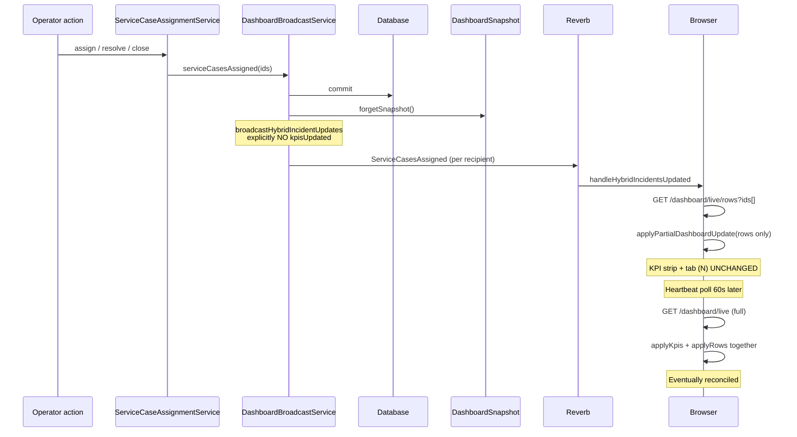
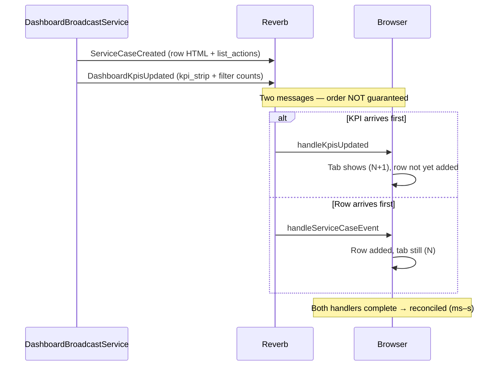
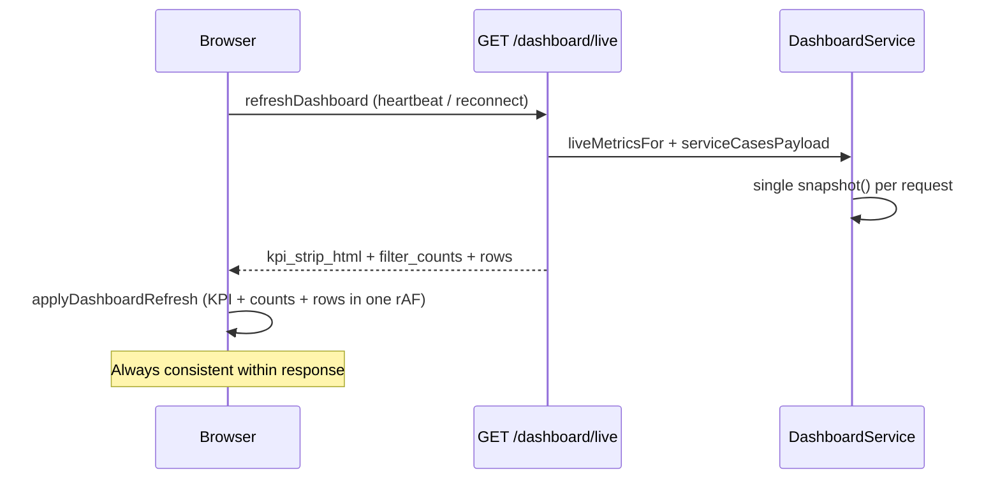

# P0-1 Investigation — KPI Strip vs Row List Divergence

**Type:** Correctness investigation (no fix implemented)  
**Date:** 2026-07-25  
**Status:** Root cause proven with code + test evidence

---

## 1. Root cause (proven)

**Primary cause: KPI counts and row list are updated through intentionally separate Reverb transports and browser code paths. They are not applied atomically.**

This is **not** a stale `CaseQueueReadModel`, **not** a cache TTL mismatch, and **not** introduced by H4. H4 only changed *which delegate* computes summary counts inside the same `DashboardSnapshot` request — definitions and transport remain unchanged.

### Proven mechanisms (ranked by impact)

| # | Mechanism | KPI / tab counts update? | Row list update? | Max divergence window |
|---|---|---|---|---|
| **A** | Hybrid Reverb events (`ServiceCasesAssigned`, `Resolved`, `Closed`, `ReferenceNumbersUpdated`) | **No** (by design) | Yes (via `/dashboard/live/rows`) | Until heartbeat poll: **60s** (up to **300s** idle) |
| **B** | `serviceCaseRemarked` broadcast | **No** | Yes (row HTML event) | Same as A |
| **C** | Create / queue-membership / SLA: **two separate** Reverb events (`ServiceCaseCreated`/`SlaStatusChanged` row + `DashboardKpisUpdated`) | Yes (event 2) | Yes (event 1) | **Milliseconds–seconds** (WS ordering + async handlers) |
| **D** | `list_actions: ignore` for **active queue tab** | May still update (KPI event) | **Skipped** | Until user changes tab or poll |
| **E** | Workspace session / search / quick-filter suppression | Queued or dropped | Queued or dropped | Until session ends + flush |
| **F** | `refreshInFlight` drops concurrent HTTP poll | N/A | N/A | Until next poll (20–60s) |

### Ruled out (with evidence)

| Hypothesis | Verdict | Evidence |
|---|---|---|
| Stale `CaseQueueReadModel` | **No** | Pure delegate; no cache; passes same `$snapshot` instance |
| H4 changed KPI definitions vs rows | **No** | `DashboardReverbMetricsConsistencyTest`, `CaseQueueOperatorConsumerMigrationTest` |
| Server-side snapshot vs read model mismatch in one broadcast | **No** | `liveReverbMetricsFor()` and row payload both call `forgetSnapshot()` then rebuild from same `DashboardSnapshot` owner in separate broadcasts — client applies at different times |
| Redis/app cache on queue counts | **No** | Counts are request-scoped `DashboardSnapshotStore` only |
| Polling uses different formulas than Reverb | **No** | Poll uses `liveMetricsFor()` → same `statsFor()` + `serviceCaseFilterCounts()` as Reverb path |

---

## 2. Timeline diagram

### Path A — Hybrid assignment (most common long divergence)

### Path B — Case created (short transient divergence)

### Path C — Full HTTP poll (atomic reconcile)

---

## 3. Exact files involved

### Server — broadcast decision

| File | Role |
|---|---|
| `app/Services/DashboardBroadcastService.php` | **Orchestrates which events fire**; hybrid paths document "no KPI refresh" (lines 234–235, 347–348) |
| `app/Services/Dashboard/DashboardLiveRowVisibilityService.php` | `list_actions` per queue tab (`add`/`update`/`remove`/`ignore`) |
| `app/Services/DashboardService.php` | `liveReverbMetricsFor()` → KPI HTML + filter count variants |
| `app/Services/Dashboard/DashboardSnapshotStore.php` | Request-scoped incident load; `forget()` between broadcasts |
| `app/ReadModels/Cases/CaseQueueReadModel.php` | H4-6E: summary counts delegate only (not row source) |
| `app/Events/Dashboard/DashboardKpisUpdated.php` | KPI + filter counts payload (no rows) |
| `app/Events/Dashboard/ServiceCasesAssigned.php` etc. | Hybrid incident IDs only (no KPI) |

### Server — broadcast triggers (KPI yes/no)

| Action | Row event | `kpisUpdated()` |
|---|---|---|
| `serviceCaseCreated` | ✅ `broadcastRowUpdate` | ✅ |
| `serviceCaseQueueMembershipChanged` | ✅ | ✅ |
| `slaStatusChanged` | ✅ | ✅ |
| `serviceCaseRemarked` | ✅ | ❌ |
| `serviceCasesAssigned` (hybrid) | ✅ hybrid fetch | ❌ **explicit** |
| `serviceCasesResolved` / `Closed` | ✅ hybrid | ❌ **explicit** |
| `transactionsAssigned` (ref #) | ✅ hybrid | ❌ **explicit** |

### Client — apply logic

| File | Role |
|---|---|
| `resources/js/live-dashboard-reverb.js` | `handleKpisUpdated` (KPI+counts only), `handleServiceCaseEvent` (rows only), `handleHybridIncidentsUpdated` (rows only) |
| `resources/js/live-dashboard.js` | `applyPartialDashboardUpdate` vs `applyDashboardRefresh` (atomic full refresh) |
| `resources/js/live-dashboard-polling.js` | Heartbeat 60s / slow 300s safety reconcile |
| `resources/js/live-dashboard-merge.js` | Row DOM merge |

### Tests proving intended behaviour

| Test | Proves |
|---|---|
| `tests/js/live-dashboard-reverb.test.js` | Hybrid + ref# update rows **without KPI changes** (lines 179–234) |
| `tests/Feature/HybridRealtimeAssignmentCloseResolveTest.php` | `DashboardKpisUpdated` **not dispatched** on assign/resolve/close |
| `tests/Feature/DashboardReverbMetricsConsistencyTest.php` | When KPI *is* sent, poll and Reverb counts **match** |
| `tests/Unit/Cases/CaseQueueOperatorConsumerMigrationTest.php` | H4 ReadModel parity with snapshot |

---

## 4. Which updates first?

| Scenario | KPI / tab `(N)` first? | Rows first? | Both together? |
|---|---|---|---|
| `GET /dashboard/live` poll | — | — | ✅ Always |
| `serviceCaseCreated` (Reverb) | Non-deterministic | Non-deterministic | ❌ Separate WS messages |
| Hybrid assign/resolve/close | **Never** (no KPI event) | ✅ Always | ❌ |
| `serviceCaseRemarked` | **Never** | ✅ Always | ❌ |
| `DashboardKpisUpdated` only | ✅ | — | — |

---

## 5. Eventual reconciliation?

| Mechanism | Reconciles? | Typical delay |
|---|---|---|
| Second Reverb event (create path) | ✅ | Sub-second |
| Heartbeat poll (`/dashboard/live`) | ✅ | **60s** connected; **300s** idle |
| Fast fallback poll (WS down) | ✅ | **20s** active interval |
| Reconnect full refresh | ✅ | On WS connect |
| Workspace flush on release | ✅ | When modal closes |
| **None** (hybrid + user idle on wrong tab) | Partial | Tab `(N)` wrong until poll even if rows moved |

**Polling resolves it:** Yes — full `/dashboard/live` applies KPI strip, filter counts, and rows in one `applyDashboardRefresh`.

**Refresh resolves it:** Yes — same endpoint.

---

## 6. Did H4 migration contribute?

**No.**

H4-6E changed `DashboardService` to obtain summary counts via `CaseQueueReadModel::…(snapshot: $snapshot)` instead of `$snapshot->…()` directly. Within a single request:

- Same `DashboardSnapshot` instance
- Same `OperationsQueueClassifier`
- Same formulas (enforced by parity tests)

Row list still comes from `$snapshot->incidentsForQueue()` / `serviceCasesPayload()` — unchanged.

Divergence is in **transport and apply timing**, which predates H4.

---

## 7. Did this exist before H4?

**Yes.**

Evidence:

1. Hybrid realtime design (Phase 3 docs) explicitly separates lightweight row events from KPI broadcasts.
2. `HybridRealtimeAssignmentCloseResolveTest` asserts no `DashboardKpisUpdated` on assign — **predates H4-6E**.
3. JS unit tests document "without KPI changes" for hybrid handlers — behaviour is **intentional**, not regression.
4. `DashboardReverbMetricsConsistencyTest` existed to ensure when KPIs *are* sent, they match poll — not to merge KPI+row in one event.

---

## 8. Lowest-risk fix (recommendation only — not implemented)

**Option 1 (smallest, hybrid gap):** After `handleHybridIncidentsUpdated` successfully merges rows, call a lightweight KPI reconcile — either invoke existing `handleKpisUpdated` if server adds counts to hybrid payload, or trigger `refreshDashboard` with `source: 'hybrid-reconcile'` **only when** row fetch succeeded.

**Option 2 (create path ordering):** Coalesce `ServiceCaseCreated` row + KPI into single client-side `applyPartialDashboardUpdate` by buffering KPI handler until row handler completes (or vice versa) within a short debounce window.

**Option 3 (remarked gap):** Add `kpisUpdated()` to `serviceCaseRemarked` when remark changes queue membership (if applicable).

**Recommended first fix:** **Option 1** — addresses the longest divergence window (assign/resolve/close/ref#) with smallest blast radius. Does not change `DashboardSnapshot` ownership, ReadModels, or event payloads (can use existing poll endpoint for reconcile only).

**Do not:** Merge MC/operator KPI definitions or change hybrid event payloads without explicit product approval.

---

## 9. Regression risk

| Fix option | Risk |
|---|---|
| Option 1 (post-hybrid reconcile poll) | Low — extra `/dashboard/live` after hybrid; may overlap with heartbeat; guard with debounce |
| Option 2 (client debounce) | Medium — timing bugs, double-apply |
| Option 3 (remarked + KPI broadcast) | Low–medium — more Reverb fan-out |
| Bundling KPI into hybrid events | Medium — payload/contract change; fan-out cost |

**Regression gates:** `DashboardReverbMetricsConsistencyTest`, `HybridRealtimeAssignmentCloseResolveTest`, `tests/js/live-dashboard-reverb.test.js`, `QueueIntegrityLiveRefreshTest`, `CaseQueueOperatorConsumerMigrationTest`.

---

## 10. Rollback plan

Any fix should be:

1. Feature-flagged or scoped to client reconcile only.
2. Rollback = remove reconcile call / debounce / extra `kpisUpdated` trigger.
3. No migration, schema, or ReadModel rollback required.
4. H4-6E `DashboardService` delegate unchanged.

---

## Summary answer

| Question | Answer |
|---|---|
| **Exact cause** | Decoupled Reverb event types + client partial apply; hybrid paths **intentionally** skip KPI broadcast |
| **H4 responsible?** | **No** |
| **Pre-existing?** | **Yes** |
| **Stale ReadModel?** | **No** |
| **How long can it last?** | ms–s (dual events) up to **60–300s** (hybrid + heartbeat) |
| **Does poll fix it?** | **Yes** |

**STOP — investigation complete. No code changes made.**
