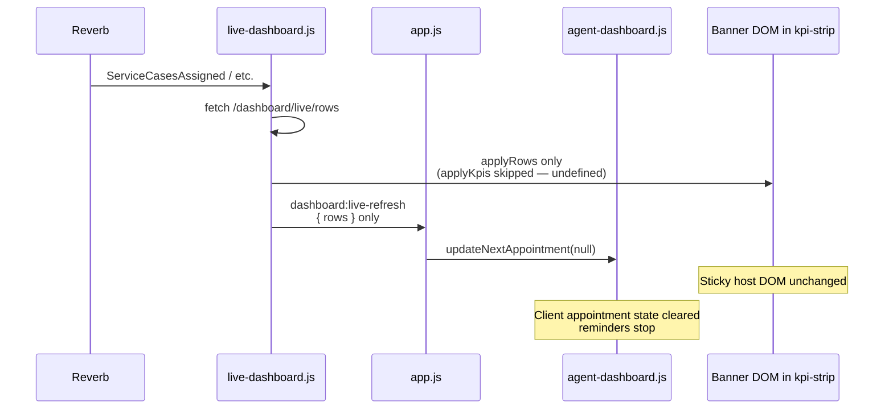
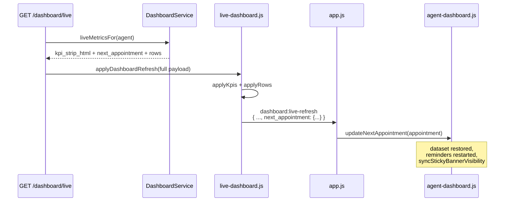

# P0-2 Investigation — Agent Next Appointment Banner Disappears After Reverb Partial Updates

**Type:** Correctness investigation (no fix implemented)  
**Date:** 2026-07-25  
**Status:** Root cause proven with code + test evidence

---

## 1. Proven root cause

**Primary cause: a client-side contract mismatch — every partial dashboard update dispatches `dashboard:live-refresh` without `next_appointment`, and the agent listener treats a missing field as an explicit clear (`null`).**

This is **not** caused by H4, **not** a `CaseQueueReadModel` issue, and **not** banner HTML embedded in service-case rows.

### Mechanism (proven)

```javascript
// resources/js/app.js
document.addEventListener('dashboard:live-refresh', (event) => {
    agentDashboardRef.current?.updateNextAppointment?.(event.detail?.next_appointment ?? null);
});
```

```javascript
// resources/js/agent-dashboard.js — updateNextAppointment(null)
root.removeAttribute('data-next-appointment');
appointment = null;
// clears reminder interval
```

```javascript
// resources/js/live-dashboard.js — applyPartialDashboardUpdate (all Reverb partial paths)
document.dispatchEvent(new CustomEvent('dashboard:live-refresh', { detail: data }));
// `data` contains only the fields passed in (rows, kpi_strip_html, etc.)
// `next_appointment` is never included unless caller supplied it
```

```php
// app/Events/Dashboard/DashboardKpisUpdated.php — broadcastWith()
return [
    'kpi_strip_html' => $this->kpiStripHtml,
    'service_case_filter_count_variants' => $this->serviceCaseFilterCountVariants,
    // NO next_appointment
];
```

**Result:** On every Reverb partial update (KPI, row, hybrid row, P0-1 `kpisOnly` reconcile), client appointment state is wiped even when the appointment has not changed.

### Contributing mechanism — visual DOM replacement on KPI paths

The sticky banner is **server-rendered inside** `#dashboard-kpi-strip` via `agent-action-cards.blade.php`, not in service-case row HTML.

On `DashboardKpisUpdated` and P0-1 hybrid KPI reconcile (`kpisOnly: true`), `applyKpis()` replaces `#dashboard-kpi-strip` innerHTML with fresh `kpi_strip_html`. That HTML is re-rendered server-side and **can** include the sticky host when `is_imminent` is true — but:

1. `next_appointment` is still not passed to `updateNextAppointment`, so client state is cleared immediately after.
2. If the fresh server render omits the sticky host (`showBanner` false or `next_appointment` null in `statsFor`), the banner DOM is **physically removed** from the page.

```blade
{{-- agent-action-cards.blade.php --}}
$showBanner = is_array($appointment) && ($appointment['is_imminent'] ?? false);
@if($showBanner)
    <div class="agent-appointment-banner-sticky-host" data-agent-appointment-sticky ...>
```

---

## 2. Timeline diagram

### Path A — Reverb `DashboardKpisUpdated` (KPI partial)

```mermaid
sequenceDiagram
    participant BC as DashboardBroadcastService
    participant DS as DashboardService
    participant Rev as Reverb
    participant LD as live-dashboard.js
    participant App as app.js
    participant AD as agent-dashboard.js
    participant DOM as #dashboard-kpi-strip

    BC->>DS: liveReverbMetricsFor(agent)
    Note over DS: statsFor → AgentNextAppointmentResolver<br/>renderKpiStrip (includes agent-action-cards)
    BC->>Rev: DashboardKpisUpdated<br/>(kpi_strip_html only)
    Rev->>LD: handleKpisUpdated
    LD->>DOM: applyKpis(kpi_strip_html)<br/>innerHTML replace
    LD->>App: dashboard:live-refresh<br/>{ kpi_strip_html, filter_counts }
    Note over App: next_appointment ABSENT
    App->>AD: updateNextAppointment(null)
    AD->>AD: remove data-next-appointment<br/>stop reminder interval
    Note over DOM,AD: Banner DOM may survive or be<br/>replaced depending on server HTML;<br/>client state always cleared
```

### Path B — Hybrid row update (row partial, no KPI HTML)



### Path C — Full HTTP poll (preserves banner state)



---

## 3. Files involved

### Server — generation

| File | Role |
|---|---|
| `app/Services/Dashboard/AgentNextAppointmentResolver.php` | Resolves next same-day scheduled appointment from `DashboardSnapshot` Scheduled queue |
| `app/Data/Dashboard/AgentNextAppointment.php` | DTO; `is_imminent` (≤30 min or overdue), `toArray()` |
| `app/Services/DashboardService.php` | `statsFor()` adds `next_appointment` for support agents; `liveMetricsFor()` exposes it; `liveReverbMetricsFor()` does **not** |
| `app/Http/Controllers/DashboardLiveController.php` | `refresh()` includes `next_appointment` in JSON (line 118) |
| `resources/views/dashboard/partials/agent-action-cards.blade.php` | Sticky banner host + KPI tiles; `$showBanner` gated on `is_imminent` |
| `resources/views/dashboard/partials/kpi-strip.blade.php` | Includes `agent-action-cards` for support agents |
| `resources/views/dashboard/index.blade.php` | Initial `data-next-appointment` on `#dashboard-page` |

### Server — broadcast (intentionally omits appointment)

| File | Role |
|---|---|
| `app/Services/DashboardBroadcastService.php` | `dispatchKpisUpdated()` → `liveReverbMetricsFor()` only |
| `app/Events/Dashboard/DashboardKpisUpdated.php` | Payload: `kpi_strip_html` + `service_case_filter_count_variants` only |

### Client — render + update

| File | Role |
|---|---|
| `resources/js/agent-dashboard.js` | Parses `data-next-appointment`; `updateNextAppointment()`; sticky visibility via `is-dismissed` |
| `resources/js/app.js` | `dashboard:live-refresh` listener — **null-coalescing clear** |
| `resources/js/live-dashboard.js` | `applyPartialDashboardUpdate` / `applyDashboardRefresh` dispatch event |
| `resources/js/live-dashboard-reverb.js` | `handleKpisUpdated`, `handleHybridIncidentsUpdated`, `handleServiceCaseEvent` → partial apply |

### Tests proving server includes appointment on full refresh only

| Test | Proves |
|---|---|
| `tests/Feature/AgentDashboardRedesignTest.php` | `test_live_refresh_includes_next_appointment_payload` |
| `tests/Feature/AgentDashboardRedesignTest.php` | `test_imminent_appointment_renders_sticky_banner_host` |
| `tests/Unit/Dashboard/AgentNextAppointmentResolverTest.php` | Resolver logic |

---

## 4. Answers to verification questions

| Question | Answer | Evidence |
|---|---|---|
| **Which updates preserve the banner?** | Full `GET /dashboard/live` poll/refresh; initial page load | `DashboardLiveController` line 118; `applyDashboardRefresh` passes full `data` |
| **Which updates remove/clear it?** | All Reverb partial paths: `DashboardKpisUpdated`, hybrid rows, `ServiceCaseCreated` row, row remove, P0-1 `kpisOnly` reconcile | `applyPartialDashboardUpdate` always dispatches; no `next_appointment` in partial payloads |
| **Server-owned or client-owned?** | **Both.** Server owns HTML in `#dashboard-kpi-strip` + initial `data-next-appointment`. Client owns runtime state (`updateNextAppointment`, reminders, dismissal via localStorage) | `agent-dashboard.js`, blade templates |
| **Part of row HTML?** | **No.** Banner is in `agent-action-cards` inside KPI strip | `kpi-strip.blade.php` line 70 |
| **Rebuilt after hybrid updates?** | Row hybrid: **no** KPI HTML change. KPI Reverb / `kpisOnly`: **yes**, full KPI strip innerHTML replace | `applyKpis(undefined)` early return vs `applyKpis(html)` |
| **Intentionally omitted from partial responses?** | **Yes** — by omission, not documented contract. Reverb event never had it; partial JS event never carries it | `DashboardKpisUpdated::broadcastWith()` |
| **Does polling restore it?** | **Yes** — heartbeat `/dashboard/live` includes `next_appointment` | `AgentDashboardRedesignTest::test_live_refresh_includes_next_appointment_payload` |
| **Does full refresh restore it?** | **Yes** — same endpoint, `applyDashboardRefresh` | Same |
| **H4 contributed?** | **No** | H4-6E migrated count delegates only; `AgentNextAppointmentResolver` unchanged; on H4 KEEP list |
| **Predates H4?** | **Yes** | `DashboardKpisUpdated` payload shape; `dashboard:live-refresh` listener pattern; no H4 touch on appointment path |

---

## 5. Update path matrix

| Trigger | `applyKpis` | `next_appointment` in event | Banner DOM | `data-next-appointment` | Reminders |
|---|---|---|---|---|---|
| Page load | — | via blade attribute | server render | set | running |
| `GET /dashboard/live` (poll) | yes | **yes** | replaced | **preserved** | running |
| `DashboardKpisUpdated` | yes | **no → null** | replaced | **cleared** | **stopped** |
| Hybrid row merge | no | **no → null** | unchanged | **cleared** | **stopped** |
| `ServiceCaseCreated` row | no | **no → null** | unchanged | **cleared** | **stopped** |
| P0-1 `kpisOnly` reconcile | yes | **no → null** | replaced | **cleared** | **stopped** |

**Divergence window:** From first Reverb partial update until next heartbeat poll (60s connected / 300s idle) or reconnect refresh.

---

## 6. Caching

| Layer | Cached? |
|---|---|
| `AgentNextAppointmentResolver` | **No** — computed per `statsFor()` from request-scoped `DashboardSnapshot` |
| `next_appointment` JSON field | **No** — fresh per `/dashboard/live` request |
| Client `data-next-appointment` | **In-memory DOM attribute** — cleared by `updateNextAppointment(null)` |
| Banner dismissal | **localStorage** (`radium.agent.appointmentBanner.dismissed.{id}`) — survives reload; not cleared by partial updates |

---

## 7. Lowest-risk fix (recommendation only — not implemented)

**Option 1 (client-only, lowest risk):** Only call `updateNextAppointment` when `next_appointment` is explicitly present in the event detail:

```javascript
if ('next_appointment' in (event.detail ?? {})) {
    agentDashboardRef.current?.updateNextAppointment(event.detail.next_appointment);
}
```

Preserves appointment state across all partial Reverb paths. Does not require Reverb, `DashboardSnapshot`, or H4 changes.

**Option 2 (server + Reverb):** Add `next_appointment` to `DashboardKpisUpdated::broadcastWith()` for support agents. Higher scope; user investigation rules excluded server changes.

**Option 3:** Stop dispatching `dashboard:live-refresh` from `applyPartialDashboardUpdate` when `next_appointment` is absent (narrower than Option 1).

**Recommended:** **Option 1** — single guard in `app.js`; aligns with “partial updates must not clear unspecified fields.”

---

## 8. Risk assessment

| Fix | Risk | Notes |
|---|---|---|
| Option 1 (guard in `app.js`) | **Low** | If appointment is genuinely cancelled, only full poll/Reverb-with-field would clear — acceptable until explicit appointment broadcast exists |
| Option 2 (Reverb payload) | **Medium** | Contract change; fan-out size; must gate to support agents |
| Option 3 (conditional dispatch) | **Low–Medium** | Other `dashboard:live-refresh` consumers might expect event on every partial |

**Regression gates:** `tests/Feature/AgentDashboardRedesignTest.php`, `tests/js/agent-dashboard.test.js`, `tests/js/live-dashboard-reverb.test.js`, `tests/Feature/DashboardReverbMetricsConsistencyTest.php`.

---

## 9. Rollback plan

- Option 1: revert one conditional in `app.js` — no server rollback.
- Option 2: revert event payload + client handler — no migration.

---

## Summary

| Item | Finding |
|---|---|
| **Exact cause** | Partial `dashboard:live-refresh` events omit `next_appointment`; `app.js` clears client state with `?? null` on every partial update |
| **Visual DOM loss** | Additional effect on KPI paths via `applyKpis` innerHTML replace when server HTML omits `showBanner` |
| **H4 responsible?** | **No** |
| **Pre-existing?** | **Yes** |
| **Polling fixes it?** | **Yes** (60–300s) |
| **Banner in row HTML?** | **No** — lives in KPI strip / `agent-action-cards` |

**STOP — investigation complete. No code changes made.**
