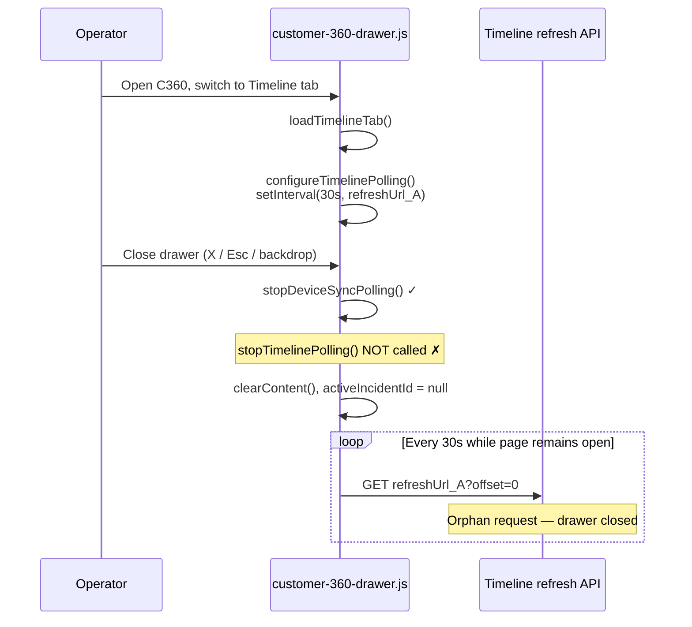
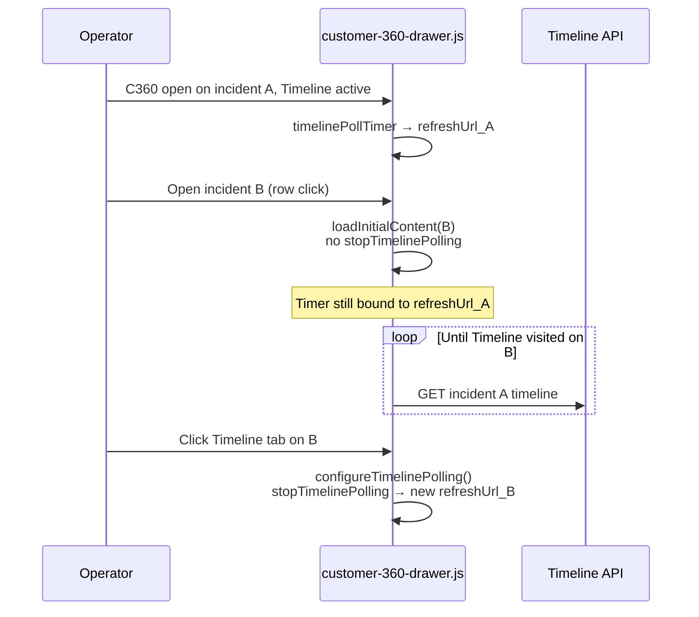

# P0-3 Investigation — Customer360 Timeline Polling Leak After Drawer Close

**Type:** Correctness investigation (no fix implemented)  
**Date:** 2026-07-25  
**Status:** Root cause proven with code evidence

---

## 1. Proven root cause

**Primary cause: `close()` stops device-sync polling but never calls `stopTimelinePolling()`, leaving a `setInterval` running after the drawer is closed.**

The timeline poll timer is created when the operator visits the Timeline tab. It captures the incident-specific `refreshUrl` in a closure and continues firing every 30s (default) even after `close()` clears the DOM and sets `activeIncidentId = null`.

This is **not** an Echo/Reverb leak, **not** a `unified-timeline.js` interval, and **not** caused by H4.

### Proof

**Timer is started here:**

```302:314:resources/js/customer-360-drawer.js
    const configureTimelinePolling = () => {
        stopTimelinePolling();

        const section = contentHost.querySelector('[data-customer-360-timeline-section]');
        const refreshUrl = section?.dataset.timelineRefreshUrl?.trim() ?? '';

        if (refreshUrl === '') {
            return;
        }

        timelinePollTimer = setInterval(() => {
            refreshTimelineSection(refreshUrl);
        }, timelinePollMs);
    };
```

Called from `loadTimelineTab()` after the lazy timeline tab HTML loads (line 672).

**`stopTimelinePolling()` exists but is only invoked from `configureTimelinePolling()`** (before restart). Grep confirms no other call sites.

**`close()` stops device polling only:**

```1146:1170:resources/js/customer-360-drawer.js
    const close = () => {
        fetchController?.abort();
        fetchController = null;
        stopDeviceSyncPolling();

        if (!drawer.classList.contains('is-open') && activeIncidentId === null) {
            return;
        }

        activeIncidentId = null;
        // ...
        clearContent();
        clearPersistedTab();
        resetLazyTabState();
```

**No `stopTimelinePolling()` call.**

**Orphan fetches continue after close** because `refreshTimelineSection` does not check drawer open state:

```271:299:resources/js/customer-360-drawer.js
    const refreshTimelineSection = async (refreshUrl) => {
        if (!refreshUrl) {
            return;
        }

        try {
            const response = await fetch(`${refreshUrl}?offset=0`, {
                // ...
            });
            // ...
            const section = contentHost.querySelector('[data-customer-360-timeline-section]');
            if (section && payload.html) {
                section.outerHTML = payload.html;
            }
```

After `clearContent()`, `section` is null so DOM is not updated — but **the HTTP request still runs** to the closed incident's timeline endpoint on every tick.

---

## 2. Contributing cause — incident switch without stopping timer

**Secondary cause:** `open()` / `loadInitialContent()` do not stop timeline polling when switching incidents.

```1065:1072:resources/js/customer-360-drawer.js
    const loadInitialContent = async (incidentId) => {
        fetchController?.abort();
        fetchController = new AbortController();

        setError('');
        closeMoreMenu();
        clearContent();
        setLoading(true);
```

No `stopTimelinePolling()` before `clearContent()`.

If the operator had the Timeline tab active on incident A, then opens incident B (without an explicit close), the interval for A's `refreshUrl` keeps firing until the operator visits Timeline on B (which calls `configureTimelinePolling()` → `stopTimelinePolling()` first).

Between switch and Timeline revisit: **orphan polls hit incident A's endpoint while viewing incident B**.

---

## 3. Timeline diagram

### Path A — Close drawer (primary leak)



### Path B — Switch incident (secondary)



### Path C — Full poll refresh (no leak from timeline module)

```mermaid
sequenceDiagram
    participant Op as Operator
    participant Drawer as customer-360-drawer.js

    Op->>Drawer: customer360:refresh while drawer open
    Drawer->>Drawer: refreshDrawerContent()
    Note over Drawer: Timers NOT stopped;<br/>lazyTabState.timeline stays true
    Note over Drawer: loadTimelineTab early-returns;<br/>existing interval continues
```

---

## 4. Files involved

| File | Role |
|---|---|
| `resources/js/customer-360-drawer.js` | **Owner** of `timelinePollTimer`, `configureTimelinePolling`, `stopTimelinePolling`, `close()`, `loadInitialContent()`, `open()` |
| `resources/js/unified-timeline.js` | Filter chips, load-more click handlers — **no polling timers** |
| `resources/js/customer-360-cockpit.js` | Keyboard shortcuts; `destroy()` removes keydown listener only |
| `resources/views/customer-360/partials/timeline-section.blade.php` | `data-timeline-refresh-url` source |
| `resources/views/dashboard/partials/customer-360-drawer-host.blade.php` | `data-timeline-poll-ms` (default 30s) |
| `tests/js/customer-360-drawer.test.js` | Drawer lifecycle tests — **no timeline polling stop coverage** |

**Not involved:** Echo/Reverb, `DashboardSnapshot`, H4 ReadModels, `AgentNextAppointmentResolver`.

---

## 5. Verification answers

| Question | Answer | Evidence |
|---|---|---|
| **Who starts polling?** | `configureTimelinePolling()` via `loadTimelineTab()` when Timeline tab is first visited | Lines 637–672, 727–728 |
| **Who owns the timer?** | Closure variable `timelinePollTimer` in `initCustomer360Drawer` | Line 176 |
| **Who should stop it?** | `close()`, and `loadInitialContent()` / `open()` on incident switch | Symmetric with `stopDeviceSyncPolling()` in `close()` |
| **Is cleanup called?** | **Partially** — device yes, timeline **no** on close | `close()` line 1149 |
| **Is cleanup incomplete?** | **Yes** — timeline interval survives close and incident switch | Code proof above |
| **Duplicate timers on reopen?** | **Unlikely duplicate** — `configureTimelinePolling` always `stopTimelinePolling()` first; but **orphan timer from prior session** continues until Timeline tab revisited or page unload | `configureTimelinePolling` line 303 |
| **Switching incidents leaves old polling?** | **Yes** — until Timeline tab reconfigured | `loadInitialContent` lacks stop |
| **Hidden tab affects polling?** | **No** — no `document.hidden` or drawer-open guard in `refreshTimelineSection` | Lines 271–314 |
| **H4 contributed?** | **No** | C360 drawer unchanged in H4 scope |
| **Predates H4?** | **Yes** | Structural omission in `close()`; timeline polling predates H4 KPI work |

---

## 6. What is NOT leaking (ruled out)

| Hypothesis | Verdict |
|---|---|
| `unified-timeline.js` `setInterval` | **No** — only event listeners for filters/load-more |
| Echo/Reverb listeners | **No** — none in C360 drawer modules |
| `cockpitApi` timers | **No** — `destroy()` removes keydown listener only |
| Memory leak from DOM refs | **Minor** — `contentHost` cleared but interval closure retains `refreshUrl` string; primary impact is **ongoing HTTP traffic** |
| `fetchController` leak | **No** — aborted in `close()` and `loadInitialContent()` |

---

## 7. Polling vs device sync asymmetry

| Poll type | Started by | Stopped on `close()`? |
|---|---|---|
| Device sync | `configureDeviceSyncPolling()` in `finalizeDrawerContent` | **Yes** — `stopDeviceSyncPolling()` |
| Timeline | `configureTimelinePolling()` in `loadTimelineTab` | **No** |

Same file, same pattern — timeline stop was simply never wired into teardown.

---

## 8. Lowest-risk fix (recommendation only)

**Option 1 (minimal):** Call `stopTimelinePolling()` in `close()` alongside `stopDeviceSyncPolling()`.

**Option 2 (complete):** Also call `stopTimelinePolling()` (and `stopDeviceSyncPolling()`) at the start of `loadInitialContent()` before `clearContent()` to fix incident-switch orphans.

**Option 3 (defense in depth):** Guard `refreshTimelineSection` / interval callback:

```javascript
if (!drawer.classList.contains('is-open')) return;
```

**Recommended:** **Options 1 + 2** — mirrors existing device-sync teardown pattern; single file change.

---

## 9. Risk assessment

| Fix | Risk | Notes |
|---|---|---|
| Option 1 (`close` only) | **Very low** | Stops leak on close; incident-switch gap remains |
| Options 1 + 2 | **Low** | Matches device-sync symmetry; no API changes |
| Option 3 guard only | **Low–Medium** | Stops fetches but leaves dead interval until cleared |

**Regression gates:** `tests/js/customer-360-drawer.test.js` + new tests: assert `clearInterval` / no fetch after close with timeline active.

---

## 10. Rollback plan

Revert `stopTimelinePolling()` calls in `close()` / `loadInitialContent()` — no server, schema, or H4 rollback.

---

## Summary

| Item | Finding |
|---|---|
| **Exact cause** | `close()` never calls `stopTimelinePolling()`; orphan `setInterval` keeps fetching closed incident timeline |
| **Secondary** | `loadInitialContent()` doesn't stop timeline poll on incident switch |
| **H4 responsible?** | **No** |
| **Pre-existing?** | **Yes** |
| **Reverb involved?** | **No** |
| **Polling restores correctly when drawer open?** | Yes — interval runs as designed while open |
| **Impact** | Unnecessary HTTP every 30s per leaked timer; wrong-incident fetches on switch |

**STOP — investigation complete. No code changes made.**
