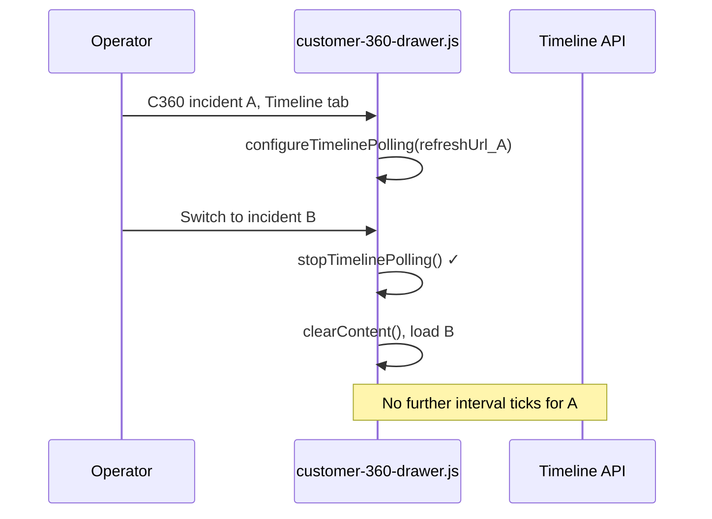
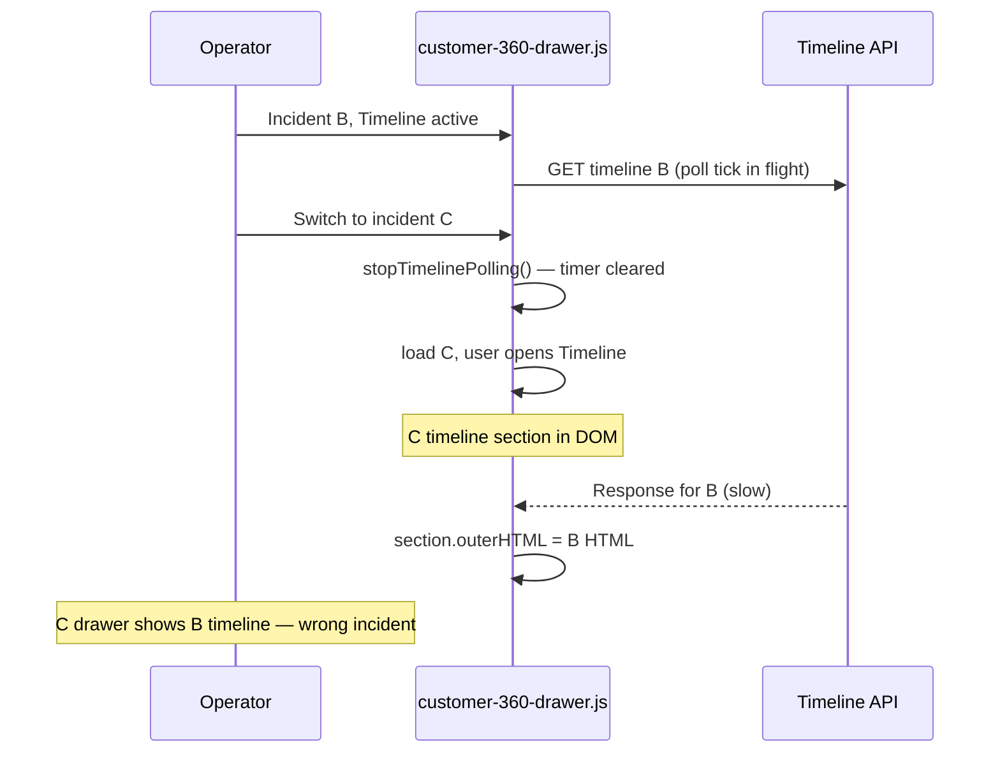

# P0-4 Investigation — Customer360 Timeline Polling Wrong Incident After Switch

**Type:** Correctness investigation (no fix implemented)  
**Date:** 2026-07-25  
**Status:** Root cause proven with code evidence (post–P0-3)

---

## Executive summary

**P0-3 eliminated the steady-state timer leak** (orphan `setInterval` continuing to poll the previous incident’s URL after close or switch).

**Wrong-incident behavior can still occur** via **in-flight fetch races**: timeline and device refresh requests have no `AbortController` and no `activeIncidentId` guard before applying HTML. A slow response for incident A can overwrite incident B’s timeline/device DOM after a rapid switch.

This is **not** H4-related and **predates** H4.

---

## 1. Proven root cause (remaining after P0-3)

### Primary (still possible): stale in-flight response overwrites current incident DOM

Timeline poll/refresh applies server HTML to **whatever** `[data-customer-360-timeline-section]` exists in `contentHost` at response time, with **no check** that the response belongs to `activeIncidentId`:

```271:296:resources/js/customer-360-drawer.js
    const refreshTimelineSection = async (refreshUrl) => {
        // ...
        const response = await fetch(`${refreshUrl}?offset=0`, { /* no signal */ });
        // ...
        const section = contentHost.querySelector('[data-customer-360-timeline-section]');
        if (section && payload.html) {
            section.outerHTML = payload.html;
            initUnifiedTimeline(contentHost);
        }
    };
```

`refreshUrl` is incident-specific (e.g. `/dashboard/service-cases/42/customer-360/timeline`) — baked into the closure when the interval was created, or passed explicitly.

**Race scenario (proven):**

1. Operator views **incident B**, Timeline tab active, poll in flight for B (or last tick before switch).
2. Operator switches to **incident C** → `loadInitialContent(C)` calls `stopTimelinePolling()` ✓ and clears content.
3. Operator opens Timeline on C → new section for C exists.
4. **Stale response for B** arrives → `querySelector` finds **C’s** section → **B’s timeline HTML is written into C’s drawer**.

Same pattern exists for **device sync polling** (`refreshDeviceSection` → `replaceDeviceSection`) with no incident guard.

### What P0-3 fixed (no longer the main steady-state cause)

P0-3 added `stopTimelinePolling()` to:

```1068:1069:resources/js/customer-360-drawer.js
        stopDeviceSyncPolling();
        stopTimelinePolling();
```

(in `loadInitialContent`) and `close()`.

**Effect:** After switch or close, **no new interval ticks** fire for the old incident’s `refreshUrl`. The P0-3 test `stops timeline polling when switching to another incident` proves no further `/customer-360/timeline` fetches from the timer after switch (when Timeline was active on A and operator lands on B overview).

**P0-3 did not:** abort in-flight fetches, guard DOM application, or reset lazy-load fetches.

---

## 2. Secondary causes (contributing)

| # | Mechanism | Wrong incident requests? | Wrong DOM overwrite? |
|---|---|---|---|
| **B** | `loadTimelineTab()` async fetch — no `AbortController` | Yes (orphan request completes) | Rare (placeholder often detached after `clearContent()`); `configureTimelinePolling()` may still run against current `contentHost` |
| **C** | `refreshDrawerContent()` — does **not** stop poll timers | Same incident only (`customer360:refresh` checks `activeIncidentId`) | Low for wrong incident |
| **D** | `lazyTabState.timeline` stays `true` on same-incident refresh | N/A | Skips `loadTimelineTab` re-run; existing timer URL unchanged (same incident — OK) |
| **E** | Device poll closure — same as timeline | Stopped on switch (P0-3) | In-flight device response can still call `replaceDeviceSection` on wrong incident |

---

## 3. Timeline diagram

### After P0-3 — timer path (fixed)



### Remaining — in-flight race (not fixed)



---

## 4. Files involved

| File | Role |
|---|---|
| `resources/js/customer-360-drawer.js` | Timer ownership, `refreshTimelineSection`, `loadTimelineTab`, `loadInitialContent`, `open`, `close` |
| `resources/js/unified-timeline.js` | Filter/load-more handlers only — **no polling timers** |
| `app/Services/Customer360Service.php` | `timelineRefreshUrl` per incident in rendered HTML |
| `resources/views/customer-360/partials/timeline-section.blade.php` | `data-timeline-refresh-url` |
| `tests/js/customer-360-drawer.test.js` | P0-3 tests stop timer on close/switch — **no in-flight race tests** |

**AbortController usage today:**

| Request type | Aborted on switch? |
|---|---|
| Initial drawer HTML (`loadInitialContent`) | **Yes** — `fetchController` |
| Drawer refresh (`refreshDrawerContent`) | **Yes** — `fetchController` |
| Timeline poll/refresh | **No** |
| Device poll/refresh | **No** |
| Lazy tab loads (timeline/AI/executive summary) | **No** |

---

## 5. Verification answers

| Question | Answer (post–P0-3) |
|---|---|
| **Can requests continue for the old incident?** | **Timer-driven:** No (after switch/close). **In-flight:** Yes — requests already sent are not aborted. |
| **Can old responses overwrite the new incident?** | **Yes** — if new incident’s timeline/device section exists when stale response applies. |
| **Are AbortControllers always respected?** | **Only** for main drawer HTML load/refresh — not timeline/device/lazy tab fetches. |
| **Race conditions during rapid switching?** | **Yes** — proven by async apply without generation/incident guard. |
| **Does drawer close fully reset state?** | **Yes** for timers, `activeIncidentId`, content, lazy flags (P0-3). In-flight fetches not cancelled. |
| **Did P0-3 eliminate part of this?** | **Yes** — eliminated **orphan interval polling** wrong URL after switch/close. |
| **Is wrong-incident still possible?** | **Yes** — via **in-flight response races** (and device sync equivalent). |
| **H4 contributed?** | **No** |
| **Predates H4?** | **Yes** — timer orphan predates P0-3; in-flight races are structural in current fetch helpers. |

---

## 6. Scenario matrix (post–P0-3)

| Scenario | Timer polls wrong URL? | In-flight wrong URL / DOM? |
|---|---|---|
| Open A → Timeline → switch B (overview) | **No** (P0-3) | Possible if B Timeline opened before A response lands |
| Rapid A → B → C | **No** steady orphan timer | **Yes** — multiple unstopped fetches |
| Close drawer | **No** (P0-3) | Stale response may no-op (no section) or mutate detached nodes |
| Close → reopen same incident | Clean timers | Low risk |
| `customer360:refresh` same incident | Timer keeps same URL (OK) | N/A |

---

## 7. Lowest-risk fix (recommendation only)

**Option 1 (minimal, recommended):** Add a **generation token** or compare `activeIncidentId` to incident ID parsed from `refreshUrl` before any DOM write in:

- `refreshTimelineSection`
- `refreshDeviceSection`
- `loadTimelineTab` (before `placeholder.outerHTML` and `configureTimelinePolling`)

Increment token / update guard at start of `loadInitialContent` and `close`.

**Option 2:** Shared `AbortController` for all C360 sub-fetches, aborted in `loadInitialContent` / `close` (mirrors `fetchController`).

**Option 3:** Also call `stopTimelinePolling()` / `stopDeviceSyncPolling()` in `refreshDrawerContent` before HTML replace (same-incident hygiene only).

**Recommended:** **Option 1 + Option 2** for timeline/device — guard prevents stale apply even if abort misses; abort reduces wasted traffic.

---

## 8. Risk assessment

| Fix | Risk |
|---|---|
| Incident/generation guard before DOM apply | **Low** — small checks in existing helpers |
| AbortController for poll/lazy fetches | **Low–medium** — must handle `AbortError` in all callers |
| Revisit P0-3 timer stops | **None** — keep as-is |

**Regression gates:** `tests/js/customer-360-drawer.test.js` (P0-3 timer tests) + new race tests with deferred `fetch` mocks.

---

## 9. Rollback plan

Revert guard/abort additions in `customer-360-drawer.js` only — no server or H4 rollback.

---

## Summary

| Item | Finding |
|---|---|
| **P0-3 resolved?** | **Partially** — steady-state wrong-incident **timer** polling after switch/close |
| **Still broken?** | **Yes** — **in-flight** timeline/device responses can apply wrong incident HTML |
| **Exact remaining cause** | No `activeIncidentId`/generation check before DOM apply; no abort on sub-fetches |
| **H4?** | **No** |

**STOP — investigation complete. No code changes made.**
