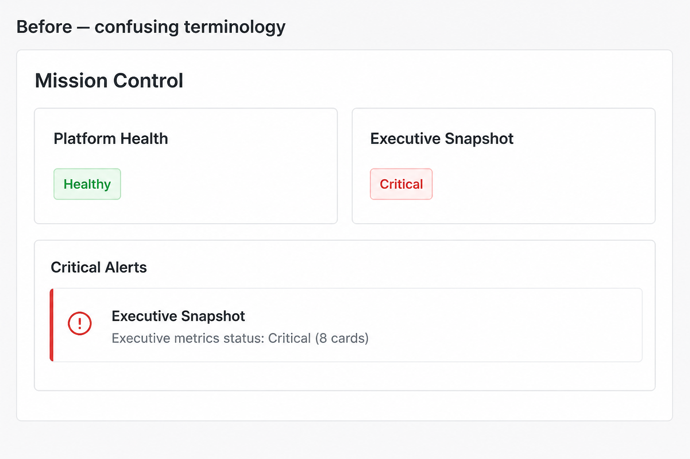
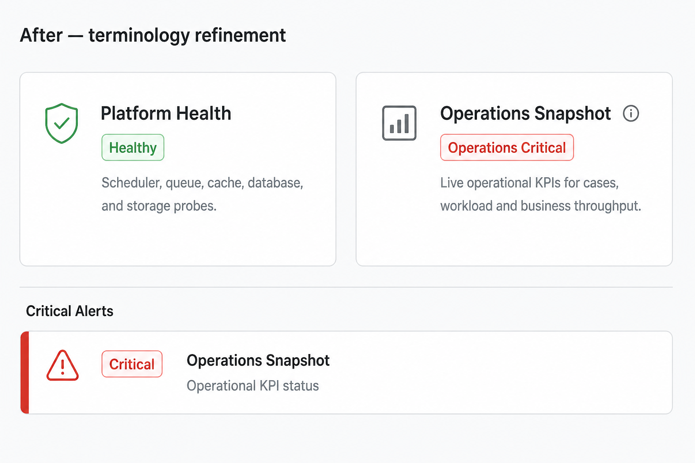

# P0 — Operations Snapshot Terminology

**Status:** Implemented  
**Captured:** 2026-08-04  
**Scope:** Presentation / operator wording only  
**Canvas:** [`p0-operations-snapshot-terminology.canvas.tsx`](/Users/ravi/.cursor/projects/Users-ravi-radium-service-desk/canvases/p0-operations-snapshot-terminology.canvas.tsx)

---

## Summary

Platform Health stays infrastructure. Executive Snapshot is now labeled **Operations Snapshot** with **Operations\*** badges, so operators can read “Platform Healthy + Operations Critical” without confusing infra and workload.

| Metric | Value |
| --- | --- |
| Scope | Presentation |
| Thresholds / math | Identical |
| Routes / APIs | Unchanged (`executive_snapshot`) |
| Related tests | 23/23 |

### Success check

| Surface | Reads as |
| --- | --- |
| Platform Health badge | Healthy (infra) |
| Operations Snapshot badge | Operations Critical (workload) |
| Critical Alerts row | Operations Snapshot · Operational KPI status |
| Tooltip | Business workload vs infrastructure health |

### Explicit non-changes

No KPI calculations · no thresholds · no alert rules · no Telegram · no automation · no dashboard architecture · route key remains `executive_snapshot`

---

## Terminology map

| Surface | Before | After |
| --- | --- | --- |
| Zone title | Executive Snapshot | Operations Snapshot |
| Zone subtitle | Live executive KPIs… | Live operational KPIs for cases, workload and business throughput. |
| Status badge | Critical / Warning / Healthy | Operations Critical / Warning / Healthy |
| Critical Alerts title | Executive Snapshot | Operations Snapshot |
| Critical Alerts description | Executive metrics status… | Operational KPI status |
| Expand panel | Executive metrics status: Critical (8 cards) | Operations status: Critical · Affected KPI cards: 8 |

### Tooltip (Operations Snapshot title)

> Operations Snapshot measures business workload. Platform Health measures infrastructure health.

---

## Screenshots

### Before — confusing terminology



Path: [`docs/assets/operations-snapshot-terminology-before.png`](assets/operations-snapshot-terminology-before.png)

### After — terminology refinement



Path: [`docs/assets/operations-snapshot-terminology-after.png`](assets/operations-snapshot-terminology-after.png)

Absolute copies also at:

- `/Users/ravi/.cursor/projects/Users-ravi-radium-service-desk/assets/operations-snapshot-terminology-before.png`
- `/Users/ravi/.cursor/projects/Users-ravi-radium-service-desk/assets/operations-snapshot-terminology-after.png`

---

## Files modified / added

| File | Role |
| --- | --- |
| `app/Support/Platform/OperationsSnapshotPresentation.php` | Central presentation constants + badge labels |
| `app/Enums/PlatformZoneId.php` | Display label → Operations Snapshot |
| `app/Enums/PlatformDashboardSection.php` | Executive section display label |
| `app/Services/Platform/Zones/ExecutiveSnapshotZone.php` | Subtitle + Operations* statusLabel |
| `app/Services/Platform/Zones/AbstractPlatformZone.php` | Optional statusLabel override on makeSnapshot |
| `app/Services/Platform/Alerts/Contributors/ExecutiveSnapshotAlertContributor.php` | Alert title/summary/status terminology |
| `app/Services/Platform/Health/Contributors/ExecutiveSnapshotContributionProvider.php` | Overall Health contribution label |
| `app/Services/Platform/Warmers/ExecutiveSnapshotWarmer.php` | Warmer display label |
| `app/Services/Platform/Zones/CriticalAlertsZone.php` | Description mentions Operations Snapshot |
| `resources/views/admin/platform/partials/zone.blade.php` | Tooltip beside Operations Snapshot title |
| `resources/views/admin/platform/zones/critical-alerts/expand.blade.php` | Operations status + Affected KPI cards |
| `tests/Feature/Platform/OperationsSnapshotTerminologyTest.php` | Presentation regression suite |
| `tests/Feature/Platform/PlatformZoneFrameworkTest.php` | Assert Operations Snapshot title |
| `tests/Feature/Platform/ExecutiveCommandCenterTest.php` | Assert Operations Snapshot title |

---

## Tests

| Suite | Result |
| --- | --- |
| OperationsSnapshotTerminologyTest (6) | Pass |
| PlatformZoneFrameworkTest | Pass |
| ExecutiveCommandCenterTest | Pass |
| ExecutiveMetricStatusRulesTest | Pass |
| Combined filter | 23 / 23 Pass |

```bash
php artisan test --filter='OperationsSnapshotTerminologyTest|PlatformZoneFrameworkTest|ExecutiveCommandCenterTest|ExecutiveMetricStatusRulesTest'
```

---

## Rollback

Revert the presentation commit. Flush `platform:zone:executive_snapshot:snapshot` and `platform:zone:critical_alerts:snapshot` so labels refresh. No data repair required.

| Step | Action |
| --- | --- |
| 1 | Revert terminology commit(s) |
| 2 | Deploy previous build |
| 3 | Flush executive_snapshot + critical_alerts zone caches (or wait ≤120s warm) |
| 4 | Confirm UI shows prior Executive Snapshot wording |
