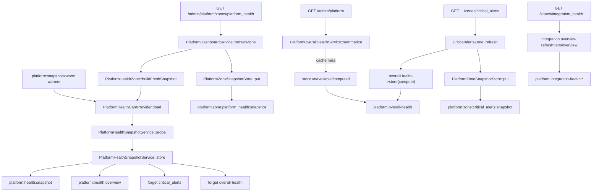
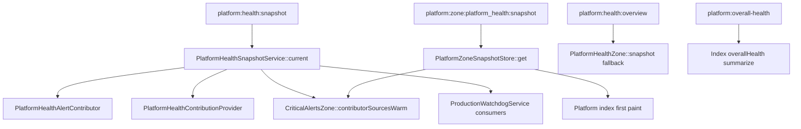

# P0 — Exact Writer Corrupting Platform Snapshots

**Status:** Investigated (facts captured; no speculative fix applied)  
**Captured:** 2026-08-04  
**Scope:** Instrument every Platform snapshot writer/reader; identify the exact request that first persists the “incorrect” snapshot after `optimize:clear`  
**Canvas:** [`p0-platform-snapshot-writer-audit.canvas.tsx`](/Users/ravi/.cursor/projects/Users-ravi-radium-service-desk/canvases/p0-platform-snapshot-writer-audit.canvas.tsx)

---

## Verdict

There is **no second writer** of `platform:health:snapshot`.

After `optimize:clear` → first paint → background refresh → browser reload, the audit log shows **exactly one** `put` to `platform:health:snapshot`. That write is the intentional probe path. The second page load **reads** the same payload — nothing overwrites it between refresh and reload.

What looks like “corruption” is the probe aggregate itself:

| Mode | Overall status written | Why |
| --- | --- | --- |
| Queue + automation disabled (local default) | `disabled` | `PlatformHealthStatus::worst()` treats Disabled (severity 20) **above** Healthy (10) |
| Queue active, automation on, no executions yet | `warning` | Automation component is Warning; overall follows |

First paint looks “correct” because it shows **placeholders** (`available=false`, Pending) — not because a Healthy shared snapshot exists.

---

## Method

Temporary auditor: `App\Support\Platform\PlatformCacheAudit`

| Control | Value |
| --- | --- |
| Flag | `PLATFORM_CACHE_AUDIT=true` / `config('platform.cache_audit')` |
| Log | `storage/logs/platform-cache-audit.log` (JSON lines) |
| Fields | timestamp, request id, route, URI, controller, service, method, cache key, old/new hash, old/new status, summary, stack |
| Harness | `tests/Feature/Platform/PlatformCacheAuditReproductionTest.php` |

Instrumented writers/readers (gated; default off):

- `PlatformHealthSnapshotService` (snapshot + overview)
- `PlatformZoneSnapshotStore` (all `platform:zone:*:snapshot`)
- `PlatformOverallHealthService`
- `PlatformIntegrationHealthOverviewService` (overview + items)
- Overview services (automation / performance / finance / communications / operations)
- `PlatformCacheInvalidator` forgets
- `PlatformHealthCache` heartbeat puts
- `PlatformHealthZone` overview fallback read

Checked and **not** writing these keys on the repro path: scheduler warmers mid-request, Reverb, queue workers, boot listeners, cache observers. Warmers exist (`platform:snapshots:warm`) but did not run during the HTTP sequence.

---

## Timeline (instrumented repro)

Sequence: durable heartbeats present → `Cache::flush` (optimize:clear style) → `GET /admin/platform` → JS-order zone refreshes → `GET /admin/platform` again.

| Step | Request | `platform:health:snapshot` | `platform:zone:platform_health:snapshot` | `platform:overall-health` |
| --- | --- | --- | --- | --- |
| 1 Clear | CLI flush | gone | gone | gone |
| 2 First paint | `GET admin/platform` | miss (no write) | miss → placeholder | **write** `unavailable` via `summarize()` on miss |
| 3 Ops Snapshot refresh | `GET …/zones/executive_snapshot` | untouched | untouched | forget (dependents) |
| 4 **Platform Health refresh** | `GET …/zones/platform_health` | **WRITE** aggregate status | **WRITE** same status | forget |
| 5 Integration refresh | `GET …/zones/integration_health` | untouched | untouched | forget (dependents) |
| 6 Critical Alerts refresh | `GET …/zones/critical_alerts` | **read hit** | — | **write** from contributors |
| 7 Browser reload | `GET admin/platform` | **read hit** (same status) | **read hit** | **read hit** |

**First bad write request:** `GET admin/platform/zones/platform_health`  
**First reader of the bad snapshot:** Critical Alerts refresh (and then the second index).

---

## Exact offending call chain

```
PlatformDashboardController::zone
  → PlatformDashboardService::refreshZone
    → PlatformHealthZone::buildFreshSnapshot
      → PlatformHealthCardProvider::load   // ALWAYS probe(); never current()
        → PlatformHealthSnapshotService::probe
          → PlatformHealthSnapshotService::store
             Cache::put('platform:health:snapshot', …)
             Cache::put('platform:health:overview', …)
             forget critical_alerts + overall-health
    → PlatformZoneSnapshotStore::put('platform:zone:platform_health:snapshot')
    → PlatformCacheInvalidator::invalidateDependents
```

| Field | Fact |
| --- | --- |
| Exact method | `PlatformHealthSnapshotService::store` (called from `probe`) |
| Exact cache key | `platform:health:snapshot` |
| Only production caller of `probe()` | `PlatformHealthCardProvider::load` |
| Companion zone key | `platform:zone:platform_health:snapshot` via `PlatformZoneSnapshotStore::put` |

Repo-wide search: no other PHP site `Cache::put`s `platform:health:snapshot`.

---

## Writer graph



---

## Reader graph



---

## Why the previous regeneration fix did not intercept this

| Prior repair | What it stopped | What still happens |
| --- | --- | --- |
| Durable heartbeats + missing → Warning | False **Critical** when cache HB wiped | Aggregate can still be **Disabled** or **Warning** for other components |
| HTTP zone uses `refreshZone()` | Skipped `invalidateDependents` | Does not change probe math |
| CA no Pending put / skip Loading stubs | CA self-poison race | Does not change PH `store` payload |
| JS contributors before CA | Race bake order | Still one deliberate PH probe write |

The prior fix assumed the poison was “false Critical from missing heartbeats.” Instrumentation shows the post-clear refresh still writes a non-Healthy overall from **live component statuses**, and the browser reload faithfully displays that write.

---

## Component facts from repro

### A — Queue + automation disabled

Overall: **`disabled`**

| Component | Status |
| --- | --- |
| scheduler | healthy |
| presence | healthy |
| queue | disabled |
| automation | disabled |
| database / cache / storage | healthy |

### B — Queue active, automation enabled, no executions

Overall: **`warning`** (automation: “Enabled but no executions recorded yet.”)

Severity math: `Disabled=20 > Healthy=10` in `PlatformHealthStatus::severity()`, so any Disabled component forces overall Disabled even when every active subsystem is Healthy.

---

## Latent secondary path (not in HTTP repro)

`PlatformCacheInvalidator::markZoneStale('platform_health')` forgets `relatedOverviewKeys`, which **includes** `platform:health:snapshot`. A failed warmer can wipe the shared snapshot while only marking the zone stale. Not observed in the clear→HTTP refresh→reload timeline, but it is a real second **forget** path that can leave dependents empty until the next probe.

---

## Minimal permanent fix (do not ship as a workaround)

No cache clearing. No UI change. No TTL change.

**Primary (one-line semantics, correct root):**

In overall aggregation for the shared snapshot (`PlatformHealthSnapshotService::probe` / `PlatformHealthStatus::worst`), **exclude `Disabled` components** (or assign Disabled severity below Healthy) so turned-off queue/automation cannot dominate Platform Health when active infra is Healthy.

That makes the single existing writer persist the status operators expect after background refresh — without inventing another cache writer or re-clearing.

**Secondary (hardening, optional follow-up):**

1. Remove `KEY_PLATFORM_HEALTH_SNAPSHOT` from `markZoneStale` overview forgets (stale zone ≠ delete shared truth).
2. Stop `PlatformOverallHealthService::summarize` from **storing** cold `unavailable` on first paint miss (compute for response only, or store only after contributors warm).
3. After the permanent fix lands, set `PLATFORM_CACHE_AUDIT=false` and remove the temporary auditor wiring.

---

## Surfaces checked (no alternate snapshot writer found)

| Surface | Role in repro |
| --- | --- |
| HTTP zone refresh | **Sole writer** of `platform:health:snapshot` |
| Index GET | Reads zones; writes overall only on miss |
| JS rAF / poll auto-refresh | Triggers zone GETs only |
| Scheduler / `platform:snapshots:warm` | Can write via same card `load→probe` if scheduled; not in this HTTP timeline |
| Queue worker / Reverb | No writes to these keys |
| Boot / providers / observers | No snapshot puts |

---

## How to re-capture on a live box

```bash
# .env
PLATFORM_CACHE_AUDIT=true

php artisan config:clear
rm -f storage/logs/platform-cache-audit.log
php artisan optimize:clear
# open Platform → wait for background refresh → refresh browser once
# inspect storage/logs/platform-cache-audit.log for cache_key=platform:health:snapshot
```

Or run: `php artisan test --filter=PlatformCacheAuditReproductionTest`

---

## Deliverable pairing

| Artifact | Path |
| --- | --- |
| Markdown | `docs/p0-platform-snapshot-writer-audit.md` |
| Canvas | `/Users/ravi/.cursor/projects/Users-ravi-radium-service-desk/canvases/p0-platform-snapshot-writer-audit.canvas.tsx` |
