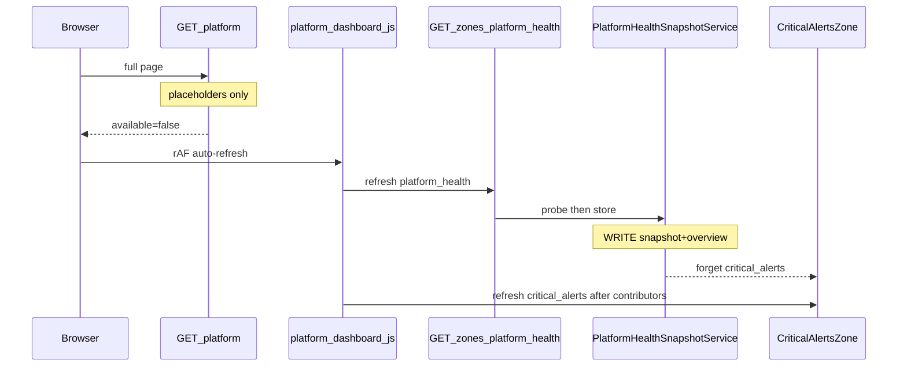

# P0 — Snapshot Cache Regeneration Bug

**Status:** Fixed  
**Captured:** 2026-08-04  
**Scope:** Snapshot generation pipeline (not UI, not “clear cache again”)  
**Canvas:** [`p0-snapshot-cache-regeneration-bug.canvas.tsx`](/Users/ravi/.cursor/projects/Users-ravi-radium-service-desk/canvases/p0-snapshot-cache-regeneration-bug.canvas.tsx)

---

## Summary

After `optimize:clear`, the first paint looked fine (placeholders). The next HTTP zone refresh re-probed with wiped heartbeats and persisted a false Critical (or raced Critical Alerts into a poison bake). Clearing cache again was not the fix — the writers were wrong.

| Metric | Value |
| --- | --- |
| Invalid writer path | HTTP zone GET → probe → store |
| Heartbeat survival | Durable file + Warning if truly missing |
| CA cold start | No Pending put |
| Pipeline tests | 21/21 |

### Success

`optimize:clear` → open Platform → auto-refresh → shared snapshot stays non-Critical when cron was healthy before the flush; Critical Alerts cannot re-poison itself with Pending/Loading stubs.

---

## Cache keys · writers · readers

| Key | Writer | Readers |
| --- | --- | --- |
| `platform:health:snapshot` | `PlatformHealthSnapshotService::store` | Card/zone/alerts/overall/watchdog |
| `platform:health:overview` | `PlatformHealthSnapshotService::store` | Admin strip, PH zone fallback |
| `platform:overall-health` | `PlatformOverallHealthService::store` | Index summarize, CA refresh/warm |
| `platform:zone:{key}:snapshot` | `PlatformZoneSnapshotStore::put` | Zone first paint + JS refresh |
| `platform:integration-health:*` | `PlatformIntegrationHealthOverviewService` | Integration zone / CA contributor |
| `operations:scheduler:last_run_at` (+ durable file) | `PlatformHealthCache::recordSchedulerHeartbeat` | `SchedulerHealthProvider` |
| `operations:presence:*` (+ durable file) | `PlatformHealthCache::recordPresenceTimeoutRun` | `PresenceHealthProvider` |

There is no `overall_platform_health` key — overall uses `platform:overall-health`.

---

## Request flow

| Step | What happens |
| --- | --- |
| 1 | `optimize:clear` wipes app cache (zone + snapshot + HB cache keys) |
| 2 | `GET /admin/platform` — placeholders only (no probe write) |
| 3 | JS `rAF` auto-refresh priority zones |
| 4 | `GET /admin/platform/zones/platform_health` → probe → store |
| 5 | `store` writes snapshot+overview; forgets `critical_alerts` + overall |
| 6 | Concurrent CA refresh could put Pending (before fix) |
| 7 | Full page refresh read the poisoned caches → looks wrong |



---

## Root cause (compound)

### 1. False Critical writer

`PlatformHealthSnapshotService::probe()` after cache flush saw null scheduler/presence heartbeats and wrote `Critical` into `platform:health:snapshot`.

### 2. Critical Alerts race / poison put

CA refresh concurrent with PH; Loading integration stubs became Warning alerts; cold Pending was put to `platform:zone:critical_alerts:snapshot` after PH forget.

### 3. HTTP path skipped dependents

Controller called `provider->refresh()` directly — bypassed `invalidateDependents()`.

---

## Pipeline repair

| Writer path | Before | After |
| --- | --- | --- |
| `GET /admin/platform/zones/platform_health` | `provider->refresh()` (skipped invalidateDependents) | `dashboardService->refreshZone()` |
| `PlatformHealthSnapshotService::probe/store` | Wrote Critical when heartbeats wiped by optimize:clear | Durable heartbeats + missing → Warning |
| `CriticalAlertsZone::refresh` put | Persisted Pending / Loading-as-Warning races | No put when `!available`; skip Loading alerts |
| JS `refreshZonesByPriority` concurrency=3 | CA raced PH `store()->forget(critical_alerts)` | Contributors first, then CA |

### Files modified

| File | Change |
| --- | --- |
| `app/Services/Platform/PlatformHealthCache.php` | Durable heartbeat file survives cache:clear |
| `app/Services/Platform/Health/SchedulerHealthProvider.php` | Missing heartbeat → Warning (not Critical) |
| `app/Services/Platform/Health/PresenceHealthProvider.php` | Missing run marker → Warning when no stale sessions |
| `app/Http/Controllers/PlatformDashboardController.php` | `zone()` → `refreshZone()` |
| `app/Services/Platform/Zones/CriticalAlertsZone.php` | Do not put unavailable Pending |
| `app/Services/Platform/Alerts/Contributors/IntegrationHealthAlertContributor.php` | Skip Loading stubs |
| `resources/js/platform-dashboard.js` | Contributors before critical_alerts |
| `tests/Feature/Platform/SnapshotCacheRegenerationPipelineTest.php` | Regression suite |

---

## Tests

```bash
php artisan test --filter='SnapshotCacheRegenerationPipelineTest|PlatformHealthCardTest|PlatformDashboardTest|PlatformAutomationOverviewSchedulerWorkersTest'
```

**Result:** 21/21 passed.

Covered:

- Cache flush after healthy heartbeats does not persist Critical when durable HB remains
- Cold Critical Alerts refresh does not put Pending
- HTTP PH refresh invalidates Critical Alerts
- Second refresh after flush stays non-Critical

---

## Rollback

Revert the pipeline commit. Optionally delete `storage/framework/platform-health/platform-health-heartbeats.json`. Prior false-Critical-after-clear behavior returns.

| Step | Action |
| --- | --- |
| 1 | Revert pipeline repair commit(s) |
| 2 | Deploy previous build |
| 3 | Optional: remove durable heartbeat JSON if rolling back HB durability |
| 4 | Confirm zone refresh path |
