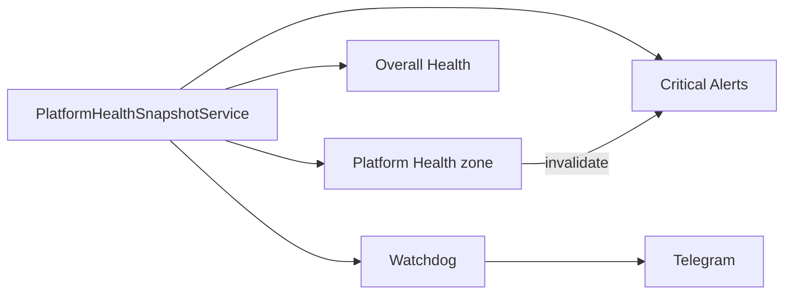

# P0 — Unify Platform Health Snapshot

**Status:** Implemented  
**Captured:** 2026-08-04  
**Scope:** Shared infra health computation only  
**Canvas:** [`p0-unify-platform-health-snapshot.canvas.tsx`](/Users/ravi/.cursor/projects/Users-ravi-radium-service-desk/canvases/p0-unify-platform-health-snapshot.canvas.tsx)

---

## Summary

Platform Health, Critical Alerts, Overall Health, and Telegram/Watchdog now consume one shared infra health snapshot. Refreshing Platform Health immediately drops the Critical Alerts bake so “Platform Health Critical” cannot lag behind a Healthy probe.

| Metric | Value |
| --- | --- |
| Shared snapshot | 1 |
| Migration | Cache only |
| KPI / alert semantics | Unchanged |
| Related tests | 38/38 |

### Verdict

| Observation | Cause | Fix |
| --- | --- | --- |
| PH Healthy + Critical Alerts “Platform Health Critical” | Independent 120s critical_alerts zone bake | Shared snapshot + invalidate Critical Alerts on health store/refresh |
| Executive Snapshot Critical while PH Healthy | KPI thresholds (cases/waiting/refunds) | Intentional — ES KPIs unchanged; not Platform Health |
| Telegram vs Platform Health drift | Watchdog re-probed Ops system health separately | Queue/automation prefer shared snapshot when warm |

### Non-goals honored

No UI redesign · no KPI threshold changes · no automation business logic · no ledger writes · no Telegram fingerprint / terminal classifier changes

---

## Current architecture (before)

| Surface | Meaning of Critical | Source |
| --- | --- | --- |
| Platform Health | Worst of live infra probes | PlatformHealthCardProvider → zone + overview |
| Critical Alerts “Platform Health” | Cached alert from prior PH / overview | PlatformHealthAlertContributor → baked 120s |
| Executive Snapshot | Worst of business KPI cards | ExecutiveSnapshotZone::worstStatus |
| Telegram | Watchdog ProductionCriticalAlert list | ProductionWatchdogService SQL / Ops health |

`relatedOverviewKeys(platform_health)` cleared overview + overall-health only — not critical_alerts. Manual PH refresh left Critical Alerts stale.

---

## Duplicate paths

| Concept | Before | After |
| --- | --- | --- |
| Infra probe aggregation | Card provider probed; contributors read zone/overview separately | `PlatformHealthSnapshotService::probe()` once |
| Platform Health alert input | Zone snapshot OR overview cache | `healthSnapshot->current()` only |
| Overall Health PH contribution | Zone snapshot OR overview | Same shared snapshot |
| Watchdog queue/automation | OpsSystemHealth + ledger SQL only | Prefer shared components when warm; ledger fallback |
| Critical Alerts coherence | Independent TTL | Forgotten on snapshot store + contributor refresh |

### Still separate (by design)

Executive Snapshot KPI status remains independent. Critical Cases ≥3 / Waiting ≥10 / Refunds ≥5 can keep ES Critical while infra is Healthy.

---

## New shared architecture

### PlatformHealthSnapshotService

- `probe()` — registry.probeAll + worst status → store
- `current()` — read `platform:health:snapshot`
- `store()` — writes snapshot + thin overview; forgets `critical_alerts` + overall-health

### Consumers

| Consumer | How it uses the object |
| --- | --- |
| Platform Health card/zone | `probe()` on refresh; metrics from components |
| Critical Alerts PH alert | `current()` → severity mapping unchanged |
| Overall Health contribution | `current()` → PlatformOverallHealthStatus |
| Watchdog / Telegram | Queue component when warm; automation Critical uses metrics then ledger fallback |
| Executive Snapshot | Unchanged KPI math; still contributes own alert |

### Invalidation

`dependentZones(platform_health|executive_snapshot|integration_health) → critical_alerts`. Called from snapshot store, dashboard refresh, and zone warmers.



---

## Files modified / added

| File | Role |
| --- | --- |
| `app/Data/Platform/PlatformHealthSnapshot.php` | New shared health DTO |
| `app/Services/Platform/Health/PlatformHealthSnapshotService.php` | Single probe/cache/store; invalidates Critical Alerts |
| `app/Services/Platform/Cards/PlatformHealthCardProvider.php` | Consumes snapshot service (no local probe) |
| `app/Services/Platform/Alerts/Contributors/PlatformHealthAlertContributor.php` | Reads shared snapshot only |
| `app/Services/Platform/Health/Contributors/PlatformHealthContributionProvider.php` | Overall Health from shared snapshot |
| `app/Services/Operations/ProductionWatchdogService.php` | Queue/automation prefer shared snapshot |
| `app/Services/Platform/PlatformCachePolicy.php` | Snapshot key + dependentZones() |
| `app/Services/Platform/PlatformCacheInvalidator.php` | Forget Critical Alerts on contributor change |
| `app/Services/Platform/PlatformDashboardService.php` | invalidateDependents after zone refresh |
| `app/Services/Platform/Warmers/AbstractZoneSnapshotWarmer.php` | invalidateDependents after warm |
| `app/Services/Platform/Zones/CriticalAlertsZone.php` | Sources warm includes shared snapshot |
| `tests/Feature/Platform/PlatformHealthSnapshotUnificationTest.php` | Coherence + intentional ES/PH separation |

---

## Migration impact

| Item | Value |
| --- | --- |
| DB migrations | None |
| New cache key | `platform:health:snapshot` |
| Stale bake | ≤120s max, or immediate on health store/refresh |

| Step | Effect |
| --- | --- |
| Deploy | Code only — no schema |
| First warm / PH refresh | Populates shared snapshot + overview |
| On store | critical_alerts forgotten → rebuilds from contributors |
| Telegram | Uses snapshot when warm; else prior ledger/Ops paths |

---

## Test results

| Suite | Coverage | Result |
| --- | --- | --- |
| PlatformHealthSnapshotUnificationTest | 5 | Pass |
| PlatformHealthCardTest | included | Pass |
| DashboardIntelligenceTest | included | Pass |
| ProductionWatchdogTest | included | Pass |
| IntelligentAutomationAlertSemanticsTest | included | Pass |
| PlatformProductionHardeningTest | included | Pass |
| Combined filter | 38 / 38 | Pass |

```bash
php artisan test --filter='PlatformHealthSnapshotUnificationTest|PlatformHealthCardTest|DashboardIntelligenceTest|ProductionWatchdogTest|IntelligentAutomationAlertSemanticsTest|PlatformProductionHardeningTest'
```

---

## Rollback

Revert the unifying commit(s). Flush shared caches. Prior dual-path behavior returns (including possible PH vs Critical Alerts lag).

| Step | Action |
| --- | --- |
| 1 | Revert health-unify commit(s) |
| 2 | Deploy previous build |
| 3 | Flush: `platform:health:snapshot`, `platform:health:overview`, `platform:zone:critical_alerts:snapshot`, `platform:overall-health` |
| 4 | Confirm Critical Alerts rebuilds on next warm |
