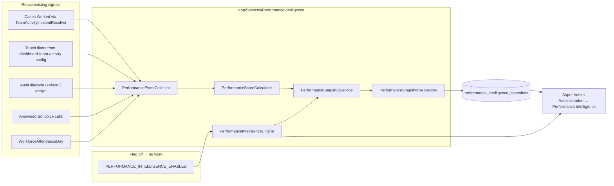

# Performance Intelligence — Phase 0 (Shadow Mode)

**Date:** 2026-08-05  
**Type:** Implementation report  
**Source of truth:** [radium-performance-engine-blueprint.md](./radium-performance-engine-blueprint.md)  
**Status:** Phase 0 delivered behind feature flag; no employee-facing surface

---

## 1. Verdict

Phase 0 builds the full Performance Intelligence **engine, daily snapshots, explainability, and Super Admin–only review screen** in **shadow mode**.

| Constraint | Status |
|------------|--------|
| `PERFORMANCE_INTELLIGENCE_ENABLED=false` by default | Yes |
| Zero runtime impact when disabled | Yes — capture no-ops; schedule gated; UI/nav hidden |
| No employee visibility | Yes — Super Admin + flag only |
| No awards / leaderboards / badges / gamification / AI | Yes — not implemented |
| No existing KPI changes | Yes — reads Cases Worked / touches / attendance; does not mutate them |
| Every score explainable | Yes — `explanations` JSON on every snapshot |

---

## 2. Feature flag

| Key | Default | Effect when false |
|-----|---------|-------------------|
| `PERFORMANCE_INTELLIGENCE_ENABLED` | `false` | Engine `captureDay` skips; Artisan command exits cleanly; schedule `when()` false; Super Admin routes/nav deny |
| `PERFORMANCE_INTELLIGENCE_SNAPSHOT_TIME` | `00:15` | Daily schedule time (only if enabled) |

Config: `config/performance_intelligence.php`  
Env sample: `.env.example`

---

## 3. Architecture



| Class | Role |
|-------|------|
| `PerformanceIntelligenceEngine` | Façade: enabled?, capture, list/explain snapshots |
| `PerformanceEventCollector` | Batched day inputs; reuses CW resolver + existing allowlists |
| `PerformanceScoreCalculator` | Transparent pillar + composite math + explanation lines |
| `PerformanceSnapshotService` | Orchestrates collect → score → upsert; no-op when disabled |
| `PerformanceSnapshotRepository` | Persist / query by date (idempotent upsert) |
| `PerformanceDayInputs` / `PerformanceScoreResult` | Immutable DTOs |
| `PerformanceIntelligenceAccess` | Super Admin **and** flag enabled |
| `CapturePerformanceIntelligenceSnapshotCommand` | `performance-intelligence:snapshot {--date=}` |

No duplicated Cases Worked / Customer Touches business logic — collector calls `TeamActivityIncidentResolver::casesWorkedRowsQuery` and mirrors touch filters from config.

---

## 4. Scoring (Phase 0.1)

Composite (blueprint §3.2):

```
0.35×Outcome + 0.20×Reach + 0.20×Contribution + 0.10×Commitment + 0.15×Quality
```

| Pillar | Phase 0 inputs (summary) |
|--------|---------------------------|
| **Outcome** | Resolve ×8; close-after-resolve ×2 / close-only ×5; refund decision ×4 → normalize |
| **Reach** | Cases Worked; **zeroed** without substance (outcome / WA / email / answered call) |
| **Contribution** | Answered calls, manual WA, emails; capped remarks / intermediate status / assign; **CT diagnostic only** |
| **Commitment** | Extra / Leave / Holiday points only if Outcome floor met; soft OT points from payroll `overtime_seconds` |
| **Quality** | 100 − reopens×15 (floor 0); low-volume note in explanations |

Anti-gaming: remark/status/assign caps; **note deletes excluded** from PI contribution inputs.

Full point/cap tables live in `config/performance_intelligence.php` and are stored on snapshots under `feature_flags` + `version`.

---

## 5. Snapshot schema

Table: `performance_intelligence_snapshots`  
Unique: `(user_id, snapshot_date)`

| Column | Purpose |
|--------|---------|
| `snapshot_date` | Employee calendar day |
| `outcome_score` … `quality_score` | Pillars 0–100 |
| `composite_score` | Weighted index |
| `breakdown` | Raw pillar points + weights |
| `inputs` | Raw metrics for debug (CW, CT, lifecycle, attendance, …) |
| `explanations` | Human lines: why each pillar / composite |
| `version` | e.g. `phase0.1` |
| `feature_flags` | Flag + version at calculate time |
| `calculation_duration_ms` | Per-employee timing |
| `calculated_at` | Snapshot timestamp |

One row per employee per day; re-capture updates in place (idempotent).

---

## 6. Owner-only UI

**Path:** Admin → Administration → **Performance Intelligence**  
**Access:** `PerformanceIntelligenceAccess` / gate `viewPerformanceIntelligence` — Super Admin only, and only when flag is on.

| Screen | Shows |
|--------|-------|
| Index | Employees for a date: composite + five pillars |
| Show | Inputs, raw metrics, pillar explanations, composite explanation |
| Intuition vs score | Query-string placeholder only — architecture for later calibration; **no AI**, not persisted |

Not shown: rankings as awards, badges, leaderboards, employee My Performance integration.

---

## 7. Observability & performance

- Every calculation writes `explanations` — black-box scores are rejected by design.
- Collector batches by user-id lists (CW query, audits, calls, attendance) — no per-user N+1 metric loops.
- Dashboard paths do not call the engine when the flag is off.
- Schedule: `performance-intelligence:snapshot` daily at configured time, `->when(enabled)`.

---

## 8. Tests

| Suite | Covers |
|-------|--------|
| `tests/Unit/PerformanceIntelligence/PerformanceScoreCalculatorTest.php` | Pillar math, substance gate, caps |
| `tests/Feature/PerformanceIntelligence/PerformanceIntelligenceAccessTest.php` | Super Admin only; nav visibility |
| `tests/Feature/PerformanceIntelligence/PerformanceIntelligenceFeatureFlagTest.php` | Disabled = no UI, no snapshots, command skip |
| `tests/Feature/PerformanceIntelligence/PerformanceIntelligenceSnapshotTest.php` | Persist + explain + idempotent upsert |
| `tests/Feature/PerformanceIntelligence/PerformanceIntelligenceBatchPerformanceTest.php` | Batch query bound for multi-user capture |

Run:

```bash
php artisan test tests/Unit/PerformanceIntelligence tests/Feature/PerformanceIntelligence
```

---

## 9. Explicitly out of scope (Phase 0)

Awards · Leaderboards · Achievements · Bonus · Promotion · Gamification · AI coaching · Badges · Notifications · Employee UI · Replacing Cases Worked / Customer Touches · Changing payroll OT or attendance Extra rules.

---

## 10. How to operate (owner)

1. Set `PERFORMANCE_INTELLIGENCE_ENABLED=true` in the environment (staging first).
2. `php artisan config:clear` (or reload config).
3. Capture a day: `php artisan performance-intelligence:snapshot --date=YYYY-MM-DD`
4. Sign in as Super Admin → Administration → Performance Intelligence.
5. Open an employee → read explanations; optionally pass intuition query params for mental calibration.
6. Keep flag `false` in production until shadow correlation is accepted.

---

## 11. File map

| Area | Paths |
|------|-------|
| Config | `config/performance_intelligence.php` |
| Migration | `database/migrations/2026_08_05_120000_create_performance_intelligence_snapshots_table.php` |
| Model | `app/Models/PerformanceIntelligenceSnapshot.php` |
| Services | `app/Services/PerformanceIntelligence/*` |
| DTOs | `app/Data/PerformanceIntelligence/*` |
| Access | `app/Support/Administration/PerformanceIntelligenceAccess.php` |
| Command | `app/Console/Commands/CapturePerformanceIntelligenceSnapshotCommand.php` |
| Schedule | `bootstrap/app.php` |
| HTTP | `app/Http/Controllers/Admin/PerformanceIntelligenceController.php` |
| Views | `resources/views/admin/performance-intelligence/*` |
| Nav | `resources/views/navigation/administration-workspace-nav.blade.php` |
| Routes | `routes/web.php` (`admin.performance-intelligence.*`) |
| Tests | `tests/Unit/PerformanceIntelligence/*`, `tests/Feature/PerformanceIntelligence/*` |

---

## 12. Next phases (not started)

Per blueprint roadmap: shadow correlation → live RPE lite pillars → Quality/complexity/boards → AI insights. Phase 0 only prepares the substrate and owner explain screen.
