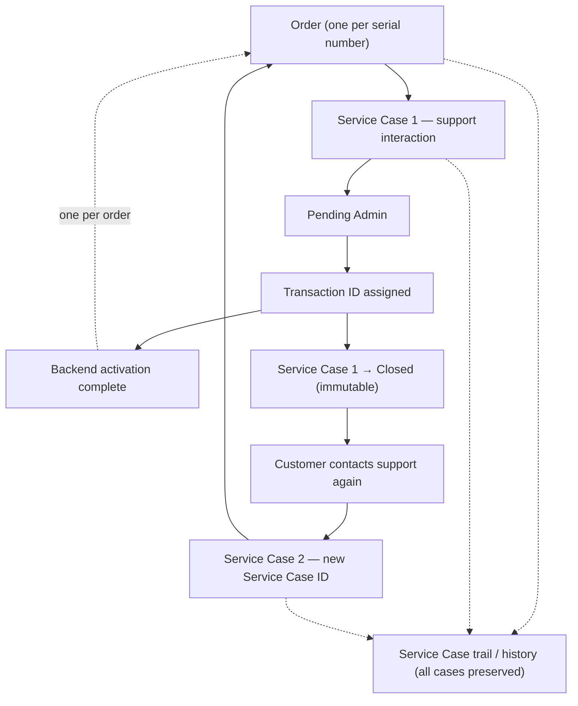

# Radium Service Desk — Product Foundations

This document defines the long-term business rules and product philosophy for Radium Service Desk. It is the authoritative reference for ownership, assignment, activation, immutability, corrections, data integrity, and dashboard design. Implementation may lag this document; when they diverge, this document states the intended foundation.

**Status:** Foundational policy  
**Audience:** Product, engineering, operations, and support leadership  
**Last updated:** 2026-06-26

---

## Table of Contents

1. [Ownership Philosophy](#1-ownership-philosophy)
2. [Service Case Ownership](#2-service-case-ownership)
3. [Activation Lifecycle](#3-activation-lifecycle)
4. [Record Immutability](#4-record-immutability)
5. [Correction Workflow](#5-correction-workflow)
6. [Future Reactivation](#6-future-reactivation)
7. [Dashboard Philosophy](#7-dashboard-philosophy)
8. [Future Performance Rating](#8-future-performance-rating)
9. [Data Integrity Principles](#9-data-integrity-principles)
10. [Assignment & Ownership Lifecycle](#10-assignment--ownership-lifecycle)

---

## 1. Ownership Philosophy

The dashboard is an **operational work console**, not an analytics or executive reporting surface.

### Purpose

The dashboard exists to help each user answer:

> **What should I work on next?**

It does **not** exist to answer:

> How is the business performing?

Operational metrics that support prioritization and workload visibility are in scope. Historical business performance, trend analysis, and executive KPIs belong elsewhere (reports, exports, or dedicated analytics tools)—not on the main dashboard.

### Design implications

- Views should be **action-oriented**: queues, assignments, pending items, and next steps.
- Filters and counts should reflect **current responsibility**, not long-range history.
- The primary user question is **"What is mine to do now?"**, not **"How did we perform last quarter?"**

---

## 2. Service Case Ownership

Every **active** Service Case has exactly **one current owner** at any point in time.

### Current owners

| Owner type | Description |
|------------|-------------|
| **Agent** | Front-line operational handler |
| **Admin** | Escalation, completion, and administrative actions |

### Future owners

The ownership model must extend without redesign. Planned future owner types include:

- Sales
- Accounts
- Warranty
- Other departments as needed

### Reassignment

Ownership **may change** through explicit reassignment. Full lifecycle rules, event types, and timeline requirements are defined in [§10 Assignment & Ownership Lifecycle](#10-assignment--ownership-lifecycle).

- Reassignment must be traceable (who changed ownership, when, and ideally why).
- At no time may an active Service Case have zero owners or multiple simultaneous owners, except transiently during an **Unassigned** event until the next assignment.

### Invariants

| Rule | Requirement |
|------|-------------|
| Single owner | One active Service Case → one current owner |
| Active only | Ownership rules apply to active Service Cases |
| Extensibility | New owner types are additive, not a model rewrite |

---

## 3. Activation Lifecycle

Activation is complete when a **Transaction ID** is assigned to the related Order. Until then, the case is pending administrative completion.

### Normal workflow

```
New Order
    ↓
Service Case
    ↓
Pending Admin
    ↓
Transaction ID Assigned
    ↓
Completed / Resolved
```

### Stage definitions

| Stage | Meaning |
|-------|---------|
| **New Order** | Order record exists with device and customer context (order ID, serial number, product, etc.). |
| **Service Case** | A Service Case is opened against the order (support, activation issue, remote help, etc.). |
| **Pending Admin** | The case awaits administrative action—typically Transaction ID assignment. |
| **Transaction ID Assigned** | A Transaction ID is recorded on the order. |
| **Completed / Resolved** | The order is considered **activated**; the operational activation workflow is finished. |

### Activation rule

> **Once a Transaction ID exists, the order is considered activated.**

Activation is an **order-level** state driven by the presence of a Transaction ID, not a separate boolean flag. Service Cases on that order reflect activation status through their relationship to the order.

### Serial number and Transaction ID

- Each serial number maps to **one order** in the system.
- Each activated order holds **one Transaction ID** at a time.
- Assigning a Transaction ID completes activation for that serial number's order.

### Service Case Completion Rule

Assigning a Transaction ID completes **backend activation** and **closes the current Service Case** in a single operational step. Service Cases represent **support interactions**, not activations. Activation is an order-level outcome; case closure is the terminal state for that support interaction.

#### Rules

| # | Rule |
|---|------|
| 1 | Assigning a Transaction ID completes backend activation for the Order. |
| 2 | Immediately after a Transaction ID is successfully assigned, the **current** Service Case is considered completed and **automatically moves to Closed** status. |
| 3 | A Closed Service Case is **immutable from a workflow perspective** and is **never reopened**. |
| 4 | If the customer contacts support again for the same product or serial number, a **new Service Case must always be created**. |
| 5 | Each new Service Case: receives a **new Service Case ID**; remains linked to the **same Order**; remains linked to the **same Serial Number**; **preserves complete history**; and appears in the **Service Case trail/history**. |
| 6 | Over the product lifecycle there is always: **one Order**, **one Activation** (Transaction ID), and **many Service Cases**. |
| 7 | Service Cases represent **support interactions**, not activations. |

#### Cardinality

```
One Order
    └── One Serial Number
    └── One Activation (one Transaction ID)
    └── Many Service Cases (support interactions over time)
```

#### Lifecycle workflow

The diagram below shows how activation completion closes the active case and how subsequent support creates a new case on the same order.



#### Distinction from order activation

| Concept | Scope | Terminal state |
|---------|-------|----------------|
| **Activation** | Order | Transaction ID assigned; order is activated |
| **Service Case completion** | Current support interaction | Closed when Transaction ID is assigned on that case's activation path |
| **Follow-up support** | New interaction | Always a **new** Service Case on the same Order |

Closed cases remain readable for audit and history. Workflow actions (reassignment, reopen, pending admin for activation on that case) do not apply to Closed cases. New work is always expressed as a new Service Case.

---

## 4. Record Immutability

After activation, core activation fields are **immutable** for standard roles. Corrections are a separate, audited process (see [§5 Correction Workflow](#5-correction-workflow)).

### Locked fields after activation

| Field | Agent | Admin | Super Admin |
|-------|-------|-------|-------------|
| **Serial Number** | Cannot edit | Cannot edit | May correct (via correction workflow) |
| **Transaction ID** | Cannot edit | Cannot edit | May correct (via correction workflow) |

### Scope

- **Agent** and **Admin** must not modify Serial Number or Transaction ID on activated orders through normal edit flows.
- **Super Admin** is the only role authorized to perform corrections on these fields.
- Other order or case fields may have their own policies; this section governs activation-critical data only.

### Rationale

Serial Number and Transaction ID are the legal and operational anchor of activation. Allowing silent edits after activation would break audit integrity and customer trust.

---

## 5. Correction Workflow

Corrections fix **human mistakes**. They are **not** reactivations, not new activations, and not a way to bypass lifecycle rules.

### What a correction is

| Corrections are | Corrections are not |
|-----------------|---------------------|
| Fixes for data entry errors | Reactivations |
| Super Admin–governed changes | Routine edits by Agent or Admin |
| Fully audited events | Silent overwrites |

### Mandatory audit record

Every correction **must** capture:

| Field | Required |
|-------|----------|
| **Old value** | Yes |
| **New value** | Yes |
| **Reason** | Yes (mandatory) |
| **Corrected by** | Yes |
| **Timestamp** | Yes |
| **Related Order** | Yes |
| **Related Service Case** | Yes, when applicable |

### Audit principle

> **Nothing should be overwritten without an audit trail.**

Implementation must preserve history. Corrections append to the audit record; they do not erase evidence of the prior state.

### Relationship to unlock

Any future or existing "unlock" capability for Transaction ID must conform to this correction model: reason required, full audit trail, Super Admin only—not an informal reset.

---

## 6. Future Reactivation

Reactivation is **not part of the current system**. This section documents intent only.

### Possible future workflow

Reactivation would apply when a device or order must be activated again after a long-valid prior activation—for example, replacement hardware, warranty replacement, or contractual re-provisioning.

Indicative requirements (subject to product approval):

| Requirement | Direction |
|-------------|-----------|
| **Minimum elapsed time** | At least one year after prior activation |
| **Approval** | Special approval required |
| **New order** | A new Order record (not reuse of the activated order) |
| **New Transaction ID** | A distinct Transaction ID for the new activation |
| **Audit history** | Full linkage to prior order, case, and activation history |

### Current system boundary

Until reactivation is explicitly designed and built:

- Do not treat corrections as reactivations.
- Do not assign a second Transaction ID to the same serial number through unlock-and-reassign without a defined reactivation policy.
- Completed activations remain terminal for normal operational workflows.

---

## 7. Dashboard Philosophy

The dashboard reflects **ownership** and **operational workload**. It is a live console for people doing the work.

### In scope

- Items **owned by** or **assigned to** the current user
- Queues filtered by role (Agent, Admin, future departments)
- Pending Admin cases awaiting Transaction ID
- Work-in-progress and actionable Service Cases
- Operational counts that drive **what to do next** (e.g., my open cases, overdue under SLA, unassigned in my queue)

### Out of scope on the main dashboard

- Historical reporting (monthly trends, year-over-year comparisons)
- Executive or business-performance KPIs
- Deep analytics better served by reports or BI tools
- Metrics that answer "how are we performing?" rather than "what should I do?"

### KPI guidance

| Prefer | Avoid |
|--------|-------|
| My open workload | Company-wide historical throughput |
| Pending items I can act on | Activation rate over last 12 months |
| SLA risk on owned cases | Revenue or sales aggregates |
| Unassigned cases in my scope | Correction rate trends (belongs in rating/reporting) |

Dashboard KPIs should help users **prioritize and complete work**, not **review past performance**.

---

## 8. Future Performance Rating

Performance rating is a **future capability**. This section lists candidate categories only. **No formulas, weights, or scoring logic are defined yet.**

### Candidate rating dimensions

| Category | Description (indicative) |
|----------|--------------------------|
| **SLA compliance** | Timeliness against defined service levels |
| **Data accuracy** | Quality of order and case data at entry and completion |
| **Correction events** | Frequency and severity of post-activation corrections tied to the user |
| **Customer feedback** | Customer satisfaction or feedback signals where collected |
| **Successful resolutions** | Cases closed or activated correctly without escalation or rework |
| **Sales performance** | Where Sales owns cases or contributes to outcomes |
| **After-hours support** | Coverage and quality outside standard hours |
| **Collaboration** | Handoffs, reassignment quality, and cross-team support |

### Explicit non-goals (for now)

- No scoring formulas
- No weighting between categories
- No automated rating implementation
- No tie-in to compensation or HR systems until separately approved

When rating is implemented, it must align with [§1 Ownership Philosophy](#1-ownership-philosophy) and [§7 Dashboard Philosophy](#7-dashboard-philosophy): operational fairness and measurable behavior, not dashboard vanity metrics.

---

## 9. Data Integrity Principles

This section states the cross-cutting data integrity rules that underpin [§3 Activation Lifecycle](#3-activation-lifecycle), [§4 Record Immutability](#4-record-immutability), [§5 Correction Workflow](#5-correction-workflow), and [§6 Future Reactivation](#6-future-reactivation). All current and future modules must conform to these principles.

### Single Source of Truth

The system must maintain unambiguous ownership of activation data:

| Rule | Requirement |
|------|-------------|
| **Serial Number → Order** | One Serial Number belongs to one **active** Order. |
| **Order → Activation** | One active Order owns one activation. |
| **Service Case → Order** | One Service Case belongs to one Order. |
| **Order → Service Cases** | Multiple Service Cases may exist for one Order. |

These rules prevent duplicate activations, split records, and conflicting device identity. Historical orders may exist in the archive, but only one Order may be **active** for a given Serial Number at any time.

### Immutability

After activation (see [§3](#3-activation-lifecycle)):

- **Serial Number** becomes immutable.
- **Transaction ID** becomes immutable.

Only **Super Admin** may perform a correction on these fields, and only through the correction workflow defined in [§5](#5-correction-workflow).

Immutability applies to business-critical activation data—not to operational metadata such as Service Case ownership, status, or remarks, unless separately governed.

### Correction vs Reactivation

These are distinct workflows and must never be conflated:

| Workflow | Purpose |
|----------|---------|
| **Correction** | Fixes human error on existing records. Same business event; data was wrong. |
| **Reactivation** | Represents a new business event. A prior activation occurred; a new activation is required. |

**Corrections are not reactivations.** A correction adjusts a mistake. A reactivation creates a new activation lifecycle (see [§6](#6-future-reactivation)). Implementation, UI, permissions, and audit records must keep these paths separate.

### Audit First

No business-critical field should ever be silently changed.

Every correction must produce an audit trail capturing at minimum the requirements in [§5](#5-correction-workflow): old value, new value, reason, corrected by, timestamp, related Order, and related Service Case when applicable.

Audit records are append-only evidence. They do not replace history; they document changes to it.

### Future Extensibility

Future modules must **reuse these same principles** instead of creating separate rules:

- Sales
- Warranty
- Accounts
- CRM
- Inventory

Any new module that touches Orders, Serial Numbers, Transaction IDs, or Service Cases inherits:

- Single source of truth constraints
- Post-activation immutability
- Separation of correction and reactivation
- Audit-first change management

Module-specific workflows may add fields and processes, but must not weaken or bypass these foundations.

---

## 10. Assignment & Ownership Lifecycle

This section defines how Service Case ownership is assigned, transferred, recorded, and measured. It extends [§2 Service Case Ownership](#2-service-case-ownership) with operational lifecycle rules. Assignment changes ownership of **work**; they are not corrections to activation data (see [§5](#5-correction-workflow) and [§9](#9-data-integrity-principles)).

### Ownership

Every **active** Service Case has exactly **one current owner** (see [§2](#2-service-case-ownership)).

Additional requirements:

- **Ownership history must never be lost.** Prior owners, handoffs, and timing remain permanently accessible.
- **Every ownership change becomes part of the permanent timeline.** The current owner is a pointer; the history is the record of truth.

At no time may an ownership change overwrite or delete a prior assignment event.

### Assignment Events

Each ownership change is an **assignment event**. Every event must record:

| Field | Required |
|-------|----------|
| **Previous owner** | Yes (or explicit unassigned state) |
| **New owner** | Yes (or explicit unassigned state) |
| **Event type** | Yes |
| **Initiated by** | Yes |
| **Reason** | Yes when required by event type (see [Self Assignment](#self-assignment)) |
| **Timestamp** | Yes |

#### Event types

| Event type | Description (indicative) |
|------------|--------------------------|
| **Auto Assignment** | System assigns owner on create or by rule (e.g., shift-based routing) |
| **Manual Assignment** | A user explicitly assigns the case to another user |
| **Self Assignment** | An authorized user claims ownership from another user |
| **Transfer** | Ownership moves from one user to another without escalation |
| **Escalation** | Ownership moves to a higher tier (e.g., Agent → Admin) |
| **Auto Escalation** | System escalates based on SLA, priority, or handover rules |
| **Reopened** | A previously closed or resolved case returns to active work; ownership is (re)assigned |
| **Unassigned** | Case has no current owner; must be resolved by a subsequent assignment event |

Event types must be stored explicitly—not inferred solely from role changes—so reporting and audit remain reliable.

### Shift Handover

When an owner does not complete required work before **SLA threshold** or **shift handover**:

- The Service Case **may automatically move** to another eligible owner.
- The **previous owner remains recorded** in the assignment history.
- The **delay duration** (time under prior ownership without required completion) **must be recorded**.
- **No history may be overwritten.** Handover is a new assignment event, not a silent reassignment.

Shift handover rules must align with [§7 Dashboard Philosophy](#7-dashboard-philosophy): the dashboard surfaces work the new owner should act on next; handover events explain why ownership changed.

### Self Assignment

Authorized users may **claim ownership** from another user (Self Assignment).

Requirements:

- The action **must always be logged** as an assignment event.
- A **reason should be mandatory** (e.g., prior owner unavailable, specialist needed, workload balancing).
- Previous and new owner must both appear in the event record.

Self Assignment is not a correction and does not modify Order or activation data.

### Performance Measurement

Assignment events are the **source data** for future quality and performance metrics. They feed [§8 Future Performance Rating](#8-future-performance-rating) but are recorded for operational integrity regardless of when rating is implemented.

Indicative metrics derived from assignment events ( **no formulas defined** ):

| Metric area | Examples |
|-------------|----------|
| **Timeliness** | SLA compliance |
| **Ownership duration** | Average ownership duration per owner or event type |
| **Escalation** | Auto escalations; manual escalations |
| **Handoffs** | Manual transfers; shift handovers |
| **Claiming** | Self assignments |
| **Rework** | Reopened cases |
| **Data quality** | Correction events (see [§5](#5-correction-workflow)) |

These metrics belong in **rating and reporting surfaces**, not on the main operational dashboard (see [§7](#7-dashboard-philosophy)).

### Timeline

Every assignment event **must appear** in the Service Case **activity timeline**.

The timeline is the **permanent audit history of ownership** for that case. Users reviewing a case should see a complete, ordered sequence of who owned the work, when, why, and under which event type—alongside other case activity (status changes, remarks, activation events).

Timeline entries must be append-only. Editing or removing assignment history is not permitted except through Super Admin correction of erroneous audit entries, following [§5](#5-correction-workflow).

### Future AI

**Not part of the current system.** Possible future capabilities include:

| Capability | Description (indicative) |
|------------|--------------------------|
| **SLA prediction** | Predict likely SLA breaches before they occur |
| **Reassignment recommendation** | Suggest optimal owner based on workload, skill, or shift |
| **Workload imbalance detection** | Detect uneven queue distribution across owners or teams |
| **Ownership pattern analysis** | Detect repeated ownership changes that may indicate process or training issues |

Any future AI feature must:

- Recommend or assist only; **not** silently reassign ownership without an assignment event
- Preserve full audit history per this section and [§9 Audit First](#audit-first)
- Align with [§1 Ownership Philosophy](#1-ownership-philosophy): support **what to work on next**, not replace human accountability

No implementation details, models, or integrations are defined here.

---

## Document maintenance

| Change type | Action |
|-------------|--------|
| New owner type | Update §2 and §10; ensure reassignment and dashboard filters are specified before build |
| Assignment or handover rule change | Update §10; cross-check §2, §7, §8 |
| Activation or Service Case completion rule change | Update §3 (including Service Case Completion Rule) and cross-check §4–§6, §9, §10 |
| Correction policy change | Update §5 and §9; never reduce audit requirements |
| Data integrity rule change | Update §9 and cross-check §3–§6 |
| Dashboard scope change | Update §7; reject historical reporting on main dashboard unless this document is amended |
| Rating implementation | Add a new document for formulas; keep §8 as category reference; derive inputs from §10 assignment events |
| New module (Sales, CRM, etc.) | Confirm conformance with §9 and §10 before build |

---

## Related concepts (implementation mapping)

For engineering reference only—this table maps foundation terms to common system entities:

| Foundation term | Typical system entity |
|-----------------|----------------------|
| Order | `orders` |
| Service Case | `incidents` |
| Transaction ID | `orders.transaction_id` |
| Pending Admin | Order without Transaction ID; case awaiting completion |
| Activated / Completed | Order with Transaction ID assigned |
| Closed Service Case | Service Case in terminal Closed status after Transaction ID assignment; never reopened (see §3 Service Case Completion Rule) |
| Owner | Assignee on Service Case (extensible to departments) |
| Assignment event | Ownership change with type, reason, and timeline entry (see §10) |
| Correction | Audited Super Admin change with reason (see audit log) |

Implementation must converge toward this document over time.
