# Radium Desk Master Architecture — Version 2.0

**Version:** 2.0  
**Task:** P28-06-005  
**Status:** Single reference for all future development  
**Audience:** Product, engineering, operations, support leadership, and new contributors  
**Last updated:** 2026-06-28

This document answers one question:

> **How does the entire Radium Desk ecosystem work?**

It consolidates all existing product documentation into one navigable architecture. Implementation may lag this document; when they diverge, this document states the intended direction.

**Do not duplicate source documents.** Use this file for orientation, cross-cutting decisions, and roadmap coherence. Follow links for authoritative detail on each topic.

---

## Navigation & Index

| # | Section | Purpose |
|---|---------|---------|
| — | [Cross-Reference Map](#cross-reference-map) | Where to find authoritative detail |
| 1 | [Product Vision](#1--product-vision) | Mission, vision, constitution, principles |
| 2 | [System Architecture](#2--system-architecture) | Ecosystem diagram; Radium Desk as orchestration layer |
| 3 | [Order Workspace](#3--order-workspace) | Permanent UI structure and data sources |
| 4 | [Data Ownership](#4--data-ownership) | Single source of truth by system |
| 5 | [Customer Journey Map](#5--customer-journey-map) | How journeys flow through the workspace |
| 6 | [Communication Architecture](#6--communication-architecture) | Channels, timeline, automation, AI guardrails |
| 7 | [Automation Roadmap](#7--automation-roadmap) | Reusable workflow patterns |
| 8 | [AI Roadmap](#8--ai-roadmap) | Future assistant capabilities (conceptual) |
| 9 | [Compliance](#9--compliance) | Automatic audit generation |
| 10 | [Recognition & Performance](#10--recognition--performance) | KPIs for coaching, not surveillance |
| 11 | [Future Integrations](#11--future-integrations) | Reserved integration contracts |
| 12 | [Product Evolution Roadmap](#12--product-evolution-roadmap) | Phased delivery plan |
| 13 | [Design Commandments](#13--design-commandments) | Permanent development principles |
| — | [Document Maintenance](#document-maintenance) | Keeping documentation synchronized |

---

## Cross-Reference Map

| Topic | Authoritative document | This master doc section |
|-------|------------------------|-------------------------|
| Mission, vision, product principles, decision filter | [Product Constitution](product-constitution.md) | §1 |
| Ownership, activation, immutability, corrections, dashboard policy | [Product Foundations](product-foundations.md) | §1, §4, §9, §10 |
| Order Workspace layout, components, NBA, Customer Story, hierarchy | [Order Workspace Blueprint](order-workspace-blueprint.md) | §3, §6, §7, §8 |
| Seven customer journeys and workspace surface matrix | [Customer Journeys](customer-journeys.md) | §5, §7 |
| Modal action system, workspace contexts, refresh contract | [Workspace Architecture](workspace-architecture.md) | §2, §3 |
| Dashboard inbox, live refresh, quick create, transactions | [Dashboard Architecture](dashboard-architecture.md) | §2, §12 |
| Real-time infrastructure (Reverb) | [Dashboard Reverb Phase 4.2](dashboard-reverb-phase-4.2.md) | §6, §12 |
| Local development setup | [Local Development](local-development.md) | — |
| Release history (v3.5) | [Release Notes v3.5](release-notes-v3.5.md) | §12 |
| Known technical debt | [Remaining Technical Debt](remaining-technical-debt.md) | §12 |
| Interactive workspace mockup | [public/previews/order-workspace.html](../public/previews/order-workspace.html) | §3 |

---

## 1 — Product Vision

### Mission

Radium Desk exists to help every support agent deliver **fast, consistent, accountable, and delightful** customer service. The software must reduce customer waiting time, improve internal collaboration, and create complete operational transparency.

→ Full statement: [Product Constitution — Mission](product-constitution.md#mission)

### Vision

Radium Desk is **not** a traditional service desk. It is an **Operations Workspace**.

| Surface | Role |
|---------|------|
| **Dashboard** | Inbox — answers *"What should I work on next?"* |
| **Order Workspace** | Where work happens — every customer interaction begins and ends here |

→ Full statement: [Product Constitution — Product Vision](product-constitution.md#product-vision)

### Product Constitution

The [Product Constitution](product-constitution.md) is the permanent design reference for mission, vision, principles, UX rules, timeline philosophy, communication philosophy, accountability, recognition, compliance, and the **Product Decision Filter**.

Before implementing any feature, answer:

1. Does it improve customer service?
2. Does it reduce handling time?
3. Does it reduce clicks?
4. Does it improve collaboration?
5. Does it strengthen accountability?
6. Does it improve compliance?
7. Does it belong inside the Order Workspace?

If most answers are **No**, reconsider the feature.

### Core Principles

The constitution defines five product principles. Summarized here; full detail in [Product Principles](product-constitution.md#product-principles):

| Principle | Meaning |
|-----------|---------|
| **One Workspace** | Everything for one customer on one page — no module hopping |
| **One Timeline** | Every important activity creates a timeline entry — the operational story |
| **One Click** | Frequent actions (call, WhatsApp, email, note, assign, schedule) require one click |
| **One Truth** | Each domain has exactly one source of truth — never duplicate ownership |
| **One Goal** | Every feature reduces agent effort; complexity without service improvement is rejected |

Supporting foundations from [Product Foundations](product-foundations.md):

- Dashboard is an **operational work console**, not an analytics surface
- Every active service case has **exactly one owner**
- Activation-critical fields are **immutable** after activation; corrections are audited Super Admin actions
- Assignment history is **append-only** and always visible on timeline

---

## 2 — System Architecture

Radium Desk is the **orchestration layer** that unifies customer operations. It does not own payments, product catalog, or warranty rules — it coordinates them into a single agent experience.

### High-Level Ecosystem Diagram

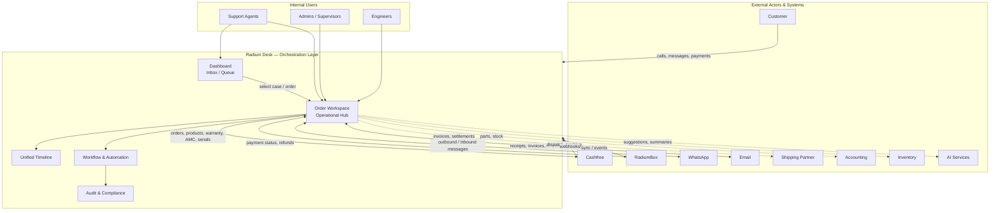

### Orchestration vs. Application

| Layer | Responsibility | Does **not** do |
|-------|----------------|-----------------|
| **Cashfree** | Payment processing, refunds, settlement | Service workflow, agent assignment |
| **RadiumBox** | Orders, products, warranty, AMC, serial numbers, QC, invoicing | Agent timeline, internal notes, SLA tracking |
| **Radium Desk** | Service workflow, timeline, ownership, communications log, SLA, audit | Duplicate payment records, product catalog, gateway settlement |

### Internal Architecture Surfaces

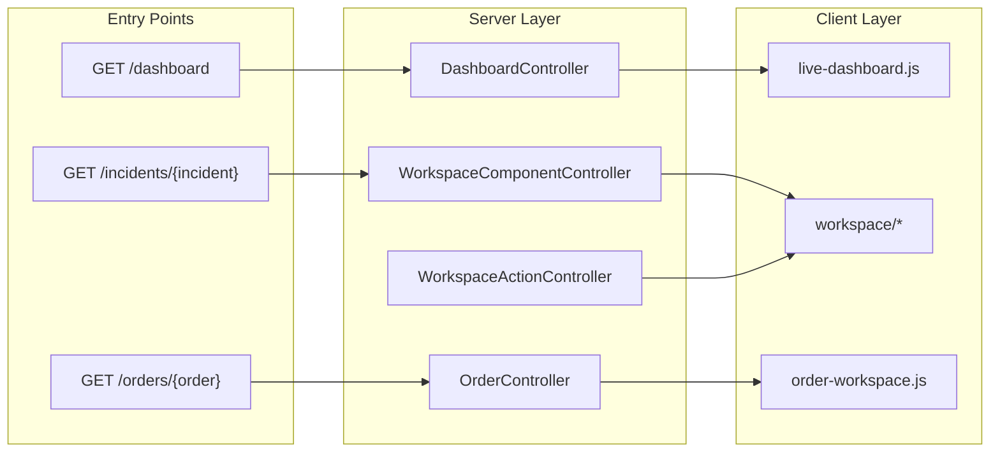

→ Technical detail: [Dashboard Architecture](dashboard-architecture.md), [Workspace Architecture](workspace-architecture.md)

---

## 3 — Order Workspace

The Order Workspace is the **permanent center** of Radium Desk. All integrations (Cashfree, RadiumBox, WhatsApp, Email, AI) enhance this surface — they do not create separate modules.

**Entry point:** `GET /orders/{order}` → three-column layout: left context panel, center work area, right agent assistant.

→ Layout, component review, hierarchy: [Order Workspace Blueprint](order-workspace-blueprint.md)

### Permanent Structure

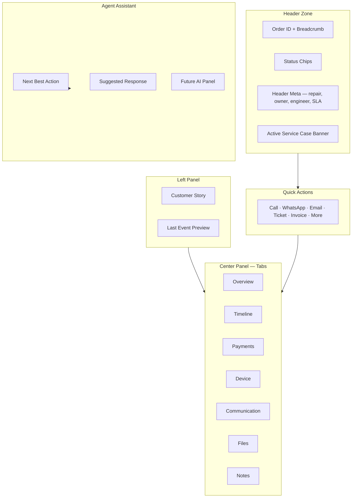

### Section Reference

For each section: **Purpose**, **Data Sources**, **Future Enhancements**.

#### Header

| | |
|---|---|
| **Purpose** | Level 1 identity and state — order ID, repair reference, ownership, SLA risk, activation/payment signals. Answers *"Which order is this and what state is it in?"* in under 3 seconds. |
| **Data Sources** | `orders` (ID, dates, transaction lock), active `incidents` (status, owner, engineer, priority, SLA), derived status chips. See [Information Hierarchy — Level 1](order-workspace-blueprint.md#level-1--always-visible-critical). |
| **Future Enhancements** | Split payment vs. activation chips; SLA-at-risk chip; mobile collapse to Customer Story summary; real-time chip refresh via Reverb. |

#### Quick Actions

| | |
|---|---|
| **Purpose** | One-click access to the most frequent agent actions without leaving the workspace. |
| **Data Sources** | Customer phone/email from order; workspace modal system ([Workspace Architecture](workspace-architecture.md)); future channel integrations. |
| **Future Enhancements** | Primary CTA driven by Next Best Action; workspace modal for remark and create ticket (`order` context); click-to-call (`tel:`); disabled-until-integrated channel composers. |

#### Customer Story

| | |
|---|---|
| **Purpose** | Single-glance narrative for call handling — who the customer is, what device they have, warranty/repair history, preferences, current wait state. Target: answer 80% of inbound calls without tab switching. |
| **Data Sources** | `order.created_at`, `incidents` count/history, status chips, NBA-derived wait state. Warranty and preferences are placeholders until RadiumBox / preference store. See [Customer Story Component](order-workspace-blueprint.md#customer-story-component). |
| **Future Enhancements** | `CustomerStoryService`; preferred channel/language; never fabricate — omit or show "Unknown"; feed top lines to Agent Assistant. |

#### Next Best Action

| | |
|---|---|
| **Purpose** | Configurable, explainable recommendation for the single most valuable action on this order right now. Non-blocking — agent always confirms. |
| **Data Sources** | Order state, incident state, payment state, refund state, warranty state, pickup state. Rule registry in config/DB. See [Next Best Action Framework](order-workspace-blueprint.md#next-best-action-framework). |
| **Future Enhancements** | Rule engine v1; promote NBA as first quick action; dashboard urgency badge; pre-select channel/template in Communication composer. |

#### Overview

| | |
|---|---|
| **Purpose** | Summary dashboard — service case history, repair details, financial snapshot, KPI strip. Default tab on workspace open. |
| **Data Sources** | Order fields, related incidents, summary cards (SLA, priority, payment, warranty), service cases list. |
| **Future Enhancements** | Dedupe with Customer Story; refund summary card; dedicated service cases tab if list grows; RadiumBox QC/invoice cards. |

#### Timeline

| | |
|---|---|
| **Purpose** | Complete operational story — not a raw log. Every entry answers Who, What, When, Why. Append-only audit history for the order. |
| **Data Sources** | `OrderActivityTimelineService`, incident audit events, assignment events, refund events, remarks, future communication entries. See [Timeline Philosophy](product-constitution.md#timeline-philosophy). |
| **Future Enhancements** | Payment received entries; communication summary entries; correction entries; refund/pickup/QC icon types; left-panel last-event preview (1 item). |

#### Payments

| | |
|---|---|
| **Purpose** | Payment and activation hub — gateway payment details, transaction ID assignment, refund linkage. Distinguishes Cashfree payment from backend activation. |
| **Data Sources** | **Cashfree (read):** amount, method, bank reference, gateway IDs. **Radium Desk:** transaction assignment, assigner, timestamp. Order `transaction_id`, `transaction_locked`. |
| **Future Enhancements** | Refund status inline; Cashfree webhook linkage (Level 3); invoice display; NBA trigger for assign-transaction-id. |

#### Device

| | |
|---|---|
| **Purpose** | Device identity and audit trail — serial number, model, product, entry history. Level 3 technical detail. |
| **Data Sources** | **RadiumBox (future):** product catalog, warranty rules. **Radium Desk / Order:** serial, model, assignment audit. |
| **Future Enhancements** | Serial entry audit (who/when); merge with RadiumBox product data; correction history cross-link. |

#### Communication

| | |
|---|---|
| **Purpose** | Unified Communication Center — all customer-facing and internal channels in one chronological feed. |
| **Data Sources** | Future: WhatsApp, email, SMS, phone logs. Today: remarks infrastructure, stubs. See [Communication Center](order-workspace-blueprint.md#communication-center-future). |
| **Future Enhancements** | Channel sub-nav (Phone, WhatsApp, Email, SMS, Internal); unified timeline with filters; templates; delivery/read status; AI suggestions panel. |

#### Files

| | |
|---|---|
| **Purpose** | Attachments — photos, invoices, signed documents, evidence. |
| **Data Sources** | Future file storage service; today placeholder. |
| **Future Enhancements** | Upload from workspace; link to invoice PDF from RadiumBox; photo evidence on repair cases. |

#### Notes

| | |
|---|---|
| **Purpose** | Internal remarks visible to agents — distinct from customer-facing communications. |
| **Data Sources** | `RemarkService`, existing remarks on incidents/order context. |
| **Future Enhancements** | Workspace modal add-remark without tab switch; visibility flag separating internal notes from customer comms; @mentions. |

#### Future AI Panel

| | |
|---|---|
| **Purpose** | Agent Assistant right column — intent detection, suggested replies, next action, supplementary counts. AI recommends; human approves. |
| **Data Sources** | Customer Story lines, NBA output, last customer message (future), order/incident state. |
| **Future Enhancements** | LLM reply drafts; tone/language adjustment; supervisor alerts; knowledge suggestions. See §8. |

---

## 4 — Data Ownership

**Rule:** Never duplicate ownership. Radium Desk reads from authoritative systems and owns only operational workflow data.

### Ownership Matrix

| System | Owns | Radium Desk reads | Radium Desk writes |
|--------|------|-------------------|-------------------|
| **Cashfree** | Payments, refunds (gateway), transactions, settlement | Payment status, amount, method, gateway refs, refund payout status | Nothing — orchestration and display only |
| **RadiumBox** | Orders (catalog), products, warranty, AMC, serial numbers, QC, invoicing | Product name, warranty expiry, AMC status, invoice readiness, dispatch | Service-triggered requests (future): QC pass, generate invoice, schedule dispatch |
| **Radium Desk** | Service workflow, timeline, ownership, assignments, communications log, internal notes, SLA, audit trail | — | All operational workflow state |
| **WhatsApp Business API** (future) | Message delivery, read receipts, template registry | Threads, delivery status | Outbound messages (agent-approved) |
| **Email** (future) | Message transport, thread IDs | Threads, delivery status | Outbound messages (agent-approved) |
| **Shipping Partner** (future) | Tracking, courier assignment | Tracking events | Schedule pickup/dispatch requests |
| **Accounting** (future) | Ledger, tax, formal invoices | Invoice/payment reconciliation status | Export triggers (future) |
| **Inventory** (future) | Parts, stock levels | Availability for repair quotes | Part reservation requests (future) |
| **AI Services** (future) | Model inference | — | Prompts + context; receives suggestions only |

### Radium Desk Internal Entities

Mapping from [Product Foundations — Related concepts](product-foundations.md#related-concepts-implementation-mapping):

| Concept | Typical entity | Owned by |
|---------|----------------|----------|
| Order (operational view) | `orders` | Desk display; RadiumBox owns catalog truth |
| Service Case | `incidents` | Radium Desk |
| Transaction ID | `orders.transaction_id` | Assigned in Desk; immutability enforced by Desk |
| Owner / Assignment event | assignee + timeline | Radium Desk |
| Remark / Internal note | remarks | Radium Desk |
| Refund request (workflow) | refund requests module | Desk workflow; Cashfree owns payout |
| Timeline entry | activity timeline | Radium Desk |

### Activation Data Integrity

From [Product Foundations §9](product-foundations.md#9-data-integrity-principles):

- One serial number → one active order
- One active order → one activation (transaction ID)
- Many service cases per order (support interactions, never reopened)
- Corrections ≠ reactivations — separate audited workflows

---

## 5 — Customer Journey Map

All seven customer journeys converge on the **Order Workspace** as the operational hub. Service cases, payments, communications, and timeline entries are facets of the same order.

→ Authoritative detail: [Customer Journeys](customer-journeys.md)

### Journey Overview

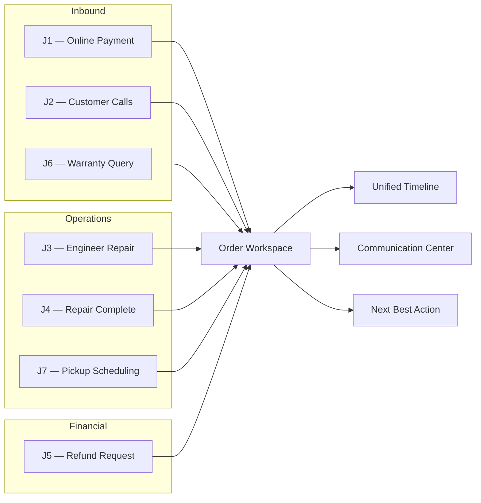

### How Every Journey Flows Through the Workspace

| Journey | Trigger | Workspace entry | Primary surfaces | Agent outcome |
|---------|---------|-----------------|------------------|---------------|
| **J1 — Online Payment** | Cashfree webhook | Dashboard broadcast → open order | Status chips, Payments, Overview, Timeline | Confirm payment, collect device details |
| **J2 — Customer Calls** | Inbound phone | Search by phone/order/serial | Customer Story, header, Agent Assistant | Answer in ≤10s; log call; act without leaving |
| **J3 — Engineer Repair** | Status → In Progress | Service case link or dashboard | Repair card, chips, Timeline | Monitor; confirm status to customer |
| **J4 — Repair Complete** | Status → Resolved | Workspace on ready order | Quick actions (Invoice), Communication, Timeline | QC, invoice, notify, dispatch, close |
| **J5 — Refund Request** | Customer/agent initiates | Refunds module today; workspace future | Timeline, Payments (future refund card) | Create, approve, notify — full audit |
| **J6 — Warranty Query** | Customer asks coverage | Search → workspace | Customer Story, warranty chip/card | Answer immediately; create case or offer AMC |
| **J7 — Pickup Scheduling** | Device ready / intake | Workspace quick action | Status chips, Communication, NBA | Schedule, notify, confirm, remind |

### Cross-Journey Principles

From [Customer Journeys — Cross-Journey Principles](customer-journeys.md#cross-journey-principles):

| Principle | Requirement |
|-----------|-------------|
| Single hub | Every journey action starts or ends in Order Workspace |
| Timeline as audit | Every material event appends to order timeline (append-only) |
| No module hopping | Refunds, comms, repairs surface in workspace |
| 10-second rule | Level 1 answers 80% of inbound calls without clicks |
| Channel-agnostic comms | Phone, WhatsApp, email, SMS share one communication timeline |
| Configurable NBA | System suggests; agent confirms |
| Future-ready | Placeholders today; integrations plug into designed slots |

### Journey ↔ Workspace Surface Matrix

→ Full matrix: [Customer Journeys — Journey ↔ Workspace Surface Matrix](customer-journeys.md#journey--workspace-surface-matrix)

---

## 6 — Communication Architecture

Communication is a **core workflow**, not an afterthought. Every interaction is logged automatically. AI may recommend replies but **never** sends without human approval.

→ Design detail: [Order Workspace Blueprint — Communication Center](order-workspace-blueprint.md#communication-center-future)

### Channel Architecture

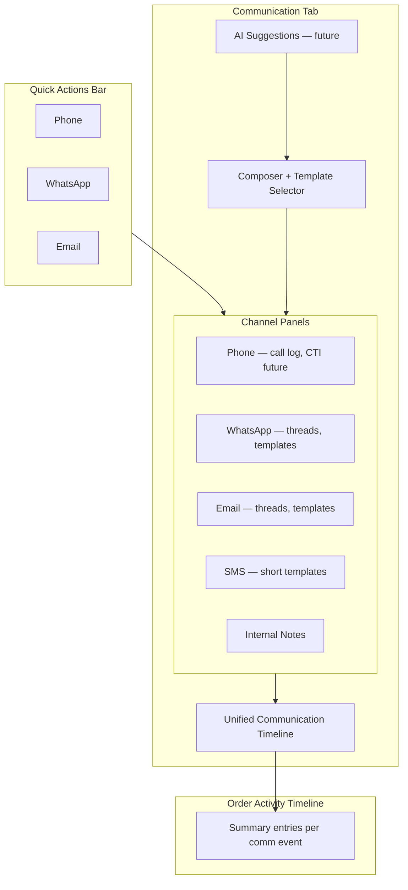

### Channel Capabilities (Future)

| Channel | Inbound | Outbound | Templates | Auto-log | Delivery status | Read status |
|---------|---------|----------|-----------|----------|-----------------|-------------|
| **Phone** | CTI match (future) | Click-to-call | — | Manual log → auto (CTI) | — | — |
| **WhatsApp** | Business API webhook | Agent-approved send | Payment, repair status, pickup, invoice | Yes | Yes | Yes |
| **Email** | IMAP/service webhook | Agent-approved send | Receipt, invoice, warranty | Yes | Yes | Yes |
| **SMS** | — | DLT-compliant templates | Short confirmations | Yes | Yes | — |
| **Internal Notes** | — | Agent entry | — | Yes (timeline) | N/A | N/A |

### Templates & Automation

| Category | Examples | Trigger |
|----------|----------|---------|
| Payment | "Payment of ₹{amount} received…" | J1 webhook |
| Repair status | "Repair in progress, ETA {date}" | J3 status change |
| Completion | "Device ready for pickup" | J4 QC pass |
| Refund | "Refund {ref} approved/rejected" | J5 decision |
| Pickup | "Scheduled {date} {time}" | J7 schedule |
| Warranty | Coverage summary, AMC offer | J6 query |

Automation sends only when: (a) template is approved, (b) trigger conditions met, (c) agent override available, (d) event logged to timeline.

### Communication Timeline vs. Order Timeline

| Feed | Scope | Audience |
|------|-------|----------|
| **Communication Timeline** | Full threads, filters by channel | Agents in Communication tab |
| **Order Activity Timeline** | Summary entry per comm event | All workspace tabs; audit |

### Future AI Suggestions (Guardrails)

| Capability | Behavior |
|------------|----------|
| Reply draft | Based on last message + order state |
| Tone adjustment | Formal ↔ conversational |
| Language | Hindi / English from Customer Story |
| Next action link | "Customer asked about pickup — schedule now?" |

**Guardrail:** AI never sends automatically. Agent reviews and clicks Send.

---

## 7 — Automation Roadmap

Automation follows **reusable workflow patterns**. Each pattern: trigger → system actions → agent touchpoints → customer notification → timeline → ownership update.

### Pattern A — Payment Success

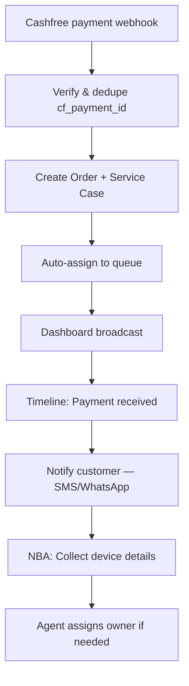

**Journey:** J1 · **Status today:** Steps 1–5 implemented; steps 6–8 partial/future.

### Pattern B — Repair Lifecycle

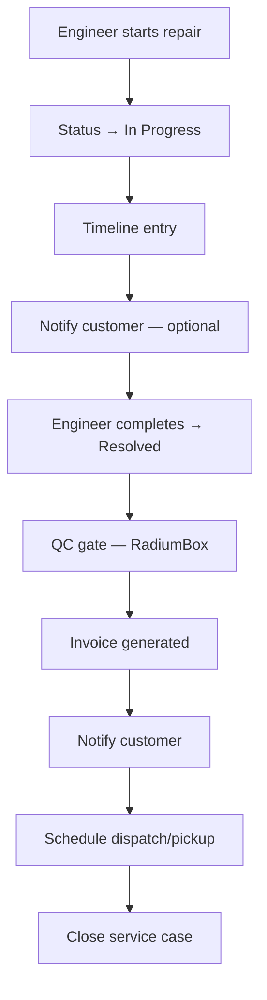

**Journey:** J3, J4, J7 · **Status today:** Status transitions implemented; QC, invoice, dispatch future.

### Pattern C — Refund Decision

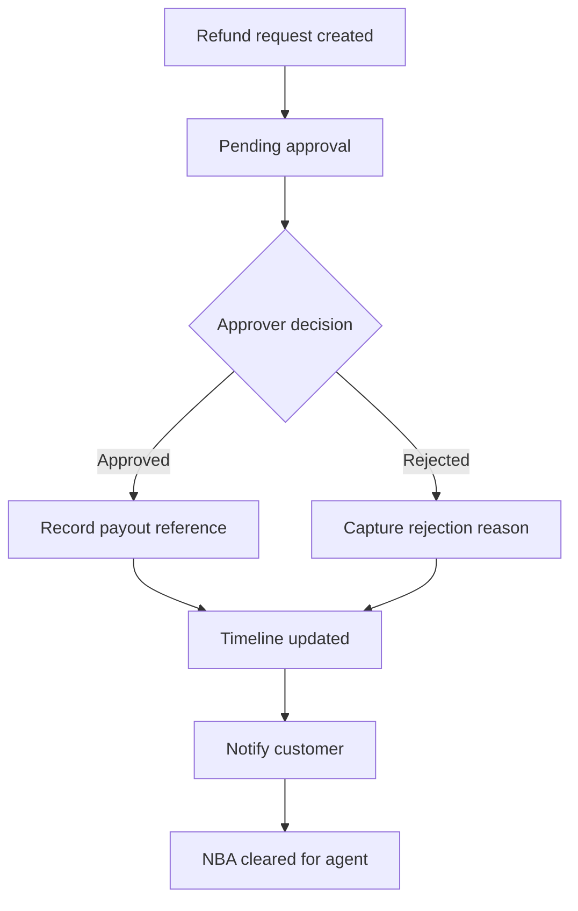

**Journey:** J5 · **Status today:** Request workflow implemented; workspace surface and auto-notify future.

### Pattern D — Shift Handover & SLA

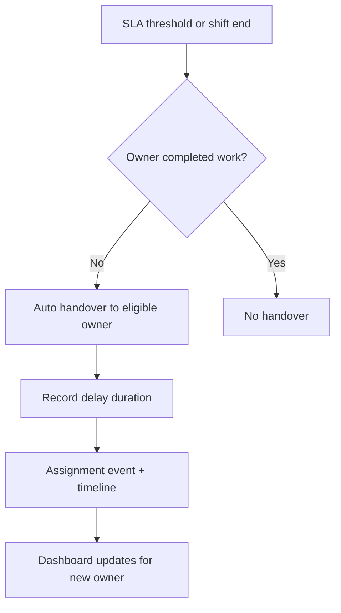

→ Rules: [Product Foundations §10 — Shift Handover](product-foundations.md#shift-handover)

### Pattern E — Activation Complete

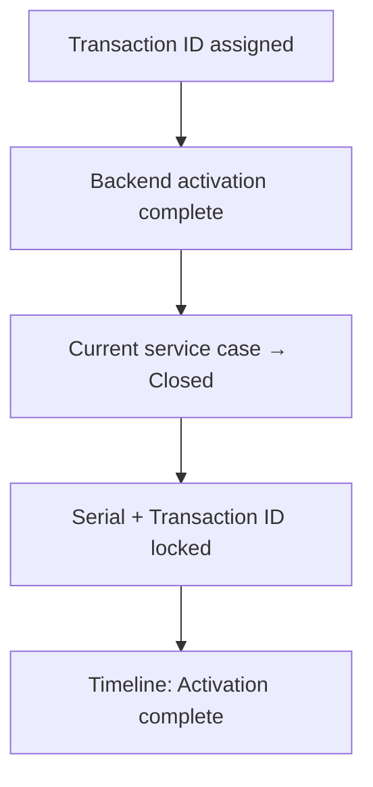

→ Rules: [Product Foundations §3 — Service Case Completion Rule](product-foundations.md#service-case-completion-rule)

### Reusable Pattern Template

When designing new automation, document:

| Field | Description |
|-------|-------------|
| **Pattern ID** | e.g. `payment-success`, `repair-complete` |
| **Trigger** | Event source (webhook, status change, schedule, manual) |
| **Preconditions** | Order/incident state required |
| **System actions** | Ordered steps with idempotency keys |
| **Agent touchpoints** | Where human judgment is required |
| **Customer notification** | Channel, template, SLA |
| **Timeline entries** | Actor, payload |
| **Ownership changes** | Assignment events if any |
| **Failure handling** | Retry, dead letter, agent alert |

---

## 8 — AI Roadmap

All capabilities are **conceptual only**. AI recommends and assists; it does not act without human approval or append-only audit events.

### Capability Map

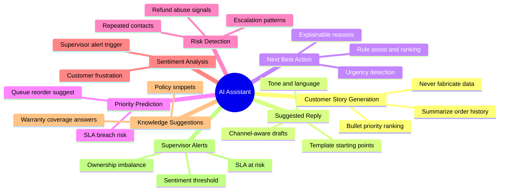

### Capability Reference

| Capability | Input | Output | Guardrail |
|------------|-------|--------|-----------|
| **Customer Story Generation** | Order, incidents, warranty, comms | Ranked bullet lines (max 6) | Omit unknown; never hardcode "Active" |
| **Suggested Reply** | Last message, order state, templates | Draft in composer | Agent must click Send |
| **Next Best Action** | Rule engine + ML rank (future) | Primary + alternatives with reason | Non-blocking; no auto-execution |
| **Priority Prediction** | SLA clock, queue depth, case age | Risk score on dashboard row | Inform only; no silent reprioritize |
| **Risk Detection** | Timeline patterns, refund history | Alert badge | Supervisor review required |
| **Sentiment Analysis** | Inbound message text | Sentiment chip | No auto-escalation without rule |
| **Knowledge Suggestions** | Customer question, product | Policy/coverage snippet | Source citation required |
| **Supervisor Alerts** | SLA, sentiment, workload imbalance | Notification | Coaching workflow, not surveillance |

### Display Surfaces

| Surface | AI features |
|---------|-------------|
| Agent Assistant (right panel) | NBA, suggested response, customer intent |
| Communication composer | Reply draft, tone, language |
| Customer Story | Auto-generated bullets |
| Dashboard (supervisor) | Workload imbalance, SLA prediction |

→ Assignment AI constraints: [Product Foundations §10 — Future AI](product-foundations.md#future-ai)

---

## 9 — Compliance

Compliance happens **automatically** through normal work. Audit trails are generated by operations — not by separate compliance data entry.

### Audit Entry Contract

Every important action must answer:

| Question | Field | Example |
|----------|-------|---------|
| **Who** | Actor | Agent Priya, System, Cashfree webhook |
| **What** | Action / event type | Refund approved, Status changed, Correction |
| **When** | Timestamp | ISO 8601, timezone-aware |
| **Why** | Reason / context | Mandatory for corrections, self-assignment, rejections |
| **Source** | Origin system | Radium Desk, Cashfree, RadiumBox, Agent UI |

### What Generates Audit Records

| Event category | Auto-generated | Reference |
|----------------|----------------|-----------|
| Assignment / ownership change | Yes — assignment event + timeline | [Product Foundations §10](product-foundations.md#assignment--ownership-lifecycle) |
| Status transition | Yes — audit + timeline | Service case status service |
| Remark / note | Yes | RemarkService |
| Transaction ID assignment | Yes — assigner + timestamp | Payments tab |
| Correction (Super Admin) | Yes — old/new value, reason | [Product Foundations §5](product-foundations.md#5-correction-workflow) |
| Refund request lifecycle | Yes | Refund module + timeline |
| Communication (future) | Yes — channel, direction, delivery | Communication Center |
| NBA rule change (future) | Yes — config audit | NBA governance |

### Immutability & Append-Only

- Timeline entries are **append-only**
- Assignment history is **never overwritten**
- Activation fields locked after transaction ID assigned
- Corrections **append** evidence; they do not erase prior state

### Principle

> **Nothing should be overwritten without an audit trail.**

---

## 10 — Recognition & Performance

Performance measurement supports **coaching and continuous improvement** — not surveillance. Metrics belong in rating and reporting surfaces, not on the operational dashboard.

→ Dashboard scope: [Product Foundations §7](product-foundations.md#7-dashboard-philosophy)  
→ Rating categories: [Product Foundations §8](product-foundations.md#8-future-performance-rating)  
→ Success metrics: [Product Constitution — Success Metrics](product-constitution.md#success-metrics)

### KPI Framework

| KPI | Purpose | Coaching use | **Not** for |
|-----|---------|--------------|-------------|
| **SLA Compliance** | Timeliness against service levels | Identify training gaps, staffing needs | Punitive-only scorecards |
| **Average Time to Answer (ATTA)** | Speed of first response | Script and workspace efficiency | Raw speed without quality |
| **First Contact Resolution** | Resolved without follow-up | Knowledge base gaps | Ignoring complex cases |
| **Average Repair Time** | Operational throughput | Process bottleneck detection | Engineer ranking without context |
| **Customer Satisfaction** | Direct feedback signals | Celebrate excellence | Single metric judgment |
| **Agent Productivity** | Work completed over time | Capacity planning | Surveillance |
| **Communication Response Time** | Latency across channels | Channel staffing | — |
| **Positive Customer Feedback** | Explicit praise | **Recognition Score** input | — |
| **Recognition Score** | Composite positive signals | Rewards, coaching highlights | Punishment |
| **Timeline Completeness** | Event coverage | Process adherence | — |
| **Internal Escalations** | Escalation volume/rate | Root cause analysis | Blame |

### Recognition Philosophy

From [Product Constitution — Recognition](product-constitution.md#recognition):

- SLA achieved
- First-contact resolution
- Fast response
- Positive customer feedback

**Performance is not only about finding mistakes.**

### Data Sources for Future Rating

Assignment events are the source data for quality metrics:

| Derived metric | Source events |
|----------------|---------------|
| Ownership duration | Assignment events |
| Escalation rate | Escalation, auto-escalation events |
| Handoff quality | Transfer, shift handover events |
| Rework | Reopened cases |
| Data accuracy | Correction events |

No formulas or weights are defined until a separate rating document is approved.

---

## 11 — Future Integrations

Each integration specifies: **Purpose**, **Owned Data**, **Inbound Data**, **Outbound Actions**. Integrations plug into Order Workspace slots — they do not create parallel modules.

### Cashfree

| | |
|---|---|
| **Purpose** | Online payment capture, refund settlement, payment audit |
| **Owned Data** | Payments, refunds, transactions, settlement, gateway IDs |
| **Inbound** | Payment webhooks (success/failure), refund status updates |
| **Outbound Actions** | None from Desk — read and display only |
| **Workspace slot** | Payments tab, payment status chip, timeline |

### RadiumBox

| | |
|---|---|
| **Purpose** | Product catalog, warranty, AMC, QC, invoicing, serial validation |
| **Owned Data** | Orders (catalog), products, warranty, AMC, serial numbers, QC results, invoices |
| **Inbound** | Product/warranty sync, QC pass/fail, invoice ready, dispatch status |
| **Outbound Actions** | Request QC, generate invoice, schedule dispatch, validate serial |
| **Workspace slot** | Device tab, Customer Story, Overview cards, NBA rules, Timeline |

### WhatsApp Business API

| | |
|---|---|
| **Purpose** | Primary customer messaging channel |
| **Owned Data** | Message threads, delivery receipts, read receipts, template registry |
| **Inbound** | Customer messages, delivery/read webhooks |
| **Outbound Actions** | Send template/message (agent-approved), schedule follow-up |
| **Workspace slot** | Quick Actions, Communication tab, unified timeline |

### Email

| | |
|---|---|
| **Purpose** | Formal receipts, invoices, warranty documentation |
| **Owned Data** | Email threads, message IDs, delivery status |
| **Inbound** | Inbound replies, bounce/delivery notifications |
| **Outbound Actions** | Send templated email (agent-approved) |
| **Workspace slot** | Quick Actions, Communication tab |

### Shipping Partner

| | |
|---|---|
| **Purpose** | Pickup and dispatch logistics |
| **Owned Data** | Courier assignment, tracking numbers, delivery proof |
| **Inbound** | Tracking events, delivery confirmation |
| **Outbound Actions** | Create shipment, schedule pickup |
| **Workspace slot** | Status chips (pickup), Timeline, NBA (J7) |

### Accounting

| | |
|---|---|
| **Purpose** | Financial reconciliation, tax reporting |
| **Owned Data** | Ledger entries, tax lines, formal invoice records |
| **Inbound** | Reconciliation status |
| **Outbound Actions** | Export invoice/payment events (future) |
| **Workspace slot** | Level 3 admin export — not on agent workspace |

### Inventory

| | |
|---|---|
| **Purpose** | Parts availability for repairs |
| **Owned Data** | Stock levels, part SKUs, reservations |
| **Inbound** | Stock updates, reservation confirmations |
| **Outbound Actions** | Reserve part for service case |
| **Workspace slot** | Overview repair card (future), Device tab |

### AI Services

| | |
|---|---|
| **Purpose** | Reply suggestions, summarization, risk detection, NBA ranking assist |
| **Owned Data** | Model versions, inference logs |
| **Inbound** | Suggestions, scores, summaries |
| **Outbound Actions** | Context payload (order state, redacted PII policy TBD) |
| **Workspace slot** | Agent Assistant, Communication composer |

### Integration Readiness Checklist

→ Slot mapping: [Order Workspace Blueprint — Integration Readiness](order-workspace-blueprint.md#integration-readiness-checklist)

---

## 12 — Product Evolution Roadmap

Phases are **maintainable milestones** — not fixed dates. Update this table when a phase ships or scope changes. Link release notes when available.

| Phase | Name | Focus | Key deliverables | Status |
|-------|------|-------|------------------|--------|
| **1** | Core Service Desk | Service cases, ownership, remarks, basic order model | Incidents, assignment, audit | **Shipped** |
| **2** | Payments | Cashfree webhook, order creation, payment metadata | Webhook handler, payment fields | **Shipped** |
| **3** | Dashboard & Workspace | Inbox, KPIs, modal actions, live refresh | Dashboard, workspace layer | **Shipped** (v3.5 stabilized) |
| **3.5** | Production Stabilization | Tests, cleanup, architecture docs | [Release Notes v3.5](release-notes-v3.5.md) | **Shipped** |
| **4** | Real-time Infrastructure | Reverb, broadcast | [Reverb Phase 4.2](dashboard-reverb-phase-4.2.md) | In progress / partial |
| **4.x** | Device Management | Serial capture, device tab, audit | Device tab, serial workflow | Partial |
| **5** | Order Workspace | Three-column layout, tabs, blueprint | [Order Workspace Blueprint](order-workspace-blueprint.md), [Customer Journeys](customer-journeys.md) | **Blueprint complete**; UI in progress |
| **5.x** | Customer Journey UX | Customer Story, NBA v1, placeholder fixes | P1 backlog items | Planned |
| **6** | RadiumBox | Warranty, QC, invoice, product catalog | J4/J6 automation | Planned |
| **7** | Communications | WhatsApp, email, SMS, call log, templates | Communication Center | Planned |
| **8** | AI Assistant | Suggested reply, story generation, risk alerts | Agent Assistant live | Planned |
| **9** | Business Intelligence | Reports, exports, supervisor dashboards | BI outside main dashboard | Planned |
| **10** | Predictive Operations | SLA prediction, workload balancing, auto-handover rules | Pattern D full automation | Planned |

### Phase Dependency Graph

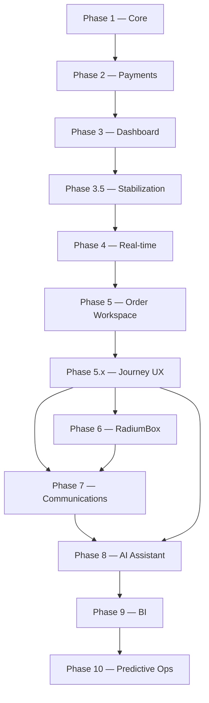

### Backlog Alignment

Priority 1–3 UX backlog items map to Phases 5.x–7. See [UX Improvement Backlog](order-workspace-blueprint.md#ux-improvement-backlog).

---

## 13 — Design Commandments

Permanent principles for all future development. When in doubt, check against this list and the [Product Decision Filter](product-constitution.md#product-decision-filter).

| # | Commandment | Meaning |
|---|-------------|---------|
| 1 | **Never Make the Agent Search** | Level 1 context on workspace answers common questions without navigation. Global search for edge cases only. |
| 2 | **Never Ask Twice** | Capture data once; propagate to timeline, Customer Story, and integrations. Pre-fill from authoritative source. |
| 3 | **Every Click Must Save Time** | If an action does not reduce handling time vs. the old flow, redesign or remove it. |
| 4 | **Automate Repetitive Work** | Webhooks, notifications, assignment, timeline entries — system does the repetitive part; agent handles judgment. |
| 5 | **Explain Before Acting** | NBA shows reason text. Corrections require reason. Status changes visible on timeline. No silent state changes. |
| 6 | **Record Everything** | If it mattered to the customer or audit, it is on the timeline with Who / What / When / Why / Source. |
| 7 | **Reward Good Service** | Build recognition into metrics. Celebrate SLA wins, FCR, and positive feedback — not only failures. |

### Constitution Alignment

These commandments map to the five product principles:

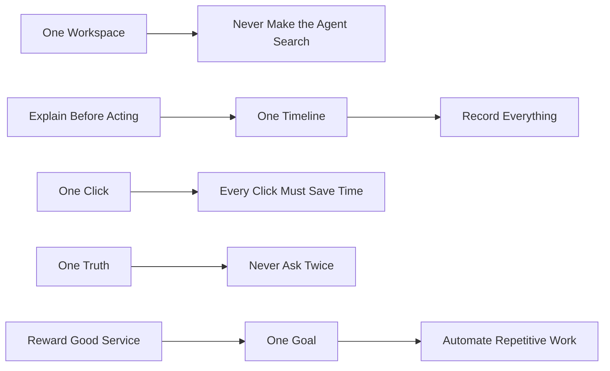

---

## Document Maintenance

### Purpose

Keep this master document synchronized with source documents so it remains the **single entry point** for new developers.

### When to Update This Document

| Trigger | Action |
|---------|--------|
| New product document added to `docs/` | Add row to Cross-Reference Map; link from relevant section |
| Phase shipped or renamed | Update §12 roadmap table and dependency graph |
| New integration contracted | Add §11 integration block; update §4 ownership if needed |
| Order Workspace section added/removed | Update §3 structure diagram and section table |
| New customer journey | Update §5; ensure [Customer Journeys](customer-journeys.md) is updated first |
| NBA rule shipped | Note in §3 Next Best Action; detail stays in blueprint appendix |
| AI capability implemented | Move from §8 conceptual to "implemented" note with link |
| Constitution or foundations amended | Refresh §1 summary pointers — do not duplicate full text |

### Source-of-Truth Hierarchy

1. **Product Constitution** — mission, principles, decision filter  
2. **Product Foundations** — business rules, ownership, immutability  
3. **Domain blueprints** — Order Workspace, Customer Journeys  
4. **Technical architecture** — Workspace, Dashboard, Reverb  
5. **This master document** — consolidation and navigation only  

If this document conflicts with a source document, **the source document wins**. Fix this document.

### Suggested Maintenance Process

1. **On every product doc PR:** Author checks whether Cross-Reference Map or one section in this file needs a one-line update.
2. **On phase completion:** Owner updates §12 status column and adds release note link.
3. **Quarterly review:** Product + engineering walk §3–§7 against implemented UI; mark gaps.
4. **Version bump:** Increment version in header (2.0 → 2.1) for material structural changes; patch note in Document History below.
5. **README link:** Keep [README.md](../README.md) pointing to this document as the architecture entry point.

### Document History

| Version | Date | Task | Notes |
|---------|------|------|-------|
| 2.0 | 2026-06-28 | P28-06-005 | Initial Master Architecture — consolidates constitution, foundations, workspace blueprint, customer journeys, dashboard/workspace architecture |

---

## Quick Start for New Developers

1. Read §1 (Product Vision) and §13 (Design Commandments) — 10 minutes  
2. Skim §2 (System Architecture) diagram — understand orchestration role  
3. Open §3 (Order Workspace) — this is where you will build  
4. Read [Customer Journeys](customer-journeys.md) for the journey you are implementing  
5. Read [Workspace Architecture](workspace-architecture.md) before touching modal actions or refresh contracts  
6. Check §12 for phase status before assuming a feature exists  
7. Run [Local Development](local-development.md) and open `/previews/order-workspace.html` for visual reference  

**Welcome to Radium Desk. The dashboard is the inbox. The Order Workspace is where work happens.**
