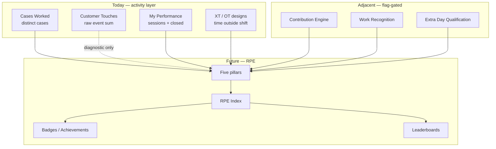

# Radium Performance Engine (RPE) — Architecture & Product Blueprint

**Date:** 2026-08-05  
**Type:** Architecture & product design (no implementation, no Canvas)  
**Status:** Foundation document for Radium Desk’s future employee performance system  

### Baseline documents (read before this blueprint)

| Document | Contribution to RPE |
|----------|---------------------|
| [customer-touches-investigation.md](./customer-touches-investigation.md) | Exact math of Cases Worked / Customer Touches; what today’s KPIs reward and ignore |
| [customer-contribution-kpi-investigation.md](./customer-contribution-kpi-investigation.md) | Signal inventory, CCS weights, anti-gaming, outside-hours ideas |
| [team-activity-overtime-investigation.md](./team-activity-overtime-investigation.md) | Payroll OT ≠ early login; OT is post-shift only |
| [team-activity-extra-time-indicator.md](./team-activity-extra-time-indicator.md) | XT = pre+post shift operational time (not payroll) |

---

## 1. Vision

**Radium Performance Engine (RPE)** is not another KPI counter.

It is the **performance framework** that decides what Radium Desk values about human work — and what it refuses to celebrate.

| RPE is | RPE is not |
|--------|------------|
| A multi-pillar score of real customer impact | A rename of Customer Touches |
| A recognition, review, and awards substrate | Payroll overtime or attendance math |
| Fair multi-agent credit with anti-gaming | Idle-time or click-count theatre |
| Role-aware (Support vs Activation packs) | A single vanity number without explanation |

### Owner philosophy (non-negotiable)

1. **Solve customer problems.** Outcomes beat activity.  
2. **Help maximum customers.** Breadth of distinct cases matters — but only with substance.  
3. **Handle difficult work.** Complexity and escalations deserve uplift.  
4. **Help teammates.** Assist, review, and share knowledge — not steal credit.  
5. **Contribute outside scheduled hours.** Voluntary presence with outcomes is celebrated.  
6. **Quality beats quantity.** Reopens, repeats, and SLA breaches reduce glory.

### Never reward

Random clicks · note spam · status spam · idle time · meaningless activity · automation attributed to humans · delete/undo loops · assigner theatre without ownership.

---

## 2. Relationship to systems today



| Layer | Fate under RPE |
|-------|----------------|
| Cases Worked | Feeds **Reach** pillar (breadth) |
| Customer Touches | Remains optional **diagnostic**; never drives rewards |
| Customer Contribution Score (CCS) | Becomes the seed of **Outcome + Interaction** math |
| XT | Feeds **Commitment** (working-day outside-shift time) |
| Payroll OT / Extra day attendance | Untouched; RPE reads calendar flags only |
| Recognition / Contribution engines | Align weights with RPE; eventually consume RPE events |

---

## 3. Core architecture

### 3.1 Five independent pillars

Each pillar has its own score (0–100 normalized for the period), abuse surface, and protections. Pillars are **independent** so gaming one cannot fake another.

| Pillar | Code | Owner intent |
|--------|------|--------------|
| **Outcome** | `OUT` | Solve problems — resolve / close / decide |
| **Reach** | `RCH` | Help many customers — distinct cases with substance |
| **Contribution** | `CTB` | Meaningful interactions + enablement + teammate help |
| **Commitment** | `CMT` | Presence when it matters — outside hours with outcomes |
| **Quality** | `QLT` | Clean, durable help — few reopens, SLA, thanks |

### 3.2 RPE Index (composite)

```
RPE Index (period) =
  0.35 × Outcome
+ 0.20 × Reach
+ 0.20 × Contribution
+ 0.10 × Commitment
+ 0.15 × Quality
```

Weights are **product-calibratable**. Support pack uses the above. Activation / Ops packs may raise enablement signals inside Contribution and lower case-resolution Outcome share.

**Display rule:** Always show the five pillars beside the Index. Never show Index alone in reviews.

### 3.3 Scoring units

| Unit | Use |
|------|-----|
| **Raw points** | Event-level awards after caps |
| **Pillar score** | Normalized 0–100 for the period |
| **RPE Index** | Weighted blend of pillars |
| **Badges / achievements** | Threshold + narrative, not substitutes for Index |

---

## 4. Pillars in detail

### 4.1 Outcome (`OUT`)

| | |
|--|--|
| **Purpose** | Measure problem-solving, not busyness |
| **Business meaning** | “Did this person finish customer problems?” |
| **Future metrics** | Resolved (primary); Closed (secondary); Refund decisions; Escalation resolution ownership; Activation completions (role pack) |
| **Possible abuse** | Premature resolve; reopen→close loops; closing without customer confirmation |
| **Protection** | High weight on Resolve; Close after same-day Resolve scores less; reopen caps; dwell-time before second Close; Quality pillar penalizes reopens |

### 4.2 Reach (`RCH`)

| | |
|--|--|
| **Purpose** | Reward helping *many* customers with real work |
| **Business meaning** | “How many distinct customers did you meaningfully touch?” |
| **Future metrics** | Distinct cases with ≥1 Outcome or Interaction point (not view-only); unique customers if identity available |
| **Possible abuse** | Touch-and-run (assign only); one-note spray across many cases |
| **Protection** | Case counts toward Reach only if substance threshold met (e.g. ≥3 contribution points or an outcome); assign-only does not expand Reach |

### 4.3 Contribution (`CTB`)

| | |
|--|--|
| **Purpose** | Reward help along the journey — calls, WA, email, enablement, teammate assist |
| **Business meaning** | “Did you actively help, not just click statuses?” |
| **Future metrics** | Answered calls; manual WhatsApp; human outbound email; serial/identity fixes; refund request; appointment ownership; helper credit; knowledge shared (when measurable) |
| **Possible abuse** | Note spam; status thrash; auto-WA attributed to human; short call spam |
| **Protection** | Caps per case/day; deletes score 0; automation excluded; answered-call filter; status transitions weighted ≠ equal |

### 4.4 Commitment (`CMT`)

| | |
|--|--|
| **Purpose** | Celebrate initiative beyond the roster |
| **Business meaning** | “Did you show up when you didn’t have to — and deliver?” |
| **Future metrics** | Outside-hours badge days (WO / Holiday / Leave) with outcome floor; XT on working days as soft signal; emergency after-hours outcomes |
| **Possible abuse** | Login-only on Sunday; leave login with zero help; padding XT without outcomes |
| **Protection** | Commitment points require Outcome or Contribution floor; XT alone never moves Index much; Leave multiplier highest only with outcomes |

### 4.5 Quality (`QLT`)

| | |
|--|--|
| **Purpose** | Make durability and craftsmanship count |
| **Business meaning** | “Did the help stick? Did you protect SLA and avoid messes?” |
| **Future metrics** | Low reopen rate; low repeat complaint; SLA saved vs breached; escalation avoided; customer thanks (when tagged); first-contact resolution proxy |
| **Possible abuse** | Avoiding hard cases to keep reopen rate low; gaming “thanks” tags |
| **Protection** | Complexity-adjusted quality; minimum volume gates before QLT ranks; thanks require customer-origin signal, not self-tag |

---

## 5. Every operation — taxonomy

Every measurable action falls into exactly one bucket for RPE ingestion.

### 5.1 Outcome

Actions that declare a customer problem finished or a hard decision made.

| Action | Why Outcome |
|--------|-------------|
| Status → Resolved | Primary solve signal |
| Status → Closed (ownership) | Terminal wrap |
| Refund approved / rejected / completed | Commercial decision |
| Close exception with ownership | Hard path still finishes work |
| Activation: service reference assigned (Activation pack) | Order activated |

### 5.2 Interaction

Customer-facing or customer-bound help.

| Action | Why Interaction |
|--------|-----------------|
| Answered / completed call | Live customer help |
| Manual WhatsApp template | Proactive customer channel |
| Human outbound email / reply | Written customer help |
| Promote inbound email → case | Creates work from customer signal |

### 5.3 Operational

Work that enables resolution but is not itself the customer conversation.

| Action | Why Operational |
|--------|-----------------|
| Serial / model / identity correction | Unblocks case |
| Approval numbers submitted | Process enablement |
| Escalation (genuine) | Routes hard work |
| Support appointment completed | Scheduled customer help |
| Intermediate status (In Progress, Awaiting Details) | Workflow — capped |
| Assign / reassign (capped) | Routing — low weight |
| Manual note (capped) | Context — not spam |

### 5.4 Administrative

Necessary desk hygiene; visible in audits, **minimal or zero RPE points**.

| Action | Why Administrative |
|--------|--------------------|
| Availability change | Workforce state |
| Leave submit / approve | HR workflow |
| RadiumBox manual sync | Data hygiene |
| AI suggestion view/copy/insert | Tool use, not help |
| Login / logout | Attendance domain |

### 5.5 Ignored

Never enter RPE scoring.

| Action | Why Ignored |
|--------|-------------|
| Case / order viewed | Click ≠ help |
| System remarks | Automation |
| Auto / IRA / scheduler WhatsApp | Not human initiative |
| Inbound customer email received | Customer effort |
| Note deleted | Undo must not earn |
| Notification skipped / failed | Non-delivery |
| Automation pipeline / customer-waiting auto-close | IRA domain |
| Missed / ring-only calls | No conversation |
| Duplicate lifecycle of same send | Double-count risk |

---

## 6. Complexity scoring

Simple work and hard work must not look identical on a leaderboard.

### 6.1 Complexity dimensions

| Dimension | Low | Medium | High |
|-----------|-----|--------|------|
| **Category / issue type** | Password reset, how-to | Battery / software | Motherboard / hardware RMA |
| **Commercial** | None | Partial refund | Full refund / dispute |
| **Escalation** | None | Internal escalate | External / VIP escalate |
| **Customer context** | New, calm | Repeat complaint | VIP / angry / multi-touch history |
| **Process load** | Single channel | Multi-channel | Approval + serial + refund chain |

### 6.2 Suggested complexity multiplier (case-level)

```
complexity_factor ∈ {1.0, 1.25, 1.5, 2.0}
Outcome/Interaction points on that case × complexity_factor
```

| Example | Factor |
|---------|--------|
| Password reset, closed cleanly | 1.0 |
| Battery troubleshooting, multi-touch | 1.25 |
| Motherboard / RMA path | 1.5 |
| Refund + escalation + VIP | 2.0 |
| Repeat complaint (N≥2 open cycles) | +0.25 uplift (cap 2.0) |

### 6.3 How complexity affects performance

- **Outcome** and **Interaction** points on a case are multiplied.  
- **Hygiene** (notes, intermediate status) is **not** multiplied — complexity never rewards spam.  
- **Quality** uses complexity-adjusted reopen rates so hard-case owners are not punished unfairly.  
- **Reach** still counts one case once; complexity does not invent fake case counts.

### 6.4 Data readiness

| Ready now | Needs product enrichment |
|-----------|--------------------------|
| Escalation events; refund events; reopen history; VIP flags if present on order/customer | Structured issue-type taxonomy on incidents; repeat-complaint detector; hardware category tags |

**Phase rule:** Start with event-based complexity (refund / escalate / reopen history). Add category taxonomy later.

---

## 7. Multi-agent fair credit

Identical credit for everyone on a case is unfair. Zero credit for helpers kills teamwork.

### 7.1 Roles

| Role | Definition | Share of case Outcome pool |
|------|------------|----------------------------|
| **Owner** | Assignee at time of Resolve/Close, or actor of Resolve if unassigned | 50–70% |
| **Helper** | Meaningful Interaction/Operational points without owning close | 15–30% |
| **Reviewer** | Explicit review action (future) or approval on linked work | 5–15% |
| **Approver** | Refund / approval-number decision actor | Own Outcome points on decision events |
| **Escalation actor** | Who escalated (routing) | Small Operational credit; not full Outcome |
| **Engineer / specialist** | Downstream assignee who resolves after escalate | Owner share when they resolve |

### 7.2 Rules

1. **Outcome pool** for a case’s Resolve/Close is split by role table — not duplicated 100% to every touch.  
2. **Interaction points** (calls, WA, email) stay with the actor who performed them (full personal Contribution).  
3. **Assigner** who never helps receives **Operational only** (cap), never Outcome.  
4. **Automation actors** receive nothing.  
5. **Self-assignment** to farm Owner share without work: Owner share requires substance threshold before Resolve scores.

### 7.3 Example

SC100: A assigns → B answers call → C resolves.

| Person | Credit |
|--------|--------|
| A | Operational assign (1, capped) |
| B | Interaction call (full) + Helper share of Outcome |
| C | Owner share of Outcome + any of C’s interactions |

---

## 8. Outside hours

Aligns with OT/Calendar/XT baselines: **payroll OT ≠ early login**; **Extra day ≠ Leave work**; **XT is operational time**.

### 8.1 Contexts

| Context | Detection (existing / planned) | RPE treatment |
|---------|--------------------------------|---------------|
| Before shift | Planned XT pre-shift | Soft Commitment if outcomes that day |
| After shift | `overtime_seconds` / XT post | Soft Commitment if outcomes |
| Weekly Off / Sunday | Attendance Extra / calendar | Badge + Commitment; optional ×1.5 |
| Holiday | Company holiday + work | Badge + Commitment; optional ×1.5 |
| Leave | `is_on_leave` + sessions | Badge + Commitment; optional ×2.0 |
| Emergency | After-hours + escalate/VIP/resolve | Badge `Emergency` + Outcome uplift |

### 8.2 Mechanism — combination (recommended)

| Layer | Mechanism |
|-------|-----------|
| **Separate pillar** | Commitment holds outside-hours value |
| **Recognition badge** | `WO` / `HOL` / `LV` / `Night` / `Emergency` when outcomes floor met |
| **Multiplier (v2)** | Applied to Outcome+Contribution for that day only after floor |
| **Not a bonus for login** | Presence without CCS floor → no badge, no multiplier |

**Do not** conflate XT minutes with Extra-day heroism. XT is “worked outside the window on a working day.” Extra-day is “worked when not rostered.”

---

## 9. Quality metrics

| Metric | Direction | Source direction |
|--------|-----------|------------------|
| Reopened cases | ↓ bad | `status_changed` Closed→Open by period |
| Repeat complaints | ↓ bad | Same customer/order reopen cycle count |
| Customer thanks | ↑ good | Future: tagged inbound thanks / CSAT |
| Resolution quality | ↑ good | Inverse of reopen within N days |
| SLA saved | ↑ good | Closed/resolved within SLA |
| SLA breached | ↓ bad | Overdue at close or while owned |
| Escalation avoided | ↑ good | Hard category closed without escalate (careful) |
| Knowledge shared | ↑ good | Future: published tips / internal wiki; not AI copy |

### Quality score sketch

```
QLT ≈ clamp(0–100,
  base
  − reopen_penalty
  − sla_breach_penalty
  − repeat_penalty
  + thanks_bonus
  + clean_close_bonus
)
```

Require minimum resolved volume before QLT ranks on leaderboards (avoid “perfect zero”).

---

## 10. Anti-gaming

| Attack | RPE response |
|--------|--------------|
| 50 notes | Cap notes per case/day; notes never multiply by complexity |
| 100 status changes | Transition weights + hard cap per case/day |
| Repeated reopen | Cap reopen credit; QLT penalty; dwell time |
| Artificial / short calls | Answered/completed only; min talk duration optional |
| Self-assignment farm | Owner Outcome requires substance before Resolve |
| Duplicate work / double email | Dedupe by incident + action key + time bucket |
| Repeated edits | Ignore or admin-only; deletes = 0 |
| Automation abuse | Exclude automation actors; non-manual WA = 0 |
| Touch-and-run Reach | Reach requires substance threshold |
| Login on leave | Commitment floor = outcomes required |
| Helper credit stuffing | Helper share requires Interaction/Operational points |

**Invariant:** Five clean resolutions must outrank fifty notes and twenty status loops — always.

---

## 11. Visualization — audiences

### 11.1 Agent (self)

| Widget | Content |
|--------|---------|
| Today’s RPE Index | Soft number + trend vs personal 7-day avg |
| Five pillar bars | OUT / RCH / CTB / CMT / QLT |
| Cases Worked | Breadth companion |
| Wins | Resolves, answered calls, badges earned today |
| Coaching | “High touches, low outcomes” style tips |
| Hidden | Raw Customer Touches (or collapsed under “Activity diagnostic”) |

### 11.2 Team Leader

| Widget | Content |
|--------|---------|
| Team table | Index + pillars + Cases Worked |
| Busy vs effective | High CT / low OUT quadrant |
| Outside-hours badges | Who showed up off-roster |
| Load balance | Reach distribution |
| At-risk quality | Reopen / SLA flags |

### 11.3 Operations Manager

| Widget | Content |
|--------|---------|
| Org heatmaps | Pillars by role / shift |
| Complexity mix | Hard-case coverage |
| Channel mix | Call / WA / email contribution |
| Calibration | Weight sensitivity; outlier detection |
| Shadow vs live | CT vs CCS/RPE delta during rollout |

### 11.4 Owner

| Widget | Content |
|--------|---------|
| One screen | Who creates customer value |
| Monthly awards shortlist | Index + Quality + Commitment |
| Culture signals | Outside-hours heroes; quality masters |
| System health | Gaming alerts; automation leakage |

---

## 12. Leaderboards

| Cadence | Ranking focus | Notes |
|---------|---------------|-------|
| **Daily** | Contribution + Outcome (fast feedback) | Commitment badges visible; Quality muted (noisy) |
| **Weekly** | Full RPE Index | Primary team ritual board |
| **Monthly** | Index + Quality + Commitment | Awards & Extra-day alignment |
| **Quarterly** | Index trend + Quality | Promotion / PIP input |
| **Annual** | Sustained Index + achievements | Certificates, culture awards |

**Should rankings differ?** Yes.

- Daily rewards hustle + solve.  
- Monthly elevates Quality and Commitment.  
- Annual elevates sustained excellence and rare achievements.

Role packs: Support and Activation **never share one board**.

---

## 13. Achievements (meaningful only)

| Achievement | Earn rule (sketch) |
|-------------|-------------------|
| **Night Hero** | Outcomes after shift end, N days in month |
| **Sunday Saver** | WO/Sunday with Outcome floor |
| **Customer Champion** | Top Reach + Outcome band for month |
| **Escalation Expert** | High-complexity resolves after escalate |
| **Fast Resolver** | High FCR / short time-to-resolve with Quality floor |
| **Quality Master** | Top QLT with minimum volume |
| **Team Player** | High Helper share without Owner monopoly |
| **Innovation Award** | Manual nomination + evidence (not auto from clicks) |
| **Leave Guardian** | Leave-day outcomes with Quality floor |
| **Channel Ace** | Balanced call + WA + email Contribution |

Avoid achievements for “most notes,” “most status changes,” or “longest idle online.”

---

## 14. Badges

### Permanent (career)

| Badge | Meaning |
|-------|---------|
| Quality Master (year) | Sustained QLT |
| Customer Champion (year) | Sustained OUT+RCH |
| Team Player (year) | Sustained helper credit |

### Temporary (period)

| Badge | Window |
|-------|--------|
| Night Hero | Month |
| Sunday Saver | Month |
| Outside Hours | Day flag WO/HOL/LV |
| On Fire | Rolling 7-day Index streak |
| SLA Guardian | Week/month low breach |

Badges decorate profiles and Team Activity; they **never replace** pillar scores in reviews.

---

## 15. Recognition → people systems

| Process | How RPE drives it |
|---------|-------------------|
| **Bonuses** | Monthly Index bands + Commitment multipliers; align with Work Recognition benefit bands |
| **Promotion** | Quarterly Index trend + Quality + complexity-adjusted Outcome; never Index alone |
| **Performance review** | Five-pillar narrative; Cases Worked for coverage; CT only if diagnosing gaming |
| **Awards** | Monthly/annual boards + achievements |
| **Certificates** | Annual permanent badges + signed summary of pillars |

**Separation of concerns:** RPE informs rewards; HR still decides. Attendance Extra day and payroll OT remain workforce/payroll systems.

---

## 16. Roadmap

### Phase 1 — Minimal risk (shadow)

| Deliver | Risk |
|---------|------|
| Define event→taxonomy map from Phase 1/2 inventories | Low |
| Shadow **CCS / Outcome+Contribution** beside Team Activity | Low — no UI replacement |
| Cap rules for notes/status; stop counting note deletes in any new score | Low |
| Keep Cases Worked; demote CT in manager narrative | Product messaging only |

**Exit:** Shadow leaderboard correlates with manager intuition better than CT.

### Phase 2 — Operational metrics (live RPE lite)

| Deliver | Risk |
|---------|------|
| Live Outcome + Reach + Contribution pillars in Agent / TL views | Medium |
| Fair multi-agent Owner/Helper split (v1) | Medium |
| XT indicator (ops) + Outside-hours **badges** (no multiplier yet) | Medium |
| Anti-gaming caps enforced | Medium |

**Exit:** CT removed from rewards conversations; CCS/RPE lite used in weekly huddles.

### Phase 3 — Quality & complexity

| Deliver | Risk |
|---------|------|
| Quality pillar (reopen, SLA) | Medium |
| Event-based complexity multipliers | Medium |
| Monthly boards + achievements v1 | Medium |
| Commitment multipliers (calibrated) | Higher — needs fairness review |

**Exit:** Monthly awards run on RPE; recognition engine consumes RPE signals.

### Phase 4 — AI-assisted insights

| Deliver | Risk |
|---------|------|
| Coaching narratives (“busy but ineffective”) | Medium |
| Complexity from category/NLP assist | Higher |
| Customer-thanks detection | Higher |
| Owner dashboard + gaming alerts | Medium |
| Calibration assistant for weight packs | Medium |

**Exit:** RPE is the default performance language of Radium Desk.

---

## 17. Design invariants (freeze these)

1. **Outcomes > activity.**  
2. **Quality can veto vanity Rank** (volume without QLT cannot win monthly awards).  
3. **Automation never pays humans.**  
4. **Payroll OT / attendance Extra are not RPE scores.**  
5. **Pillars stay visible** — Index is a summary, not a black box.  
6. **Anti-gaming caps are product rules**, not optional.  
7. **Role packs do not compete on one board.**  
8. **Outside hours require outcomes** — presence is not performance.

---

## 18. Open product decisions (for later workshops)

| Decision | Options |
|----------|---------|
| Exact pillar weights | Start 35/20/20/10/15; recalibrate after shadow |
| Owner vs Helper split | 60/40 vs 70/30 |
| Close after Resolve same day | +2 vs 0 |
| Leave multiplier | 2.0 vs badge-only |
| Complexity taxonomy ownership | Ops vs engineering taxonomy |
| Whether CT remains on UI | Hidden vs “Activity (diagnostic)” |

---

## 19. Document map

| Need | Document |
|------|----------|
| What CW/CT do today | customer-touches-investigation.md |
| What should count for contribution | customer-contribution-kpi-investigation.md |
| OT vs early login | team-activity-overtime-investigation.md |
| XT operational time | team-activity-extra-time-indicator.md |
| **Performance framework** | **This blueprint** |

---

## 20. Closing statement

Radium Desk already measures **motion**.  
RPE exists to measure **merit**.

When RPE is live, an agent who quietly resolves hard cases, answers real calls, protects quality, and shows up on a Sunday will outrank an agent who generates fifty notes and a hundred status changes — every time, by design.

*End of blueprint. No implementation implied.*
