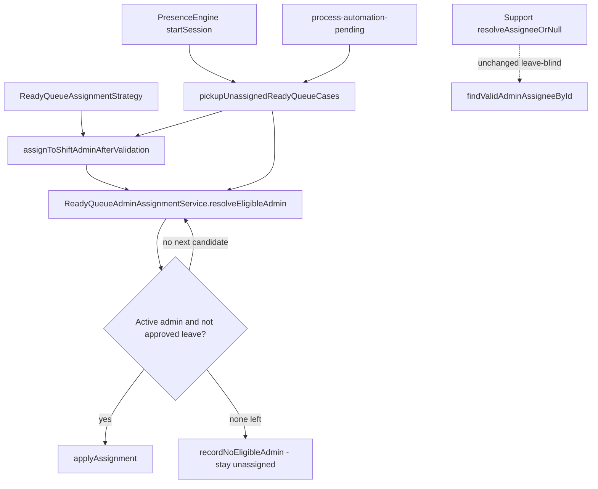

# Ready Queue Admin Leave Gate + Automatic Pickup

**Prompt:** P[04-08]-015  
**Date:** 2026-08-04  
**Type:** Scoped implementation (Ready Queue admin path only)  
**Canvas:** [/Users/ravi/.cursor/projects/Users-ravi-radium-service-desk/canvases/ready-queue-admin-leave-pickup.canvas.tsx](/Users/ravi/.cursor/projects/Users-ravi-radium-service-desk/canvases/ready-queue-admin-leave-pickup.canvas.tsx)

---

## Bottom line

Ready Queue admin assignment now skips configured admins on **approved leave** (including half-day), tries fallbacks in configured order, and if none are eligible keeps the case **unassigned (IRA Ready Queue)** with an audit reason. When an eligible Ready Queue admin becomes available again (login session start or periodic automation processing), the oldest unassigned Ready-eligible cases are picked up automatically. Support Queue, Smart Assignment, Email, Appointment, WorkforceAuthority, Team Activity, Attendance, and Presence eligibility rules are unchanged.

---

## Problem (from P[04-08]-012)

Ready Queue used `resolveAssigneeOrNull` → `findValidAdminAssigneeById` (active + `admin` only). Approved leave was ignored, so an On Leave day-shift admin (e.g. Avinash) still received cases. Fallbacks never ran while the primary remained “valid.”

---

## Solution (isolated)

| Concern | Behaviour |
|---------|-----------|
| Eligibility order | Day/night admin → fallback #1 → fallback #2 (existing settings order) |
| Eligible means | Active, admin role, not soft-deleted, **not** on approved leave (incl. half-day) |
| Not checked | Presence, Team Activity, workload |
| No eligible admin | Stay unassigned; audit `service_case.ready_queue_unassigned` with reason “No eligible Ready Queue admin available.” |
| Pickup | Oldest unassigned Ready-eligible cases; never reassign owned cases |
| Triggers | `PresenceEngineService::startSession` (login); `service-cases:process-automation-pending` (periodic) |

**Isolation:** `resolveAssigneeOrNull` / `findValidAdminAssigneeById` remain leave-blind for Support capability fallbacks. Only `assignToShiftAdminAfterValidation` / Ready reassign / pickup use `ReadyQueueAdminAssignmentService`.

---

## Architecture



---

## Files modified

| File | Change |
|------|--------|
| `app/Services/Assignment/ReadyQueueAdminAssignmentService.php` | **New** — leave-aware resolve, no-eligible audit, pickup |
| `app/Services/ServiceCaseAssignmentService.php` | Ready path uses `resolveEligibleAdmin` / `recordNoEligibleAdmin` |
| `app/Services/Operations/PresenceEngineService.php` | After deferred smart batch, call Ready Queue pickup |
| `app/Console/Commands/ProcessAutomationPendingAssignmentsCommand.php` | After grace processing, call Ready Queue pickup |
| `config/service_case_assignment.php` | `ready_queue_pickup_batch_size` (default 25) |
| `tests/Feature/ReadyQueueAdminLeaveAssignmentTest.php` | **New** — leave, fallback, IRA retain, pickup, isolation |

### Not modified (by design)

Support Queue, Smart / Deferred Smart logic, Incoming Email, Email Triage, UAE routing, Appointment Assignment, WorkforceAuthority, Team Activity, Attendance, Presence eligibility math.

---

## Test results

```text
ReadyQueueAdminLeaveAssignmentTest — 8 passed (30 assertions)
Related regression (shift admin audit, grace, deferred smart sample) — 15 passed
```

| Scenario | Result |
|----------|--------|
| Primary on leave → fallback | Pass |
| Primary + FB1 on leave → FB2 | Pass |
| All on leave (incl. half-day) → unassigned + audit | Pass |
| Leave ends + periodic command → oldest first pickup | Pass |
| Login (`startSession`) → pickup | Pass |
| Already assigned never modified | Pass |
| Primary not on leave → unchanged Ready behaviour | Pass |
| `resolveAssigneeOrNull` still leave-blind | Pass |

---

## Rollback strategy

1. Revert the six files above (or revert the release commit/tag).
2. No DB migrations were added; no settings schema change required beyond optional env `SERVICE_CASE_READY_QUEUE_PICKUP_BATCH_SIZE`.
3. After revert, Ready Queue again assigns via leave-blind `resolveAssigneeOrNull` (pre-fix behaviour).
4. Existing unassigned Ready cases remain unassigned until the next Ready assignment path runs under restored logic.

---

## Success criteria checklist

- [x] Ready Queue never assigns to an admin on approved leave
- [x] Fallbacks tried in configured order
- [x] No eligible admin → IRA retains unassigned Ready ownership + audit
- [x] Automatic pickup for oldest IRA Ready Queue cases on login / periodic processing
- [x] Already assigned cases never modified
- [x] Other assignment strategies untouched
