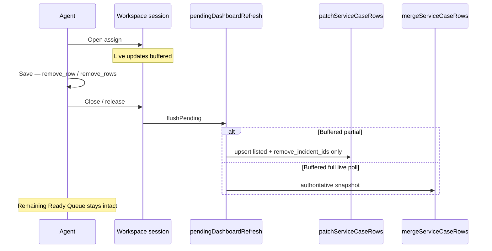

# Ready Queue Auto-Refresh Investigation

**Type:** Production correctness investigation + fix  
**Date:** 2026-08-07  
**Status:** Root cause proven · **fix implemented**  
**Canvas:** [`ready-queue-auto-refresh-investigation.canvas.tsx`](/Users/ravi/.cursor/projects/Users-ravi-radium-service-desk/canvases/ready-queue-auto-refresh-investigation.canvas.tsx)

---

## Bottom line

After Assign Reference, Ready Queue briefly collapsed to the processed row (or an incomplete set) because **incremental row payloads were applied with full-list merge semantics**.

**Fixed:** Partial updates now use patch semantics (upsert/replace listed rows only). Rows are removed only via `remove_incident_ids`. Workspace buffering still pauses during edit, but buffered partials never flush through snapshot merge. Inline Assign Reference returns `remove_row` / `remove_rows` when `shouldRemoveFromAdminReadyQueue()` is true.

---

## Symptom (before fix)

| Observed | Expected |
|----------|----------|
| Ready Queue shows ~35 jobs | — |
| Agent opens one, Assigns Reference, saves | Remove completed job only |
| Queue “refreshes” to **one processed row** (or incomplete list) | Remaining Ready jobs stay visible |
| Several seconds later, full remaining list returns | Immediate correct list, no blank/partial flash |

---

## Root cause (historical)

| Path | Bug |
|------|-----|
| Immediate partial | `applyPartialDashboardUpdate` → `mergeServiceCaseRows` deleted absent DOM rows |
| Session flush | Partial `rows[]` queued then flushed via `applyDashboardRefresh` as a full snapshot |
| Pending merge | Later 1-row partial overwrote a queued full 35-row poll |
| Inline assign | Replaced row HTML; never returned `remove_row` |

---

## Fix implemented

### P0 — Patch semantics

| Concern | Behaviour |
|---------|-----------|
| Partial apply | `patchServiceCaseRows` upserts/replaces listed rows only |
| Deletes | **Only** `remove_incident_ids` |
| Counters / KPIs | Still applied from partial payloads |
| Full `/dashboard/live` | Still uses authoritative `mergeServiceCaseRows` |

### Workspace buffering (unchanged UX)

Operator selects → refresh pauses → background updates buffered → Submit/Cancel → resume.

**Changed:** Buffered partials are tagged `authoritative: false` / `partial: true`, keep `remove_incident_ids` + `patch_rows`, and flush through `applyPartialDashboardUpdate`. Full live polls are tagged `authoritative: true` and still flush as snapshots. A 1-row patch never replaces a queued full `rows[]`.

### Inline parity

`OrderTransactionController::store` JSON response:

- `remove_row` / `remove_rows` when `shouldRemoveFromAdminReadyQueue`
- `row_html: null` in that case
- Client removes immediately (same outcome as batch)

### Merge safety

```
35 rows → 1-row patch → update that row only (siblings kept)
35 rows → full snapshot with 34 → authoritative remove of the missing one
```

---

## Files changed

| File | Change |
|------|--------|
| `resources/js/live-dashboard-merge.js` | Added `patchServiceCaseRows` |
| `resources/js/live-dashboard.js` | Patch apply; authoritative flag; safe pending merge; partial flush |
| `resources/js/pages/dashboard.js` | Inline success applies `remove_row` / `remove_rows` |
| `app/Http/Controllers/OrderTransactionController.php` | Inline Ready Queue remove payload |
| `tests/js/live-dashboard-merge.test.js` | Patch vs snapshot coverage |
| `tests/js/live-dashboard.test.js` | Buffering, partial, snapshot, remove, multi-queue cases |
| `tests/Feature/QueueIntegrityLiveRefreshTest.php` | Inline assign `remove_row` |

---

## Tests

**JS:** `npx vitest run tests/js/live-dashboard.test.js tests/js/live-dashboard-merge.test.js`

Coverage includes:

- workspace buffering
- partial patch (no sibling wipe)
- snapshot merge (still removes absent)
- `remove_incident_ids`
- multiple queued partials
- partial after full
- full after partial

**PHP:** `php artisan test --filter='test_inline_assign_reference_returns_remove_row|test_dashboard_batch_assign_returns_remove_rows'`

---

## Risks

| Risk | Mitigation |
|------|------------|
| Stale row left if remove event dropped | Heartbeat full poll still authoritative |
| Patch adds a row that full poll would not include | Next authoritative live refresh reconciles |
| Inline remove when case should stay visible | Gated on `shouldRemoveFromAdminReadyQueue` (same as batch) |
| Pending merge edge cases | Explicit `authoritative` / `partial` flags; regression tests |

Unchanged by design: workspace pause, selection locking, batch workflow, Reverb transport, polling cadence.

---

## Post-fix timeline


