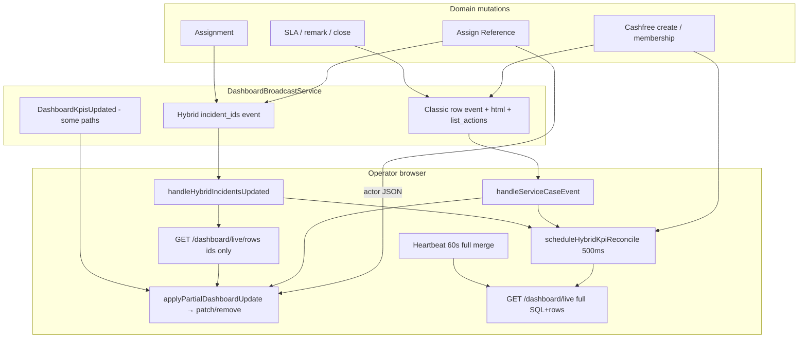

# Ready Queue Event-Driven Architecture Investigation

**Status:** Investigation complete · **Phase 1 shipped** (`v4.0.11`) · **Phase 2 implemented locally** (not deployed)
**Production:** v4.0.11 / `bf593e57`
**Date:** 2026-08-08
**Canvas:** [`ready-queue-event-driven-architecture-investigation.canvas.tsx`](/Users/ravi/.cursor/projects/Users-ravi-radium-service-desk/canvases/ready-queue-event-driven-architecture-investigation.canvas.tsx)

Related: [ready-queue-phase1-production-benchmark.md](./ready-queue-phase1-production-benchmark.md) · [ready-queue-refresh-not-working-investigation.md](./ready-queue-refresh-not-working-investigation.md) · [ready-queue-auto-refresh-investigation.md](./ready-queue-auto-refresh-investigation.md) · [hybrid-reverb-phase-2.md](./hybrid-reverb-phase-2.md) · [p0-1-dashboard-broadcast-prod-benchmark.md](./p0-1-dashboard-broadcast-prod-benchmark.md)

---

## Verdict

Ready Queue **row** updates are already largely incremental via Ably `list_actions` + `patchServiceCaseRows` / `/dashboard/live/rows`.

**Phase 1 (v4.0.11) closed the expensive reconcile gap:** `kpisOnly` now hits `GET /dashboard/live?kpis_only=1`, and the controller **skips** `serviceCasesPayload` / row HTML. Production warm path (19 Ready cases): full ~160 ms / 280 KB vs counts-only ~95 ms / 11 KB, **zero** row HTML on reconcile. See [ready-queue-phase1-production-benchmark.md](./ready-queue-phase1-production-benchmark.md).

**Phase 2 (local):** while viewing Ready Queue, proven `list_actions.action_required` / hybrid row membership transitions apply chip ±1 and **skip** immediate `kpis_only` reconcile. Absolute reconcile remains for unsafe paths (other tabs, unloaded removes). Not deployed yet.

Remaining gaps vs the desired end-to-end model:

1. ~~**Counts are never ADD=+1 / REMOVE=−1**~~ — **Phase 2 client ±1 when proven** (absolute reconcile kept as safety).
2. ~~**`kpisOnly` builds full Ready Queue rows**~~ — **fixed in Phase 1**.
3. **Heartbeat / reconnect** still authoritative-merge the entire loaded window (Phase 4 / later).
4. **Inline Assign Reference** removes the actor’s row correctly but **does not update the Ready Queue tab count** (Phase 3).

Smallest remaining path: assign-reference count parity (Phase 3), then heartbeat tuning. **Not** a generic rewrite.

---

## 1. Current architecture / flow

**Ready Queue identity:** `action_required` (`data-live-queue`).

**Row state:** DOM table rows `#service-case-row-{id}` under `.dashboard-service-cases-card`. Partial updates use **patch** semantics (upsert listed rows only; deletes only via `remove_incident_ids`). Full `/dashboard/live` uses **merge** semantics (authoritative snapshot for the loaded window).

---

## 2. Event-by-event ADD / UPDATE / REMOVE matrix

| Event | Payload | Can browser decide ADD/UPD/REM? | Updates only affected row? | Triggers full `/dashboard/live`? | Count update |
|-------|---------|----------------------------------|----------------------------|----------------------------------|--------------|
| **ServiceCaseCreated** | `incident_id`, `queue`, `list_actions`, `html?` | Yes via `list_actions[action_required]` | Yes (inline html / remove) | **No for rows**; yes **kpisOnly** after | Deferred absolute via reconcile |
| **SlaStatusChanged** | same | Yes | Yes | Rows no; kpisOnly after | Deferred absolute |
| **ServiceCaseRemarked** | same | Yes | Yes | No | **None** until poll |
| **ServiceCasesAssigned** | `incident_ids[]` | After `/live/rows` | Yes | Rows no; kpisOnly after | Deferred absolute |
| **ReferenceNumbersUpdated** | `incident_ids[]` | After `/live/rows` (Ready → usually **REMOVE**) | Yes | Rows no; kpisOnly after | Deferred absolute |
| **ServiceCasesResolved/Closed** | `incident_ids[]` | After `/live/rows` | Yes | Rows no; kpisOnly after | Deferred absolute |
| **Queue membership** | Re-emits **ServiceCaseCreated** + **DashboardKpisUpdated** | Yes | Yes | Rows no | Immediate absolute KPI event (+ reconcile) |
| **DashboardKpisUpdated** | KPI HTML + filter count variants | N/A | N/A | No | Absolute replace |
| **Inline Assign Reference** (actor HTTP) | `remove_row` / `row_html` / `kpi_strip_html` | Explicit remove/replace | Yes | No | **KPI strip only — chip count skipped** |
| **Heartbeat / reconnect / workspace switch** | Full live JSON | Snapshot merge | Rebuilds loaded window | **Yes** | Absolute |

`listActionForQueue` (`DashboardLiveRowVisibilityService`):

- not visible in queue → `remove`
- queue is primary / my_work → `add`
- else visible → `update`

Frontend: `resolveListAction` reads `list_actions[activeQueue]` (`live-dashboard-reverb.js`).

---

## 3. Ready Queue count update mechanism

| Surface | Storage / render | Update API |
|---------|------------------|------------|
| Ready tab badge | `[data-dashboard-case-filter-count="action_required"]` | `applyFilterCounts(absoluteMap)` |
| KPI strip Open | `.dashboard-kpi-value` inside replaced `kpi_strip_html` | `applyKpis(html)` |
| Card total | `data-service-case-filter-total` | Set from live payload / filter counts |

**Incremental +1/−1:** **Phase 2 (local)** — `ready-queue-count-delta.js` adjusts `action_required` chip when viewing Ready and membership transition is proven (`list_actions.action_required` + DOM/memory, or hybrid rows/removes). Absolute `applyFilterCounts` / `kpis_only` reconcile / heartbeat remain authoritative.

**Implication for desired model:** Proven ADD/REMOVE no longer need immediate reconcile; unsafe paths still use absolute counts-only.

---

## 4. Exact causes of unnecessary full refreshes

| Cause | Detail |
|-------|--------|
| **hybrid-kpi-reconcile** | After create/SLA/hybrid events, client calls `refreshDashboard(..., { kpisOnly: true })` → `GET /dashboard/live?kpis_only=1`. **Phase 1:** controller skips `serviceCasesPayload` / row HTML; returns KPI strip + filter counts only. |
| **Heartbeat `poll_heartbeat`** | Every ~60s (5m when idle): full live + `mergeServiceCaseRows`. |
| **WS `connected`** | One full live before heartbeat starts (catch-up — acceptable). |
| **Workspace switch** | Full live with `force` + pagination reset (needed for queue change). |
| **P0-1 side effect** | Removing sync `DashboardKpisUpdated` from create/SLA increased reliance on client reconcile for counts — **cheap after Phase 1**. |

Not the main row problem after the 2026-08-07 patch-semantics fix — partial Ably/hybrid updates no longer wipe sibling rows.

---

## 5. Workflows

### Assign Reference (desired 10 → 9)

**Actor (inline editor):**

1. POST save → `OrderTransactionController`
2. If `shouldRemoveFromAdminReadyQueue` → JSON `remove_row` / `remove_rows`
3. Client `removeServiceCaseRow(id)` — **that row only**
4. `applyKpis(kpi_strip_html)` — **does not** `applyFilterCounts`
5. Others: `ReferenceNumbersUpdated` → `/dashboard/live/rows` → remove + kpisOnly reconcile

**Already supports per-row REMOVE.** Gap = Ready chip count for actor; others pay full `/live` for counts.

### New Ready case (desired ADD)

| Path | Emits | Row ADD capable? |
|------|-------|------------------|
| Cashfree fresh order | `dashboard_broadcast` → `serviceCaseCreated` | Yes (`list_actions.add` + html) |
| Queue membership (waiting/hold/status) | `serviceCaseQueueMembershipChanged` → `ServiceCaseCreated` + `DashboardKpisUpdated` | Yes |
| Agent assignment | `ServiceCasesAssigned` (hybrid) | Yes via `/live/rows` |
| Serial/model / enrichment that changes visibility | Usually membership / create-style row broadcast | Yes if broadcast fires |

Cashfree actor exclusion (id=1) is a **delivery** issue (prior investigation), not a missing ADD opcode.

### Stay Ready but change (desired UPDATE)

SLA badge, remark, enrichment row refresh → `update` + html (or hybrid rows fetch). Count should stay unchanged; today remarked skips count reconcile (acceptable if membership unchanged).

---

## 6. Polling / heartbeat role

| Mode | Interval | Work | Desired role |
|------|----------|------|--------------|
| Heartbeat (Ably up) | 60s / 5m idle | Full `/live` merge | Safety / missed-event only |
| Fast fallback | ~20s | Full `/live` | Transport down only |
| Legacy poll | 20s/60s | Full `/live` | When transport=`poll` |
| kpisOnly reconcile | On events | **`kpis_only=1` counts-only** (Phase 1) | Done for server work; still absolute replace |

**Constraint for this investigation:** do not change heartbeat yet. First make event-path counts cheap so heartbeat can later be lowered safely.

---

## 7. What v4.0.7–v4.0.10 already contributed

| Change | Effect on this architecture |
|--------|-----------------------------|
| Ready Queue patch semantics (2026-08-07) | **Partial rows no longer rebuild/wipe the list** |
| Hybrid Phase 1/2 (reference/assign/close) | ID events + `/live/rows` — incremental rows |
| Ops Live bundle / N+1 work | **OCC**, not operator Ready Queue |
| **P0-1 KPI fanout removal (4.0.10)** | Rows stay event-driven; counts moved to client reconcile → **full `/live` cost** |

---

## 8. Gaps checklist

**Already works**

- Per-row ADD/UPDATE/REMOVE via `list_actions` + patch
- Hybrid `/live/rows` for assign/reference/close
- Actor inline Assign Reference DOM remove of exactly that case
- Authoritative merge reserved for poll/reconnect/switch

**Unnecessarily refreshing**

- ~~Server-side full row build on every kpisOnly `/dashboard/live`~~ — **fixed Phase 1**
- Heartbeat full merge while Ably healthy (keep for now; reduce later)
- Double count work on queue membership (immediate KPI event + reconcile)

**Missing / weak**

- Client count deltas (+1/−1) — Phase 2
- Counts on inline Assign Reference response — Phase 3
- Count reconcile for remarked (optional)
- ~~Lightweight counts endpoint / `kpis_only` server short-circuit~~ — **done Phase 1**
- (Separate) Ably self-exclusion for Cashfree system actor — delivery, not opcode

**Where count deltas are lost**

- Between Ably row apply and hybrid-kpi-reconcile completion
- Inline assign: row gone, chip unchanged
- Remarked: row may change, counts untouched until heartbeat

---

## 9. Recommended minimal implementation phases

### Phase 1 — Cheap count reconcile (highest ROI) — **SHIPPED v4.0.11**

- Add `kpis_only=1` so backend **skips** `serviceCasesPayload` / row HTML.
- Point `scheduleHybridKpiReconcile` at that path (client already used `{ kpisOnly: true }`; now sends query param).
- **No UI redesign · no schema · heartbeat unchanged.**
- Prod benchmark: [ready-queue-phase1-production-benchmark.md](./ready-queue-phase1-production-benchmark.md).

### Phase 2 — Optimistic Ready chip deltas — **IMPLEMENTED LOCALLY (not deployed)**

- On proven Ready membership ADD/REMOVE while viewing Ready, adjust chip via `adjustFilterCount` / `ready-queue-count-delta.js`.
- `list_actions.add` + row already present → UPDATE (no ±1); not a blind +1 on every create/SLA.
- Skip `scheduleHybridKpiReconcile` when proven; keep it when not viewing Ready / unloadable remove / missing `list_actions.action_required`.
- Keep absolute overwrite from Phase 1 response / heartbeat / `DashboardKpisUpdated`.
- Dedupe via DOM presence + short membership memory (`in`/`out`).

### Phase 3 — Inline Assign Reference parity

- Return `service_case_filter_counts` in assign JSON **or** client −1 on successful `remove_row`.
- Align with workspace `response-handler` which already applies filter counts.

### Phase 4 — Later (out of scope now)

- Lower heartbeat frequency once Phase 1–3 proven.
- Ably recipient fix for system actor (separate P0).
- Do not touch local IRA Cashfree optimization.

---

## 10. Expected savings (order of magnitude)

Assume ~12 Ably viewers, busy Cashfree morning, ~1 create/min + periodic assigns.

| Resource | Current | After Phase 1–3 |
|----------|---------|-----------------|
| HTTP after event | Ably + optional `/live/rows` + **full `/live`** | Ably + optional `/live/rows` + **counts-only** |
| SQL/PHP per reconcile | liveMetrics **+ full Ready rows** × viewers | liveMetrics/counts only × viewers |
| Browser | Patch 1 row + KPI replace; heartbeat re-merges N | Patch 1 row + chip ±1; heartbeat unchanged until Phase 4 |
| Ably volume | Unchanged | Unchanged |
| Full queue rebuilds | Heartbeat + server work hidden inside kpisOnly | Heartbeat only (client); server kpisOnly cheap |

Largest win is **eliminating Ready Queue row rebuild inside kpisOnly `/dashboard/live`**, which P0-1 made the default count path.

---

## 11. Production risks & rollback

| Risk | Mitigation / rollback |
|------|------------------------|
| Optimistic count drift | Absolute reconcile always wins; heartbeat remains |
| Wrong ADD vs UPDATE | Server `list_actions` remains authority for DOM ops |
| Pagination total mismatch | Update `data-service-case-filter-total` with chip |
| Phase 1 backend flag bug | Flag off → previous full `/live` behavior |
| Rollback | Revert Phase independently; no migrations |

---

## Constraints respected

- No UI redesign · no business-rule changes · no schema · no code · no deploy
- Heartbeat / Ably recipients / local IRA **not** changed in this investigation

**STOP — do not implement until phases are approved.**
