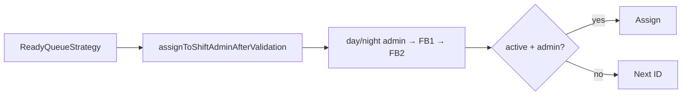
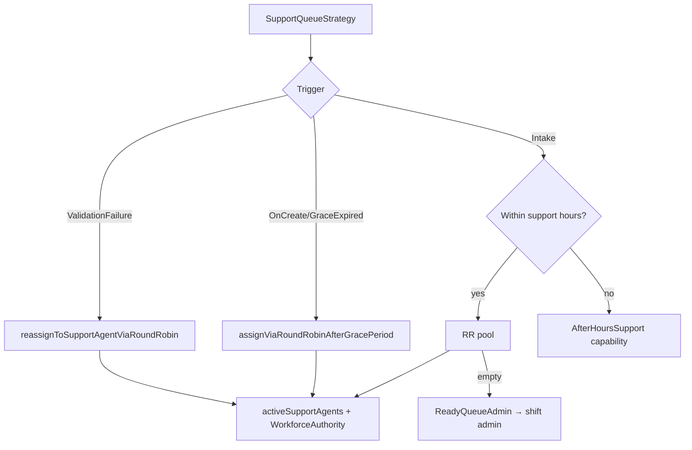
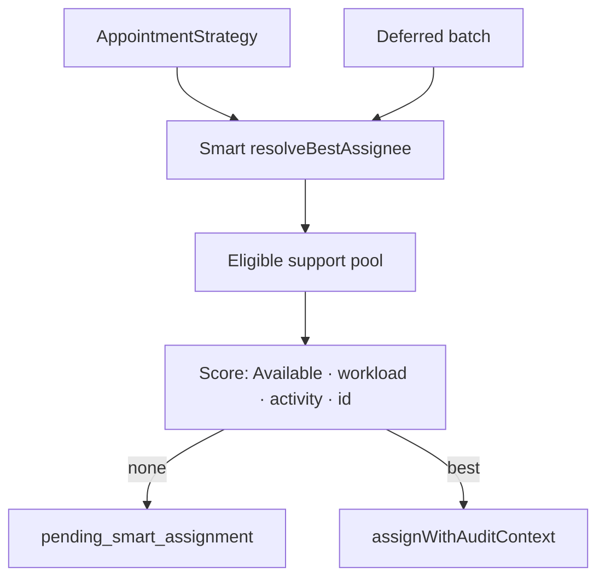
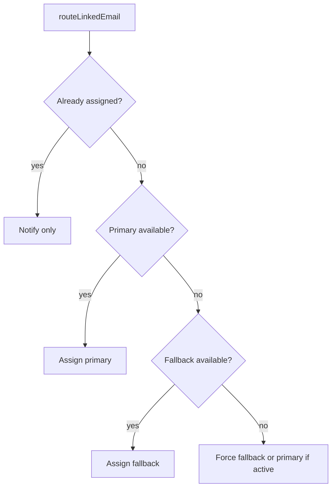

# Service Case Assignment — Candidate Selection Comparison

**Prompt:** P[04-08]-014  
**Date:** 2026-08-04  
**Type:** Read-only strategy analysis (no recommendations / no code changes)  
**Continues:** [docs/service-case-assignment-entry-points.md](docs/service-case-assignment-entry-points.md)  
**Canvas:** [/Users/ravi/.cursor/projects/Users-ravi-radium-service-desk/canvases/service-case-assignment-candidate-selection.canvas.tsx](/Users/ravi/.cursor/projects/Users-ravi-radium-service-desk/canvases/service-case-assignment-candidate-selection.canvas.tsx)

---

## Bottom line

Candidate selection is **not unified**. Support RR and Smart share `WorkforceAuthority` (approved leave + calendar + presence + Available/Busy). Ready / shift-admin and most capability fallbacks only need **active (+ admin role)**. Incoming Email Intake checks leave/calendar/Offline but **can force-assign** anyway and does **not** require a work session. **Team Activity labels are never consulted.** Pending leave is never consulted. Skill matching is unused in production.

---

## Strategy profiles

### 1. Ready Queue (`ReadyQueueAssignmentStrategy`)

| Dimension | Behaviour |
|-----------|-----------|
| Candidate source | Settings: day/night shift admin → fallback_admin_1 → fallback_admin_2 |
| Ordering | Fixed priority list (`assigneeCandidateUserIds`); first valid wins |
| Round robin | No |
| Least workload | No |
| Previous owner | Skips assign if already assigned; inquiry → RR; active appointment → no Ready reassign |
| Skill / department | No |
| Admin fallback | Fallbacks are part of the same ID chain |
| Queue ownership | Ready path; does not steal active support-appointment owner |
| Appointment ownership | Preserved (returns early if active support appointment) |
| Cache | None for candidates |
| Retry / deferred | Via grace cron / eligibility re-entry only |

**Eligibility (`findValidAdminAssigneeById`):** active, not trashed, has `admin` role. **No** leave, presence, schedule, WorkforceAuthority.

---

### 2. Support Queue (`SupportQueueAssignmentStrategy`)

| Dimension | Behaviour |
|-----------|-----------|
| Candidate source | `activeSupportAgents` (SUPPORT_TEAM / inquiry roles) filtered by `OperationsAssignmentEligibilityService` → WorkforceAuthority |
| Ordering | Round-robin by user id vs cursor `assignment.agent_round_robin_last_user_id` (`lockForUpdate`) |
| Round robin | **Yes** (primary) |
| Least workload | No |
| Previous owner | Unassigned only for most triggers; validation-failure reassign may keep operational/designated assignee |
| Skill / department | No |
| Admin fallback | Day hours + empty RR → `ReadyQueueAdmin` capability → shift-admin resolve; after hours → `AfterHoursSupport` capability |
| Queue ownership | Support; communication intake forces Support even if case would classify Ready |
| Appointment ownership | Not selected here (appointment path separate) |
| Cache | RR cursor in settings |
| Retry | Grace expiry cron; validation-failure reassign |

**Eligibility (pool):** active + normal assignment pool + on duty (approved leave → off; calendar holiday/weekly off/outside hours → off; no open session or Away → off; need Available or Busy). **Pending leave: no.** **Team Activity: no.**

Capability fallback assignees: same as shift-admin / active setting user — **not** full WorkforceAuthority.

---

### 3. Appointment Assignment (`AppointmentAssignmentStrategy` → Smart)

| Dimension | Behaviour |
|-----------|-----------|
| Candidate source | Same support/inquiry role pool as Smart |
| Ordering | Delegates to SmartAssignmentService scoring |
| Round robin | No |
| Least workload | Via Smart |
| Previous owner | `shouldRetainOperationalAssignee` / designated hardware retain |
| Skill | No (production) |
| Admin fallback | No; unassigned → pending smart queue |
| Queue ownership | Support-oriented appointment ownership |
| Appointment ownership | Requires scheduled appointment; retains operational assignee |
| Cache | DashboardSnapshot for workload |
| Retry / deferred | Marks `pending_smart_assignment`; clears assignee if needed |

---

### 4. Smart Assignment (`SmartAssignmentService`)

| Dimension | Behaviour |
|-----------|-----------|
| Candidate source | Active users with support/inquiry roles + `isEligible` (WorkforceAuthority) |
| Ordering | Sort: Available first → lowest workload total → activity penalty → lowest user id |
| Round robin | No |
| Least workload | **Yes** (open action/attention + scheduled today) |
| Previous owner | Not in scoring (caller may retain) |
| Skill | No |
| Admin fallback | No |
| Capability | No |
| Cache | `DashboardSnapshot::load()` for metrics |
| Deferred | Consumed by DeferredSmartAssignmentService |

---

### 5. Deferred Smart Assignment (`DeferredSmartAssignmentService`)

| Dimension | Behaviour |
|-----------|-----------|
| Candidate source | Re-runs `SmartAssignmentService::resolveBestAssignee` |
| Ordering | Same as Smart |
| Eligibility | Same as Smart |
| Retry | Cron every 5m; also on login (`startSession`) and Available status change |
| Deferred behaviour | Only incidents with `pending_smart_assignment` + scheduled appointment; skips closed/manual/retained; Cache lock `deferred_smart_assignment:process_pending_batch` |
| Previous owner | Clears pending flag if manual/retained; does not overwrite those |

---

### 6. Email Triage (`EmailTriageAssignmentStrategy`)

| Dimension | Behaviour |
|-----------|-----------|
| Candidate source | By classification: SalesLead / IncomingEmailSupervisor **capability** settings; NewSupportCase → Support Queue intake |
| Ordering | Single capability resolve (setting → optional shift_admin fallback) |
| Round robin | Only if delegated to Support Queue |
| Least workload | No |
| Previous owner | Skips if already assigned; UAE ownership guard may skip earlier |
| Skill / department | Capability role mapping only |
| Admin fallback | Config `fallback_resolver: shift_admin` on some capabilities |
| Cache | None |
| Eligibility | Capability path: **active user from setting** (or shift-admin validity). Not WorkforceAuthority unless Support Queue branch |

---

### 7. Incoming Email Assignment (`IncomingEmailAssignmentService`)

| Dimension | Behaviour |
|-----------|-----------|
| Candidate source | Settings `communication_intake_primary_user_id` / `fallback_user_id` only |
| Ordering | Primary if available → fallback if available → **force fallback** → **force primary** |
| Round robin | **No** (explicitly) |
| Least workload | No |
| Previous owner | If already assigned → notify only, no reassign |
| Skill | No |
| Admin fallback | Force-assign soft-unavailable primary/fallback |
| Queue ownership | Ownership routing, not Ready/Support strategies |
| Appointment | Not involved |
| Cache | None |
| Retry | None beyond force path |

**Preferred availability (`isAvailableForCommunicationIntake`):** active; **approved leave** no; calendarAllows (holiday/weekly off/hours); stored Offline no; open session + Away no. **Does not require** open session. **Pending leave: no.** **Team Activity: no.** Force path ignores availability.

---

### 8. Universal Assignment Engine (routing only)

| Dimension | Behaviour |
|-----------|-----------|
| Candidate source | Does not select people; picks **queue strategy** |
| Ordering | N/A |
| Routing | `assignOnCreate` → SCAS; unassigned intake → **force Support**; grace expiry → Ready if validation OK else Support; validation success → Ready; failure → Support; appointments → Appointment strategy; email classification → Email triage |
| Ownership | `CommunicationOwnershipGuard` may skip |
| WaitingCustomer / Completed strategies | No-op (no candidate selection) |

---

## Candidate selection flow diagrams

### Ready / shift admin

### Support RR (+ capability fallback)

### Smart / Deferred

### Incoming email intake

---

## Comparison matrix — selection mechanisms

| Mechanism | Ready | Support | Appointment/Smart | Deferred | Email Triage | Incoming Email | UAE routing |
|-----------|-------|---------|-------------------|----------|--------------|----------------|-------------|
| Candidate source | Shift-admin settings chain | Support role pool | Support role pool | Same as Smart | Capability settings | Intake primary/fallback settings | Queue only |
| Ordering | Fixed ID priority | RR cursor | Workload score | Same as Smart | Single resolve | Primary→fallback→force | N/A |
| Round robin | No | **Yes** | No | No | Only if → Support | No | N/A |
| Least workload | No | No | **Yes** | **Yes** | No | No | N/A |
| Previous owner | Skip if set | Retain on some reassign | Retain operational | Skip manual/retain | Skip if set | Notify if set | Ownership guard |
| Skill matching | No | No | No | No | No | No | N/A |
| Department filter | No | Role pool only | Role pool only | Same | Capability roles | Settings users | N/A |
| Admin fallback | Built into chain | Capability → shift admin | No (pending instead) | No | Optional shift_admin | Force primary/fallback | N/A |
| Queue ownership | Ready | Support | Appointment/support | Pending smart | Support/capability | Ownership-only | Chooses queue |
| Appointment ownership | Preserves | N/A | Central | Requires scheduled appt | N/A | N/A | Routes to Appointment |
| Cached decisions | No | RR cursor | DashboardSnapshot | Process lock | No | No | No |
| Retry / deferred | Grace/eligibility | Grace/eligibility | → pending flag | Cron + login/Available | No | Force path | Re-entry via callers |

---

## Comparison matrix — eligibility checks

Legend: **Y** = checked as hard gate · **P** = partial · **F** = checked then may force · **—** = not consulted

| Check | Ready | Support RR | Smart/Deferred | Email Triage (capability) | Incoming Email | Capability fallback (Support) |
|-------|-------|------------|----------------|---------------------------|----------------|------------------------------|
| Active user | Y | Y | Y | Y | Y / F | Y |
| Soft deleted | Y | Y | Y | Y | Y / F | Y |
| Admin role | Y | — (pool) | — | Often via settings | — | Via shift_admin |
| Support role | — | Y | Y | — / Support branch | — | — |
| Approved Leave | **—** | Y | Y | **—** | Y then **F** | **—** |
| Pending Leave | — | — | — | — | — | — |
| Presence / work session | **—** | Y (required on duty) | Y | **—** | P (Away if open; session not required) | **—** |
| Heartbeat | — | via presence | via presence | — | via Away | — |
| Team Activity | — | — | — | — | — | — |
| WorkforceAuthority | **—** | Y | Y | **—** | P (leave + calendar + Offline) | **—** |
| Work schedule / hours | Day/night **admin pick only** | Y (calendarAllows) | Y | — | Y then F | Admin pick only |
| Holiday / Weekly Off | — | Y | Y | — | Y then F | — |
| Shift status labels | — | — | — | — | — | — |
| Stored Busy/Available | — | Y (on duty) | Y (+ prefer Available) | — | Offline blocks preferred | — |
| Idle / Pending / Team Activity overlays | — | — | — | — | — | — |
| Workload | — | — | Y | — | — | — |
| Round robin | — | Y | — | — | — | — |
| Previous owner | skip | retain rules | retain rules | skip | notify | — |
| Skills | — | — | — | — | — | — |
| Capability | — | fallback only | — | Y | — | Y |
| Queue ownership | Ready | Support | Appointment | Mixed | Ownership | Support fallback |

---

## Inconsistencies (highlighted)

1. **Leave:** Support RR / Smart exclude approved leave; Ready / shift-admin / capability fallbacks do not; Incoming Email checks then may **force**.  
2. **Presence:** Required for Support/Smart on-duty; ignored for Ready/capability; Email prefers calendar/Offline/Away but allows assign without login.  
3. **Team Activity:** Never used — operators may assume UI status gates assignment.  
4. **Pending leave:** Never gates any path.  
5. **Workload vs RR:** Appointments use least-load; create/grace Support uses RR; Ready uses fixed admin.  
6. **Empty pool behaviour:** Support → admin capability fallback; Smart → pending queue + alert; Ready → next fallback ID or unassigned.  
7. **Communication dual paths:** Production inbound email uses Intake settings service; UAE `assignForEmailClassification` / Support intake is a parallel model (Bonvoice uses Support force).  
8. **Force vs fail-closed:** Email Intake prefers ownership over eligibility; Smart fails open to pending; Ready fails open to next admin regardless of leave.

---

## Root causes of behavioural differences

| Root cause | Effect |
|------------|--------|
| Historical Ready = “give to shift admin” product rule | Admin path never wired to WorkforceAuthority |
| Support pool built for agents | Full on-duty gate; admins excluded from pool by role |
| Appointment product needs soft fail | Pending smart + deferred retries instead of admin dump |
| Email Phase 1.1 ownership mandate | Fixed primary/fallback + force so cases are never ownerless |
| UAE is a router, not an eligibility engine | Strategies keep divergent gates |
| Team Activity is presentation-only | Labels share some authority data but assignment does not read them |

---

## Risks

| Risk | Severity |
|------|----------|
| Approved-leave day admin still receives Ready cases | High |
| Operators trust Team Activity “On Leave” as coverage | High |
| Email force-assign to unavailable intake owner | Medium |
| Dual email models confuse which rules apply | Medium |
| Pending leave false sense of safety | Medium |
| Capability fallback reintroduces leave-blind admin after RR empty | High |
| No skill matching → wrong specialty not prevented | Low (by design today) |

---

## Files involved

- `ReadyQueueAssignmentStrategy.php`
- `SupportQueueAssignmentStrategy.php`
- `AppointmentAssignmentStrategy.php`
- `EmailTriageAssignmentStrategy.php`
- `UniversalAssignmentEngine.php`
- `ServiceCaseAssignmentService.php` (RR, shift admin, retain rules)
- `SmartAssignmentService.php`
- `SupportAppointmentSmartAssignmentService.php`
- `DeferredSmartAssignmentService.php`
- `IncomingEmailAssignmentService.php`
- `AssignmentCapabilityResolver.php`
- `OperationsAssignmentEligibilityService.php`
- `WorkforceAuthorityService.php`
- `config/assignment_capabilities.php`
- `config/smart_assignment.php` / `config/service_case_assignment.php`

---

## Test recommendations (no implementation)

1. Ready: day admin on approved leave still selected; fallback only if admin inactive.  
2. Support RR: approved leave excluded; pending leave included.  
3. Support empty pool → capability fallback still assigns leave-blind admin.  
4. Smart: prefer Available over Busy at equal load; no eligible → pending + deferred retry on login.  
5. Incoming email: unavailable primary → available fallback; both unavailable → forced assignee.  
6. Appointment retain: operational assignee not replaced by Smart.  
7. UAE: communication intake forces Support strategy even for Ready-classified cases.  
8. Assert Team Activity status mutations alone never change assignee selection.

---

## Out of scope

No unified engine design, no policy prescription, no code changes — comparison only.
