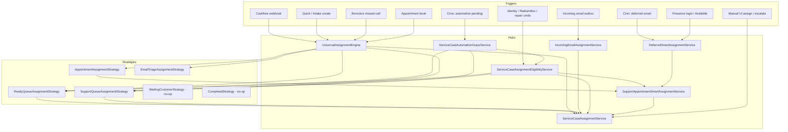

# Service Case Assignment Entry Points

**Prompt:** P[04-08]-013 (scoped)  
**Date:** 2026-08-04  
**Type:** Read-only inventory — entry points only (no eligibility analysis)  
**Canvas:** [/Users/ravi/.cursor/projects/Users-ravi-radium-service-desk/canvases/service-case-assignment-entry-points.canvas.tsx](/Users/ravi/.cursor/projects/Users-ravi-radium-service-desk/canvases/service-case-assignment-entry-points.canvas.tsx)

---

## Bottom line

Automatic Service Case assignment converges on a small set of hubs: **`ServiceCaseAssignmentService`**, **`UniversalAssignmentEngine`**, queue **strategies** (Ready / Support / Appointment / Email triage), **`IncomingEmailAssignmentService`**, and **`SupportAppointmentSmartAssignmentService` / `DeferredSmartAssignmentService`**. WhatsApp and Telegram have **no** Service Case auto-assign entry points in this codebase.

---

## Architecture diagram

---

## Assignment flow (hubs)

| Hub method | Typical next hop |
|------------|------------------|
| `UniversalAssignmentEngine::assignOnCreate` | `ServiceCaseAssignmentService::assignOnCreate` → order routing **or** grace **or** immediate RR/shift admin |
| `ServiceCaseAssignmentService::assignOnCreate` | `tryAssignViaOrderRouting` → else `ServiceCaseAutomationGraceService::beginGracePeriod` (default) |
| Grace `tryAssignAfterValidation` / expiry | `ReadyQueueAssignmentStrategy` or `SupportQueueAssignmentStrategy` |
| Ready strategy | `assignToShiftAdminAfterValidation` |
| Support strategy | `assignViaRoundRobinAfterGracePeriod` / intake RR + capability fallback |
| Appointment strategy | `SupportAppointmentSmartAssignmentService` → may mark deferred |
| Deferred batch | Smart assign → `ServiceCaseAssignmentService` apply |
| Email intake | `assignWithAuditContext` (primary/fallback settings) — **not** UniversalEngine RR |
| Eligibility evaluate | Ready / Support / smart / `reassignToShiftAdminAfterValidation` |

---

## Complete entry-point inventory

### A. Automatic — create / webhook / intake

| # | Entry point | Controller / Job / Command / Listener | Strategy | Assignment service | Next hop |
|---|-------------|----------------------------------------|----------|-------------------|----------|
| 1 | Cashfree payment creates service case | `Webhooks\CashfreeWebhookController` → `CashfreeWebhookProcessorService` | None at engine (create path) | `UniversalAssignmentEngine::assignOnCreate` → `ServiceCaseAssignmentService::assignOnCreate` | Order routing **or** grace begin → later Ready/Support |
| 2 | Quick service request create | `QuickServiceRequestController` → `QuickServiceRequestService` / `CustomerIntakeService` | None | `UniversalAssignmentEngine::assignOnCreate` | Same as #1 |
| 3 | Order-linked create (OrderController paths using QuickServiceRequest) | `OrderController` (via QuickServiceRequestService) | None | `assignOnCreate` | Same as #1 |
| 4 | Hardware / designated order routing (on create) | Inside `assignOnCreate` | None | `ServiceCaseOrderAssignmentRoutingService` via `tryAssignViaOrderRouting` | Direct assignee on order rules |

### B. Automatic — automation grace & validation

| # | Entry point | Controller / Job / Command / Listener | Strategy | Assignment service | Next hop |
|---|-------------|----------------------------------------|----------|-------------------|----------|
| 5 | Grace start + early validation try | Called from `assignOnCreate` → `ServiceCaseAutomationGraceService::beginGracePeriod` | May call Ready/Support after `evaluateAssignmentEligibility` | `ServiceCaseAssignmentEligibilityService` + strategies | Ready → shift admin; Support → RR |
| 6 | Expired grace processing | Scheduler `service-cases:process-automation-pending` → `ProcessAutomationPendingAssignmentsCommand` → `processExpiredGracePeriods` | `ReadyQueueAssignmentStrategy` or `SupportQueueAssignmentStrategy` | `ServiceCaseAssignmentService` (via strategies) | Shift admin **or** RR |
| 7 | Identity / enrichment lifecycle | `OrderIdentityLifecycleService::afterIdentityChanged` (OrderController, OrderSerialService, OrderDeviceModelService, RadiumBox enrich, repairs, imports, etc.) | Via eligibility service | `ServiceCaseAssignmentEligibilityService::evaluateAssignmentEligibility` | Smart appoint / Support fail / `reassignToShiftAdminAfterValidation` / Ready assign |
| 8 | Repair / backfill commands | `RecoverCashfreeAwaitingProductDetailsCommand`, `BackfillReadyQueueCommand`, `AutomationRepairCommand`, `InquiryOrderLinkService` | Via eligibility | Same as #7 | Same as #7 |

### C. Automatic — communication / missed call

| # | Entry point | Controller / Job / Command / Listener | Strategy | Assignment service | Next hop |
|---|-------------|----------------------------------------|----------|-------------------|----------|
| 9 | Inbound email linked to case | Outbox → `IncomingEmailProcessorService` → create/link → `IncomingEmailAssignmentService::routeLinkedEmail` | **None** (bypasses queue strategies) | `IncomingEmailAssignmentService` → `ServiceCaseAssignmentService::assignWithAuditContext` | Communication intake primary → fallback (forced if needed) |
| 10 | Email create with `assignOnCreate: false` | `IncomingEmailServiceCaseCreateService` | Deferred to #9 | Create only | `routeLinkedEmail` after link |
| 11 | Bonvoice missed-call recovery | `Webhooks\BonvoiceWebhookController` → `BonvoiceMissedCallRecoveryService` | Forced Support via engine | `UniversalAssignmentEngine::assignForUnassignedIntake` → `SupportQueueAssignmentStrategy` | RR + capability fallback |
| 12 | Email classification API (engine) | Callers of `assignForEmailClassification` (tests / future) | `EmailTriageAssignmentStrategy` | Capability assign **or** Support strategy | Sales/unknown capability **or** Support intake |

### D. Automatic — appointments / deferred

| # | Entry point | Controller / Job / Command / Listener | Strategy | Assignment service | Next hop |
|---|-------------|----------------------------------------|----------|-------------------|----------|
| 13 | Support appointment booked | `SupportAppointmentController` → `SupportAppointmentService` | `AppointmentAssignmentStrategy` | `UniversalAssignmentEngine::assignAfterBooking` → `SupportAppointmentSmartAssignmentService` | Smart assign **or** pending_smart_assignment |
| 14 | Deferred smart retry (cron) | `service-cases:process-deferred-smart-assignment` → `ProcessDeferredSmartAssignmentsCommand` | None (direct smart) | `DeferredSmartAssignmentService` → `SmartAssignmentService` → `ServiceCaseAssignmentService` | Apply assignee when eligible |
| 15 | Deferred smart retry (login / Available) | `PresenceEngineService::startSession`, `TeamAvailabilityService::updateStatus` | None | `DeferredSmartAssignmentService::processPendingBatch` | Same as #14 |
| 16 | Closed-appointment workflow reassign | `ClosedAppointmentWorkflowItemHandler` | Appointment smart | `assignForActiveSupport` + may `processPendingBatch` | Smart / deferred |
| 17 | Validation path with active appointment | Inside `evaluateAssignmentEligibility` | Appointment smart | `SupportAppointmentSmartAssignmentService::assignForActiveSupport` | Keep/set support owner |

### E. Manual / operator (not automatic, listed for completeness)

| # | Entry point | Controller / Job / Command / Listener | Strategy | Assignment service | Next hop |
|---|-------------|----------------------------------------|----------|-------------------|----------|
| 18 | Manual reassign on case | `ServiceCaseAssignmentController::update` | None | `ServiceCaseAssignmentService::reassign` | Chosen user |
| 19 | Workspace assign / escalate | `WorkspaceActionController` / `WorkspaceActionDialogService` | None | `WorkspaceAssignActionService` / `ServiceCaseEscalationService::escalate` → `ServiceCaseAssignmentService::escalate` | Chosen or L1 target user |
| 20 | Dashboard batch assign helpers | `DashboardWorkspaceActionController` (transaction batch) | None | Batch assign services | Device/transaction helpers — not case ownership engine |

### F. No-op / non-assign strategies

| # | Entry point | Notes |
|---|-------------|-------|
| 21 | `WaitingCustomerAssignmentStrategy` | Returns incident unchanged |
| 22 | `CompletedAssignmentStrategy` | Returns incident unchanged |

### G. Channels with **no** auto-assign entry point found

| Channel | Finding |
|---------|---------|
| WhatsApp | No `assignOnCreate` / UniversalEngine / SCAS auto path in app WhatsApp code |
| Telegram | Notifications/batching only (`IraAssignmentTelegramBatchService`); does not assign cases |

---

## Files involved

### Entry / triggers

- `app/Http/Controllers/Webhooks/CashfreeWebhookController.php`
- `app/Http/Controllers/Webhooks/BonvoiceWebhookController.php`
- `app/Http/Controllers/QuickServiceRequestController.php`
- `app/Http/Controllers/SupportAppointmentController.php`
- `app/Http/Controllers/ServiceCaseAssignmentController.php`
- `app/Http/Controllers/WorkspaceActionController.php`
- `app/Http/Controllers/OrderController.php`
- `app/Console/Commands/ProcessAutomationPendingAssignmentsCommand.php`
- `app/Console/Commands/ProcessDeferredSmartAssignmentsCommand.php`
- `app/Console/Commands/RecoverCashfreeAwaitingProductDetailsCommand.php`
- `app/Console/Commands/BackfillReadyQueueCommand.php`
- `app/Console/Commands/AutomationRepairCommand.php`
- `bootstrap/app.php` (scheduler)
- `app/Services/Outbox/OutboxProcessorService.php`
- `app/Services/IncomingEmail/IncomingEmailProcessorService.php`

### Hubs

- `app/Services/Assignment/UniversalAssignmentEngine.php`
- `app/Services/ServiceCaseAssignmentService.php`
- `app/Services/ServiceCaseAutomationGraceService.php`
- `app/Services/ServiceCaseAssignmentEligibilityService.php`
- `app/Services/ServiceCaseOrderAssignmentRoutingService.php`
- `app/Services/IncomingEmail/IncomingEmailAssignmentService.php`
- `app/Services/Operations/SupportAppointmentSmartAssignmentService.php`
- `app/Services/Operations/DeferredSmartAssignmentService.php`
- `app/Services/Operations/SmartAssignmentService.php`
- `app/Services/ServiceCaseEscalationService.php`
- `app/Services/Cashfree/CashfreeWebhookProcessorService.php`
- `app/Services/Bonvoice/BonvoiceMissedCallRecoveryService.php`
- `app/Services/QuickServiceRequestService.php`
- `app/Services/CustomerIntakeService.php`
- `app/Services/SupportAppointmentService.php`
- `app/Services/OrderIdentityLifecycleService.php`

### Strategies

- `app/Support/Assignment/Strategies/ReadyQueueAssignmentStrategy.php`
- `app/Support/Assignment/Strategies/SupportQueueAssignmentStrategy.php`
- `app/Support/Assignment/Strategies/AppointmentAssignmentStrategy.php`
- `app/Support/Assignment/Strategies/EmailTriageAssignmentStrategy.php`
- `app/Support/Assignment/Strategies/WaitingCustomerAssignmentStrategy.php`
- `app/Support/Assignment/Strategies/CompletedAssignmentStrategy.php`

---

## Notes (scope)

- This document does **not** evaluate leave, presence, or Team Activity gates.
- Phase-3 `SupportAssignmentEngine` (`config/support_assignment.use_engine`) defaults **off** — production Support path remains legacy RR inside `ServiceCaseAssignmentService`.
- IRA branding on Telegram is notification labeling after assignment; IRA is not an assignment entry point.
