# Phase H4-1 — Shared KPI Ownership & Read Model Inventory

**Status:** Planning and analysis only — **no implementation**  
**Governed by:** [Feature Preservation Rule](super-admin-four-hubs.md#mandatory-principle-feature-preservation-rule)  
**Prerequisite:** H3C complete (Operations hub consolidation)  
**Related:** [super-admin-four-hubs.md](super-admin-four-hubs.md) (Feature Preservation Register + preliminary KPI matrix)

---

## 1. Executive summary

Radium Desk exposes KPIs across **six live surfaces** (Operator Dashboard, Mission Control, Operations Control Center, Workforce360, Automation Health/Pipeline, Team Performance) plus **Administration Home** (no KPIs today). Calculations are spread across **40+ services** with **15+ cache keys** and **3 transport patterns** (server render, HTTP polling, Reverb hybrid).

**Key findings:**

| Finding | Impact |
|---|---|
| **12 KPI families have duplicate implementations** | Drift risk; inconsistent numbers across hubs |
| **No unified read-model layer** | Each dashboard orchestrator queries independently |
| **Operations has richest cache/poll stack** | 30s bundle + partial live groups; highest H4 leverage |
| **Mission Control executive metrics overlap Operations bento** | `open_cases`, `appointments_today`, `customers_waiting` computed separately |
| **Automation execution metrics triple-counted** | `AutomationHealthService`, `OperationsAutomationMetricsService`, `OperationsRecentAutomationActivityService` |
| **Presence/availability counted 3 ways** | Executive `active_agents`, `TeamAvailabilityOverviewService`, `Workforce360Service` |
| **Administration Home** | Zero KPIs — future read-only chips only |
| **Realtime is Operator Dashboard–only** | Operations/Platform/Workforce are poll or static |

**H4-1 deliverable:** Assign **one owner service per KPI family**, propose **shared read facades** (read-only DTOs), and sequence migration without removing any UI metric.

---

## 2. Surfaces reviewed

| Surface | Route | Controller | Orchestrator service(s) | Live transport |
|---|---|---|---|---|
| **Operator Dashboard** | `dashboard` | `DashboardController` | `DashboardService`, `DashboardPersonalizationService`, `DashboardKpiAggregator` | Reverb hybrid + `dashboard.live` (30s default) |
| **Mission Control** | `admin.platform.index` | `PlatformDashboardController` | `PlatformDashboardService` → `DashboardManifest`, `ExecutiveMetricsService` | Per-card manual refresh (`admin.platform.cards.show`); 60s config unused |
| **Operations Control Center** | `admin.operations.index` | `OperationsDashboardController` | `OperationsDashboardService` (+ 15 sub-services) | `admin.operations.live` (30s + 120s full) |
| **Automation Health** | `admin.operations.automation-health` | `AutomationHealthController` | `AutomationHealthService` | Embed fetch (no live API) |
| **Automation Pipeline** | `admin.automation.index` | `AutomationOperationsController` | `AutomationOperationsService` → `AutomationOperationsSnapshotService` | Embed fetch (60s snapshot cache) |
| **Workforce360** | `workforce.index` | `Workforce360Controller` | `Workforce360Service`, `TeamAvailabilityOverviewService` | Server render only |
| **Team Performance** | `admin.workforce.performance.index` | `WorkforcePerformanceController` | `TeamPerformanceMetricsService` | Server render only |
| **Administration Home** | `admin.administration.index` | `AdministrationHomeController` | None (link cards) | None |
| **Webhook Explorer** | `cashfree.webhook-explorer.*` | `CashfreeWebhookExplorerController` | Forensic — not KPI home | None |

**Aggregators / infrastructure reviewed:** `DashboardSnapshot`, `OperationsDashboardSnapshot`, `OperationsAdvisorSnapshot`, `AutomationOperationsSnapshotBuilder`, `ExecutiveMetricsContextBuilder`, `DashboardBroadcastService`, `OperationsDashboardLiveRenderer`, `OperationsDashboardSectionBundles`, `IraOperationsBrainService`, `OperationsAdvisorService`, `BonvoiceAnalyticsService`, `CashfreeWebhookReliabilityMetrics`, `ServiceCaseAutomationHealthService`.

---

## 3. KPI catalog (by domain)

Legend: **RT** = realtime via Reverb; **Poll** = HTTP interval; **SR** = server render on page load; **Embed** = lazy HTML fragment fetch.

### 3.1 Executive / business rollups

| KPI name | Current source | Calculation | DB tables | Cache | Poll | RT | Consumers | Duplicates | Owner (recommended) | Difficulty | Perf impact |
|---|---|---|---|---|---|---|---|---|---|---|---|
| **Open Cases** | `ExecutiveMetricsContextBuilder` + `OpenCasesMetric` | `COUNT(*)` incidents where status in open set | `incidents` | `executive:metrics:snapshot:{period}:{day}` 60s | MC card manual | No | Mission Control, (conceptual) Ops bento | **Yes** — `DashboardSnapshot::openCount()`, `OperationsSupportIntelligenceService` queue counts | `ExecutiveMetricsService` | Medium | Low — already cached |
| **Critical Cases** | `ExecutiveMetricsContextBuilder` + `CriticalCasesMetric` | High-priority open incidents | `incidents` | 60s executive | MC manual | No | Mission Control | No | `ExecutiveMetricsService` | Low | Low |
| **Refund Queue** | `ExecutiveMetricsContextBuilder` + `RefundQueueMetric` | Pending refund count | `refunds` | 60s executive | MC manual | No | Mission Control | Partial — `DashboardKpiAggregator::refundStatusCounts()` on operator dashboard | `ExecutiveMetricsService` | Medium | Low |
| **Active Agents** | `ExecutiveMetricsContextBuilder` + `ActiveAgentsMetric` | Users with active `work_sessions` today | `work_sessions`, `users` | 60s executive | MC manual | No | Mission Control, Ops Team Load (different def), Workforce | **Yes** — `PresenceEngineService`, `TeamAvailabilityOverviewService` | `PresenceEngineService` → DTO consumed by MC + Ops + WF | High | Medium — definition alignment |
| **Customers Waiting** | `ExecutiveMetricsContextBuilder` + `CustomersWaitingMetric` | Incidents in waiting-customer queue | `incidents` | 60s executive | MC manual | No | Mission Control, Ops Today | **Yes** — `DashboardSnapshot` queue classifier | `ExecutiveMetricsService` (queue facet) | Medium | Low |
| **Orders Today** | `ExecutiveMetricsContextBuilder` + `OrdersTodayMetric` | Orders created today | `orders` | 60s executive | MC manual | No | Mission Control | No | `ExecutiveMetricsService` | Low | Low |
| **Resolved Today** | `ExecutiveMetricsContextBuilder` + `ResolvedTodayMetric` | Incidents resolved today | `incidents` | 60s executive | MC manual | No | Mission Control | Partial — operator dashboard resolved counts | `ExecutiveMetricsService` | Low | Low |
| **Appointments Today** | `ExecutiveMetricsContextBuilder` + `AppointmentsTodayMetric` | Support appointments on today | `support_appointments`, `incidents` | 60s executive | MC manual | No | Mission Control, Ops bento, Today tab | **Yes** — `OperationsSupportIntelligenceService::scheduledToday` | `OperationsSupportIntelligenceService` (MC imports) | Medium | Low |

### 3.2 Operator dashboard (agent/ops queues)

| KPI name | Current source | Calculation | DB tables | Cache | Poll | RT | Consumers | Duplicates | Owner | Difficulty | Perf impact |
|---|---|---|---|---|---|---|---|---|---|---|---|
| **Online count / users** | `DashboardService::onlineUsers()` | Sessions active in last 5 min | `sessions` | Request-scoped `DashboardSnapshotStore` | 30s `dashboard.live` | **RT** `DashboardKpisUpdated` | Operator KPI strip | No | `DashboardService` (presence facet) | Low | Low |
| **Open / waiting cases** | `DashboardSnapshot::operationalKpiCounts()` | Scoped incident counts | `incidents` | Request-scoped | 30s + RT | **RT** | KPI strip, filter tabs | **Yes** — executive open_cases | `DashboardSnapshot` | Medium | Medium — large snapshot load |
| **My active / attention / needs attention** | `DashboardKpiAggregator::supportAgentKpis()` | Per-user incident buckets | `incidents` | Request-scoped | 30s + RT | **RT** | Agent action cards | No | `DashboardKpiAggregator` | Low | Medium |
| **SLA overdue / warning** | `DashboardSnapshot::slaCounts()` | SLA engine on incidents | `incidents` | Request-scoped | 30s + RT | **RT** | KPI strip | **Yes** — Ops support intelligence | `DashboardSnapshot` | Medium | Medium |
| **Queue filter counts** | `DashboardService::serviceCaseFilterCounts()` | `OperationsQueueClassifier` per queue | `incidents` | Request-scoped | 30s + RT | **RT** | Queue tabs, live scope variants | Partial | `DashboardPersonalizationService` + `DashboardSnapshot` | Medium | Medium |
| **Pending / approved / rejected refunds** | `DashboardKpiAggregator::refundStatusCounts()` | Refund status aggregates | `refunds` | Request-scoped | 30s | **RT** | Admin metrics strip | Partial — executive refund queue | `DashboardKpiAggregator` | Low | Low |
| **Automation health counts (case pipeline)** | `ServiceCaseAutomationHealthService::countsFor()` | Per-incident automation status | `incidents`, enrichment stores | Per request | 30s (admin strip) | No | Admin KPI strip | **Yes** — Automation Operations snapshot | `ServiceCaseAutomationHealthService` | Medium | Medium |
| **Next appointment** | `AgentNextAppointmentResolver` | Next scheduled for agent | `support_appointments` | Per request | `dashboard.live` JSON | No | Agent cards | No | `AgentNextAppointmentResolver` | Low | Low |

### 3.3 Operations Control Center — bento & alerts

| KPI name | Current source | Calculation | DB tables | Cache | Poll | RT | Consumers | Duplicates | Owner | Difficulty | Perf impact |
|---|---|---|---|---|---|---|---|---|---|---|---|
| **Paid without desk order** | `CashfreePaymentIntegrityService` via `OperationsCashfreeHealthService` | Integrity probe | `cashfree_webhook_logs`, `orders` | `operations:cashfree-health` 30s | 30s `critical` group | No | Critical Alerts, Performance tab, Automation counts | **Yes** — `CashfreeWebhookReliabilityMetrics` | `CashfreePaymentIntegrityService` | Medium | Low |
| **Active failed webhooks** | Same | Failed webhook counter | `cashfree_webhook_logs` | 30s | 30s critical | No | Critical Alerts, Explorer, Automation | **Yes** | `CashfreePaymentIntegrityService` | Medium | Low |
| **RadiumBox failed syncs** | `OperationsRadiumBoxHealthService` | Sync failure count | enrichment sync store | `operations:radiumbox-health` 30s | 30s critical/health | No | Critical Alerts, health compact | Partial — `radiumbox_pending` in automation | `RadiumBoxIntegrationHealthProbe` | Medium | Low |
| **Missed overdue appointments** | `OperationsSupportIntelligenceService` | Appointment vs completion logic | `support_appointments`, `incidents` | 30s ops bundle | 30s critical | No | Critical Alerts, Today tab | No | `OperationsSupportIntelligenceService` | Low | Medium |
| **IRA high risks** | `IraOperationsBrainService` → `IraRiskDetectionService` | Rule-based risk detection on snapshot | Multiple via `IraMemoryService` | `ira:operations:briefing:{date}` 60s | 30s `ira_compact` | No | Critical Alerts, IRA modal | No | `IraOperationsBrainService` | High | Medium |
| **Today's ops health (bento)** | `OperationsSupportIntelligenceService` + IRA snapshot | Action required, SLA risks, scheduled, missed, completion % | `incidents`, appointments | 30s bundle | 30s `summary` | No | Overview bento | **Yes** — executive appointments | `OperationsSupportIntelligenceService` | Medium | Medium |
| **IVR health (calls, answered%, missed%)** | `BonvoiceAnalyticsService` | Call analytics aggregation | Bonvoice tables | `bonvoice:analytics:operations` 60s | 30s performance (lazy) | No | Bento + Performance tab | No | `BonvoiceAnalyticsService` | Low | Low |
| **Team load (capacity %)** | `OperationsSupportIntelligenceService::teamWorkload()` + `TeamAvailabilityOverviewService` | Workload per on-duty member | `incidents`, sessions | 30s bundle | 30s summary | No | Bento + Team tab | **Yes** — Workforce360 availability | `TeamAvailabilityOverviewService` | Medium | Medium |
| **Cashfree / RadiumBox / Telegram compact health** | `OperationsCashfreeHealthService`, `OperationsRadiumBoxHealthService`, `OperationsTeamTelegramStatusService` | Integration probes | Various | 30s per widget | 30s `health` group | No | Health compact row | Partial — Platform health probes | Per-integration probe services | Medium | Low |
| **IRA briefing compact** | `IraOperationsBrainService` | Memory + risks + recommendations + LLM | Via `IraMemoryService` | 60s briefing | 30s `ira_compact` | No | IRA bento + modal | No | `IraOperationsBrainService` | High | Medium |
| **Advisor insights** | `OperationsAdvisorService` | Rule engine on `OperationsDashboardData` + `DashboardSnapshot` | Multiple | `operations:advisor:platform` 60s | On `overview_cards` load | No | Overview cards (embedded) | No | `OperationsAdvisorService` | Medium | Medium |

### 3.4 Operations Control Center — tabs

| KPI name | Current source | Calculation | DB tables | Cache | Poll | RT | Consumers | Duplicates | Owner | Difficulty | Perf impact |
|---|---|---|---|---|---|---|---|---|---|---|---|
| **Support intelligence (Today tab)** | `OperationsSupportIntelligenceService` | Full `SupportIntelligenceSummary` DTO | incidents, appointments, orders | 30s bundle / lazy tab | 30s `today` group | No | Today tab | Same as bento | `OperationsSupportIntelligenceService` | Low | Medium |
| **Team presence on/off duty** | `TeamAvailabilityOverviewService` | Member availability rows | `work_sessions`, leave, incidents | 30s bundle | 30s `team` group | No | Team tab, bento | **Yes** — Workforce360 | `TeamAvailabilityOverviewService` | Medium | Medium |
| **Notification metrics** | `OperationsNotificationMetricsService` | Audit aggregator for notifications | `audit_logs` / notification tables | 30s snapshot | 30s `performance` | No | Performance tab | No | `OperationsNotificationMetricsService` | Low | Low |
| **Automation execution metrics** | `OperationsAutomationMetricsService` | Today's execution status counts + avg ms | `automation_executions` | 30s snapshot | 30s `performance` | No | Performance tab | **Yes** — Automation Health overview | `AutomationExecutionMetricsReadModel` *(proposed)* | Medium | Medium |
| **Queue metrics (Laravel jobs)** | `OperationsQueueMetricsService` | `QueueMetricsService` snapshot | `jobs`, `failed_jobs` | 30s snapshot | 30s `performance` | No | Performance tab | **Yes** — Platform `QueueHealthProvider` | `QueueMetricsService` | Medium | Low |
| **Integration health cards** | `OperationsIntegrationHealthService` | Probe registry | Config + probes | 30s bundle | 30s `system` | No | System tab | Partial — Platform health | `OperationsIntegrationHealthService` | Medium | Low |
| **System health 8 components** | `OperationsSystemHealthService` | Runtime component checks | Config, cache, storage | 30s bundle | 30s `system` | No | System tab | Partial — Platform probes | `OperationsSystemHealthService` | Low | Low |
| **Recent notification failures** | `OperationsRecentNotificationFailuresService` | Recent audit failures | `audit_logs` | 30s bundle | 30s `system` | No | System tab | No | `OperationsRecentNotificationFailuresService` | Low | Low |
| **Recent automation activity** | `OperationsRecentAutomationActivityService` | Latest executions feed | `automation_executions` | 30s bundle | 30s `system` | No | System tab | Partial — Automation Health activity | `AutomationHealthService` (feed facet) | Medium | Low |
| **Recent IRA messages** | `OperationsRecentIraMessagesService` | IRA comms log | IRA message store | 30s bundle | 30s `system` | No | System tab | No | `OperationsRecentIraMessagesService` | Low | Low |
| **Device enrichment quality** | `OperationsCashfreeDeviceEnrichmentService` | Quality summary | orders/incidents | 30s bundle | 30s `performance` | No | Performance tab | No | `OperationsCashfreeDeviceEnrichmentService` | Low | Medium |
| **Missing serial automation quality** | `OperationsMissingSerialAutomationService` | Serial automation funnel | incidents, waiting states | 30s bundle | 30s `performance` | No | Performance tab | No | `OperationsMissingSerialAutomationService` | Low | Medium |

### 3.5 Automation Health (ledger)

| KPI name | Current source | Calculation | DB tables | Cache | Poll | RT | Consumers | Duplicates | Owner | Difficulty | Perf impact |
|---|---|---|---|---|---|---|---|---|---|---|---|
| **Executions today** | `AutomationHealthService::overviewMetrics()` | `COUNT` by status today | `automation_executions` | 60s `operations:automation-health:aggregation:{date}` | Embed on tab open | No | Automation Health, Ops Performance | **Yes** — `OperationsAutomationMetricsService` | `AutomationExecutionMetricsReadModel` | Medium | Reduced — aggregation cached (H4-2) |
| **Failures today** | Same | Failed count today | `automation_executions` | 60s aggregation cache | Embed | No | Automation Health, Ops | **Yes** | Same facade | Medium | Reduced |
| **Pending executions** | Same | Pending status count | `automation_executions` | 60s aggregation cache | Embed | No | Automation Health | Partial — case pipeline `automation_pending` | `AutomationHealthService` (ledger) vs `ServiceCaseAutomationHealthService` (cases) | High | Medium |
| **Average execution ms** | Same | Duration avg from completed | `automation_executions` | 60s aggregation cache | Embed | No | Automation Health, Ops | **Yes** | `AutomationExecutionMetricsReadModel` | Medium | Reduced |
| **Health status badge** | `AutomationHealthStatusCalculator` | Rule on last success/fail/pending | Derived | 60s aggregation cache | Embed | No | Automation Health | No | `AutomationHealthService` | Low | Low |
| **Breakdown by type** | `AutomationHealthService::breakdownByType()` | Group by automation type | `automation_executions` | 60s aggregation cache | Embed | No | Automation Health | No | `AutomationHealthService` | Low | Medium |
| **Activity table** | Paginated queries | Filtered execution log | `automation_executions` | None (per request) | Embed + filter fetch | No | Automation Health | Partial — recent activity feed | `AutomationHealthService` | Low | High on large tables |
| **Recent failures list** | `AutomationHealthService::recentFailures()` | Latest failed executions | `automation_executions` | 60s aggregation cache | Embed | No | Automation Health | No | `AutomationHealthService` | Low | Reduced |

### 3.6 Automation Operations (pipeline)

| KPI name | Current source | Calculation | DB tables | Cache | Poll | RT | Consumers | Duplicates | Owner | Difficulty | Perf impact |
|---|---|---|---|---|---|---|---|---|---|---|---|
| **Case automation health strip** | `ServiceCaseAutomationHealthService` via snapshot | Per-active-incident status | `incidents`, orders | `automation.operations.snapshot` 60s | Embed | No | Automation Pipeline, operator admin strip | Partial | `ServiceCaseAutomationHealthService` | Low | Medium |
| **Waiting for serial queue** | `AutomationOperationsSnapshotBuilder` | Incident queue query | `incidents`, waiting states | 60s snapshot | Embed | No | Automation Pipeline | No | `AutomationOperationsSnapshotBuilder` | Low | Medium |
| **Duplicate serial / RadiumBox not found** | Same | Queue queries | incidents, orders | 60s | Embed | No | Automation Pipeline | No | Same | Low | Medium |
| **Repair statistics** | `OrderIdentityRepairService` stats | Audit-derived repair counts | `audit_logs` | 60s snapshot | Embed | No | Automation Pipeline | No | `OrderIdentityRepairService` | Low | Low |
| **Validation breakdowns** | `AutomationOperationsValidationCollector` | Grouped validation failures | incidents | 60s snapshot | Embed | No | Automation Pipeline | No | Same | Low | Medium |
| **Cashfree webhook counts** | `CashfreeWebhookReliabilityMetrics` | Dashboard counters | webhook logs | In snapshot | Embed | No | Automation Pipeline health strip | **Yes** — Cashfree integrity | `CashfreeWebhookReliabilityMetrics` | Medium | Low |

### 3.7 Workforce360 & performance

| KPI name | Current source | Calculation | DB tables | Cache | Poll | RT | Consumers | Duplicates | Owner | Difficulty | Perf impact |
|---|---|---|---|---|---|---|---|---|---|---|---|
| **Available / busy / offline / on leave** | `Workforce360Service` | Authority + attendance signals | `work_sessions`, leave | Per request | SR | No | Workforce hero | **Yes** — team availability | `Workforce360Service` | Medium | Medium |
| **Pending leave** | `Workforce360Service` | Pending leave requests | `leave_requests` | Per request | SR | No | Workforce | No | `LeaveRequestService` | Low | Low |
| **Late login / session timeout / exceptions** | `Workforce360Service` | Session + attendance day | `work_sessions`, `workforce_attendance_days` | Per request | SR | No | Workforce, Team Performance | Partial | `AttendanceRegisterService` | Medium | Low |
| **Member open work count** | `DashboardSnapshot::openCount()` | Per-user open incidents | `incidents` | Request-scoped | SR | No | Workforce member view | **Yes** — smart assignment metrics | `DashboardSnapshot` | Low | Medium |
| **Team performance metrics** | `TeamPerformanceMetricsService` | Period attendance, cases, comms, SLA | Multiple | Per request | SR | No | Team Performance, My Performance, WF member | No | `TeamPerformanceMetricsService` | Low | Medium |

### 3.8 Mission Control — platform health

| KPI name | Current source | Calculation | DB tables | Cache | Poll | RT | Consumers | Duplicates | Owner | Difficulty | Perf impact |
|---|---|---|---|---|---|---|---|---|---|---|---|
| **Platform health aggregate** | `PlatformHealthRegistry` | Probe orchestration | Runtime | `PlatformHealthCache` per probe | Manual card refresh | No | Mission Control | Partial — Ops system health | `PlatformHealthRegistry` | Medium | Low |
| **Scheduler / DB / cache / storage / queue / presence / automation probes** | `Platform\Health\*Provider` | Health check interfaces | Runtime | Platform cache TTL | Manual | No | Mission Control | Partial — Ops mirrors | `PlatformHealthRegistry` | Medium | Low |

### 3.9 Administration Home

No KPIs displayed. Future read-only chips (H4+) may consume:

| Future KPI | Proposed owner | Source today |
|---|---|---|
| Active/inactive users | `UserManagementService` | `users` table |
| Audit events (24h) | Audit query wrapper | `audit_logs` |
| Integration toggle summary | `SystemSettingsService` | settings |

---

## 4. Duplicate calculation analysis

| KPI family | Implementations today | Drift risk | Recommended consolidation |
|---|---|---|---|
| **Open / active cases** | `ExecutiveMetricsContextBuilder`, `DashboardSnapshot`, `OperationsSupportIntelligenceService`, `Customer360` | High | `DashboardSnapshot` as case-state read model; executive + ops consume DTO |
| **Appointments today** | `ExecutiveMetricsContextBuilder`, `OperationsSupportIntelligenceService` | Medium | `OperationsSupportIntelligenceService` owns; MC imports |
| **Active agents / on duty** | `ActiveAgentsMetric` (work sessions), `TeamAvailabilityOverviewService`, `Workforce360Service`, `PresenceEngineService` | High | `PresenceEngineService` canonical DTO with `definition` metadata |
| **Automation executions today** | `AutomationHealthService`, `OperationsAutomationMetricsService`, `OperationsRecentAutomationActivityService` | High | `AutomationExecutionMetricsReadModel` single query + cache |
| **Cashfree integrity** | `CashfreePaymentIntegrityService`, `CashfreeWebhookReliabilityMetrics`, `OperationsCashfreeHealthService` | Medium | `CashfreePaymentIntegrityService` owns; others map fields |
| **Case automation pipeline counts** | `ServiceCaseAutomationHealthService`, `AutomationOperationsSnapshotBuilder`, operator admin strip | Medium | Already shares `ServiceCaseAutomationHealthService`; unify cache |
| **Queue depth (jobs)** | `OperationsQueueMetricsService`, `Platform\Health\QueueHealthProvider` | Low | `QueueMetricsService` shared |
| **SLA risk counts** | `DashboardSnapshot`, `OperationsSupportIntelligenceService`, operator KPI strip | Medium | `DashboardSnapshot::slaCounts()` single owner |
| **Team workload** | `OperationsSupportIntelligenceService`, `SmartAssignmentService`, IRA services | Medium | `TeamAvailabilityOverviewService` + workload facet |

---

## 5. KPI Ownership Matrix (authoritative for H4)

**Rule:** One **owner service** per KPI family. All dashboards **read** via facade/DTO — no independent SQL long-term.

| ID | KPI family | Owner service (target) | Primary surface | Secondary consumers | Duplicate today? | Action |
|---|---|---|---|---|---|---|
| E-01 | Executive business rollups | `ExecutiveMetricsService` | Mission Control | Ops bento (import) | Partial | MC builds; Ops reads `ExecutiveMetricsService::get()` |
| E-02 | Case queue / SLA snapshot | `DashboardSnapshot` | Operator Dashboard | Ops, IRA, Workforce member | Yes | Facade `CaseQueueReadModel` |
| E-03 | Support intelligence / today ops | `OperationsSupportIntelligenceService` | Operations | MC appointments import | Yes | MC imports scheduled/completed |
| E-04 | Presence / availability | `PresenceEngineService` | Workforce360 | Ops Team, MC active agents | Yes | Canonical `PresenceSnapshotDto` |
| E-05 | Team availability rows | `TeamAvailabilityOverviewService` | Operations Team | Workforce list | Yes | WF consumes overview DTO |
| E-06 | Automation execution ledger | `AutomationHealthService` | Automation Health | Ops Performance | Yes | New `AutomationExecutionMetricsReadModel` wraps shared query |
| E-07 | Case automation pipeline | `ServiceCaseAutomationHealthService` | Automation Pipeline | Ops quality partials | Partial | Extend 60s snapshot |
| E-08 | Cashfree payment integrity | `CashfreePaymentIntegrityService` | Operations alerts | Automation, Explorer | Yes | Single integrity DTO |
| E-09 | RadiumBox sync health | `RadiumBoxIntegrationHealthProbe` | Operations | Automation pending | Partial | Shared probe DTO |
| E-10 | IVR analytics | `BonvoiceAnalyticsService` | Operations | Team Performance (link) | Partial | Keep; link don't recompute |
| E-11 | Notification delivery metrics | `OperationsNotificationMetricsService` | Operations Performance | — | No | Keep |
| E-12 | Laravel queue metrics | `QueueMetricsService` | Operations Performance | Platform queue probe | Yes | Shared snapshot |
| E-13 | Integration health cards | `OperationsIntegrationHealthService` | Operations System | Admin future chips | No | Keep |
| E-14 | System runtime health | `OperationsSystemHealthService` | Operations System | — | No | Keep |
| E-15 | IRA briefing / risks | `IraOperationsBrainService` | Operations bento | Critical alerts | No | Keep |
| E-16 | IRA advisor insights | `OperationsAdvisorService` | Operations overview | — | No | Keep |
| E-17 | Workforce capacity hero | `Workforce360Service` | Workforce360 | — | Partial | Ops reads availability DTO only |
| E-18 | Team performance period | `TeamPerformanceMetricsService` | Team Performance | WF member, My Performance | No | Keep |
| E-19 | Platform infra health | `PlatformHealthRegistry` | Mission Control | — | No | Keep |
| E-20 | Operator personalization | `DashboardPersonalizationService` | Operator Dashboard | — | No | Not a KPI — scope only |

---

## 6. Shared read model proposal

### 6.1 Architecture pattern

```
┌─────────────────────────────────────────────────────────────┐
│                    KPI Read Facade Layer                     │
│  (read-only DTOs, no UI logic, no Blade)                     │
├─────────────┬─────────────┬──────────────┬──────────────────┤
│ Executive   │ CaseQueue   │ Automation   │ Integration      │
│ ReadModel   │ ReadModel   │ ExecutionRM  │ HealthReadModel  │
└──────┬──────┴──────┬──────┴──────┬───────┴────────┬─────────┘
       │             │             │                │
       ▼             ▼             ▼                ▼
 Owner services (existing — not replaced, wrapped)
```

**Principles:**

1. **Facades are read-only** — wrap existing owner services; no new business rules in H4.
2. **DTOs are versioned** — `v1` suffix; consumers pin to DTO not raw arrays.
3. **Cache at owner boundary** — facades inherit owner TTL; no second cache layer initially.
4. **No KPI deletion** — every register row maps to a facade method before UI migration.
5. **Hub orchestrators slim down** — `OperationsDashboardService` calls facades, not 15 services directly (later phase).

### 6.2 Proposed facade classes (H4-2+ implementation)

| Facade | Wraps | Exposes |
|---|---|---|
| `App\ReadModels\Executive\ExecutiveKpiReadModel` ✅ H4-5 | `ExecutiveMetricsService` (no SQL in facade) | `ExecutiveKpiMetricsV1` + `get`/`snapshot`/`refresh` delegates |
| `App\ReadModels\Cases\CaseQueueReadModel` ✅ H4-6B shadow | `DashboardSnapshot` + classifier pass-through | `CaseQueueMetricsV1` (no production consumers yet) |
| `App\ReadModels\Operations\SupportIntelligenceReadModel` | `OperationsSupportIntelligenceService` | `SupportIntelligenceSummary` |
| `App\ReadModels\Automation\AutomationExecutionReadModel` ✅ H4-3 | `AutomationHealthService::overviewAggregation()` | `AutomationExecutionMetricsV1`, `AutomationActivitySummaryV1` |
| `App\ReadModels\Automation\ServiceCaseAutomationReadModel` | `ServiceCaseAutomationHealthService` | pipeline counts |
| `App\ReadModels\Integrations\CashfreeIntegrityReadModel` ✅ H4-4 | `CashfreePaymentIntegrityService` (no SQL in facade) | `CashfreeIntegrityMetricsV1` + pure delegates |
| `App\ReadModels\Integrations\RadiumBoxHealthReadModel` | `RadiumBoxIntegrationHealthProbe` | sync health widget |
| `App\ReadModels\Workforce\PresenceReadModel` | `PresenceEngineService` + `TeamAvailabilityOverviewService` | active agents, on-duty rows |
| `App\ReadModels\Platform\PlatformHealthReadModel` | `PlatformHealthRegistry` | probe results |

### 6.3 Consumption map (target state)

| Consumer | Reads from (target) |
|---|---|
| Mission Control cards | `ExecutiveKpiReadModel`, `PlatformHealthReadModel` |
| Operations bento | `SupportIntelligenceReadModel`, `CashfreeIntegrityReadModel`, `PresenceReadModel`, `IraOperationsBrainService` (unchanged) |
| Operations tabs | `OperationsDashboardService` orchestrator → facades per section bundle |
| Automation Health embed | `AutomationExecutionReadModel` |
| Automation Pipeline embed | `ServiceCaseAutomationReadModel` + snapshot builder |
| Operator dashboard | `CaseQueueReadModel`, `DashboardKpiAggregator` (unchanged initially) |
| Workforce360 | `PresenceReadModel`, `CaseQueueReadModel` (member open count) |

---

## 7. Cache ownership

| Cache key | Owner service | TTL | Invalidation | Facade reads |
|---|---|---|---|---|
| `operations:dashboard:latest:v2` | `OperationsDashboardService` | 30s | `useCache: false` on batch recover | Via orchestrator until H4-3 |
| `operations:cashfree-health` | `OperationsCashfreeHealthService` | 30s | Time expiry | Widget still owns this cache; `CashfreeIntegrityReadModel` (H4-4 ✅) adds **no** cache and delegates to `CashfreePaymentIntegrityService` |
| `operations:radiumbox-health` | `OperationsRadiumBoxHealthService` | 30s | Time expiry | `RadiumBoxHealthReadModel` |
| `operations:advisor:platform` | `OperationsAdvisorService` | 60s | Time expiry | Direct (no duplicate) |
| `ira:operations:briefing:{date}` | `IraOperationsBrainService` | 60s | Date rollover | Direct |
| `ira:operations:snapshot-data:{date}` | `IraMemoryService` | 30s | Date rollover | IRA pipeline only |
| `automation.operations.snapshot` | `AutomationOperationsSnapshotService` | 60s | Time expiry | Pipeline embed |
| `executive:metrics:snapshot:{period}:{day}` | `ExecutiveMetricsCache` (via `ExecutiveMetricsService`) | 60s | `refresh()` / force | `ExecutiveKpiReadModel` (H4-5 ✅) adds **no** cache; MC cards + snapshot capture read through facade |
| `bonvoice:analytics:operations` | `BonvoiceAnalyticsService` | 60s | Time expiry | Direct |
| `platform:scheduler:*`, `platform:presence:*` | `PlatformHealthCache` | Constant | Probe refresh | `PlatformHealthReadModel` |
| `operations:automation-health:aggregation:{date}` | `AutomationHealthService` | 60s | TTL only — no event-driven invalidation (H4-2 ✅) | `AutomationExecutionReadModel` (H4-3 ✅) → Health page, Ops Performance metrics, activity summary, advisor |
| Request-scoped | `DashboardSnapshotStore` | Request | `forgetSnapshot()` on broadcast | `CaseQueueReadModel` (H4-6B ✅) adds **no** cache; shadow only |

**Cache policy (H4):** Do not introduce a second cache for the same KPI. Facades delegate to owner cache. `AutomationHealthService` owns a single 60s aggregation cache (H4-2 ✅); `AutomationExecutionReadModel` (H4-3 ✅) reads through that owner with no nested layer.

---

## 8. Polling ownership

| Surface | Endpoint | Interval config | Owner (transport) | Groups / scope |
|---|---|---|---|---|
| Operator Dashboard | `dashboard.live` | `performance.polling.dashboard_live_ms` (30s); Reverb active 20s / idle 60s | `DashboardLiveController` | KPI strip HTML + filter counts |
| Operator rows | `dashboard.live.rows` | On-demand (Reverb-driven) | `DashboardLiveRowVisibilityService` | Service case rows |
| Operations Control Center | `admin.operations.live` | `operations_ms` 30s; `operations_full_refresh_ms` 120s | `OperationsDashboardController` | `critical,summary,health,ira_compact` always + active tab |
| Mission Control | `admin.platform.cards.show` | Manual only (`executive_dashboard_seconds` unused) | `PlatformDashboardController` | Per-card |
| Automation embeds | Fetch standalone HTML | On tab/subview activation | `operations-dashboard.js` | Health + Pipeline |
| Notifications | Navbar poll | `notification_ms` 20s | `live-notifications.js` | Bell badge |
| Customer360 | Timeline/device endpoints | 30s / 10s | `DashboardController` config | Drawer only |
| Presence heartbeat | `presence/heartbeat` | 120s | `presence-heartbeat.js` | Session keepalive |

**Polling policy (H4):** Operations polling groups map 1:1 to read-model bundles in `OperationsDashboardSectionBundles`. New facades must declare which poll group invalidates them.

---

## 9. Realtime ownership

| Event / channel | Service | KPI impact | Surfaces |
|---|---|---|---|
| `DashboardKpisUpdated` | `DashboardBroadcastService` | Full KPI strip re-render + scoped filter counts | Operator Dashboard only |
| `ServiceCaseCreated/Assigned/Closed/Resolved` | `DashboardBroadcastService` | Row patches; triggers KPI refresh | Operator Dashboard |
| `SlaStatusChanged` | Hybrid realtime | Row + indirect KPI | Operator Dashboard |
| `NotificationCreated` | Broadcast | Bell count | Global navbar |
| `IncomingCallReceived` | Bonvoice | Incoming call card | Operator shell |

**Realtime policy (H4):** Operations Control Center remains **HTTP poll only**. Do not add Reverb to Operations without explicit H4+ approval. Operator Dashboard keeps hybrid Reverb + poll fallback.

**Gap:** Mission Control and Workforce have no realtime — by design (executive/workforce are not live ops consoles).

---

## 10. Dependency graph

```mermaid
flowchart TB
  subgraph surfaces["Dashboard surfaces"]
    MC[Mission Control]
    OPS[Operations Control Center]
    OD[Operator Dashboard]
    WF[Workforce360]
    AH[Automation Health]
    AP[Automation Pipeline]
  end

  subgraph facades["H4 Read Facades (proposed)"]
    ERM[ExecutiveKpiReadModel]
    CQR[CaseQueueReadModel]
    SIR[SupportIntelligenceReadModel]
    AER[AutomationExecutionReadModel]
    SCR[ServiceCaseAutomationReadModel]
    CIR[CashfreeIntegrityReadModel]
    PRM[PresenceReadModel]
    PHR[PlatformHealthReadModel]
  end

  subgraph owners["Owner services (existing)"]
    EMS[ExecutiveMetricsService]
    DS[DashboardSnapshot]
    OSI[OperationsSupportIntelligenceService]
    AHS[AutomationHealthService]
    OAM[OperationsAutomationMetricsService]
    SCAH[ServiceCaseAutomationHealthService]
    CPI[CashfreePaymentIntegrityService]
    TAO[TeamAvailabilityOverviewService]
    PE[PresenceEngineService]
    IRA[IraOperationsBrainService]
    ODS[OperationsDashboardService]
  end

  subgraph infra["Infrastructure"]
    CACHE[(Redis cache)]
    POLL[HTTP polling]
    REVERB[Reverb hybrid]
  end

  MC --> ERM --> EMS --> CACHE
  MC --> PHR
  OPS --> ODS
  ODS --> SIR --> OSI --> DS
  ODS --> AER
  AER --> AHS
  AER --> OAM
  OPS --> CIR --> CPI --> CACHE
  OPS --> TAO
  OPS --> IRA --> CACHE
  AH --> AHS
  AP --> SCR --> SCAH --> CACHE
  OD --> CQR --> DS
  OD --> REVERB
  OD --> POLL
  OPS --> POLL
  WF --> PRM --> PE
  WF --> CQR
```



---

## 11. Recommended migration order

| Phase | Scope | Read models | Risk | Feature preservation gate |
|---|---|---|---|---|
| **H4-1** ✅ | This inventory + ownership matrix | — | None | Register unchanged |
| **H4-2** ✅ | Automation Health aggregation cache | 60s owner cache on `AutomationHealthService` (overview/breakdown/failures) | Low | Same KPI values; standalone + embed share cache |
| **H4-3** ✅ | `AutomationExecutionReadModel` | Unify execution today/failures/avg across Health + Ops Performance + activity summary | Medium | Automation Health + Ops Performance show identical shared numbers |
| **H4-4** ✅ | `CashfreeIntegrityReadModel` | Pure-delegate integrity projection (paid-missing / classified failures / requires alert) | Low | Critical alerts + health widgets unchanged; outbox/probe/evening not merged |
| **H4-5** ✅ | `ExecutiveKpiReadModel` | Pure-delegate over `ExecutiveMetricsService` (8 MC KPIs) | Low | MC cards + snapshot capture identical; Ops/Admin not merged |
| **H4-6A** ✅ | Case Queue inventory | See [super-admin-h4-6a-case-queue-inventory.md](super-admin-h4-6a-case-queue-inventory.md) | None | Investigation only |
| **H4-6B** ✅ | `CaseQueueReadModel` shadow facade | Pure-delegate over `DashboardSnapshot` + classifier (no SQL/cache) | Low | Parity tests; **zero** production consumer switches |
| **H4-6C** ✅ | Ops summary count migration | SupportIntelligence + IraMemory + IraOwner summary KPIs | Low | Identical counts; collections stay on snapshot |
| **H4-6C.1** ✅ | Summary adoption audit | [super-admin-h4-6c1-case-queue-summary-adoption-audit.md](super-admin-h4-6c1-case-queue-summary-adoption-audit.md) | None | No further SAFE migrants this phase |
| **H4-6D** ✅ | Workforce scoped open migration | TeamAvailability + Workforce360 via `forUser` / `forTeamMembers` | Low | Identical open_work_count; no Team model / no collections |
| **H4-6E** | Operator dashboard consumers | Per inventory SAFE list only | High | Reverb + Ready Queue suites |
| **H4-7** | Executive ↔ Ops appointment import (optional) | Only if product confirms SupportIntelligence ownership for `scheduledToday` | Medium | Cache path must stay explicit; no silent TTL change |
| **H4-8** | `PresenceReadModel` | Unify active agents / on duty | High | Definition document + cross-surface tests |
| **H4-9** | Mission Control lazy first paint | Placeholder cards → deep links | Low | No metric removal |
| **H4-10** | `OperationsDashboardService` refactor | Orchestrator calls facades only | High | Full operations test suite |
| **H4-11** | Administration Home chips | Read-only user/audit counts | Low | New surface only |

---

## 12. Refactor risk tiers

### Quick wins (H4-9)

| Item | Why quick | Preservation |
|---|---|---|
| ~~`AutomationExecutionReadModel`~~ | **Done (H4-3)** — wraps Health overview; Ops + activity summary consume DTOs | Both UIs keep all fields; parity tests |
| ~~`CashfreeIntegrityReadModel`~~ | **Done (H4-4)** — pure-delegate; only identical integrity consumers migrated | Alert thresholds unchanged; outbox/probe/evening left separate |
| ~~`ExecutiveKpiReadModel`~~ | **Done (H4-5)** — pure-delegate over `ExecutiveMetricsService`; MC + snapshot only | Cards/thresholds/cache unchanged |
| Mission Control placeholder → deep links | UI only; no KPI computation | Placeholders become links per register MC-18–24 |
| ~~Cache Automation Health overview~~ | **Done (H4-2)** — 60s aggregation cache in `AutomationHealthService` | Faster embed; same numbers |

### Medium-risk refactors (H4-6, H4-7, H4-10 partial)

| Item | Risk | Mitigation |
|---|---|---|
| `CaseQueueReadModel` facade | Operator dashboard is production-critical | Shadow mode: facade + legacy side-by-side in tests |
| Executive ↔ Ops appointment import | Cache/TTL path must not silently change | Explicit ownership + contract tests (deferred H4-7) |
| `OperationsDashboardService` partial facade adoption | Section bundle regression | Per-group feature tests already exist |

### High-risk refactors (H4-8, H4-10 full)

| Item | Risk | Mitigation |
|---|---|---|
| `PresenceReadModel` / active agents unification | Three different definitions of "active" | Product sign-off on canonical definition before code |
| Full orchestrator rewrite | 15-service bundle is performance-tuned | Profiler-guided; maintain `OperationsDashboardSectionBundles` |
| Reverb on Operations | New transport complexity | **Out of scope** unless explicitly approved |
| Merging Platform + Ops system health | Different probe scopes (infra vs runtime) | Keep separate owners; document scope split |

---

## 13. Feature preservation checklist (H4 gate)

Before any H4 implementation phase merges:

- [ ] Every KPI in Section 3 maps to an owner in Section 5
- [ ] No register row (OP-*, MC-*, AH-*, AU-*, WF-*) loses its UI destination
- [ ] Parity test: old service output === facade output for each migrated KPI
- [ ] Cache TTL documented and not shortened without perf review
- [ ] Poll groups unchanged unless explicitly migrated
- [ ] Automation embed + standalone alias routes remain 200

---

## Related docs

- [super-admin-four-hubs.md](super-admin-four-hubs.md) — Feature Preservation Register + preliminary KPI matrix
- [super-admin-h3c-operations-consolidation.md](super-admin-h3c-operations-consolidation.md) — Operations hub consolidation (complete)
- [remaining-technical-debt.md](remaining-technical-debt.md) — Operations dashboard build overhead
