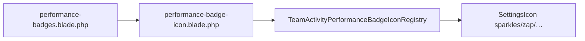

# Team Activity — Performance Badge Icon Refresh

**Date:** 2026-08-05  
**Type:** Presentation-only change  
**Parent:** [team-activity-performance-badges.md](./team-activity-performance-badges.md)  
**Status:** Emoji badges replaced with outline SVG icons

---

## 1. Verdict

Team Activity performance badges now render as **14–16px gold outline SVG icons** beside the compact presence code. No emojis. No resolver, PI, or feature-flag changes.

| Constraint | Status |
|------------|--------|
| No new icon package | Yes — reuses `SettingsIcon` SVG paths |
| No emojis in UI | Yes |
| Badge keys unchanged | Yes — `extra_contribution`, etc. |
| Tooltips unchanged | Yes — same `title` text |
| Resolver / PI logic unchanged | Yes |
| Single icon registry | Yes — `TeamActivityPerformanceBadgeIconRegistry` |

---

## 2. Before → after

| Key | Before | After |
|-----|--------|-------|
| `extra_contribution` | 🌙 emoji | Sparkles outline SVG |
| `exceptional_day` | 🔥 emoji | Zap outline SVG |
| `critical_work` | 🛡 emoji (future) | Alert-triangle outline SVG |
| `team_helper` | 🤝 emoji (future) | Heart-pulse outline SVG |

Example presence row:

```
🟢 A²ʰ¹⁵ᵐ [✦] [⚡]
```

(Compact status code + up to three small gold icons.)

---

## 3. Architecture



| File | Role |
|------|------|
| `TeamActivityPerformanceBadgeIconRegistry` | Badge key → `SettingsIcon` name |
| `components/team-activity/performance-badge-icon.blade.php` | Renders one icon by key |
| `components/team-activity/performance-badges.blade.php` | Loops badges; no per-key Blade branches |
| `resources/css/app.css` | 16px (`1rem`), gold `#c9a227`, compact row |

Adding a future badge: register one line in `TeamActivityPerformanceBadgeIconRegistry::map()` — no conditional Blade.

---

## 4. Accessibility

| Element | Behavior |
|---------|----------|
| Badge wrapper | `role="img"` + `aria-label="{title}"` |
| Tooltip | Native `title` (title + explanation, unchanged) |
| SVG | `aria-hidden="true"` via `SettingsIcon` |
| Presence row | Badge titles still appended to presence `aria-label` |

---

## 5. Design tokens

| Token | Value |
|-------|-------|
| Size | `1rem` (16px) |
| Color | `#c9a227` (gold accent) |
| Stroke | Settings default `1.75` outline |
| Animation | None |

---

## 6. Unchanged

- `TeamActivityBadgeResolver`
- `config/team_activity_performance_badges.php` (emoji fields remain for DTO compat; not rendered)
- Feature flags
- Performance Intelligence snapshots and thresholds
- Tooltip copy

---

## 7. Tests

| File | Change |
|------|--------|
| `tests/Unit/Dashboard/TeamActivityPerformanceBadgeIconRegistryTest.php` | **New** — registry map + SVG output |
| `tests/Feature/TeamActivityPerformanceBadgesRenderingTest.php` | Asserts SVG + aria-label; rejects emojis |

```bash
php artisan test tests/Unit/Dashboard/TeamActivityPerformanceBadgeIconRegistryTest.php tests/Feature/TeamActivityPerformanceBadgesRenderingTest.php
```

---

## 8. File map

| Area | Path |
|------|------|
| Registry | `app/Support/Dashboard/TeamActivityPerformanceBadgeIconRegistry.php` |
| Icon slot | `resources/views/components/team-activity/performance-badge-icon.blade.php` |
| Badge list | `resources/views/components/team-activity/performance-badges.blade.php` |
| Styles | `resources/css/app.css` |
| SVG source | `app/Support/Settings/SettingsIcon.php` |
