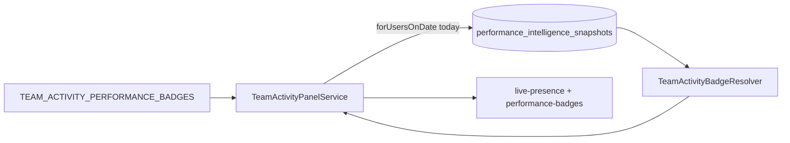

# Team Activity — Performance Badges (Presentation Only)

**Date:** 2026-08-05  
**Type:** Implementation report  
**Depends on:** [performance-intelligence-phase0.md](./performance-intelligence-phase0.md), [radium-performance-engine-blueprint.md](./radium-performance-engine-blueprint.md)  
**Status:** Phase 1 presentation layer behind feature flag

---

## 1. Verdict

Team Activity can show up to **three operational emoji badges** beside the compact presence code (e.g. `🟢 A²ʰ¹⁵ᵐ 🌙🔥`).

| Constraint | Status |
|------------|--------|
| Presentation only | Yes — reads PI snapshots; never recalculates KPIs |
| No scores / RPE / PI numbers in UI | Yes — emoji + tooltip text only |
| `TEAM_ACTIVITY_PERFORMANCE_BADGES=false` by default | Yes |
| Zero runtime impact when disabled | Yes — no snapshot query |
| No gamification / rankings / awards | Yes |
| Permissions follow Team Activity | Yes — same panel visibility as today |

---

## 2. Feature flag

| Key | Default | Effect when false |
|-----|---------|-------------------|
| `TEAM_ACTIVITY_PERFORMANCE_BADGES` | `false` | `TeamActivityBadgeResolver` no-ops; panel build skips snapshot load |
| `TEAM_ACTIVITY_BADGE_EXCEPTIONAL_COMPOSITE_MIN` | `70` | Internal threshold for 🔥 only; **never shown in UI** |

Config: `config/team_activity_performance_badges.php`

**Note:** Badges require **today’s** Performance Intelligence snapshot for each employee. PI capture must run (`PERFORMANCE_INTELLIGENCE_ENABLED=true` + `performance-intelligence:snapshot` or schedule). Badge flag alone is not enough.

---

## 3. Architecture



| Component | Role |
|-----------|------|
| `TeamActivityBadgeResolver` | Maps snapshot → ordered badge list (max 3) |
| `PerformanceSnapshotRepository::forUsersOnDate` | Single batched read per panel build |
| `TeamActivityPerformanceBadge` | DTO: key, emoji, title, tooltip |
| `TeamActivityAgentRow::$performanceBadges` | Serialized to panel HTML/JSON refresh |
| `<x-team-activity.performance-badges>` | Renders emoji with `title` tooltips |

Resolver **never** calls `PerformanceScoreCalculator` or KPI services.

---

## 4. Phase 1 badges

| Emoji | Key | Shipped | Rule (from snapshot) |
|-------|-----|---------|----------------------|
| 🌙 | `extra_contribution` | **Live** | Off-roster day (Extra / Leave / Holiday / non-working) **and** `breakdown.outcome_raw` ≥ commitment floor — same PI evidence as Commitment pillar; **not** login duration |
| 🔥 | `exceptional_day` | **Live** | `composite_score` ≥ configurable minimum (default 70); threshold used internally only |
| 🤝 | `team_helper` | **Architecture** | `badges.team_helper.enabled=false` until helper credit exists on snapshots |
| 🛡 | `critical_work` | **Architecture** | `badges.critical_work.enabled=false` until reliable escalation/complexity signal on snapshots |

### Display order (when >3 qualify)

1. Exceptional Day  
2. Extra Contribution  
3. Critical Work  
4. Team Helper  

Capped at `max_badges` (3).

### Example

```
🟢 A²ʰ¹⁵ᵐ 🌙🔥
```

---

## 5. Tooltips

Each badge uses native `title` (hover) with **title + explanation** — no scores.

| Badge | Tooltip body |
|-------|----------------|
| 🌙 | Meaningful work completed outside scheduled hours. Operational recognition only. |
| 🔥 | Standout operational day by calibrated thresholds. Operational recognition only. |
| 🤝 | Received helper credit for meaningful teammate support. Operational recognition only. |
| 🛡 | Handled critical or escalation work. Operational recognition only. |

Accessible summary: badge titles appended to presence `aria-label` (e.g. `Active · 2h 15m · Exceptional Day, Extra Contribution`).

---

## 6. Permissions

No new permission. Visibility = existing `teamActivity.view` + `DASHBOARD_TEAM_ACTIVITY_ENABLED`. Agents without Team Activity access do not see badges.

---

## 7. Explicitly out of scope

Leaderboards · Awards · Ranks · Performance scores in UI · Employee comparisons · Bonus · Promotion · Notifications · Gamification · Recalculating metrics in the panel path.

---

## 8. Tests

| File | Covers |
|------|--------|
| `tests/Unit/Dashboard/TeamActivityBadgeResolverTest.php` | Extra contribution, exceptional thresholds, priority cap, disabled |
| `tests/Feature/TeamActivityPerformanceBadgesFeatureFlagTest.php` | Disabled skips DB; enabled loads badges |
| `tests/Feature/TeamActivityPerformanceBadgesRenderingTest.php` | HTML emoji, tooltips, no score leakage |

```bash
php artisan test tests/Unit/Dashboard/TeamActivityBadgeResolverTest.php tests/Feature/TeamActivityPerformanceBadgesFeatureFlagTest.php tests/Feature/TeamActivityPerformanceBadgesRenderingTest.php
```

---

## 9. File map

| Area | Path |
|------|------|
| Config | `config/team_activity_performance_badges.php` |
| Resolver | `app/Support/Dashboard/TeamActivityBadgeResolver.php` |
| DTO | `app/Data/TeamActivityPerformanceBadge.php` |
| Panel wiring | `app/Services/Dashboard/TeamActivityPanelService.php` |
| Row data | `app/Data/TeamActivityAgentRow.php` |
| Snapshot batch | `app/Services/PerformanceIntelligence/PerformanceSnapshotRepository.php` |
| Blade | `resources/views/components/team-activity/performance-badges.blade.php` |
| Presence slot | `resources/views/components/team-activity/live-presence.blade.php` |
| CSS | `resources/css/app.css` |
| Env | `.env.example` |

---

## 10. Enabling (staging)

1. `PERFORMANCE_INTELLIGENCE_ENABLED=true` and capture today’s snapshots.  
2. `TEAM_ACTIVITY_PERFORMANCE_BADGES=true`  
3. `php artisan config:clear`  
4. Open Dashboard → Team Activity; badges appear on qualifying rows only.

---

## 11. Future wiring

| Badge | When ready |
|-------|------------|
| 🤝 Team Helper | Set `badges.team_helper.enabled=true`; implement `qualifiesTeamHelper()` against `helper_credit_count` (or equivalent) on snapshot inputs |
| 🛡 Critical Work | Set `badges.critical_work.enabled=true`; add escalation/complexity fields to PI collector + snapshot inputs |

Both resolver methods are stubbed with comments — no fake badges.
