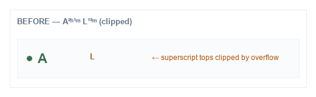
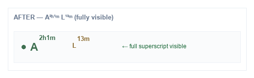

# Team Activity Presence Superscript Clipping — Investigation & Fix

**Date:** 2026-08-04  
**Type:** CSS/layout fix only (no HTML, codes, attendance, presence, resolver, or payroll changes)  
**Canvas:** [/Users/ravi/.cursor/projects/Users-ravi-radium-service-desk/canvases/team-activity-presence-superscript-clip-investigation.canvas.tsx](/Users/ravi/.cursor/projects/Users-ravi-radium-service-desk/canvases/team-activity-presence-superscript-clip-investigation.canvas.tsx)

---

## Bottom line

Duration superscripts on compact Presence codes (`A²ʰ¹ᵐ`, `L¹³ᵐ`) were vertically clipped. Cause: `overflow: hidden` plus flex `align-items: center` (which ignores `vertical-align: super`) and a tight `line-height`. Fix is CSS-only: `overflow: visible`, baseline alignment, and explicit `top` offsets for superscripts.

| Check | Finding |
|-------|---------|
| HTML structure | Unchanged |
| Presence codes | Unchanged |
| Logic layers | Unchanged |
| Font size | Unchanged (0.5625rem duration) |
| Row height | Essentially unchanged (+1px padding-block) |

---

## Symptom

```
A²ʰ¹ᵐ
```

Only the lower portion of the superscript was visible; tops of `2h` / `1m` / late minutes were cut off.

---

## Root cause analysis

| Factor | Role in clipping |
|--------|------------------|
| `.team-activity-live-presence--compact { overflow: hidden }` | Primary clip of anything rising above the line box |
| `.team-activity-status { align-items: center }` on the primary pill | Flex children ignore `vertical-align: super`; duration sits in a centered band then gets clipped |
| `.team-activity-status-pill { overflow: hidden }` | Secondary clip risk on the same element as `__primary` |
| `.team-activity-live-presence__code { line-height: 1.2 }` | Too tight for raised superscript ascent |
| `vertical-align: super` on duration | Ineffective inside `inline-flex` |

Parent height / transform were not the main drivers; row `min-height: 2.75rem` had spare room once overflow stopped clipping.

---

## Fix (CSS only)

```css
.team-activity-live-presence--compact {
  overflow: visible;
  line-height: 1.45;
  padding-block: 0.0625rem;
}

.team-activity-live-presence__primary.team-activity-status-pill {
  align-items: baseline;
  overflow: visible;
  line-height: 1.45;
}

.team-activity-live-presence__duration {
  position: relative;
  top: -0.4em;          /* explicit raise; flex ignores vertical-align */
  vertical-align: baseline;
  font-size: 0.5625rem; /* unchanged */
}

.team-activity-live-presence__late .…__late-sup {
  position: relative;
  top: -0.35em;
}
```

Also set `overflow: visible` on `.team-activity-presence-state` and `.team-activity-col--presence`.

---

## Browser notes

Approach avoids relying on `sup` + `vertical-align` inside flex (inconsistent across engines):

| Browser | Expectation |
|---------|-------------|
| Chrome | Full superscript via `top: -0.4em` + visible overflow |
| Safari | Same; WebKit flex ignores vertical-align the same way |
| Firefox | Same; relative offset is stable |

Verify with fixture: `docs/fixtures/team-activity-presence-superscript-clip.html`

---

## Before / after screenshots





Combined: `docs/fixtures/screenshots/presence-superscript-before-after.png`

Chromium render of the fixture (before + after rows): `docs/fixtures/screenshots/presence-superscript-chrome.png`

---

## Files modified

| File | Change |
|------|--------|
| `resources/css/app.css` | Unclip + baseline + relative superscript offsets |
| `docs/fixtures/team-activity-presence-superscript-clip.html` | Isolated before/after fixture |
| `docs/fixtures/screenshots/*` | Before/after visuals |
| `tests/Unit/Dashboard/TeamActivityPresenceSuperscriptCssTest.php` | Regression: compact wrapper must not use `overflow: hidden` |

**Not modified:** Blade HTML, presence codes, attendance, presence engine, status resolver, payroll.

---

## Test results

```bash
php artisan test --filter='TeamActivityPresenceSuperscriptCssTest|DashboardTeamActivityUiTest::test_late_employee|DashboardTeamActivityUiTest::test_presence_column_layout|TeamActivityMemberStatusPresenterTest::test_status_codes'
```

CSS regression asserts:

- compact wrapper uses `overflow: visible`
- duration uses `top: -0.4em`
- compact wrapper no longer matches `overflow: hidden`

---

## Rollback strategy

1. Revert the `.team-activity-live-presence*` block in `app.css` to prior `overflow: hidden` / `vertical-align: super` / `line-height: 1.2` rules.
2. Remove `TeamActivityPresenceSuperscriptCssTest` and fixture assets if undesired.

No migrations or API changes — single CSS revert.

---

## Success criteria

Superscripts on `A`, `I`, `B`, `P`, `ALO`, and `L` are fully visible on a single compact line without shrinking the duration font or changing Presence logic.
