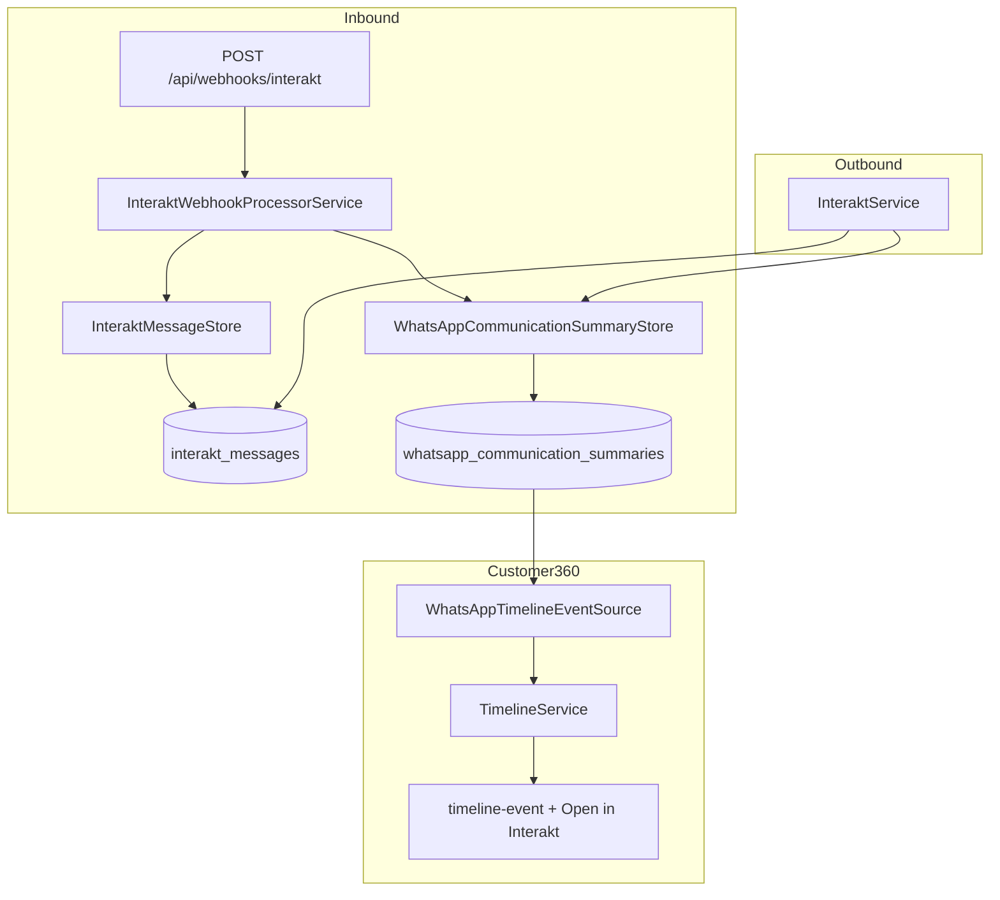

# WhatsApp Communication Summary (Phase 8.4)

**Status:** Implemented  
**Scope:** Customer360 operational WhatsApp summary — not a chat UI  
**Last updated:** 2026-07-01

Customer360 shows **one timeline card per WhatsApp conversation** (keyed by customer phone). Interakt remains the system of record for messaging; Radium Desk stores operational metadata only.

---

## Architecture



### Layers

| Layer | Responsibility |
|-------|----------------|
| `InteraktMessage` | Raw message rows (unchanged); idempotent by `message_id` |
| `WhatsAppCommunicationSummary` | Operational snapshot per `customer_phone` |
| `WhatsAppCommunicationSummaryBuilder` | Aggregates messages → status, counts, last template/sender |
| `WhatsAppCommunicationSummaryStore` | Upserts summary after webhook processing or outbound send |
| `WhatsAppTimelineEventSource` | Emits **one** `TimelineEvent` per phone from summary |
| `InteraktDeepLinkService` | Builds external Interakt URL (configurable templates) |

Webhook processing remains asynchronous via the existing outbox — no synchronous chat operations were added.

---

## Timeline card (UI flow)

1. Agent opens Customer360 drawer for a service case.
2. Timeline loads via `Customer360TimelineService` → `WhatsAppTimelineEventSource`.
3. If a summary row exists (or messages exist and summary is lazily backfilled), **one card** appears:

```
💬 WhatsApp                          Today 2:45 PM
[Waiting for Customer]

Last Activity    Today 2:45 PM
Messages         6 exchanged
Current Status   Waiting for Customer
Template         Repair Started

Open in Interakt ↗
```

4. Additional messages for the same phone **update** the summary row and refresh the same card (`dedupeKey: whatsapp:summary:{phone}`).
5. Clicking **Open in Interakt** opens the conversation in Interakt (new tab). There is no internal chat UI.

---

## Stored metadata

| Field | Purpose |
|-------|---------|
| `last_activity_at` | Most recent message timestamp |
| `conversation_status` | `waiting_for_customer`, `waiting_for_agent`, `failed`, `inactive` |
| `messages_exchanged_count` | Total persisted messages for phone |
| `unread_count` | Optional; populated when webhook exposes it |
| `last_template_name` | Latest outgoing template display name |
| `last_sender` | `customer`, `template`, or `agent` |
| `last_message_id` | Latest Interakt message id (searchable) |
| `conversation_id` | Interakt conversation id when present in webhook |
| `interakt_customer_id` | Interakt customer id from webhook |

Message bodies (e.g. casual greetings) are **not** shown on the timeline and are **not** indexed for search.

---

## Conversation status rules

| Last message | Delivery | Status |
|--------------|----------|--------|
| Incoming | — | Waiting for Agent |
| Outgoing | Failed | Failed |
| Outgoing | Other | Waiting for Customer |

---

## Deep-link approach for Interakt

Interakt does not publish a stable public deep-link API. Radium Desk uses **configurable URL templates** in `config/interakt.php`:

| Variable | Purpose |
|----------|---------|
| `INTERAKT_APP_URL` | Base app URL (default `https://app.interakt.ai`) |
| `INTERAKT_CONVERSATION_URL_TEMPLATE` | Preferred deep link, e.g. `{app_url}/inbox/{customer_id}` |
| `INTERAKT_CUSTOMER_PROFILE_URL_TEMPLATE` | Fallback when conversation template unset (default `{app_url}/contacts?search={phone}`) |

Placeholders: `{app_url}`, `{customer_id}`, `{conversation_id}`, `{phone}`, `{message_id}`.

Resolution order:

1. `INTERAKT_CONVERSATION_URL_TEMPLATE` when set
2. `INTERAKT_CUSTOMER_PROFILE_URL_TEMPLATE` when `interakt_customer_id` is known
3. `INTERAKT_APP_URL` as last resort

Operations should set `INTERAKT_CONVERSATION_URL_TEMPLATE` to match their Interakt workspace URL pattern once verified with Interakt support.

---

## Search

`UniversalSearchService` matches incidents when the linked order's phone has a summary row matching:

- `last_template_name`
- `last_message_id`
- `conversation_id`
- `interakt_customer_id`

Controlled by setting `search.whatsapp_enabled` (default: true). Casual message text is excluded.

---

## Before vs After

| Area | Before | After |
|------|--------|-------|
| Timeline | One card **per message** | One card **per conversation** (phone) |
| Card content | Message text / template body | Operational summary fields |
| Chat UI | None (unchanged) | None — still no chat UI |
| External action | None on timeline | **Open in Interakt** link |
| Storage | `interakt_messages` only | + `whatsapp_communication_summaries` |
| Search | Phone, order fields, notes | + template name, message id, conversation id |
| Health card | Delivery status chip | Conversation status from summary |

---

## Files modified

**New**

- `database/migrations/2026_07_01_160000_create_whatsapp_communication_summaries_table.php`
- `app/Models/WhatsAppCommunicationSummary.php`
- `app/Enums/WhatsAppConversationStatus.php`
- `app/Services/Interakt/WhatsAppCommunicationSummaryBuilder.php`
- `app/Services/Interakt/WhatsAppCommunicationSummaryStore.php`
- `app/Services/Interakt/InteraktDeepLinkService.php`
- `tests/Unit/WhatsAppCommunicationSummaryTest.php`
- `tests/Feature/WhatsAppCommunicationSummaryFeatureTest.php`
- `docs/whatsapp-communication-summary.md`

**Updated**

- `app/Services/Interakt/InteraktWebhookPayloadParser.php` — `customerId`, `conversationId`, `unreadCount`
- `app/Services/Interakt/InteraktWebhookProcessorService.php` — refresh summary after message upsert
- `app/Services/Interakt/InteraktService.php` — refresh summary after outbound send
- `app/Services/Timeline/Sources/WhatsAppTimelineEventSource.php` — summary card mapping
- `app/Services/Timeline/Customer360TimelineService.php` — container resolution for source
- `app/Data/TimelineEvent.php` — `summaryFields`, `actionLabel`, `actionUrl`
- `resources/views/components/timeline-event.blade.php` — WhatsApp summary layout + external link
- `resources/css/app.css` — summary field styles
- `config/interakt.php` — app URL templates
- `app/Services/UniversalSearchService.php` — WhatsApp summary search
- `tests/Unit/WhatsAppTimelineEventSourceTest.php`
- `tests/Feature/InteraktWebhookTest.php`

---

## Tests

- `tests/Unit/WhatsAppCommunicationSummaryTest.php` — builder, store updates, deep links
- `tests/Unit/WhatsAppTimelineEventSourceTest.php` — single card, lazy backfill
- `tests/Feature/WhatsAppCommunicationSummaryFeatureTest.php` — webhook → summary, UI link, search
- `tests/Feature/InteraktWebhookTest.php` — backward-compatible webhook + timeline assertions

Run: `php artisan test --filter=WhatsApp`

---

## Explicitly not implemented

- Chat UI, bubbles, attachments, emoji rendering, typing indicators, media gallery
- Interakt replacement or message-by-message timeline
- Synchronous webhook processing changes (outbox unchanged)
