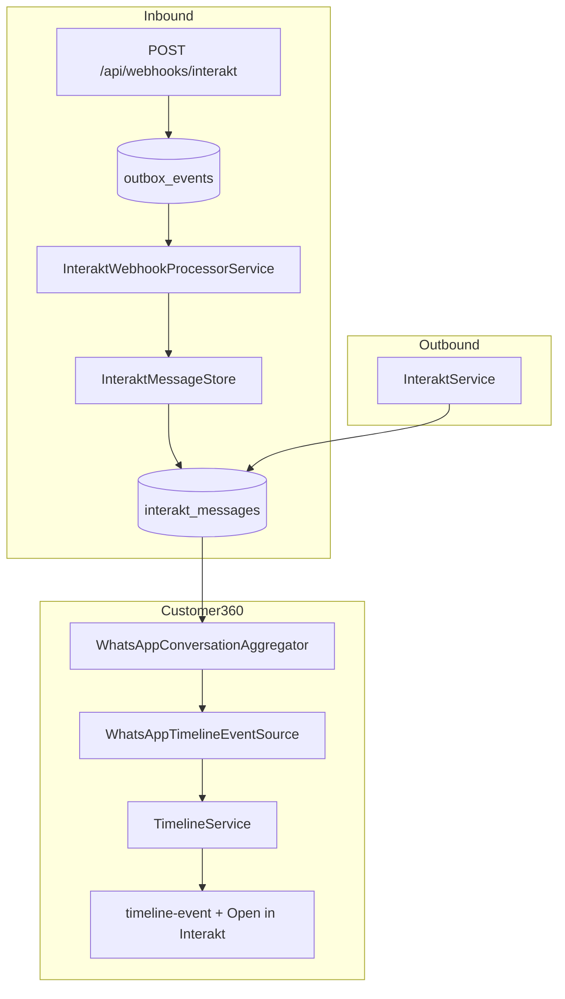

# WhatsApp Communication Summary (Phase 8.4)

**Status:** Implemented  
**Principle:** Persist events. Compute views.  
**Last updated:** 2026-07-01

Customer360 shows **one operational WhatsApp card per customer phone**. Interakt remains the conversation surface; Radium Desk stores message events only and computes the summary at read time.

---

## Architecture



### Layers

| Layer | Role |
|-------|------|
| `interakt_messages` | Sole source of truth for WhatsApp events |
| `WhatsAppConversationAggregator` | Stateless runtime snapshot (`COUNT` + latest row) |
| `WhatsAppConversationSnapshot` | Read-only DTO for timeline + deep links |
| `WhatsAppTimelineEventSource` | Maps snapshot → one `TimelineEvent` per phone |
| `InteraktDeepLinkService` | External Interakt URL from snapshot fields |

No derived summary table. No dual-write. No lazy backfill.

---

## Runtime aggregation

For each Customer360 drawer load:

```sql
SELECT * FROM interakt_messages
 WHERE customer_phone = ?
 ORDER BY sent_at DESC, id DESC
 LIMIT 1;

SELECT COUNT(*) FROM interakt_messages
 WHERE customer_phone = ?;
```

Both queries use the existing `(customer_phone, sent_at)` index.

Conversation status, last sender, and template are derived from the latest message row only.

---

## Search

`UniversalSearchService` matches incidents via `interakt_messages` operational columns:

- `template_name`
- `message_id`
- `conversation_id`
- `interakt_customer_id`

Message body text is not indexed. Correlation fields are persisted on the message row at webhook upsert (event metadata, not a computed view).

---

## Deep links

Configurable URL templates in `config/interakt.php` — see `InteraktDeepLinkService`.

---

## Tests

- `tests/Unit/WhatsAppConversationAggregatorTest.php`
- `tests/Feature/WhatsAppConversationFeatureTest.php`
- `tests/Feature/InteraktWebhookTest.php`

Run: `php artisan test --filter=WhatsApp`
